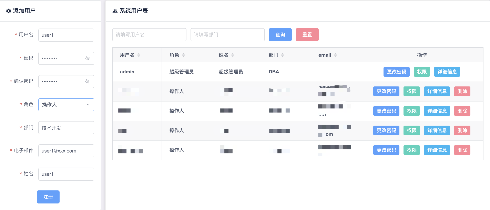
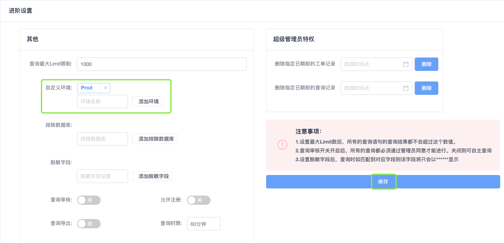
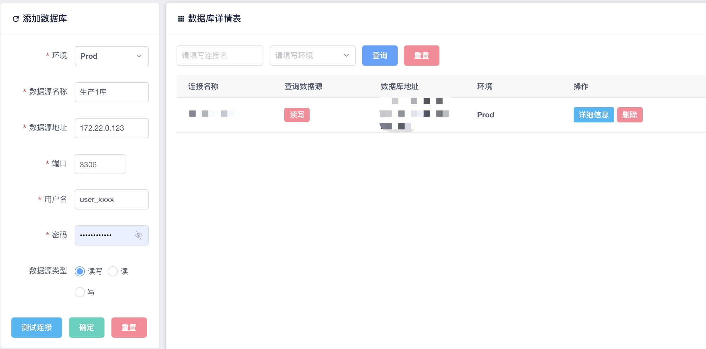
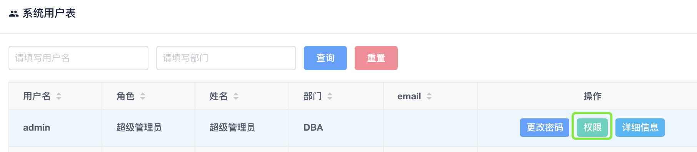
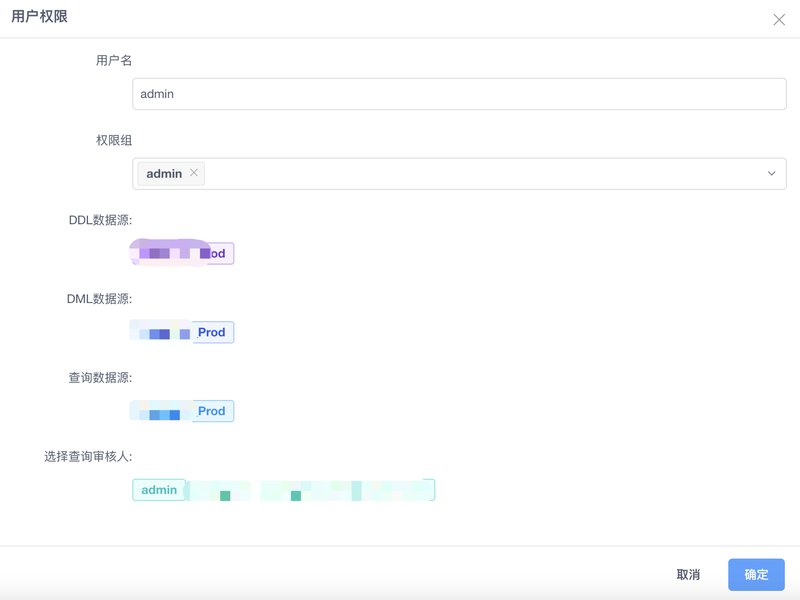

# MySQL SQL语句审核平台

安装使用Yearning请参考[官方文档](https://guide.yearning.io/)

## 添加用户

角色可以选择`提交人`和`操作人`，提交人只能提交SQL申请，而操作人即可提交申请也可审批执行。

## 设置环境

在设置中进阶设置里可以添加环境，环境命名可随意。图中环境以Prod命名，表示为生产环境。

## 添加数据源

## 设置权限组

## 流程模板

## 用户权限分配

