# Rhel7.3 搭建 Oracle12.2.01 RAC

## 环境配置

1. 安装环境

   ```tex
   虚拟机：CentOS 7.6 KVM
   操作系统：rhel-server-7.3-x86_64
   Grid集群安装包：linuxx64_12201_grid_home
   DB数据库安装包：linuxx64_12201_database
   ```

2. IP划分

   ```tex
   Public-IP
   10.0.7.110 ehs-rac-01
   10.0.7.120 ehs-rac-02
   Private-IP
   10.0.0.110 ehs-rac-01-priv
   10.0.0.120 ehs-rac-02-priv
   Virtual-IP
   10.0.7.113 ehs-rac-01-vip
   10.0.7.123 ehs-rac-02-vip
   Scan-IP    
   10.0.7.101
   ```

3. ASM磁盘划分

   ```tex
   OCR 3块：asm-diskc 2G 、asm-diskd 2G、asm-diske 2G
   GIMR 1块：asm-diskf 40G
   数据 1块：asm-diskg 10G
   ```

4. Linux 系统安装时选项包

   ```tex
   Server with GUI                   #带GUI的服务器
   Hardware Monitoring Utilities     #硬件监控实用程序
   Large Systems Performance         #大型系统性能
   Network file system client        #网络文件系统客户端
   Performance Tools                 #性能工具
   Compatibility Libraries           #兼容性库
   Development Tools                 #开发工具
   ```

5. 虚拟机配置

   ```tex
   先配置一台虚拟机(第一个节点 ehs-rac-01)
   内存设置8G
   添加安装ORACLE软件盘 目录为：/u01
   添加ASM存储盘(3块OCR，1块GIMR，1块存放数据)
   ```

   

## 安装前准备

1. 修改 /etc/selinux/config 配置

   ```shell
   [root@ehs-rac-01 ~]# sed -i 's/^SELINUX=.*/SELINUX=disabled/' /etc/selinux/config; setenforce 0 ; cat /etc/selinux/config | grep -i SELINUX= | grep -v "^#"
   SELINUX=disabled
   ```

2. 关闭防火墙

   ```shell
   [root@ehs-rac-01 ~]# systemctl stop firewalld; systemctl disable firewalld
   Removed symlink /etc/systemd/system/dbus-org.fedoraproject.FirewallD1.service.
   Removed symlink /etc/systemd/system/basic.target.wants/firewalld.service.
   ```

3. 配置 redhat yum 源

   [Redhat7解决This system is not registered to Red Hat Subscription Management](wiz://open_document?guid=60f2ba40-d89d-4b13-9e41-8d976962d865&kbguid=&private_kbguid=fe89a0f7-56e7-4d32-b1af-de509c704437)

   由于 Redhat 系统没有注册，使用 yum 会有错误：This system is not registered to Red Hat Subscription Management. You can use subscription-manager to register. 

   **配置本地 yum 源 （此步骤不需要操作，了解就可以）**

   ```shell
   [root@ehs-rac-01 ~]# mkdir /mnt/rhel73iso
   [root@ehs-rac-01 ~]# mount -o loop -t iso9660 /root/rhel-server-7.3-x86_64-dvd.iso /mnt/rhel73iso
   mount: /dev/loop0 写保护，将以只读方式挂载
   [root@ehs-rac-01 ~]# cd /etc/yum.repos.d
   [root@ehs-rac-01 yum.repos.d]# ll
   总用量 4
   -rw-r--r--. 1 root root 358 9月  10 15:24 redhat.repo
   [root@ehs-rac-01 yum.repos.d]# vim /etc/yum.repos.d/rhel-iso.repo
   [ISO-DVD]
   name=Red Hat Enterprise Linux $releasever - $basearch - Source
   baseurl=file:///mnt/rhel73iso
   enabled=1
   gpgcheck=0
   [root@ehs-rac-01 yum.repos.d]# df -h
   文件系统               容量  已用  可用 已用% 挂载点
   /dev/mapper/rhel-root   35G  6.9G   29G   20% /
   devtmpfs               3.9G     0  3.9G    0% /dev
   tmpfs                  3.9G   84K  3.9G    1% /dev/shm
   tmpfs                  3.9G  9.4M  3.9G    1% /run
   tmpfs                  3.9G     0  3.9G    0% /sys/fs/cgroup
   /dev/vda1             1014M  155M  860M   16% /boot
   tmpfs                  799M   28K  799M    1% /run/user/0
   tmpfs                  799M  4.0K  799M    1% /run/user/42
   /dev/loop0             3.6G  3.6G     0  100% /mnt/rhel73iso
   ```

4. 增加新网卡

   **注意：**如果服务器配置是双网卡，不需要操作此步；本服务器为 KVM 虚拟机需要在宿主机上给虚拟机添加网卡；

   [KVM虚拟机在线添加网卡](https://www.leeks.info/zh_CN/latest/ops_tools/kvm/KVM%E8%99%9A%E6%8B%9F%E6%9C%BA%E5%9C%A8%E7%BA%BF%E6%B7%BB%E5%8A%A0%E7%BD%91%E5%8D%A1.html)

5. 安装依赖包

   ```shell
   [root@ehs-rac-01 ~]# yum -y install binutils compat-libcap1 \
   compat-libstdc++ gcc gcc-c++ glibc glibc-devel libgcc \
   libstdc++ libstdc++-devel libaio sysstat libaio-devel \
   elfutils-libelf-devel unixODBC unixODBC-devel libXext \
   libXtst libX11 libXau libxcb ksh make libXi
   ```

6. 配置内核参数

   ```shell
   [root@ehs-rac-01 ~]# cat >> /etc/sysctl.conf << EOF
   fs.file-max = 6815744
   kernel.sem = 250 32000 100 128
   kernel.shmmni = 4096
   kernel.shmall = 1073741824
   kernel.shmmax = 4398046511104
   kernel.panic_on_oops = 1
   net.core.rmem_default = 262144
   net.core.rmem_max = 4194304
   net.core.wmem_default = 262144
   net.core.wmem_max = 1048576
   net.ipv4.conf.all.rp_filter = 2
   net.ipv4.conf.default.rp_filter = 2
   fs.aio-max-nr = 1048576
   net.ipv4.ip_local_port_range = 9000 65500
   EOF
    
   #修改生效：
   [root@ehs-rac-01 ~]# /sbin/sysctl -p
   ```

7. 修改系统限制参数

   ```shell
   [root@ehs-rac-01 ~]# cat >> /etc/security/limits.conf << EOF
   oracle soft nofile 1024
   oracle hard nofile 65536
   oracle soft nproc 16384
   oracle hard nproc 16384
   oracle soft stack 10240
   oracle hard stack 32768
   oracle hard memlock 134217728
   oracle soft memlock 134217728
   grid soft nofile 1024
   grid hard nofile 65536
   grid soft nproc 16384
   grid hard nproc 16384
   grid soft stack 10240
   grid hard stack 32768
   grid hard memlock 134217728
   grid soft memlock 134217728
   EOF
   ```

8. 关闭ZEROCONF

   ```shell
   [root@ehs-rac-01 ~]# echo "NOZEROCONF=yes" >> /etc/sysconfig/network
   ```

9. 增加组和用户

   ```shell
   [root@ehs-rac-01 ~]# groupadd -g 54321 oinstall
   [root@ehs-rac-01 ~]# groupadd -g 54322 dba
   [root@ehs-rac-01 ~]# groupadd -g 54323 oper
   [root@ehs-rac-01 ~]# groupadd -g 54324 backupdba
   [root@ehs-rac-01 ~]# groupadd -g 54325 dgdba
   [root@ehs-rac-01 ~]# groupadd -g 54326 kmdba
   [root@ehs-rac-01 ~]# groupadd -g 54327 asmdba
   [root@ehs-rac-01 ~]# groupadd -g 54328 asmoper
   [root@ehs-rac-01 ~]# groupadd -g 54329 asmadmin
   [root@ehs-rac-01 ~]# groupadd -g 54330 racdba
   [root@ehs-rac-01 ~]# useradd -u 54321 -g oinstall -G dba,asmdba,backupdba,dgdba,kmdba,racdba,oper oracle
   [root@ehs-rac-01 ~]# useradd -u 54322 -g oinstall -G asmadmin,asmdba,asmoper,dba grid
   [root@ehs-rac-01 ~]# passwd oracle
   [root@ehs-rac-01 ~]# passwd grid
   ```

10. 修改 hosts 文件

    ```shell
    [root@ehs-rac-01 ~]# cat >> /etc/hosts << EOF
    # Public
    10.0.7.110 ehs-rac-01.localdomain ehs-rac-01
    10.0.7.120 ehs-rac-02.localdomain ehs-rac-02
    # Private
    10.0.0.110 ehs-rac-01-priv.localdomain ehs-rac-01-priv
    10.0.0.120 ehs-rac-02-priv.localdomain ehs-rac-02-priv
    # Virtual
    10.0.7.113 ehs-rac-01-vip.localdomain ehs-rac-01-vip
    10.0.7.123 ehs-rac-02-vip.localdomain ehs-rac-02-vip
    #Scan-IP
    10.0.7.101 rac-scan
    EOF
    ```

11. 查看网卡信息

    ```shell
    [root@ehs-rac-01 ~]# ifconfig
    ens10: flags=4163<UP,BROADCAST,RUNNING,MULTICAST>  mtu 1500
            inet 10.0.7.111  netmask 255.255.255.0  broadcast 10.0.7.255
            inet6 fe80::9de4:f335:6b37:fc6a  prefixlen 64  scopeid 0x20<link>
            ether 52:54:00:40:5c:b4  txqueuelen 1000  (Ethernet)
            RX packets 106  bytes 4876 (4.7 KiB)
            RX errors 0  dropped 98  overruns 0  frame 0
            TX packets 27  bytes 3955 (3.8 KiB)
            TX errors 0  dropped 0 overruns 0  carrier 0  collisions 0
    eth0: flags=4163<UP,BROADCAST,RUNNING,MULTICAST>  mtu 1500
            inet 10.0.7.110  netmask 255.255.255.0  broadcast 10.0.7.255
            inet6 fe80::93fc:53a6:2f8d:69c3  prefixlen 64  scopeid 0x20<link>
            ether 52:54:00:8c:90:67  txqueuelen 1000  (Ethernet)
            RX packets 1131  bytes 112292 (109.6 KiB)
            RX errors 0  dropped 151  overruns 0  frame 0
            TX packets 489  bytes 107148 (104.6 KiB)
            TX errors 0  dropped 0 overruns 0  carrier 0  collisions 0
    lo: flags=73<UP,LOOPBACK,RUNNING>  mtu 65536
            inet 127.0.0.1  netmask 255.0.0.0
            inet6 ::1  prefixlen 128  scopeid 0x10<host>
            loop  txqueuelen 1  (Local Loopback)
            RX packets 40  bytes 2870 (2.8 KiB)
            RX errors 0  dropped 0  overruns 0  frame 0
            TX packets 40  bytes 2870 (2.8 KiB)
            TX errors 0  dropped 0 overruns 0  carrier 0  collisions 0
    virbr0: flags=4099<UP,BROADCAST,MULTICAST>  mtu 1500
            inet 192.168.122.1  netmask 255.255.255.0  broadcast 192.168.122.255
            ether 52:54:00:94:02:c3  txqueuelen 1000  (Ethernet)
            RX packets 0  bytes 0 (0.0 B)
            RX errors 0  dropped 0  overruns 0  frame 0
            TX packets 0  bytes 0 (0.0 B)
            TX errors 0  dropped 0 overruns 0  carrier 0  collisions 0
    ```

12. 建立文件路径

    ```shell
    [root@ehs-rac-01 /]# mkdir -p /u01/app/12.2.0.1/grid
    [root@ehs-rac-01 /]# mkdir -p /u01/app/grid
    [root@ehs-rac-01 /]# mkdir -p /u01/app/oracle/product/12.2.0.1/db_1
    [root@ehs-rac-01 /]# chown -R grid:oinstall /u01
    [root@ehs-rac-01 /]# chmod -R 775 /u01/
    [root@ehs-rac-01 /]# chown -R oracle:oinstall /u01/app/oracle
    ```

13. 修改grid用户的环境变量

    ```shell
    [root@ehs-rac-01 /]# su - grid
    [grid@ehs-rac-01 ~]$ cd ~
    [grid@ehs-rac-01 ~]$ cat >> .bash_profile << EOF
    export ORACLE_BASE=/u01/app/grid
    export ORACLE_HOME=/u01/app/12.2.0.1/grid
    export ORACLE_SID=+ASM1
    export PATH=\$ORACLE_HOME/bin:\$PATH
    export LD_LIBRARY_PATH=\$ORACLE_HOME/lib:/lib:/usr/lib
    export CLASSPATH=\$ORACLE_HOME/JRE:\$ORACLE_HOME/jlib:\$ORACLE_HOME/rdbms/jlib
    umask=022
    EOF
    #--注意 ORACLE_SID rac2 节点需要修改 +ASM2
    ```

14. 修改oracle用户的环境变量

    ```shell
    [root@ol7-122-rac1 ~]# su - oracle
    [oracle@ol7-122-rac1 ~]$ cd ~
    [oracle@ol7-122-rac1 ~]$ cat >> .bash_profile << EOF
    export ORACLE_BASE=/u01/app/oracle
    export ORACLE_HOME=/u01/app/oracle/product/12.2.0.1/db_1
    export ORACLE_SID=orcl1
    export PATH=\$ORACLE_HOME/bin:\$PATH
    export LD_LIBRARY_PATH=\$ORACLE_HOME/lib:/lib:/usr/lib
    export CLASSPATH=\$ORACLE_HOME/JRE:\$ORACLE_HOME/jlib:\$ORACLE_HOME/rdbms/jlib
    umask=022
    EOF
    #--注意rac2节点需要修改 orcl2
    ```

    

## 配置 iscsi 共享存储

**注意：**本次使用软件 iscsi 服务来搭建 Oracle rac 共享存储；

具体操作流程请参照文档：[iscsi 构建 RAC 共享存储](https://www.leeks.info/zh_CN/latest/Databases/Oracle/iscsi%20%E6%9E%84%E5%BB%BA%20RAC%20%E5%85%B1%E4%BA%AB%E5%AD%98%E5%82%A8.html)


## 绑定 UDEV 共享磁盘（rac1 和 rac2）

**注意：**添加共享磁盘顺序要一致

1. 生成规则文件

   ```shell
   [root@ehs-rac-01 rules.d]# touch /etc/udev/rules.d/99-oracle-asmdevices.rules; cd /etc/udev/rules.d; ll
   -rw-r--r--. 1 root root 709 8月 24 2016 70-persistent-ipoib.rules
   -rw-r--r-- 1 root root 0 9月 10 20:16 99-oracle-asmdevices.rules
    
   #####或者#####
   [root@ehs-rac-01 rules.d]# touch /usr/lib/udev/rules.d/99-oracle-asmdevices.rules
   ```

2. 生成规则

   没有对sdb进行分区,执行如下shell脚本

   ```shell
   for i in a b c d e;
   do
   echo "KERNEL==\"sd*\", SUBSYSTEM==\"block\", PROGRAM==\"/usr/lib/udev/scsi_id --whitelisted --replace-whitespace --device=/dev/\$name\", RESULT==\"`/usr/lib/udev/scsi_id --whitelisted --replace-whitespace --device=/dev/sd$i`\", SYMLINK+=\"asm-disk$i\", OWNER=\"grid\", GROUP=\"asmadmin\", MODE=\"0660\"" >> /etc/udev/rules.d/99-oracle-asmdevices.rules
   done
   [root@ehs-rac-01 rules.d]# cat 99-oracle-asmdevices.rules 
   KERNEL=="sd*", SUBSYSTEM=="block", PROGRAM=="/usr/lib/udev/scsi_id --whitelisted --replace-whitespace --device=/dev/$name", RESULT=="360000000000000000e00000000010001", SYMLINK+="asm-diska", OWNER="grid", GROUP="asmadmin", MODE="0660"
   KERNEL=="sd*", SUBSYSTEM=="block", PROGRAM=="/usr/lib/udev/scsi_id --whitelisted --replace-whitespace --device=/dev/$name", RESULT=="360000000000000000e00000000010002", SYMLINK+="asm-diskb", OWNER="grid", GROUP="asmadmin", MODE="0660"
   KERNEL=="sd*", SUBSYSTEM=="block", PROGRAM=="/usr/lib/udev/scsi_id --whitelisted --replace-whitespace --device=/dev/$name", RESULT=="360000000000000000e00000000010003", SYMLINK+="asm-diskc", OWNER="grid", GROUP="asmadmin", MODE="0660"
   KERNEL=="sd*", SUBSYSTEM=="block", PROGRAM=="/usr/lib/udev/scsi_id --whitelisted --replace-whitespace --device=/dev/$name", RESULT=="360000000000000000e00000000010004", SYMLINK+="asm-diskd", OWNER="grid", GROUP="asmadmin", MODE="0660"
   KERNEL=="sd*", SUBSYSTEM=="block", PROGRAM=="/usr/lib/udev/scsi_id --whitelisted --replace-whitespace --device=/dev/$name", RESULT=="360000000000000000e00000000010005", SYMLINK+="asm-diske", OWNER="grid", GROUP="asmadmin", MODE="0660"
   ```

   对sdb 进行了分区，执行如下shell脚本 （**不需要操作，了解就可以**）

   ```shell
   for i in b1 b2
   do
   echo "KERNEL==\"sd$i\", SUBSYSTEM==\"block\", PROGRAM==\"/usr/lib/udev/scsi_id --whitelisted --replace-whitespace --device=/dev/\$parent\", RESULT==\"`/usr/lib/udev/scsi_id --whitelisted --replace-whitespace --device=/dev/sd${i:0:1}`\", SYMLINK+=\"asm-disk$i\", OWNER=\"grid\", GROUP=\"asmadmin\", MODE=\"0660\"" >> /etc/udev/rules.d/99-oracle-asmdevices.rules
   done;
   ```

   **注意**：未分区用 `$name`，分区用 `$parent`

3. 文件 99-oracle-asmdevices.rules 格式 （**不需要操作，了解就可以**）

   ```shell
   KERNEL=="sd*", SUBSYSTEM=="block", PROGRAM=="/usr/lib/udev/scsi_id --whitelisted --replace-whitespace --device=/dev/$name", RESULT=="36000c2948ef9d9e4a7937bfc65888bc8", NAME="asm-diskb", OWNER="grid", GROUP="asmadmin", MODE="0660"
   ```

   手动加载分区

   ```shell
   [root@ehs-rac-01 rules.d]# /sbin/partprobe /dev/sda
   [root@ehs-rac-01 rules.d]# /sbin/partprobe /dev/sdb
   [root@ehs-rac-01 rules.d]# /sbin/partprobe /dev/sdc
   [root@ehs-rac-01 rules.d]# /sbin/partprobe /dev/sdd
   [root@ehs-rac-01 rules.d]# /sbin/partprobe /dev/sde
   ```

   **备注**：获取 RESULT

   在 Linux 7下，可以使用如下命令（**不需要操作，了解就可以**）

   ```shell
   [root@ehs-rac-01 rules.d]# /usr/lib/udev/scsi_id -g -u /dev/sdb
   360000000000000000e00000000010002
   ```

4. 用 udevadm 进行测试

   **注意：** udevadm 命令不接受 /dev/sdc 这样的挂载设备名，必须是使用 /sys/block/sdb 这样的原始设备名。

   ```shell
   [root@ehs-rac-01 rules.d]# /sbin/udevadm test /sys/block/sda
   [root@ehs-rac-01 rules.d]# /sbin/udevadm test /sys/block/sdb
   [root@ehs-rac-01 rules.d]# /sbin/udevadm test /sys/block/sdc
   [root@ehs-rac-01 rules.d]# /sbin/udevadm test /sys/block/sdd
   [root@ehs-rac-01 rules.d]# /sbin/udevadm test /sys/block/sde
   
   [root@ehs-rac-01 rules.d]# udevadm info --query=all --path=/sys/block/sda
   [root@ehs-rac-01 rules.d]# udevadm info --query=all --path=/sys/block/sdb
   [root@ehs-rac-01 rules.d]# udevadm info --query=all --path=/sys/block/sdc
   [root@ehs-rac-01 rules.d]# udevadm info --query=all --path=/sys/block/sdd
   [root@ehs-rac-01 rules.d]# udevadm info --query=all --path=/sys/block/sde
   
   [root@ehs-rac-01 rules.d]# udevadm info --query=all --name=asm-diska
   [root@ehs-rac-01 rules.d]# udevadm info --query=all --name=asm-diskb
   [root@ehs-rac-01 rules.d]# udevadm info --query=all --name=asm-diskc
   [root@ehs-rac-01 rules.d]# udevadm info --query=all --name=asm-diskd
   [root@ehs-rac-01 rules.d]# udevadm info --query=all --name=asm-diske
   ```

5. 启动udev

   ```shell
   [root@ehs-rac-01 rules.d]# /sbin/udevadm control --reload-rules
   [root@ehs-rac-01 rules.d]# systemctl status systemd-udevd.service
   [root@ehs-rac-01 rules.d]# systemctl enable systemd-udevd.service
   ```

6. 检查设备是否正确绑定

   ```shell
   [root@ehs-rac-01 rules.d]# ll /dev/asm*
   lrwxrwxrwx 1 root root 3 9月 10 20:28 /dev/asm-diska -> sda
   lrwxrwxrwx 1 root root 3 9月 10 20:30 /dev/asm-diskb -> sdb
   lrwxrwxrwx 1 root root 3 9月 10 20:30 /dev/asm-diskc -> sdc
   lrwxrwxrwx 1 root root 3 9月 10 20:30 /dev/asm-diskd -> sdd
   lrwxrwxrwx 1 root root 3 9月 10 20:30 /dev/asm-diske -> sde
   [root@ehs-rac-01 rules.d]# 
   [root@ehs-rac-01 rules.d]# ll /dev/sd*
   brw-rw---- 1 grid asmadmin 8, 0 9月 10 20:28 /dev/sda
   brw-rw---- 1 grid asmadmin 8, 16 9月 10 20:30 /dev/sdb
   brw-rw---- 1 grid asmadmin 8, 32 9月 10 20:30 /dev/sdc
   brw-rw---- 1 grid asmadmin 8, 48 9月 10 20:30 /dev/sdd
   brw-rw---- 1 grid asmadmin 8, 64 9月 10 20:30 /dev/sde
   ```


## 设置SSH信任关系（rac1 和 rac2 ）

**基本步骤：**

- 设置 rac1 的 rsa 和 dsa 加密，然后都追加到 authorized_keys 文件中

- 再把 rac1 的 authorized_keys 拷贝到 rac2 中

- 同样 rac2 的 rsa 和 dsa 加密，然后把 rac2 的 rsa 和 dsa 加密追加到 authorized_keys 文件中

- 再把 rac2 的 authorized_keys 文件拷贝到 rac1 中，覆盖之前的 authorized_keys 文件

- **注1：**这样的话 rac1 和 rac2 的 authorized_keys 文件中都有了彼此的 rsa 和 dsa 加密

- **注2：**需设置 grid 和 oracle 两个用户(这里以 oracle 用户为例)


1. Rac1服务器设置

   - 设置rsa和dsa加密

     ```shell
     [root@ehs-rac-01 ~]# su - oracle
     [oracle@ehs-rac-01 ~]$ ssh-keygen -t rsa
     [oracle@ehs-rac-01 ~]$ ssh-keygen -t dsa
     [oracle@ehs-rac-01 ~]$ ll .ssh/
     total 16
     -rw------- 1 oracle oinstall 672 Sep 10 13:51 id_dsa
     -rw-r--r-- 1 oracle oinstall 607 Sep 10 13:51 id_dsa.pub
     -rw------- 1 oracle oinstall 1679 Sep 10 13:51 id_rsa
     -rw-r--r-- 1 oracle oinstall 399 Sep 10 13:51 id_rsa.pub
     ```

   - 把rsa和dsa加密都放置到authorized_keys文件中

     ```shell
     [oracle@ehs-rac-01 ~]$ cat .ssh/id_rsa.pub >> .ssh/authorized_keys
     [oracle@ehs-rac-01 ~]$ cat .ssh/id_dsa.pub >> .ssh/authorized_keys
     [oracle@ehs-rac-01 ~]$ ll .ssh/
     总用量 20
     -rw-r--r-- 1 oracle oinstall 1006 9月  10 20:49 authorized_keys
     -rw------- 1 oracle oinstall  668 9月  10 20:48 id_dsa
     -rw-r--r-- 1 oracle oinstall  607 9月  10 20:48 id_dsa.pub
     -rw------- 1 oracle oinstall 1675 9月  10 20:48 id_rsa
     -rw-r--r-- 1 oracle oinstall  399 9月  10 20:48 id_rsa.pub
     ```

   - 把rac1的authorized_keys拷贝到rac2中

     ```shell
     [oracle@ehs-rac-01 ~]$ cd /home/oracle/.ssh
     [oracle@ehs-rac-01 .ssh]$ scp authorized_keys 10.0.7.120:/home/oracle/.ssh/
     ```

2. Rac2服务器设置

   - 设置rsa和dsa加密

     ```shell
     [root@ehs-rac-02 ~]# su - oracle
     [oracle@ehs-rac-02 ~]$ ssh-keygen -t rsa
     [oracle@ehs-rac-02 ~]$ ssh-keygen -t dsa
     [oracle@ehs-rac-02 ~]$ ll .ssh/
     总用量 20
     -rw-r--r-- 1 oracle oinstall 1006 9月  10 20:51 authorized_keys
     -rw------- 1 oracle oinstall  668 9月  10 20:50 id_dsa
     -rw-r--r-- 1 oracle oinstall  607 9月  10 20:50 id_dsa.pub
     -rw------- 1 oracle oinstall 1679 9月  10 20:50 id_rsa
     -rw-r--r-- 1 oracle oinstall  399 9月  10 20:50 id_rsa.pub
     ```

   - 把rac2的rsa和dsa加密都放置到从rac1拷贝来的authorized_keys文件中

     ```shell
     [oracle@ehs-rac-02 ~]$ cat .ssh/id_rsa.pub >> .ssh/authorized_keys
     [oracle@ehs-rac-02 ~]$ cat .ssh/id_dsa.pub >> .ssh/authorized_keys
     ```

   - 把rac2中的authorized_keys文件拷贝到rac1中，覆盖之前的authorized_keys文件

     ```shell
     [oracle@ehs-rac-02 ~]$ cd /home/oracle/.ssh
     [oracle@ehs-rac-02 .ssh]$ scp authorized_keys 10.0.7.110:/home/oracle/.ssh/
     ```

3. 查看一下 rac1 和 rac2 相同的 authorized_keys 文件

   ```shell
   [oracle@ehs-rac-01 .ssh]$ more authorized_keys
   ssh-rsa AAAAB3NzaC1yc2EAAAADAQABAAABAQCxgKiV0Xu/9T6f2NFrWOSePEQsHHB3Ug7ueUs/ZCGvP1/QlAT8h8RowfuEZ6ZaeqwTpqpjB74j4OKGdg/bvDuDIvmRx5qrE5TRZ5fYPhc114j5nkOG+m6GM1xxgvNmn8Qi/PdXaCfqNP4KMUlTpDEyaoMT2crGzeKzM4MBUedYiAd7fM0MNEcVI0wCS4ec491NQ3TKxfdk/T6ohisNn7ZbM+EXgIXadHS2ph3Pke03rCwUjKOjo+mR4I0T5xcKk8Xdc/V4CdGMx65nQadKFZ9reRgdc7KIJn2bpTyyMrnYkytfuas1ron8HQmhhe73qhNm45ml0RDUlTKxQ8wrf7a7 oracle@ehs-rac-01
   ssh-dss AAAAB3NzaC1kc3MAAACBAIby5b4SAyCNIIHH1QI+SYbP6NwfWSaPFhZUYIZfESPpEVgL6s40kksqzp3uDhCz5dqGuwhQdnVDVNUCZtSQKmqPTn4uLZopJtMf82+E8tKUjDF75gjreoVgA9MXvveqZ2sN9iz09c4QIdE5usWFBMLjyFGldrZt9ES0HHMYbfd9AAAAFQCkk/CtZ3iNP8tP0TD8h/bBkFkDYwAAAIBNMY0xwc+x05BhEDjRuetST72qYM6sp3HRfTblQ7p/kBuLAcHpdLw5h8rtc1bR/MFhYNGfZYdQS90IQJzET78zd8QzFqKF4k62Zn95UfFmKksUCmYJL/zV0Ac+TaXS8Lfx6yL1JDmrgN0/ejKgz+OxJR4+hrXSXsqImSldgtJYlAAAAIBH8mOlFgoZYpvKvyWYm59NA1LFJelA61vtUFVaVzmeh1P9J8aFnLWewnGT8RvKjoEw6Kj0lUF39kGjTYJMk8BCkvhrRf4IPlT7gMSk+x1CMao/br5N4B732Grw2LPuIyJNpqg38Oo6HOZi63qLZhUzqpJaO7KGgEYzoD4AtrwMfw== oracle@ehs-rac-01
   ssh-rsa AAAAB3NzaC1yc2EAAAADAQABAAABAQDYCk6agT6tY4D3b3vdB120HpeH8Pqo6ZHUBuLVjvqCK0QtxQcdleWQXRToULqyu3uYuHlsiJCAG6kbT3w2lbkVJLAtWhYa7u0owuy2zhMYf+2bvvTfOgbA/z6JikRpEGRmUEa6/uatr9EhuVQ2st3peyn/e5Gdnb55hhQ8XYJ4IClhCfmkaeT+arl1BjLDO7SG6cLcedEiJAGpNUtnzLqo86g2T6ar/GbwQzy1FfFcc8PzIgClsCXTJP3oXWUdOlDXs6Tonugs/rVjV22ISkdeWNfQnZouPa9YdX7trJrpw5VzenksVFhAXmfkVo7IhNHvnqyPuU+lhoiMXuGJ13cv oracle@ehs-rac-02
   ssh-dss AAAAB3NzaC1kc3MAAACBAKqWe/wM9wHWxTrjsxE7nU/oZ1zzGtVR2o21Na9V6ivZpQYPp2CobiUmw5EyNAHDJndgyaBOS6GH6iPyaCVKhikhr5ZRKqIwxq+xNcZJl+it1Yry7pnGL3V3zdqu433zJU9IXtcHAF1wj0EEvGlm+USSE9oOeixBfplCPWOcz5fFAAAAFQDaFCYj81olTz+HWleGN0RpXaRmAwAAAIEAh9/AuRE1n06nhobrOKGgpEs7G3nGFxuJPZ98apYVpNf28qPwgPm+dfHIfpIIbaLEOpYK1jXLfaH/ZgM9CSy8rlf2bANPKcZ3AfktjLBenuZiJLP9LPOgPXoJlL+zVK2j7lYa+oCmI4lM4BVxhWr/nzCES5kgOfM1DiiuGd8QYEEAAACAMn5GWRD1ZO+k19yjip9HqRlto8MpoUvXQuDkUjIimx7cEBrd0dK0pJ/sBIIZqW0nw/8RvUd2AcMquoq+uR41NSJNWKwQPufLy2p2QQEnTCABP9IXzcHSPORYE/0QGkOuos467HK0JvxbnSsvmTwXSO9ieTXwoQvE2VJBNVsFNKY= oracle@ehs-rac-02
   ```

4. 测试SSH

   ```shell
   # Rac1和 rac2分别测试，可以正常返回日期即可：
   [oracle@ehs-rac-01 .ssh]$ ssh ehs-rac-01 date
   Tue Sep 10 14:11:55 CST 2019
   [oracle@ehs-rac-01 .ssh]$ ssh ehs-rac-01-priv date
   Tue Sep 10 14:11:59 CST 2019
   [oracle@ehs-rac-01 .ssh]$ ssh ehs-rac-02 date
   Tue Sep 10 14:12:03 CST 2019
   [oracle@ehs-rac-01 .ssh]$ ssh ehs-rac-02-priv date
   Tue Sep 10 14:12:08 CST 2019
   [oracle@ehs-rac-02 .ssh]$ ssh ehs-rac-01 date
   Tue Sep 10 14:10:38 CST 2019
   [oracle@ehs-rac-02 .ssh]$ ssh ehs-rac-01-priv date
   Tue Sep 10 14:10:43 CST 2019
   [oracle@ehs-rac-02 .ssh]$ ssh ehs-rac-02 date
   Tue Sep 10 14:10:51 CST 2019
   [oracle@ehs-rac-02 .ssh]$ ssh ehs-rac-02-priv date
   Tue Sep 10 14:10:56 CST 2019
   ```

   

## 安装GRID软件 （rac1）

**注意：**只需要在一个节点上安装grid就行了，没必要在第二个节点又安装一次，如果往已有的 RAC 里 ADD NODE 才需要在新节点上安装。

需要把安装包解压到 ORACLE_HOME 目录下进行安装：**ORACLE_HOME = /u01/app/12.2.0.1/grid**

```shell
[root@ehs-rac-01 ~]# su - grid
[grid@ehs-rac-01 ~]$ unzip linuxx64_12201_grid_home.zip -d $ORACLE_HOME
[grid@ehs-rac-01 ~]$ cd $ORACLE_HOME
```

1. 安装grid前检查

   ```shell
   [grid@ehs-rac-01 grid]$ ./runcluvfy.sh stage -pre crsinst -n ehs-rac-01,ehs-rac-02 -verbose
   ++++++++++++++++++++++++++++++++++++++++++++++++++++++++++++++++++++++++++++++++++++++++++++++
   正在验证交换空间大小...失败
   ehs-rac-01: PRVF-7573 : 节点 "ehs-rac-01" 上的交换空间大小不足 [应为 = 7.7967GB
               (8175384.0KB); 找到 = 4GB (4194300.0KB)]
   执行 CVU 验证请求 "stage -pre crsinst" 时失败。
   正在验证包: ksh...失败
   ehs-rac-01: PRVF-7532 : 节点 "ehs-rac-01" 上缺少程序包 "ksh"
   正在验证包: cvuqdisk-1.0.10-1...失败
   ehs-rac-01: PRVG-11550 : 节点 "ehs-rac-01" 上缺少程序包 "cvuqdisk"
   正在验证守护程序 "avahi-daemon" 未配置且未运行...失败
   ehs-rac-01: PRVG-1360 : 守护程序进程 "avahi-daemon" 正在节点 "ehs-rac-01" 上运行
   正在验证/dev/shm 作为临时文件系统装载...失败
   ehs-rac-01: PRVE-0421 : /etc/fstab 中不存在用于装载 /dev/shm 的条目
   正在验证zeroconf 检查...失败
   ehs-rac-01: PRVE-10077 : 在节点 "ehs-rac-01" 上的文件 "/etc/sysconfig/network" 中未指定
               NOZEROCONF 参数或未将该参数设置为 'yes'
   ++++++++++++++++++++++++++++++++++++++++++++++++++++++++++++++++++++++++++++++++++++++++++++++
   ```

   **解决检查未通过项：**

   - 正在验证交换空间大小...失败 (PRVF-7573)

     ```shell
     正在验证交换空间大小...
       节点名 可用 必需 状态        
       ------------ ------------------------ ------------------------ ----------
       ehs-rac-01 4GB (4194300.0KB) 7.7967GB (8175384.0KB) 失败        
     正在验证交换空间大小...失败 (PRVF-7573)
     ```

     解决方法：

     系统扩大交换空间（swap）

     ```shell
     [root@ehs-rac-01 /]# free -h
                   total used free shared buff/cache available
     Mem: 7.8G 554M 6.1G 11M 1.1G 7.0G
     Swap: 4.0G 0B 4.0G
     [root@ehs-rac-01 /]# dd if=/dev/zero of=/swap bs=1024 count=12000000
     12000000+0 records in
     12000000+0 records out
     12288000000 bytes (12 GB) copied, 82.7888 s, 148 MB/s
     [root@ehs-rac-01 /]# mkswap /swap
     Setting up swapspace version 1, size = 11999996 KiB
     no label, UUID=d50bfab0-4716-4971-8413-b66d427c65a7
     [root@ehs-rac-01 /]# swapon /swap
     swapon: /swap: insecure permissions 0644, 0600 suggested.
     [root@ehs-rac-01 /]# vim /etc/fstab
     UUID=d50bfab0-4716-4971-8413-b66d427c65a7 swap swap default 0 0
     [root@ehs-rac-01 /]# free -h
                   total used free shared buff/cache available
     Mem: 7.8G 568M 129M 9.9M 7.1G 6.9G
     Swap: 15G 1.5M 15G
     ```

   - 正在验证包: ksh...失败 (PRVF-7532)

     ```shell
     正在验证包: ksh...
       节点名 可用 必需 状态        
       ------------ ------------------------ ------------------------ ----------
       ehs-rac-01 缺失 ksh 失败        
     正在验证包: ksh...失败 (PRVF-7532)
     ```

     解决方法：

     ```shell
     yum install -y ksh
     ```

   - 正在验证包: cvuqdisk-1.0.10-1...失败 (PRVG-11550)

     ```shell
     正在验证包: cvuqdisk-1.0.10-1...
       节点名           可用                        必需                        状态        
       ------------  ------------------------  ------------------------  ----------
       ehs-rac-01    缺失                        cvuqdisk-1.0.10-1         失败        
     正在验证包: cvuqdisk-1.0.10-1...失败 (PRVG-11550)
     ```

     解决方法：

     cvuqdisk安装包在cv/rpm目录下

     ```shell
     [root@ehs-rac-01 shm]# cd /u01/app/12.2.0.1/grid/cv/rpm
     [root@ehs-rac-01 rpm]# rpm -ivh cvuqdisk-1.0.10-1.rpm
     ```

   - 正在验证(Linux) resolv.conf 完整性...失败 (PRVG-10048)

     ```shell
     正在验证resolv.conf 完整性...
       正在验证(Linux) resolv.conf 完整性...
       节点名                                   状态                      
       ------------------------------------  ------------------------
       ehs-rac-01                            通过                      
       
     检查 "/etc/resolv.conf" 中指定的每个名称服务器对名称 "ehs-rac-01" 的响应
       节点名           源                         注释                        状态        
       ------------  ------------------------  ------------------------  ----------
       ehs-rac-01    114.114.114.114           IPv4                      失败        
       正在验证(Linux) resolv.conf 完整性...失败 (PRVG-10048)
     正在验证resolv.conf 完整性...失败 (PRVG-10048)
     正在验证DNS/NIS 名称服务...通过
     正在验证域套接字...通过
     正在验证/boot 装载...通过
     ```

     解决方法：

     配置中使用/etc/hosts文件进行解析，不用DNS解析，忽略错误。

   - 正在验证守护程序 "avahi-daemon" 未配置且未运行...失败 (PRVG-1360)

     ```shell
     正在验证守护程序 "avahi-daemon" 未配置且未运行...
       节点名           已配置                       状态                      
       ------------  ------------------------  ------------------------
       ehs-rac-01    否                         通过                      
       节点名           正在运行?                     状态                      
       ------------  ------------------------  ------------------------
       ehs-rac-01    是                         失败                      
     正在验证守护程序 "avahi-daemon" 未配置且未运行...失败 (PRVG-1360)
     ```

     解决方法：

     ```shell
     [root@ehs-rac-01 rpm]# ps -ef|grep avahi-daemon
     avahi 700 1 0 9月10 ? 00:00:00 avahi-daemon: running [ehs-rac-01-2.local]
     avahi 708 700 0 9月10 ? 00:00:00 avahi-daemon: chroot helper
     root 12861 23175 0 13:56 pts/0 00:00:00 grep --color=auto avahi-daemon
     [root@ehs-rac-01 rpm]# kill -9 700 708
     [root@ehs-rac-01 rpm]# ps -ef|grep avahi-daemon
     root 12873 23175 0 13:56 pts/0 00:00:00 grep --color=auto avahi-daemon
     ```

   - 正在验证 /dev/shm 作为临时文件系统装载...失败 (PRVE-0421)

     解决方法：

     /dev/shm mounted as temporary file system：该告警是Oracle的一个Bug，cluvfy check不会实际检查/dev/shm是否已经挂载，而是检查/etc/fstab中关于/dev/shm的配置信息，可以忽略。

   - 正在验证 zeroconf 检查...失败 (PRVE-10077)

     解决方法：

     关闭ZEROCONF

     ```shell
     echo "NOZEROCONF=yes" >> /etc/sysconfig/network
     ```

   - 在所有节点上预检查 集群服务设置 失败。

     解决方法：

     rac1 和 rac2 节点 grid 用户没有做 ssh 互信；

2. 检查网络和等效性

   ```shell
   [grid@ehs-rac-01 grid]$ ./runcluvfy.sh comp nodecon -n ehs-rac-01,ehs-rac-02 -verbose
   WARNING: 
   忽略节点 "ehs-rac-01" 的多个规范。将在节点 "ehs-rac-01" 上执行检查
   正在验证节点连接性...
     正在验证主机文件...
     节点名 状态                      
     ------------------------------------ ------------------------
     ehs-rac-01 通过                      
     正在验证主机文件...通过
   节点 "ehs-rac-01" 的接口信息
    名称 IP 地址 子网 网关 默认网关 HW 地址 MTU   
    ------ --------------- --------------- --------------- --------------- ----------------- ------
    ens10 10.0.7.111 10.0.7.0 0.0.0.0 10.0.7.1 52:54:00:CA:41:DD 1500  
    eth0 10.0.7.110 10.0.7.0 0.0.0.0 10.0.7.1 52:54:00:76:BC:32 1500  
    virbr0 192.168.122.1 192.168.122.0 0.0.0.0 10.0.7.1 52:54:00:F3:67:77 1500  
   检查: 子网 "10.0.7.0" 的 MTU 一致性。
     节点 名称 IP 地址 子网 MTU             
     ---------------- ------------ ------------ ------------ ----------------
     ehs-rac-01 ens10 10.0.7.111 10.0.7.0 1500            
     ehs-rac-01 eth0 10.0.7.110 10.0.7.0 1500            
   检查: 子网 "192.168.122.0" 的 MTU 一致性。
     节点 名称 IP 地址 子网 MTU             
     ---------------- ------------ ------------ ------------ ----------------
     ehs-rac-01 virbr0 192.168.122.1 192.168.122.0 1500            
     正在验证检查流经子网的最大 (MTU) 大小数据包...通过
     源 目标 是否已连接?          
     ------------------------------ ------------------------------ ----------------
     ehs-rac-01[ens10:10.0.7.111] ehs-rac-01[eth0:10.0.7.110] 是               
   正在验证节点连接性...通过
   正在验证多点传送检查...
   正在检查子网 "10.0.7.0" 是否能够与多点传送组 "224.0.0.251" 进行多点传送通信
   正在验证多点传送检查...通过
   节点连接性 的验证成功。
   CVU 操作已执行: 节点连接性
   日期: 2019-9-11 10:38:34
   CVU 主目录: /home/grid/linuxx64_12201_grid_home/
   用户: grid
   ```

3. 安装 GRID

   ```shell
   [grid@ehs-rac-01 grid]$ ./gridSetup.sh
   ERROR: Unable to verify the graphical display setup. This application requires X display. Make sure that xdpyinfo exist under PATH variable.
   No X11 DISPLAY variable was set, but this program performed an operation which requires it.
   ```

   错误：无法验证图形显示设置。 此应用程序需要X显示。 确保在PATH变量下存在xdpyinfo。

   没有设置X11 DISPLAY变量，但是该程序执行了需要它的操作。

   解决方法：

   ```shell
   [root@ehs-rac-01 ~]# xhost +
   access control disabled, clients can connect from any host
   ```

   这时就需要设置DISPLAY环境变量了，但是现在并不清楚DISPLAY的端口，需要用xdpyinfo命令查看DISPLAY的当前端口是什么，默认是0。

   ```shell
   [root@ehs-rac-01 ~]# xdpyinfo | head
   name of display: :0
   version number: 11.0
   vendor string: The X.Org Foundation
   vendor release number: 11905000
   X.Org version: 1.19.5
   maximum request size: 16777212 bytes
   motion buffer size: 256
   bitmap unit, bit order, padding: 32, LSBFirst, 32
   image byte order: LSBFirst
   number of supported pixmap formats: 7
   ```

   xdpyinfo的命令输出过多，这里只需要关注第一行也就是name of display后面的值，然后设置DISPLAY环境变量的值为name of display后面的值即可。

   ```shell
   [grid@ehs-rac-01 grid]$ export DISPLAY=:0
   ```

   或者像下面这样设置也可以。

   ```shell
   [grid@ehs-rac-01 grid]$ export DISPLAY=localhost:0.0
   ```

   然后就可用解决这个问题打开图形界面了。

   开始安装

   ```shell
   [grid@ehs-rac-01 grid]$ ./gridSetup.sh
   ```

   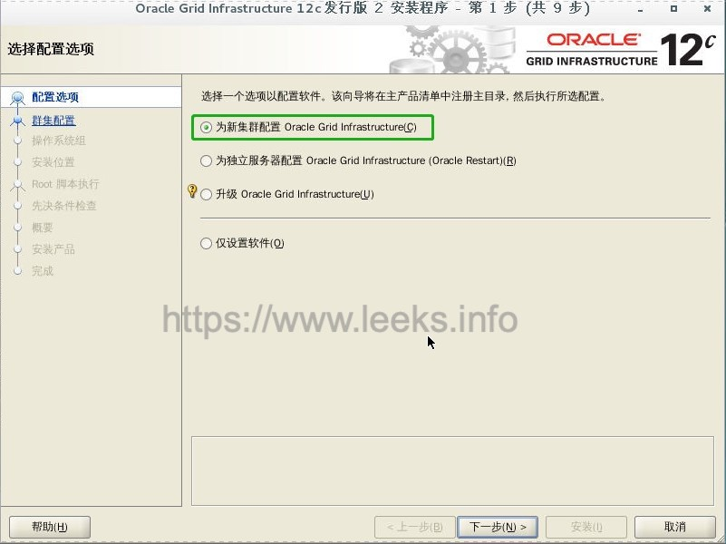

   

   **注意：**SCAN 名称需要对应 hosts 文件中 scan ip 名称一致，否则会报下面错误；

   ins-40718 single client accessname(scan):XXclustername could not be resolved

   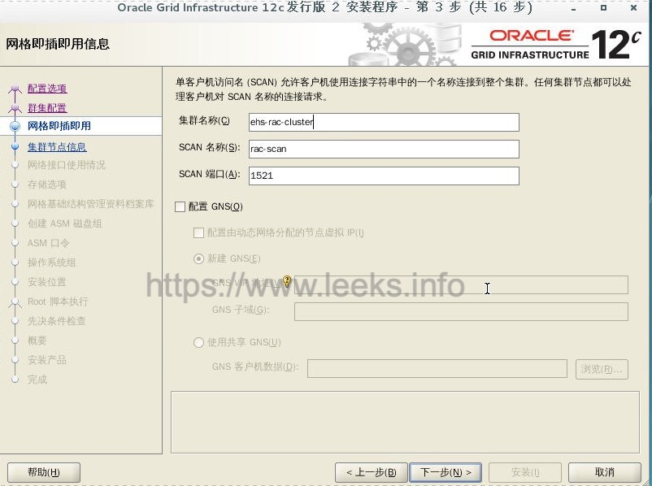

   单击“Add”，添加其他节点的信息，注意与 /etc/hosts 文件中保持一致。添加完后单击“OK”。

   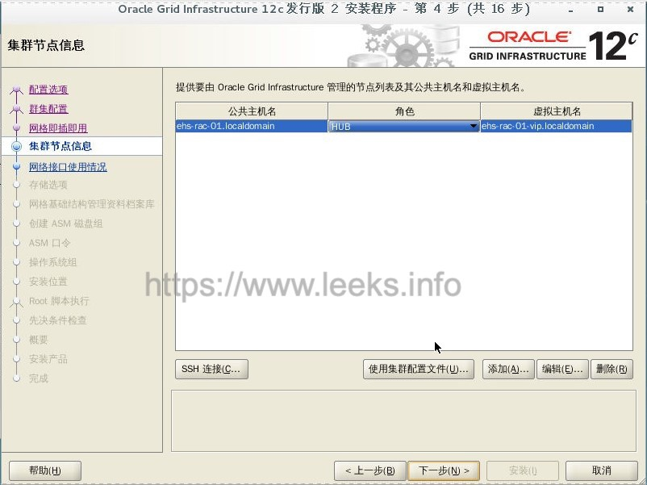

   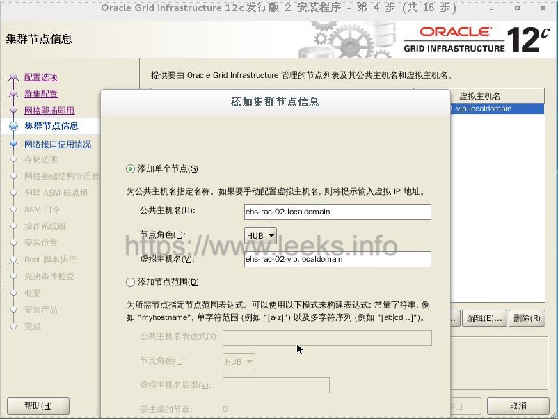

   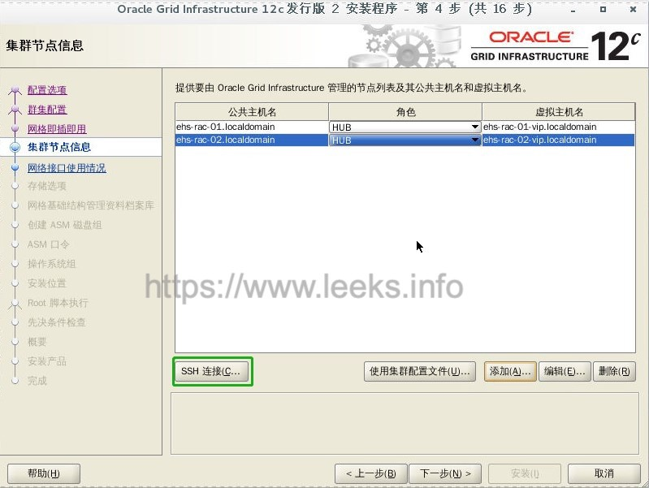

   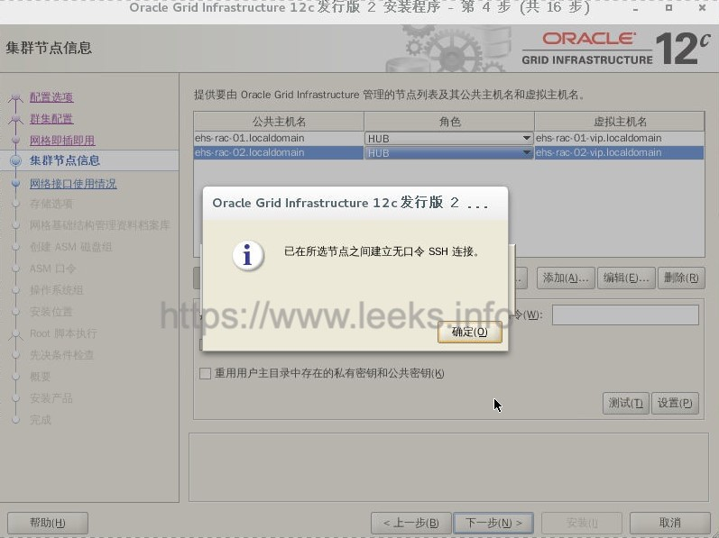

   

   

   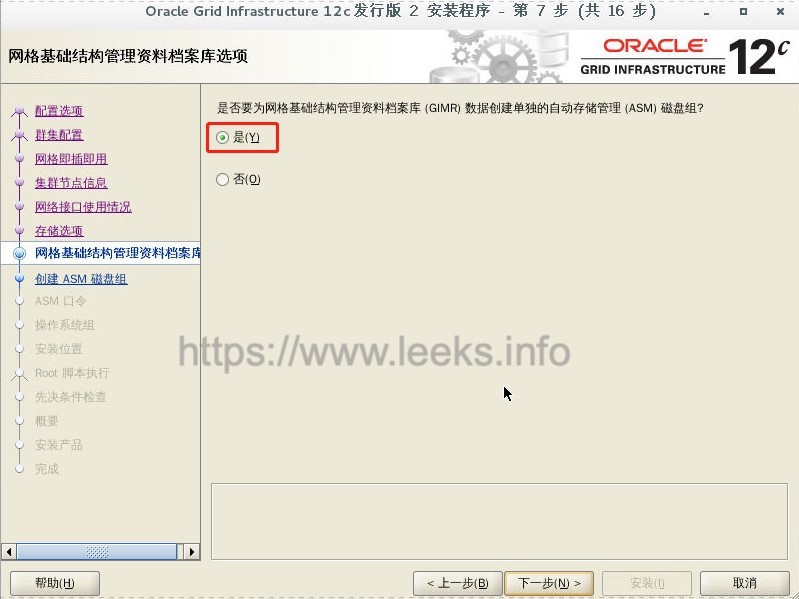

   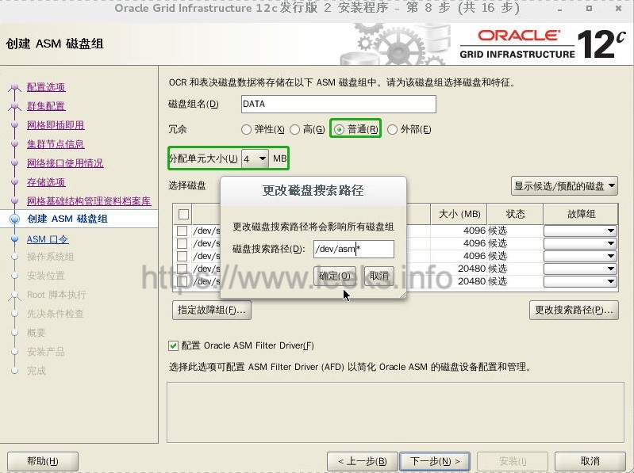

   

   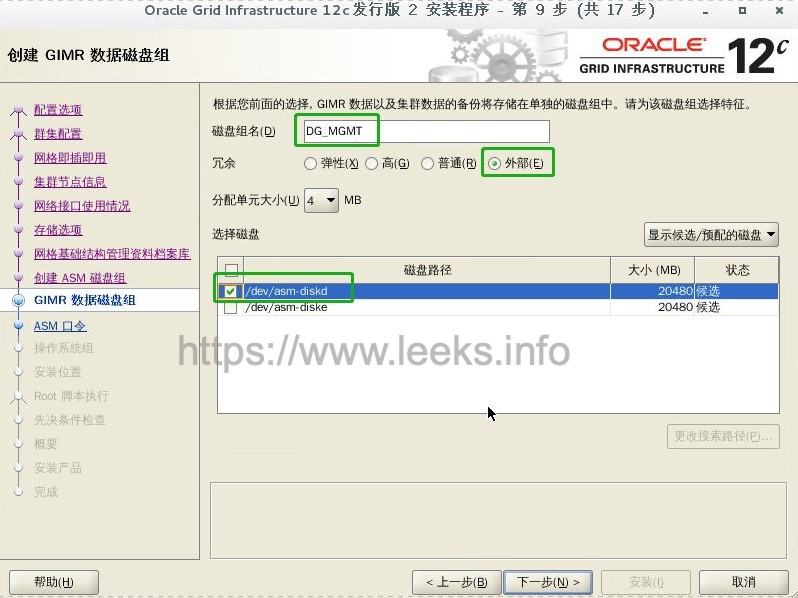

   

   口令：`oracle`

   

   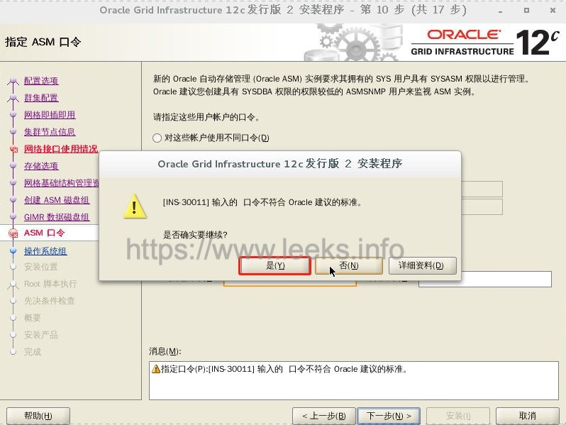

   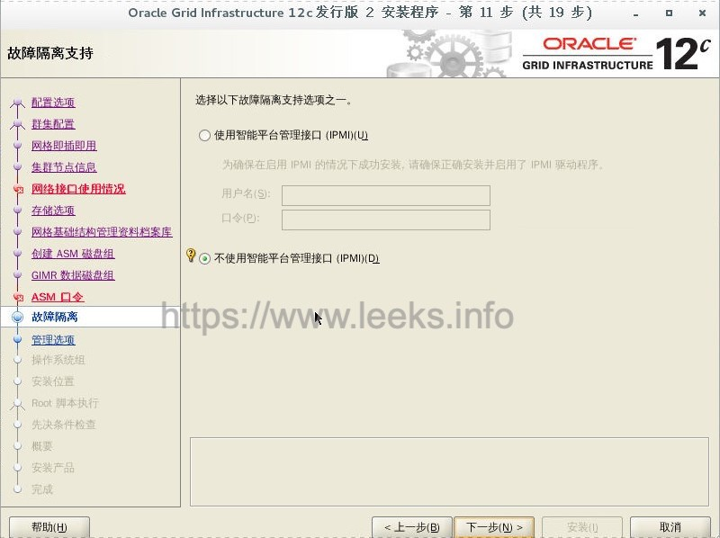

   

   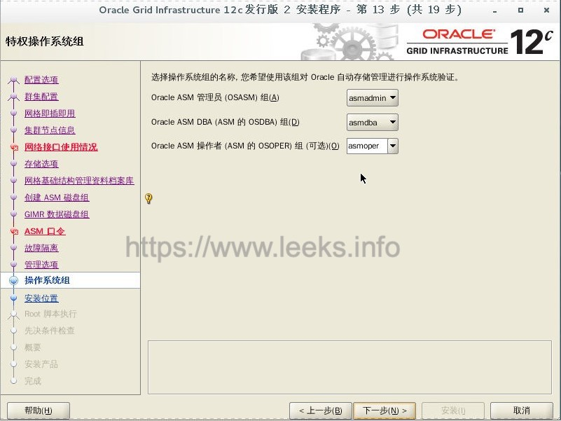

   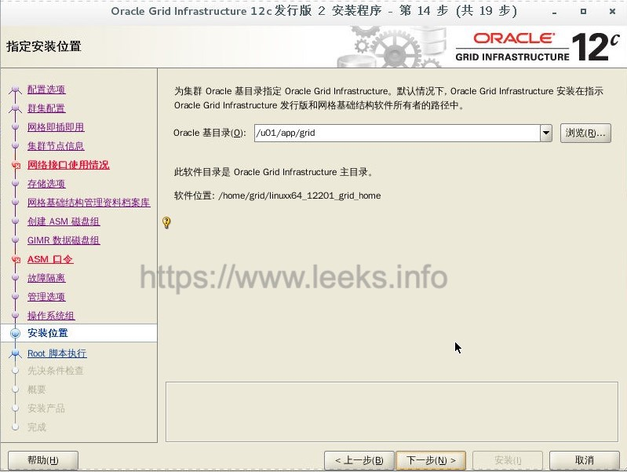

   安装到 Installation Location 时遇到 [INS-44002] The Oracle home location contains directories or files on following remote nodes 错误。

   解决方案：

   - 从环境变量中取消 ORACLE_HOME 设置

   - 将 grid.zip 解压到节点1的 /u01/app/12.2.0.1/grid 目录下，并运行 gridSetup.sh

   - 保证其他节点上的相同 ORACLE_HOME（比如 /u01/app/12.2.0.1/grid ）目录是空的，并且GI安装用户有权限访问他们。

   

   

   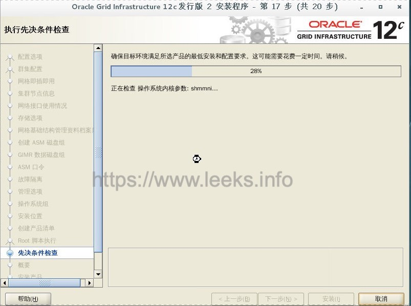

   

   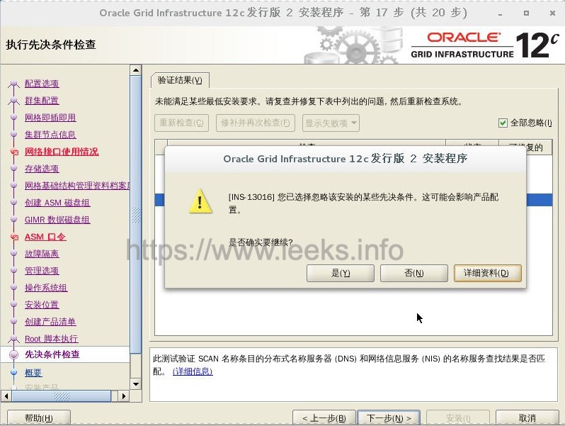

   

   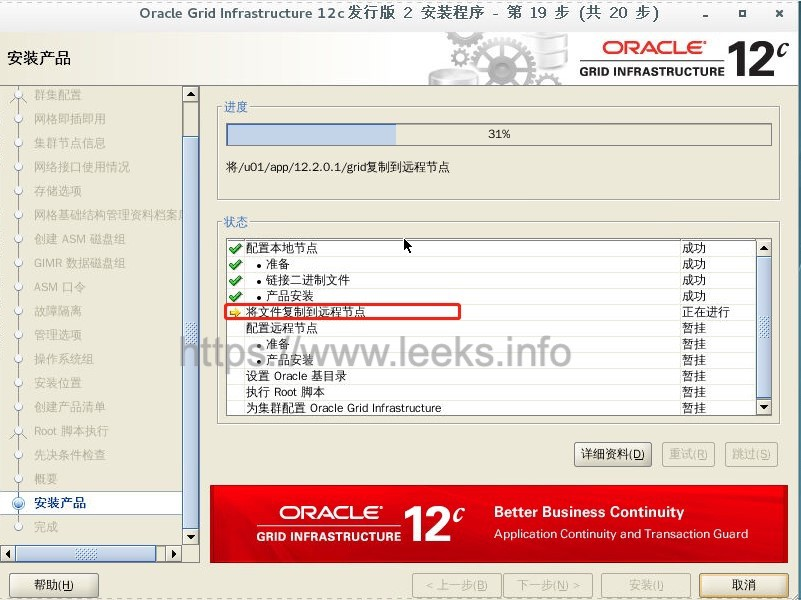

   此时到 rac02 节点目录查看是否有文件

   ```shell
   [root@ehs-rac-02 grid]# cd /u01/app/12.2.0.1/grid
   [root@ehs-rac-02 grid]# ls
   addnode      crs     deinstall    gpnp           inventory  ldap                          OPatch       ords   precomp   rhp             rootupgrade.sh.ouibak  srvm      welcome.html
   assistants   css     demo         gridSetup.sh   javavm     lib                           opmn         oss    QOpatch   root.sh         runcluvfy.sh           suptools  wlm
   bin          cv      diagnostics  has            jdbc       linuxx64_12201_grid_home.zip  oracore      oui    qos       root.sh.old     scheduler              tomcat    wwg
   cfgtoollogs  dbjava  dmu          hs             jdk        md                            oraInst.loc  owm    racg      root.sh.old.1   slax                   ucp       xag
   cha          dbs     env.ora      install        jlib       network                       ord          perl   rdbms     root.sh.ouibak  sqlpatch               usm       xdk
   clone        dc_ocm  evm          instantclient  JRE        nls                           ordim        plsql  relnotes  rootupgrade.sh  sqlplus                utl
   ```

   

   分别在 rac01 和 rac02 节点上执行脚本

   **注意：**先在 rac01 上执行，然后再到 rac02 上执行脚本

   rac01执行结果：

   ```shell
   [root@ehs-rac-01 grid]# /u01/app/oraInventory/orainstRoot.sh 
   更改权限/u01/app/oraInventory.
   添加组的读取和写入权限。
   删除全局的读取, 写入和执行权限。
   更改组名/u01/app/oraInventory 到 oinstall.
   脚本的执行已完成。
   [root@ehs-rac-01 grid]# /u01/app/12.2.0.1/grid/root.sh
   Performing root user operation.
   The following environment variables are set as:
       ORACLE_OWNER= grid
       ORACLE_HOME=  /u01/app/12.2.0.1/grid
   Enter the full pathname of the local bin directory: [/usr/local/bin]: 
      Copying dbhome to /usr/local/bin ...
      Copying oraenv to /usr/local/bin ...
      Copying coraenv to /usr/local/bin ...
   Creating /etc/oratab file...
   Entries will be added to the /etc/oratab file as needed by
   Database Configuration Assistant when a database is created
   Finished running generic part of root script.
   Now product-specific root actions will be performed.
   Relinking oracle with rac_on option
   Using configuration parameter file: /u01/app/12.2.0.1/grid/crs/install/crsconfig_params
   The log of current session can be found at:
     /u01/app/grid/crsdata/ehs-rac-01/crsconfig/rootcrs_ehs-rac-01_2019-09-16_11-39-39AM.log
   2019/09/16 11:40:05 CLSRSC-594: Executing installation step 1 of 19: 'SetupTFA'.
   2019/09/16 11:40:07 CLSRSC-4001: Installing Oracle Trace File Analyzer (TFA) Collector.
   2019/09/16 11:40:41 CLSRSC-4002: Successfully installed Oracle Trace File Analyzer (TFA) Collector.
   2019/09/16 11:40:41 CLSRSC-594: Executing installation step 2 of 19: 'ValidateEnv'.
   2019/09/16 11:40:52 CLSRSC-363: User ignored prerequisites during installation
   2019/09/16 11:40:52 CLSRSC-594: Executing installation step 3 of 19: 'CheckFirstNode'.
   2019/09/16 11:40:54 CLSRSC-594: Executing installation step 4 of 19: 'GenSiteGUIDs'.
   2019/09/16 11:40:56 CLSRSC-594: Executing installation step 5 of 19: 'SaveParamFile'.
   2019/09/16 11:41:07 CLSRSC-594: Executing installation step 6 of 19: 'SetupOSD'.
   2019/09/16 11:41:08 CLSRSC-594: Executing installation step 7 of 19: 'CheckCRSConfig'.
   2019/09/16 11:41:08 CLSRSC-594: Executing installation step 8 of 19: 'SetupLocalGPNP'.
   2019/09/16 11:41:38 CLSRSC-594: Executing installation step 9 of 19: 'ConfigOLR'.
   2019/09/16 11:41:54 CLSRSC-594: Executing installation step 10 of 19: 'ConfigCHMOS'.
   2019/09/16 11:41:54 CLSRSC-594: Executing installation step 11 of 19: 'CreateOHASD'.
   2019/09/16 11:42:03 CLSRSC-594: Executing installation step 12 of 19: 'ConfigOHASD'.
   2019/09/16 11:42:18 CLSRSC-330: Adding Clusterware entries to file 'oracle-ohasd.service'
   2019/09/16 11:43:05 CLSRSC-594: Executing installation step 13 of 19: 'InstallAFD'.
   2019/09/16 11:43:14 CLSRSC-594: Executing installation step 14 of 19: 'InstallACFS'.
   CRS-2791: 正在启动用于关闭 'ehs-rac-01' 上 Oracle 高可用性服务管理的资源的操作
   CRS-2793: 关闭 'ehs-rac-01' 上 Oracle 高可用性服务管理的资源的操作已完成
   CRS-4133: Oracle 高可用性服务已停止。
   CRS-4123: Oracle 高可用性服务已启动。
   2019/09/16 11:43:46 CLSRSC-400: A system reboot is required to continue installing.
   The command '/u01/app/12.2.0.1/grid/perl/bin/perl -I/u01/app/12.2.0.1/grid/perl/lib -I/u01/app/12.2.0.1/grid/crs/install /u01/app/12.2.0.1/grid/crs/install/rootcrs.pl ' execution failed
   ```

   错误：

   ```shell
   2019/09/16 11:43:46 CLSRSC-400: A system reboot is required to continue installing.
   The command '/u01/app/12.2.0.1/grid/perl/bin/perl -I/u01/app/12.2.0.1/grid/perl/lib -I/u01/app/12.2.0.1/grid/crs/install /u01/app/12.2.0.1/grid/crs/install/rootcrs.pl ' execution failed
   ```

   解决：

   ```shell
   [grid@ehs-rac-01 grid]$ acfsdriverstate -orahome $ORACLE_HOME supported
   ACFS-9459: ADVM/ACFS is not supported on this OS version: '3.10.0-514.el7.x86_64'
   ACFS-9201: Not Supported
   ```

   解释：

   > 我的系统不支持ADVM / ACFS，意味着我无法安装ACFS驱动程序。
   > “Doc ID 2025056.1”表示：如果节点不使用或不支持ACFS，则可以忽略这些错误消息。 所以我重新启动系统并删除安装的文件。 然后我再次安装，没有出现错误。
   > 如果节点2出现相同的错误，只需重启系统并再次运行root.sh。

   重新执行结果：

   ```shell
   [root@ehs-rac-01 grid]# /u01/app/12.2.0.1/grid/root.sh
   Performing root user operation.
   The following environment variables are set as:
       ORACLE_OWNER= grid
       ORACLE_HOME=  /u01/app/12.2.0.1/grid
   Enter the full pathname of the local bin directory: [/usr/local/bin]: 
   The contents of "dbhome" have not changed. No need to overwrite.
   The contents of "oraenv" have not changed. No need to overwrite.
   The contents of "coraenv" have not changed. No need to overwrite.
   Entries will be added to the /etc/oratab file as needed by
   Database Configuration Assistant when a database is created
   Finished running generic part of root script.
   Now product-specific root actions will be performed.
   Relinking oracle with rac_on option
   Using configuration parameter file: /u01/app/12.2.0.1/grid/crs/install/crsconfig_params
   The log of current session can be found at:
     /u01/app/grid/crsdata/ehs-rac-01/crsconfig/rootcrs_ehs-rac-01_2019-09-16_12-26-25AM.log
   2019/09/16 12:26:29 CLSRSC-594: Executing installation step 1 of 19: 'SetupTFA'.
   2019/09/16 12:26:29 CLSRSC-4001: Installing Oracle Trace File Analyzer (TFA) Collector.
   2019/09/16 12:26:29 CLSRSC-4002: Successfully installed Oracle Trace File Analyzer (TFA) Collector.
   2019/09/16 12:26:30 CLSRSC-594: Executing installation step 2 of 19: 'ValidateEnv'.
   2019/09/16 12:26:32 CLSRSC-363: User ignored prerequisites during installation
   2019/09/16 12:26:32 CLSRSC-594: Executing installation step 3 of 19: 'CheckFirstNode'.
   2019/09/16 12:26:34 CLSRSC-594: Executing installation step 4 of 19: 'GenSiteGUIDs'.
   2019/09/16 12:26:36 CLSRSC-594: Executing installation step 5 of 19: 'SaveParamFile'.
   2019/09/16 12:26:38 CLSRSC-594: Executing installation step 6 of 19: 'SetupOSD'.
   2019/09/16 12:26:39 CLSRSC-594: Executing installation step 7 of 19: 'CheckCRSConfig'.
   2019/09/16 12:26:40 CLSRSC-594: Executing installation step 8 of 19: 'SetupLocalGPNP'.
   2019/09/16 12:26:43 CLSRSC-594: Executing installation step 9 of 19: 'ConfigOLR'.
   2019/09/16 12:26:44 CLSRSC-594: Executing installation step 10 of 19: 'ConfigCHMOS'.
   2019/09/16 12:27:31 CLSRSC-594: Executing installation step 11 of 19: 'CreateOHASD'.
   2019/09/16 12:27:32 CLSRSC-594: Executing installation step 12 of 19: 'ConfigOHASD'.
   2019/09/16 12:27:33 CLSRSC-594: Executing installation step 13 of 19: 'InstallAFD'.
   2019/09/16 12:27:38 CLSRSC-594: Executing installation step 14 of 19: 'InstallACFS'.
   CRS-2791: 正在启动用于关闭 'ehs-rac-01' 上 Oracle 高可用性服务管理的资源的操作
   CRS-2793: 关闭 'ehs-rac-01' 上 Oracle 高可用性服务管理的资源的操作已完成
   CRS-4133: Oracle 高可用性服务已停止。
   CRS-4123: Oracle 高可用性服务已启动。
   2019/09/16 12:28:11 CLSRSC-594: Executing installation step 15 of 19: 'InstallKA'.
   2019/09/16 12:28:20 CLSRSC-594: Executing installation step 16 of 19: 'InitConfig'.
   CRS-2791: 正在启动用于关闭 'ehs-rac-01' 上 Oracle 高可用性服务管理的资源的操作
   CRS-2793: 关闭 'ehs-rac-01' 上 Oracle 高可用性服务管理的资源的操作已完成
   CRS-4133: Oracle 高可用性服务已停止。
   CRS-4123: Oracle 高可用性服务已启动。
   CRS-2672: 尝试启动 'ora.evmd' (在 'ehs-rac-01' 上)
   CRS-2672: 尝试启动 'ora.mdnsd' (在 'ehs-rac-01' 上)
   CRS-2676: 成功启动 'ora.mdnsd' (在 'ehs-rac-01' 上)
   CRS-2676: 成功启动 'ora.evmd' (在 'ehs-rac-01' 上)
   CRS-2672: 尝试启动 'ora.gpnpd' (在 'ehs-rac-01' 上)
   CRS-2676: 成功启动 'ora.gpnpd' (在 'ehs-rac-01' 上)
   CRS-2672: 尝试启动 'ora.cssdmonitor' (在 'ehs-rac-01' 上)
   CRS-2672: 尝试启动 'ora.gipcd' (在 'ehs-rac-01' 上)
   CRS-2676: 成功启动 'ora.cssdmonitor' (在 'ehs-rac-01' 上)
   CRS-2676: 成功启动 'ora.gipcd' (在 'ehs-rac-01' 上)
   CRS-2672: 尝试启动 'ora.cssd' (在 'ehs-rac-01' 上)
   CRS-2672: 尝试启动 'ora.diskmon' (在 'ehs-rac-01' 上)
   CRS-2676: 成功启动 'ora.diskmon' (在 'ehs-rac-01' 上)
   CRS-2676: 成功启动 'ora.cssd' (在 'ehs-rac-01' 上)
   已成功创建磁盘组。有关详细信息, 请查看 /u01/app/grid/cfgtoollogs/asmca/asmca-190916下午122902.log。
   2019/09/16 12:30:46 CLSRSC-482: Running command: '/u01/app/12.2.0.1/grid/bin/ocrconfig -upgrade grid oinstall'
   CRS-2672: 尝试启动 'ora.crf' (在 'ehs-rac-01' 上)
   CRS-2672: 尝试启动 'ora.storage' (在 'ehs-rac-01' 上)
   CRS-2676: 成功启动 'ora.storage' (在 'ehs-rac-01' 上)
   CRS-2676: 成功启动 'ora.crf' (在 'ehs-rac-01' 上)
   CRS-2672: 尝试启动 'ora.crsd' (在 'ehs-rac-01' 上)
   CRS-2676: 成功启动 'ora.crsd' (在 'ehs-rac-01' 上)
   CRS-4256: 更新概要文件
   已成功添加表决磁盘 e81cdfa91e744f09bfdf07f2f234e0b5。
   已成功添加表决磁盘 560fa68cb9f44f4fbfdbd9c43496b321。
   已成功添加表决磁盘 5afa9cb55c614feebffe7540e6c0f053。
   已成功将表决磁盘组替换为 +DG_OCR。
   CRS-4256: 更新概要文件
   CRS-4266: 已成功替换表决文件
   ##  STATE    File Universal Id                File Name Disk group
   --  -----    -----------------                --------- ---------
    1. ONLINE   e81cdfa91e744f09bfdf07f2f234e0b5 (/dev/sda) [DG_OCR]
    2. ONLINE   560fa68cb9f44f4fbfdbd9c43496b321 (/dev/sdc) [DG_OCR]
    3. ONLINE   5afa9cb55c614feebffe7540e6c0f053 (/dev/sdb) [DG_OCR]
   找到了 3 个表决磁盘。
   CRS-2791: 正在启动用于关闭 'ehs-rac-01' 上 Oracle 高可用性服务管理的资源的操作
   CRS-2673: 尝试停止 'ora.crsd' (在 'ehs-rac-01' 上)
   CRS-2677: 成功停止 'ora.crsd' (在 'ehs-rac-01' 上)
   CRS-2673: 尝试停止 'ora.storage' (在 'ehs-rac-01' 上)
   CRS-2673: 尝试停止 'ora.crf' (在 'ehs-rac-01' 上)
   CRS-2673: 尝试停止 'ora.gpnpd' (在 'ehs-rac-01' 上)
   CRS-2673: 尝试停止 'ora.mdnsd' (在 'ehs-rac-01' 上)
   CRS-2677: 成功停止 'ora.crf' (在 'ehs-rac-01' 上)
   CRS-2677: 成功停止 'ora.gpnpd' (在 'ehs-rac-01' 上)
   CRS-2677: 成功停止 'ora.storage' (在 'ehs-rac-01' 上)
   CRS-2673: 尝试停止 'ora.asm' (在 'ehs-rac-01' 上)
   CRS-2677: 成功停止 'ora.mdnsd' (在 'ehs-rac-01' 上)
   CRS-2677: 成功停止 'ora.asm' (在 'ehs-rac-01' 上)
   CRS-2673: 尝试停止 'ora.cluster_interconnect.haip' (在 'ehs-rac-01' 上)
   CRS-2677: 成功停止 'ora.cluster_interconnect.haip' (在 'ehs-rac-01' 上)
   CRS-2673: 尝试停止 'ora.ctssd' (在 'ehs-rac-01' 上)
   CRS-2673: 尝试停止 'ora.evmd' (在 'ehs-rac-01' 上)
   CRS-2677: 成功停止 'ora.ctssd' (在 'ehs-rac-01' 上)
   CRS-2677: 成功停止 'ora.evmd' (在 'ehs-rac-01' 上)
   CRS-2673: 尝试停止 'ora.cssd' (在 'ehs-rac-01' 上)
   CRS-2677: 成功停止 'ora.cssd' (在 'ehs-rac-01' 上)
   CRS-2673: 尝试停止 'ora.gipcd' (在 'ehs-rac-01' 上)
   CRS-2677: 成功停止 'ora.gipcd' (在 'ehs-rac-01' 上)
   CRS-2793: 关闭 'ehs-rac-01' 上 Oracle 高可用性服务管理的资源的操作已完成
   CRS-4133: Oracle 高可用性服务已停止。
   2019/09/16 12:32:46 CLSRSC-594: Executing installation step 17 of 19: 'StartCluster'.
   CRS-4123: 正在启动 Oracle 高可用性服务管理的资源
   CRS-2672: 尝试启动 'ora.mdnsd' (在 'ehs-rac-01' 上)
   CRS-2672: 尝试启动 'ora.evmd' (在 'ehs-rac-01' 上)
   CRS-2676: 成功启动 'ora.mdnsd' (在 'ehs-rac-01' 上)
   CRS-2676: 成功启动 'ora.evmd' (在 'ehs-rac-01' 上)
   CRS-2672: 尝试启动 'ora.gpnpd' (在 'ehs-rac-01' 上)
   CRS-2676: 成功启动 'ora.gpnpd' (在 'ehs-rac-01' 上)
   CRS-2672: 尝试启动 'ora.gipcd' (在 'ehs-rac-01' 上)
   CRS-2676: 成功启动 'ora.gipcd' (在 'ehs-rac-01' 上)
   CRS-2672: 尝试启动 'ora.drivers.acfs' (在 'ehs-rac-01' 上)
   CRS-2674: 未能启动 'ora.drivers.acfs' (在 'ehs-rac-01' 上)
   CRS-2672: 尝试启动 'ora.cssdmonitor' (在 'ehs-rac-01' 上)
   CRS-2676: 成功启动 'ora.cssdmonitor' (在 'ehs-rac-01' 上)
   CRS-2672: 尝试启动 'ora.cssd' (在 'ehs-rac-01' 上)
   CRS-2672: 尝试启动 'ora.diskmon' (在 'ehs-rac-01' 上)
   CRS-2676: 成功启动 'ora.diskmon' (在 'ehs-rac-01' 上)
   CRS-2676: 成功启动 'ora.cssd' (在 'ehs-rac-01' 上)
   CRS-2672: 尝试启动 'ora.cluster_interconnect.haip' (在 'ehs-rac-01' 上)
   CRS-2672: 尝试启动 'ora.ctssd' (在 'ehs-rac-01' 上)
   CRS-2676: 成功启动 'ora.ctssd' (在 'ehs-rac-01' 上)
   CRS-2672: 尝试启动 'ora.drivers.acfs' (在 'ehs-rac-01' 上)
   CRS-2674: 未能启动 'ora.drivers.acfs' (在 'ehs-rac-01' 上)
   CRS-2676: 成功启动 'ora.cluster_interconnect.haip' (在 'ehs-rac-01' 上)
   CRS-2672: 尝试启动 'ora.asm' (在 'ehs-rac-01' 上)
   CRS-2676: 成功启动 'ora.asm' (在 'ehs-rac-01' 上)
   CRS-2672: 尝试启动 'ora.storage' (在 'ehs-rac-01' 上)
   CRS-2676: 成功启动 'ora.storage' (在 'ehs-rac-01' 上)
   CRS-2672: 尝试启动 'ora.crf' (在 'ehs-rac-01' 上)
   CRS-2676: 成功启动 'ora.crf' (在 'ehs-rac-01' 上)
   CRS-2672: 尝试启动 'ora.crsd' (在 'ehs-rac-01' 上)
   CRS-2676: 成功启动 'ora.crsd' (在 'ehs-rac-01' 上)
   CRS-6023: 正在启动 Oracle 集群就绪服务管理的资源
   CRS-6017: 正在处理以下服务器的资源自动启动: ehs-rac-01
   CRS-6016: 服务器 ehs-rac-01 的资源自动启动已完成
   CRS-6024: 已完成启动 Oracle 集群就绪服务管理的资源
   CRS-4123: Oracle 高可用性服务已启动。
   2019/09/16 12:35:28 CLSRSC-343: Successfully started Oracle Clusterware stack
   2019/09/16 12:35:28 CLSRSC-594: Executing installation step 18 of 19: 'ConfigNode'.
   CRS-2672: 尝试启动 'ora.ASMNET1LSNR_ASM.lsnr' (在 'ehs-rac-01' 上)
   CRS-2676: 成功启动 'ora.ASMNET1LSNR_ASM.lsnr' (在 'ehs-rac-01' 上)
   CRS-2672: 尝试启动 'ora.asm' (在 'ehs-rac-01' 上)
   CRS-2676: 成功启动 'ora.asm' (在 'ehs-rac-01' 上)
   CRS-2672: 尝试启动 'ora.DG_OCR.dg' (在 'ehs-rac-01' 上)
   CRS-2676: 成功启动 'ora.DG_OCR.dg' (在 'ehs-rac-01' 上)
   2019/09/16 12:38:58 CLSRSC-594: Executing installation step 19 of 19: 'PostConfig'.
   2019/09/16 12:40:25 CLSRSC-325: Configure Oracle Grid Infrastructure for a Cluster ... succeeded
   ```

   rac2 执行结果：

   ```shell
   [root@ehs-rac-02 grid]# /u01/app/oraInventory/orainstRoot.sh
   更改权限/u01/app/oraInventory.
   添加组的读取和写入权限。
   删除全局的读取, 写入和执行权限。
   更改组名/u01/app/oraInventory 到 oinstall.
   脚本的执行已完成。
   [root@ehs-rac-02 grid]# /u01/app/12.2.0.1/grid/root.sh
   Performing root user operation.
   The following environment variables are set as:
       ORACLE_OWNER= grid
       ORACLE_HOME=  /u01/app/12.2.0.1/grid
   Enter the full pathname of the local bin directory: [/usr/local/bin]: 
   The contents of "dbhome" have not changed. No need to overwrite.
   The contents of "oraenv" have not changed. No need to overwrite.
   The contents of "coraenv" have not changed. No need to overwrite.
   Entries will be added to the /etc/oratab file as needed by
   Database Configuration Assistant when a database is created
   Finished running generic part of root script.
   Now product-specific root actions will be performed.
   Relinking oracle with rac_on option
   Using configuration parameter file: /u01/app/12.2.0.1/grid/crs/install/crsconfig_params
   The log of current session can be found at:
     /u01/app/grid/crsdata/ehs-rac-02/crsconfig/rootcrs_ehs-rac-02_2019-09-16_12-46-13AM.log
   2019/09/16 12:46:17 CLSRSC-594: Executing installation step 1 of 19: 'SetupTFA'.
   2019/09/16 12:46:17 CLSRSC-4001: Installing Oracle Trace File Analyzer (TFA) Collector.
   2019/09/16 12:46:18 CLSRSC-4002: Successfully installed Oracle Trace File Analyzer (TFA) Collector.
   2019/09/16 12:46:18 CLSRSC-594: Executing installation step 2 of 19: 'ValidateEnv'.
   2019/09/16 12:46:20 CLSRSC-363: User ignored prerequisites during installation
   2019/09/16 12:46:20 CLSRSC-594: Executing installation step 3 of 19: 'CheckFirstNode'.
   2019/09/16 12:46:21 CLSRSC-594: Executing installation step 4 of 19: 'GenSiteGUIDs'.
   2019/09/16 12:46:22 CLSRSC-594: Executing installation step 5 of 19: 'SaveParamFile'.
   2019/09/16 12:46:23 CLSRSC-594: Executing installation step 6 of 19: 'SetupOSD'.
   2019/09/16 12:46:25 CLSRSC-594: Executing installation step 7 of 19: 'CheckCRSConfig'.
   2019/09/16 12:46:25 CLSRSC-594: Executing installation step 8 of 19: 'SetupLocalGPNP'.
   2019/09/16 12:46:27 CLSRSC-594: Executing installation step 9 of 19: 'ConfigOLR'.
   2019/09/16 12:46:29 CLSRSC-594: Executing installation step 10 of 19: 'ConfigCHMOS'.
   2019/09/16 12:47:16 CLSRSC-594: Executing installation step 11 of 19: 'CreateOHASD'.
   2019/09/16 12:47:17 CLSRSC-594: Executing installation step 12 of 19: 'ConfigOHASD'.
   2019/09/16 12:47:18 CLSRSC-594: Executing installation step 13 of 19: 'InstallAFD'.
   2019/09/16 12:47:19 CLSRSC-594: Executing installation step 14 of 19: 'InstallACFS'.
   CRS-2791: 正在启动用于关闭 'ehs-rac-02' 上 Oracle 高可用性服务管理的资源的操作
   CRS-2793: 关闭 'ehs-rac-02' 上 Oracle 高可用性服务管理的资源的操作已完成
   CRS-4133: Oracle 高可用性服务已停止。
   CRS-4123: Oracle 高可用性服务已启动。
   2019/09/16 12:47:38 CLSRSC-594: Executing installation step 15 of 19: 'InstallKA'.
   2019/09/16 12:47:40 CLSRSC-594: Executing installation step 16 of 19: 'InitConfig'.
   CRS-2791: 正在启动用于关闭 'ehs-rac-02' 上 Oracle 高可用性服务管理的资源的操作
   CRS-2793: 关闭 'ehs-rac-02' 上 Oracle 高可用性服务管理的资源的操作已完成
   CRS-4133: Oracle 高可用性服务已停止。
   CRS-4123: Oracle 高可用性服务已启动。
   CRS-2791: 正在启动用于关闭 'ehs-rac-02' 上 Oracle 高可用性服务管理的资源的操作
   CRS-2793: 关闭 'ehs-rac-02' 上 Oracle 高可用性服务管理的资源的操作已完成
   CRS-4133: Oracle 高可用性服务已停止。
   2019/09/16 12:48:02 CLSRSC-594: Executing installation step 17 of 19: 'StartCluster'.
   CRS-4123: 正在启动 Oracle 高可用性服务管理的资源
   CRS-2672: 尝试启动 'ora.mdnsd' (在 'ehs-rac-02' 上)
   CRS-2672: 尝试启动 'ora.evmd' (在 'ehs-rac-02' 上)
   CRS-2676: 成功启动 'ora.mdnsd' (在 'ehs-rac-02' 上)
   CRS-2676: 成功启动 'ora.evmd' (在 'ehs-rac-02' 上)
   CRS-2672: 尝试启动 'ora.gpnpd' (在 'ehs-rac-02' 上)
   CRS-2676: 成功启动 'ora.gpnpd' (在 'ehs-rac-02' 上)
   CRS-2672: 尝试启动 'ora.gipcd' (在 'ehs-rac-02' 上)
   CRS-2676: 成功启动 'ora.gipcd' (在 'ehs-rac-02' 上)
   CRS-2672: 尝试启动 'ora.cssdmonitor' (在 'ehs-rac-02' 上)
   CRS-2676: 成功启动 'ora.cssdmonitor' (在 'ehs-rac-02' 上)
   CRS-2672: 尝试启动 'ora.cssd' (在 'ehs-rac-02' 上)
   CRS-2672: 尝试启动 'ora.diskmon' (在 'ehs-rac-02' 上)
   CRS-2676: 成功启动 'ora.diskmon' (在 'ehs-rac-02' 上)
   CRS-2676: 成功启动 'ora.cssd' (在 'ehs-rac-02' 上)
   CRS-2672: 尝试启动 'ora.cluster_interconnect.haip' (在 'ehs-rac-02' 上)
   CRS-2672: 尝试启动 'ora.ctssd' (在 'ehs-rac-02' 上)
   CRS-2676: 成功启动 'ora.ctssd' (在 'ehs-rac-02' 上)
   CRS-2672: 尝试启动 'ora.crf' (在 'ehs-rac-02' 上)
   CRS-2676: 成功启动 'ora.crf' (在 'ehs-rac-02' 上)
   CRS-2672: 尝试启动 'ora.crsd' (在 'ehs-rac-02' 上)
   CRS-2676: 成功启动 'ora.crsd' (在 'ehs-rac-02' 上)
   CRS-2676: 成功启动 'ora.cluster_interconnect.haip' (在 'ehs-rac-02' 上)
   CRS-2672: 尝试启动 'ora.drivers.acfs' (在 'ehs-rac-02' 上)
   CRS-2674: 未能启动 'ora.drivers.acfs' (在 'ehs-rac-02' 上)
   CRS-2672: 尝试启动 'ora.asm' (在 'ehs-rac-02' 上)
   CRS-2676: 成功启动 'ora.asm' (在 'ehs-rac-02' 上)
   CRS-6017: 正在处理以下服务器的资源自动启动: ehs-rac-02
   CRS-2672: 尝试启动 'ora.net1.network' (在 'ehs-rac-02' 上)
   CRS-2672: 尝试启动 'ora.ASMNET1LSNR_ASM.lsnr' (在 'ehs-rac-02' 上)
   CRS-2676: 成功启动 'ora.net1.network' (在 'ehs-rac-02' 上)
   CRS-2672: 尝试启动 'ora.ons' (在 'ehs-rac-02' 上)
   CRS-2676: 成功启动 'ora.ASMNET1LSNR_ASM.lsnr' (在 'ehs-rac-02' 上)
   CRS-2672: 尝试启动 'ora.asm' (在 'ehs-rac-02' 上)
   CRS-2676: 成功启动 'ora.ons' (在 'ehs-rac-02' 上)
   CRS-2676: 成功启动 'ora.asm' (在 'ehs-rac-02' 上)
   CRS-6016: 服务器 ehs-rac-02 的资源自动启动已完成
   CRS-6024: 已完成启动 Oracle 集群就绪服务管理的资源
   CRS-4123: Oracle 高可用性服务已启动。
   2019/09/16 12:51:18 CLSRSC-343: Successfully started Oracle Clusterware stack
   2019/09/16 12:51:18 CLSRSC-594: Executing installation step 18 of 19: 'ConfigNode'.
   2019/09/16 12:51:45 CLSRSC-594: Executing installation step 19 of 19: 'PostConfig'.
   2019/09/16 12:51:58 CLSRSC-325: Configure Oracle Grid Infrastructure for a Cluster ... succeeded
   ```

   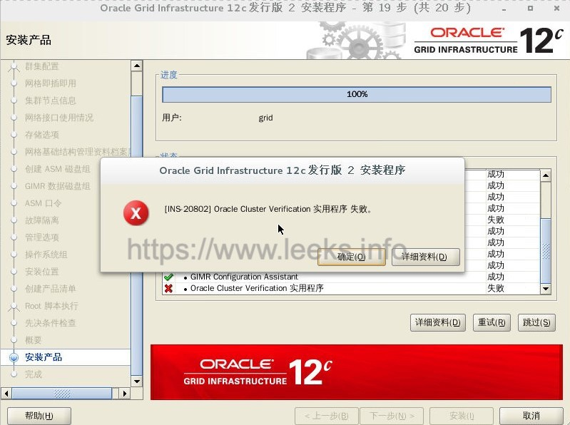

   错误：

   解决：

   因为没有配置 DNS 解析原因造成的 SCAN IP 解析错误，这个错误可以忽略。

   如果在两上节点在都可以 ping 的通 scan ip 直接跳过些错误。

   

   

   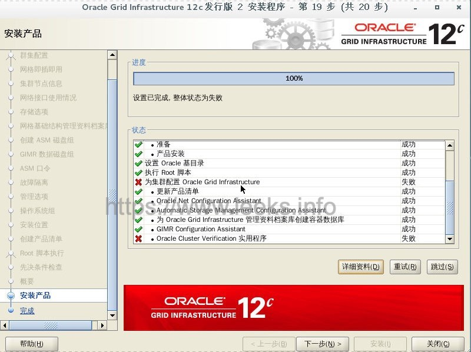

   

   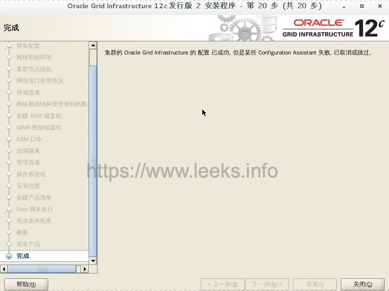

4. 安装完成后，查看集群状态

   ```shell
   [grid@ehs-rac-01 ~]$ crsctl stat res -t
   --------------------------------------------------------------------------------
   Name           Target  State        Server                   State details       
   --------------------------------------------------------------------------------
   Local Resources
   --------------------------------------------------------------------------------
   ora.ASMNET1LSNR_ASM.lsnr
                  ONLINE  ONLINE       ehs-rac-01               STABLE
                  ONLINE  ONLINE       ehs-rac-02               STABLE
   ora.DG_MGMT.dg
                  ONLINE  ONLINE       ehs-rac-01               STABLE
                  ONLINE  ONLINE       ehs-rac-02               STABLE
   ora.DG_OCR.dg
                  ONLINE  ONLINE       ehs-rac-01               STABLE
                  ONLINE  ONLINE       ehs-rac-02               STABLE
   ora.LISTENER.lsnr
                  ONLINE  ONLINE       ehs-rac-01               STABLE
                  ONLINE  ONLINE       ehs-rac-02               STABLE
   ora.chad
                  ONLINE  ONLINE       ehs-rac-01               STABLE
                  ONLINE  ONLINE       ehs-rac-02               STABLE
   ora.net1.network
                  ONLINE  ONLINE       ehs-rac-01               STABLE
                  ONLINE  ONLINE       ehs-rac-02               STABLE
   ora.ons
                  ONLINE  ONLINE       ehs-rac-01               STABLE
                  ONLINE  ONLINE       ehs-rac-02               STABLE
   --------------------------------------------------------------------------------
   Cluster Resources
   --------------------------------------------------------------------------------
   ora.LISTENER_SCAN1.lsnr
         1        ONLINE  ONLINE       ehs-rac-01               STABLE
   ora.MGMTLSNR
         1        ONLINE  ONLINE       ehs-rac-01               169.254.96.70 10.0.0
                                                                .110,STABLE
   ora.asm
         1        ONLINE  ONLINE       ehs-rac-01               Started,STABLE
         2        ONLINE  ONLINE       ehs-rac-02               Started,STABLE
         3        OFFLINE OFFLINE                               STABLE
   ora.cvu
         1        ONLINE  ONLINE       ehs-rac-01               STABLE
   ora.ehs-rac-01.vip
         1        ONLINE  ONLINE       ehs-rac-01               STABLE
   ora.ehs-rac-02.vip
         1        ONLINE  ONLINE       ehs-rac-02               STABLE
   ora.mgmtdb
         1        ONLINE  ONLINE       ehs-rac-01               Open,STABLE
   ora.qosmserver
         1        ONLINE  ONLINE       ehs-rac-01               STABLE
   ora.scan1.vip
         1        ONLINE  ONLINE       ehs-rac-01               STABLE
   --------------------------------------------------------------------------------
   ```

   

## 配置 ASM（rac1）

```shell
[grid@ehs-rac-01 ~]$ asmca
```


在磁盘组上右键选择创建或点击下方创建按钮

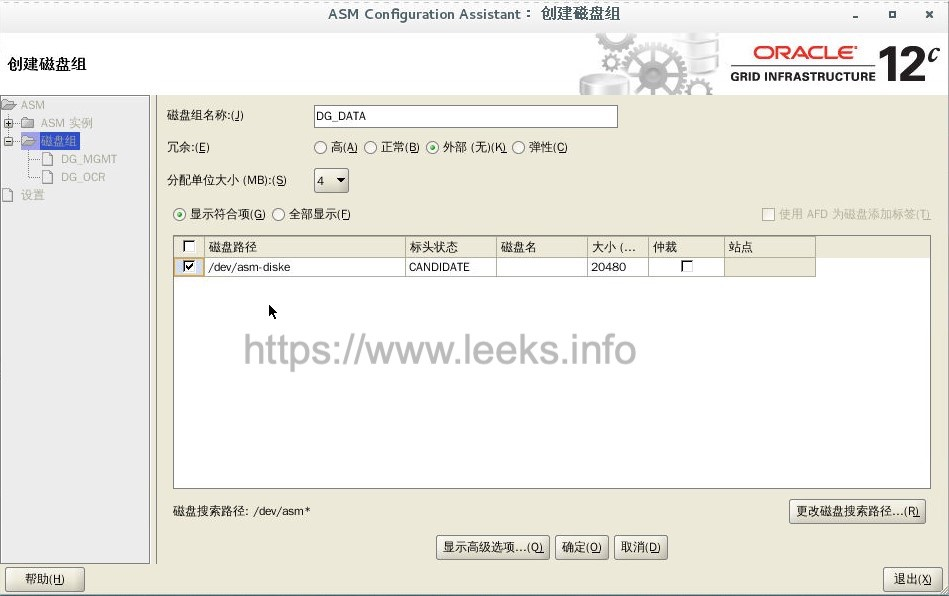


## 安装 ORACLE 软件（rac1）

1. 解压 oracle 安装包（解压到 oracle 家目录就可以）

   ```shell
   [oracle@ehs-rac-02 ~]$ unzip linuxx64_12201_database.zip 
   [oracle@ehs-rac-01 ~]$ cd database/
   [oracle@ehs-rac-01 database]$ ls
   install  response  rpm  runInstaller  sshsetup  stage  welcome.html
   [oracle@ehs-rac-01 database]$ ./runInstaller
   ```

   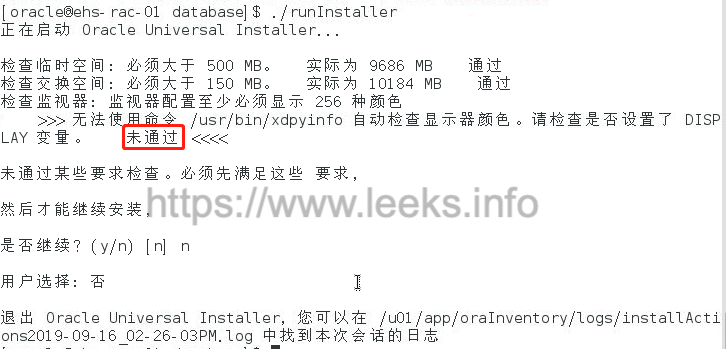

2. 设置环境变量

   ```shell
   [oracle@ehs-rac-01 database]$ export DISPLAY=:0
   ```

   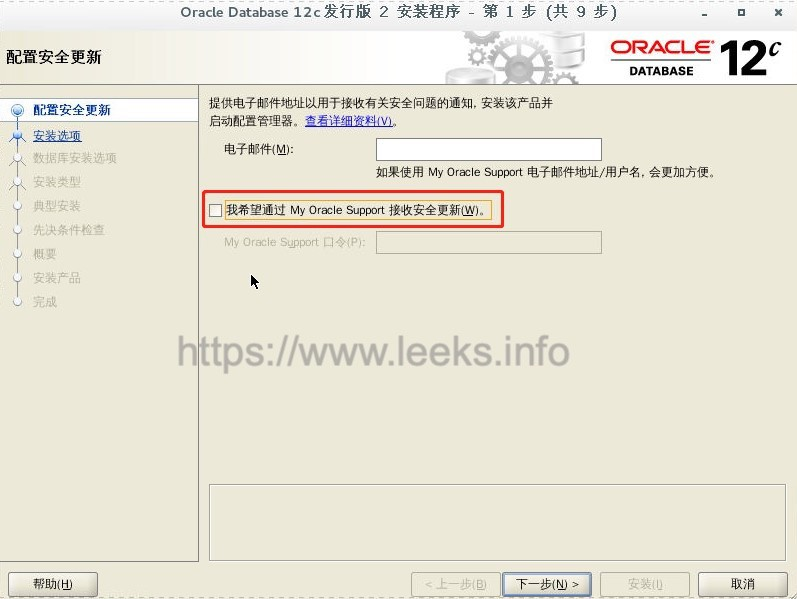

   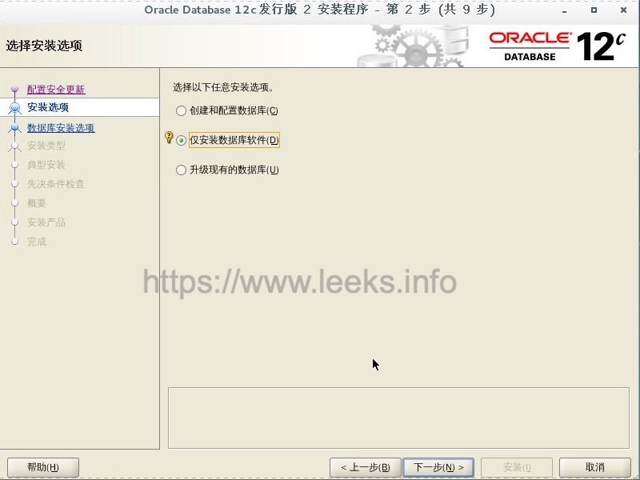

   

   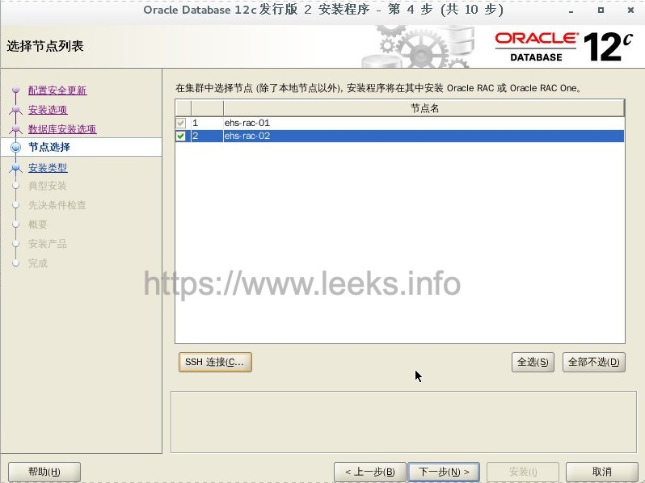

   

   

   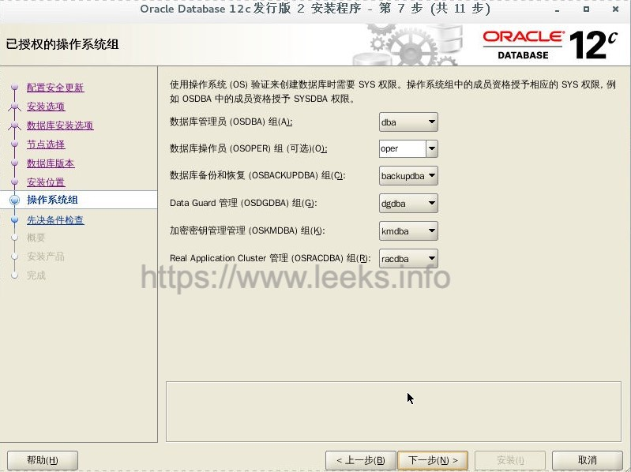

   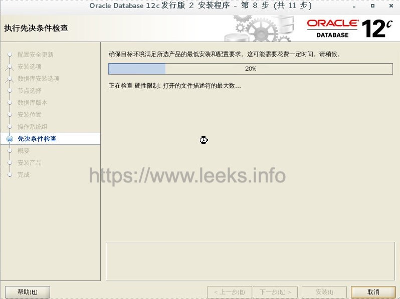

   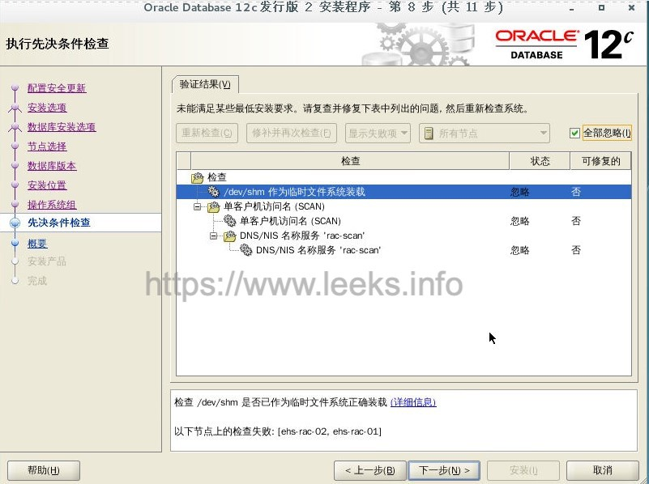

   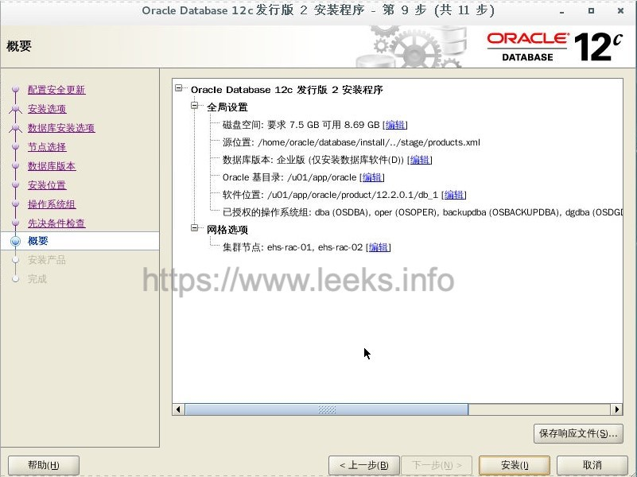

   

   

   rac01 执行脚本

   ```shell
   [root@ehs-rac-01 rules.d]# /u01/app/oracle/product/12.2.0.1/db_1/root.sh
   Performing root user operation.
   The following environment variables are set as:
       ORACLE_OWNER= oracle
       ORACLE_HOME=  /u01/app/oracle/product/12.2.0.1/db_1
   Enter the full pathname of the local bin directory: [/usr/local/bin]: 
   The contents of "dbhome" have not changed. No need to overwrite.
   The contents of "oraenv" have not changed. No need to overwrite.
   The contents of "coraenv" have not changed. No need to overwrite.
   Entries will be added to the /etc/oratab file as needed by
   Database Configuration Assistant when a database is created
   Finished running generic part of root script.
   Now product-specific root actions will be performed.
   ```

   rac02 执行脚本

   ```shell
   [root@ehs-rac-02 db_1]# /u01/app/oracle/product/12.2.0.1/db_1/root.sh
   Performing root user operation.
   The following environment variables are set as:
       ORACLE_OWNER= oracle
       ORACLE_HOME=  /u01/app/oracle/product/12.2.0.1/db_1
   Enter the full pathname of the local bin directory: [/usr/local/bin]: 
   The contents of "dbhome" have not changed. No need to overwrite.
   The contents of "oraenv" have not changed. No need to overwrite.
   The contents of "coraenv" have not changed. No need to overwrite.
   Entries will be added to the /etc/oratab file as needed by
   Database Configuration Assistant when a database is created
   Finished running generic part of root script.
   Now product-specific root actions will be performed.
   ```

   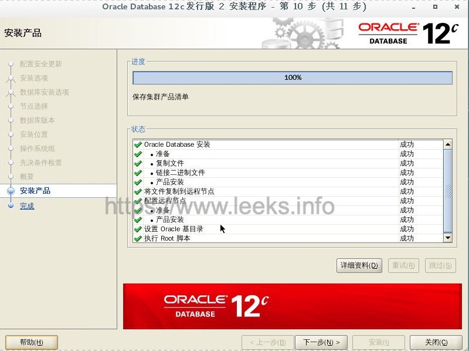
   

 


## 安装数据库（rac1）

```shell
[oracle@ehs-rac-01 database]$ dbca
```

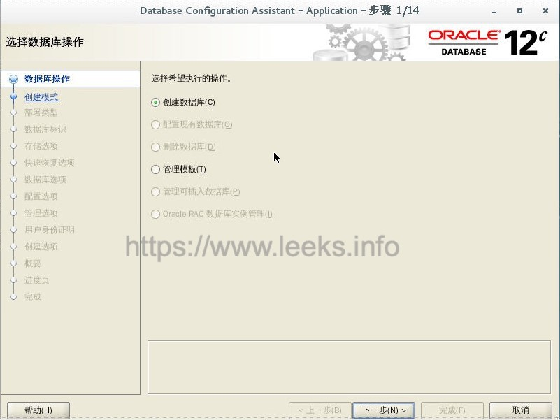


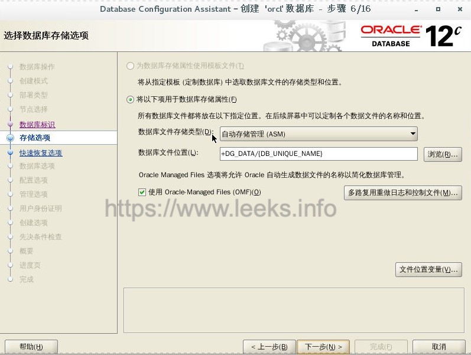
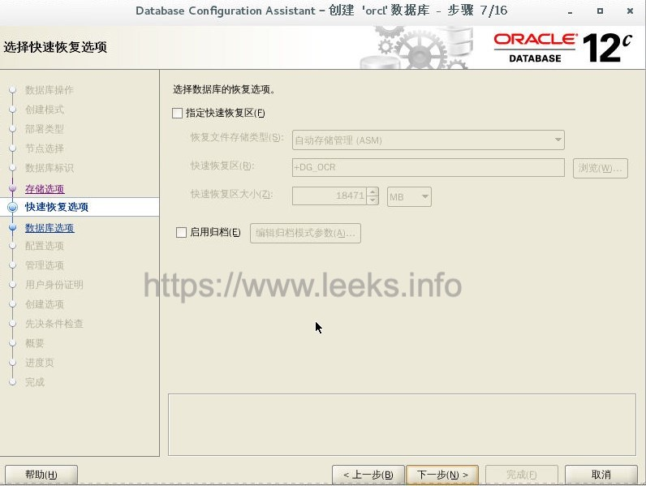


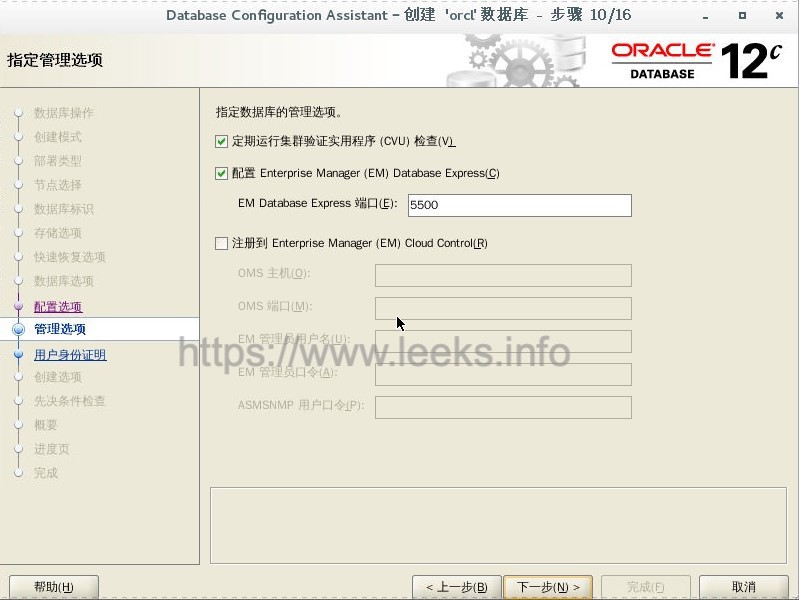

密码：`oracle`

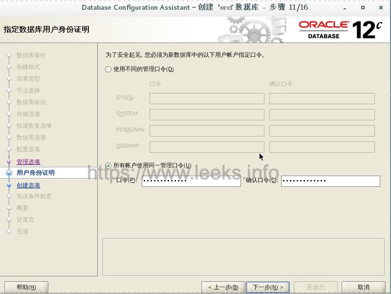

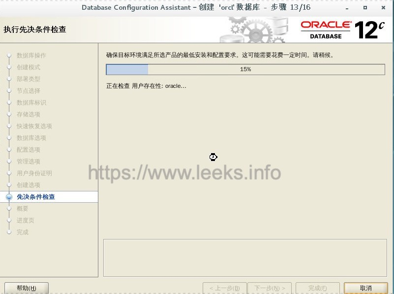
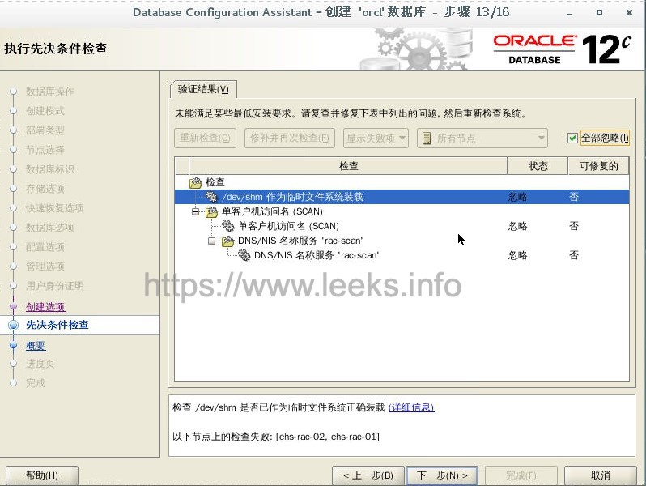
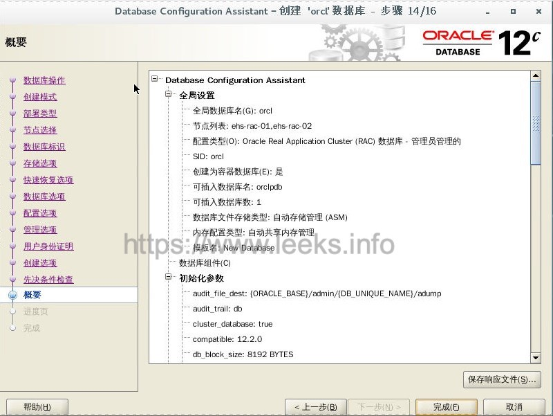

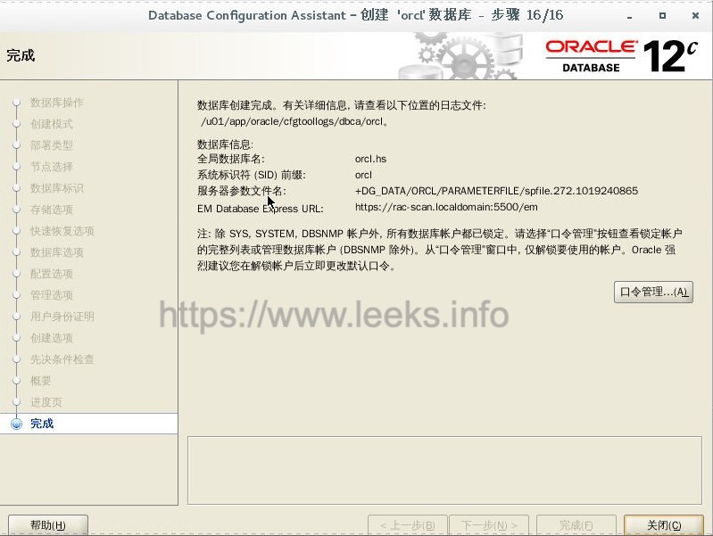


## 查看集群状态

```shell
[grid@ehs-rac-01 ~]$ srvctl config database -d orcl
数据库唯一名称: orcl
数据库名: orcl
Oracle 主目录: /u01/app/oracle/product/12.2.0.1/db_1
Oracle 用户: oracle
Spfile: +DG_DATA/ORCL/PARAMETERFILE/spfile.272.1019240865
口令文件: +DG_DATA/ORCL/PASSWORD/pwdorcl.256.1019236783
域: hs
启动选项: open
停止选项: immediate
数据库角色: PRIMARY
管理策略: AUTOMATIC
服务器池: 
磁盘组: DG_DATA
装载点路径: 
服务: 
类型: RAC
启动并行: 
停止并行: 
OSDBA 组: dba
OSOPER 组: oper
数据库实例: orcl1,orcl2
已配置的节点: ehs-rac-01,ehs-rac-02
CSS 关键型: no
CPU 计数: 0
内存目标: 0
最大内存: 0
数据库服务的默认网络编号: 
数据库是管理员管理的
[grid@ehs-rac-01 ~]$ srvctl status database -d orcl
实例 orcl1 正在节点 ehs-rac-01 上运行
实例 orcl2 正在节点 ehs-rac-02 上运行
```

