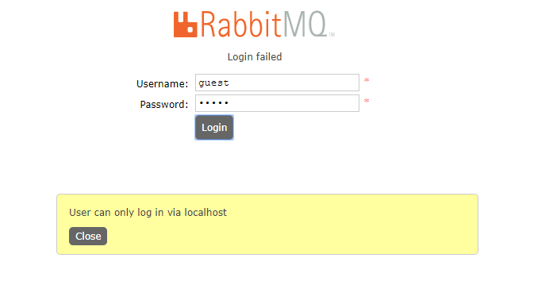
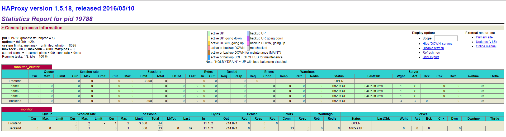

# 安装部署RabbitMQ服务

RabbitMQ 是由 LShift 提供的一个 Advanced Message Queuing Protocol (AMQP) 的开源实现，由以高性能、健壮以及可伸缩性出名的 Erlang 开发设计，因此也是继承了这些优点。

## Ubuntu

- 由于`rabbitMq`需要`erlang`语言的支持，在安装`rabbitMq`之前需要安装`erlang`。

  ```shell
  $ sudo apt-get update
  $ sudo apt-get install -y erlang-nox
  ```

- 安装 Rabbitmq

  ```shell
  $ sudo apt-get install rabbitmq-server
  ```

- 管理RabbitMQ服务

  ```shell
  # 启动
  $ sudo rabbitmq-server start
  # 停止
  $ sudo rabbitmq-server stop
  # 重启
  $ sudo rabbitmq-server restart
  # 查看状态
  $ sudo rabbitmqctl status
  ```

- 添加`admin`用户，并赋予`administrator`权限，密码为：`admin123456`

  ```shell
  $ sudo rabbitmqctl add_user admin admin123456  
  # 赋予权限
  $ sudo rabbitmqctl set_user_tags admin administrator
  # 赋予virtual host中所有资源的配置、写、读权限以便管理其中的资源
  $ sudo rabbitmqctl set_permissions -p / admin '.*' '.*' '.*'
  ```

- RabbitMQ GUID使用

  官方提供的一个web管理工具（rabbitmq_management）`http://www.rabbitmq.com/management.html`

  ```shell
  # 安装了Rabbitmq后，默认也安装了该管理工具，执行命令即可启动
  $ sudo rabbitmq-plugins enable rabbitmq_management
  ```

  浏览器访问 `http://localhost:15672`，使用刚刚创建的`admin`用户和密码登录。

##  CentOS 7

因为`RabbitMQ`是用`Erlang`开发实现的，所以在安装`RabbitMQ`之前需要先配置完成`Erlang`的开发环境，`Erlang`的具体安装配置请参考：[Erlang环境部署](https://www.leeks.info/zh_CN/latest/Databases/RabbitMQ/RabbitMQ.html#erlang)

本次我们在 CentOS 7 上安装 RabbitMQ 服务，更为详细的或者其他系统的安装过程可以参考官方[文档](https://www.rabbitmq.com/download.html)

- 下载RabbitMQ

  ```shell
  $ cd /tmp && wget https://github.com/rabbitmq/rabbitmq-server/releases/download/v3.7.9/rabbitmq-server-3.7.9-1.el7.noarch.rpm
  ```

- 安装RabbitMQ

  ```shell
  $ rpm --import https://github.com/rabbitmq/signing-keys/releases/download/2.0/rabbitmq-release-signing-key.asc
  $ yum install rabbitmq-server-3.7.9-1.el7.noarch.rpm -y
  ```

  **注：**有时侯在安装的过程中会报错，这个可能是由于 RabbitMQ 和 Erlang 的版本问题，当我们遇到相关错误的时候，可以尝试更换版本。

- 管理服务

  ```shell
  $ systemctl start rabbitmq-server
  $ systemctl enable rabbitmq-server
  # 检查 RabbitMQ 服务的状态
  $ rabbitmqctl status
  ```

  当 RabbitMQ 服务正常启动后，我们可以查看对应的日志，日志默认在 /var/log/rabbitmq/目录下。日志中给出了rabbitmq 启动的重要信息，如 node 名，$home 目录，cookie hash 值，日志文件，数据存储目录等，但是默认情况下没有配置文件的相关信息，我们需要手动创建配置文件。

- RabbitMQ 配置文件

  首先需要手动创建 /etc/rabbitmq 目录，然后把配置文件模板复制到此目录下：

  ```shell
  $ mkdir -p /etc/rabbitmq && cd /etc/rabbitmq
  $ cp /usr/share/doc/rabbitmq-server-3.7.9/rabbitmq.config.example /etc/rabbitmq/rabbitmq.config
  # 重启服务
  $ systemctl restart rabbitmq-server.service
  ```

  另外还可以建环境配置文件：/etc/rabbitmq/rabbitmq-env.conf

- 配置 web 插件

  management plugin 默认就在 RabbitMQ 的发布版本中，enable即可：

  ```shell
  $ rabbitmq-plugins enable rabbitmq_management
  $ chown -R rabbitmq:rabbitmq /var/lib/rabbitmq
  ```

  安装完成后在浏览器访问：`http://10.0.7.161:15672`

  

  默认登陆账号密码均为 guest ,当我们首次登陆的时候会报错，报错信息类似：`User can only log in via localhost`

  

  需要创建一个新的管理员账号：

  ```shell
  # 创建账户并设置密码
  $ rabbitmqctl add_user admin admin123456
  # 配置账号状态
  $ rabbitmqctl set_user_tags admin administrator
  # 配置账号权限
  $ rabbitmqctl set_permissions -p / admin ".*" ".*" ".*"
  # 列出账户
  $ rabbitmqctl list_users
  ```


## Docker

- 获取镜像列表

  ```shell
  $  docker search rabbitmq:management
  ```

- 拉取镜像

  ```shell
  $ docker pull rabbitmq:management
  ```

  获取镜像的时候要获取management版本的，不要获取last版本的，management版本的才带有管理界面。其它Tag版本可以访问[DockerHub](https://link.juejin.cn/?target=https%3A%2F%2Fhub.docker.com%2F_%2Frabbitmq)查询。

- 创建rabbitMq容器

  ```shell
  $ docker run -d -p 15672:15672 -p 5672:5672 \
  --hostname=rabbitmq-01 -e RABBITMQ_DEFAULT_USER=admin \
  -e RABBITMQ_DEFAULT_PASS=admin123456 --privileged=true \
  -v /opt/rabbitmq-01/lib:/var/lib/rabbitmq \
  -v /opt/rabbitmq-01/log:/var/log/rabbitmq \
  --name rabbitmq-01  rabbitmq:management
  ```

  参数解释：

  ```shell
  -d 以守护进程方式在后台运行
  -p 15672:15672 management 界面管理访问端口
  -p 5672:5672 amqp 访问端口
  --name ${指定容器名}
  --hostname ${设定容器的主机名} （它会被写到容器内的 /etc/hostname 和 /etc/hosts 作为容器主机IP的别名，并且将显示在容器的bash中）
  -e 参数
  RABBITMQ_DEFAULT_USER ${用户名}
  RABBITMQ_DEFAULT_PASS ${密码}
  ```

- 查看容器日志

  ```shell
  docker logs -f 容器ID
  ```

  rabbitMq默认创建了guest用户，并且赋予administrator角色权限，同时服务监听5672端口TCP连接和15672端口的HTTP连接，至此说明安装成功。

- 添加新用户

  默认的`guest` 账户有访问限制，默认只能通过本地网络(如 localhost) 访问，远程网络访问受限。

  ```shell
  # 进入容器内部
  docker exec -i -t 3ae bin/bash
  
  rabbitmqctl add_user root 123456
  
  
  ③执行abbitmqctl set_permissions -p / root ".*" ".*" ".*" 赋予root用户所有权限
  
  root@3ae75edc48e2:/# rabbitmqctl set_permissions -p / root ".*" ".*" ".*"
  Setting permissions for user "root" in vhost "/" ...
  
  
  ④执行rabbitmqctl set_user_tags root administrator赋予root用户administrator角色
  
  root@3ae75edc48e2:/# rabbitmqctl set_user_tags root administrator
  Setting tags for user "root" to [adminstrator] ...
  
  ⑤执行rabbitmqctl list_users查看所有用户即可看到root用户已经添加成功
  
  
  root@3ae75edc48e2:/# rabbitmqctl list_users
  Listing users ...
  user	tags
  guest	[administrator]
  root	[administrator]
  
  ```

  

# 安装Erlang环境

Erlang 是一种多用途编程语言，主要用于开发并发和分布式系统。它最初是一种专有的编程语言，Ericsson 使用它来开发电话和通信应用程序。

其他系统的安装配置可以参考 Erlang 的官方站点[相关文档](https://www.erlang.org)

- 安装依赖包

  ```shell
  $ yum update -y
  $ yum install epel-release -y
  $ yum install gcc gcc-c++ glibc-devel make ncurses-devel openssl-devel autoconf git wget wxBase.x86_64 vim
  ```

- 下载 Erlang

  ```shell
  $ cd /tmp && wget http://packages.erlang-solutions.com/erlang-solutions-1.0-1.noarch.rpm
  $ rpm -Uvh erlang-solutions-1.0-1.noarch.rpm
  ```

  导入 Erlang 相关 key

  ```shell
  $ rpm --import https://packages.erlang-solutions.com/rpm/erlang_solutions.asc
  ```

  修改 repo 文件，启用 gpg 校验功能

  ```shell
  $ cd /etc/yum.repos.d/
  [erlang-solutions]
  name=CentOS $releasever - $basearch - Erlang Solutions
  baseurl=https://packages.erlang-solutions.com/rpm/centos/$releasever/$basearch
  gpgcheck=1   # 修改此参数，将 0 改为 1
  gpgkey=https://packages.erlang-solutions.com/rpm/erlang_solutions.asc
  enabled=1
  ```

- 安装 Erlang

  ```shell
  $ yum makecache
  $ yum install erlang -y
  # 安装完成后，查看版本
  $ erl
  Erlang/OTP 22 [erts-10.5.2] [source] [64-bit] [smp:1:1] [ds:1:1:10] [async-threads:1] [hipe]
  Eshell V10.5.2 (abort with ^G)
  1> 
  ```

  

# RabbitMQ集群配置

一般情况下，如果只是为了探究 RabbitMQ 或者验证业务工程的正确性那么在本地环境或者测试环境上使用其单实例部署就可以了，但是出于 MQ 中间件本身的可靠性、并发性、吞吐量和消息堆积能力等问题的考虑，在生产环境上一般都会考虑使用 RabbitMQ 的集群方案。

## RabbitMQ 集群工作原理介绍

RabbitMQ 这款消息队列中间件产品本身是基于 Erlang 编写，Erlang 语言天生具备分布式特性（通过同步 Erlang 集群各节点的 magic cookie 来实现）。因此，RabbitMQ 天然支持 Clustering。这使得 RabbitMQ 本身不需要像ActiveMQ、Kafka 那样通过 ZooKeeper 分别来实现 HA 方案和保存集群的元数据。集群是保证可靠性的一种方式，同时可以通过水平扩展以达到增加消息吞吐量能力的目的。

**RabbitMQ 集群有两种模式：**

- 默认模式，以两个节点 mq1 和 mq2 为例来进行说明。对于 Queue 来说，消息实体只存在于其中一个节点 mq1 或者 mq2 ，mq1 和 mq2 两个节点仅有相同的元数据，即队列的结构。当消息进入 mq1 节点的 Queue 后，consumer 从 mq2 节点消费时，RabbitMQ 会临时在 mq1 、mq2 间进行消息传输，把 A 中的消息实体取出并经过 B 发送给 consumer。所以 consumer 应尽量连接每一个节点，从中取消息。即对于同一个逻辑队列，要在多个节点建立物理 Queue。否则无论 consumer 连 mq1 或 mq2 ，出口总在 mq1，会产生瓶颈。当 mq1 节点故障后，mq2 节点无法取到 mq1 节点中还未消费的消息实体。如果做了消息持久化，那么得等 mq1 节点恢复，然后才可被消费；如果没有持久化的话，就会产生消息丢失的现象。
- 镜像模式，把需要的队列做成镜像队列，存在与多个节点属于RabbitMQ 的 HA 方案。该模式解决了普通模式中的问题，其实质和普通模式不同之处在于，消息实体会主动在镜像节点间同步，而不是在客户端取数据时临时拉取。该模式带来的副作用也很明显，除了降低系统性能外，如果镜像队列数量过多，加之大量的消息进入，集群内部的网络带宽将会被这种同步通讯大大消耗掉。所以在对可靠性要求较高的场合中适用。

## 系统配置

```shell
# 修改 /etc/selinux/config 配置
$ sed -i 's/^SELINUX=.*/SELINUX=disabled/' /etc/selinux/config; setenforce 0 ; cat /etc/selinux/config | grep -i SELINUX= | grep -v "^#"
SELINUX=disabled
# 关闭防火墙
$ systemctl stop firewalld; systemctl disable firewalld
# 确认开机启动已经无效
$ systemctl is-enabled firewalld
disabled
```

## RabbitMQ 集群部署

1. RabbitMQ 集群主机环境

   ```tex
   mq-node1(test1) 10.0.7.161 test1
   mq-node2(test2) 10.0.7.162 test2
   mq-node3(test3) 10.0.7.163 test3
   ```

2. 各主机系统环境及 MQ 版本

   ```shell
   $ cat /etc/redhat-release
   Red Hat Enterprise Linux Server release 7.3 (Maipo)
   $ uname -r
   3.10.0-514.el7.x86_64
   Erlang : 22.1
   RabbitMQ: v3.7.9
   ```

3. 修改各主机 hosts 文件

   ```shell
   10.0.7.161 test1
   10.0.7.162 test2
   10.0.7.163 test3
   ```

   配置 RabbitMQ 集群首先需要在各个主机上安装并配置 Erlang 和 RabbitMQ

   Erlang安装过程可以参考: [安装Erlang环境](https://www.leeks.info/zh_CN/latest/Databases/RabbitMQ/RabbitMQ.html#erlang)

   RabbitMQ 具体过程可以参考：[安装RabbitMQ服务](https://www.leeks.info/zh_CN/latest/Databases/RabbitMQ/RabbitMQ.html#centos-7)

   当 Erlang 和 RabbitMQ 安装完成后就可以配置 RabbitMQ 集群了。

## 配置 RabbitMQ 集群

本次部署集群时都是将其他两个 RabbitMQ 加入到 master 主机现有集群中。

rabbitmq-server 启动时，会一起启动节点和应用，它预先设置 RabbitMQ 应用为 standalone 模式。要将一个节点加入到现有的集群中，你需要停止这个应用，并将节点设置为原始状态。如果使用 `rabbitmqctl stop`，应用和节点都将被关闭。所以使用 `rabbitmqctl stop_app` 仅仅关闭应用。

## 同步集群 cookie

RabbitMQ 利用 erlang 的分布式特性组建集群，erlang 集群通过 magic cookie 实现，此 cookie 保存在$home/.erlang.cookie，这里即：/var/lib/rabbitmq/.erlang.cookie，需要保证集群各节点的此 cookie 一致，可以选取一个节点的 cookie，采用 scp 同步到其他节点：

```shell
# test1 主机操作
$ scp /var/lib/rabbitmq/.erlang.cookie root@test2:/var/lib/rabbitmq/.erlang.cookie
$ scp /var/lib/rabbitmq/.erlang.cookie root@test3:/var/lib/rabbitmq/.erlang.cookie
```

更换 cookie 后需要重启 RabbitMQ 服务：

```shell
# test2 主机操作
$ systemctl stop rabbitmq-server.service
$ systemctl start rabbitmq-server.service
```

## 切换 RabbitMQ 启动方式

所有节点需要使用 -detached 参数启动服务： 

```shell
# 需要在所有节点上执行
$ rabbitmqctl stop
Stopping and halting node rabbit@test1 ...
$ rabbitmq-server -detached
Warning: PID file not written; -detached was passed.
```

## 组建 RabbitMQ 集群

因为将其他两个 RabbitMQ 加入到 test1 主机现有集群中，所以只需要在 test2 和 test3 上操作即可：

`test2` 主机（10.0.7.162）上操作：

```shell
$ rabbitmqctl stop_app
Stopping rabbit application on node rabbit@test2 ...
$ rabbitmqctl join_cluster rabbit@test1           # 这里集群的名字一定不要写错了
Clustering node rabbit@test2 with rabbit@test1
$ rabbitmqctl start_app
Starting node rabbit@test2 ...
 completed with 3 plugins.
```

集群名字一般可以在 test1 主机的日志文件中看到，需要注意的是这个集群名字需要和日志文件中保持一致，否则加入集群时会报错

`test3` 主机（10.0.7.163）上操作：

```shell
$ rabbitmqctl stop_app
Stopping rabbit application on node rabbit@test3 ...
$ rabbitmqctl join_cluster rabbit@test1     # 这里集群的名字一定不要写错了
Clustering node rabbit@test3 with rabbit@test1
$ rabbitmqctl start_app
Starting node rabbit@test3 ...
 completed with 3 plugins.
```

`test1`查看集群状态：

```shell
$ rabbitmqctl cluster_status
Cluster status of node rabbit@test1 ...
[{nodes,[{disc,[rabbit@test1,rabbit@test2,rabbit@test3]}]},
 {running_nodes,[rabbit@test3,rabbit@test2,rabbit@test1]},
 {cluster_name,<<"rabbit@test2">>},
 {partitions,[]},
 {alarms,[{rabbit@test3,[]},{rabbit@test2,[]},{rabbit@test1,[]}]}]
```

此时 test2 与 test3 也会自动建立连接，集群配置完成。

**注：**如果要使用内存节点，则可以使用 `rabbitmqctl join_cluster --ram rabbit@test1` 加入集群。

**RabbitMQ 节点分为内存节点和磁盘节点：**

1）内存节点（RAM）：内存节点将所有的队列、交换机、绑定、用户、权限和vhost的元数据定义存储在内存中

2）磁盘节点（Disk）：将元数据存储在磁盘中，单节点系统只允许磁盘类型的节点，防止重启RabbitMQ的时候，丢失系统的配置信息。

**如果需要切换节点类型，可以参考如下命令：**

```shell
# 如果节点已是"disk"节点，可以修改为内存节点，test1操作
$ rabbitmqctl stop_app
$ rabbitmqctl change_cluster_node_type ram
$ rabbitmqctl start_app
```

- RabbitMQ要求在集群中至少有一个磁盘节点，所有其他节点可以是内存节点，当节点加入或者离开集群时，必须要将该变更通知到至少一个磁盘节点。如果集群中唯一的一个磁盘节点崩溃的话，集群仍然可以保持运行，但是无法进行其他操作（增删改查），直到节点恢复， 或者可以设置两个磁盘节点，以保持有一个是可用的。

- 内存节点虽然不写入磁盘，但是它执行比磁盘节点要好。

- 如果集群中只有内存节点，那么不能停止它们，否则所有的状态，消息等都会丢失。

## 设置镜像队列策略

经过上述配置，集群虽然搭建成功，但只是默认的普通集群，exchange，binding 等数据可以复制到集群各节点。 但对于队列来说，各节点只有相同的元数据，即队列结构，但队列实体只存在于创建改队列的节点，即队列内容不会复制（从其余节点读取，可以建立临时的通信传输）。这样此节点宕机后，其余节点无法从宕机节点获取还未消费的消息实体。如果做了持久化，则需要等待宕机节点恢复，期间其余节点不能创建宕机节点已创建过的持久化队列；如果未做持久化，则消息丢失。

下边来配置策略，策略名称为 ha-all，通配符 ^ 表示匹配到的所有队列，复制到所有节点,在任一节点上执行：

```shell
$ rabbitmqctl set_policy ha-all "^" '{"ha-mode":"all"}'
```

也可以复制匹配到的队列到集群中的任意两个或多个节点，而不是到所有节点，并进行自动同步：

```shell
$ rabbitmqctl set_policy ha-all "^" '{"ha-mode":"exactly","ha-params":2,"ha-sync-mode":"automatic"}'
```

或者复制匹配到的队列到集群中的指定节点：

```shell
$ rabbitmqctl set_policy ha-all "^" '{"ha-mode":"nodes","ha-params":["rabbit@node01","rabbit@node02"]}'
```

至此，镜像队列策略配置完成，同时也实现了 HA。

## HAProxy 配置

我们在 10.0.7.163 主机上直接用 yum 安装 HAProxy 即可：

```shell
# test3
$ yum -y install haproxy
```

修改 HAProxy 配置文件

```shell
$ cat /etc/haproxy/haproxy.cfg     
global
    log 127.0.0.1 local2
    chroot /var/lib/haproxy
    pidfile /var/run/haproxy.pid
    maxconn 4000
    user haproxy
    group haproxy
    daemon
    stats socket /var/lib/haproxy/stats
defaults
    mode http
    log global
    option httplog
    option dontlognull
    option http-server-close
    option forwardfor except 127.0.0.0/8
    option redispatch
    retries 3
    timeout http-request 10s
    timeout queue 1m
    timeout connect 10s
    timeout client 1m
    timeout server 1m
    timeout http-keep-alive 10s
    timeout check 10s
    maxconn 3000
listen rabbitmq_cluster 0.0.0.0:5670
    mode tcp
    balance roundrobin
    server node1 10.0.7.162:5672 check inter 2000 rise 2 fall 3
    server node2 10.0.7.163:5672 check inter 2000 rise 2 fall 3
    server node3 10.0.7.161:5672 check inter 2000 rise 2 fall 3
listen monitor 0.0.0.0:8100
    mode http
    option httplog
    stats enable
    stats uri /stats
    stats refresh 5s
```

**重启 HAProxy**

```shell
$ [root@test3 rabbitmq]# systemctl restart haproxy.service
```

通过以下链接查看 HAProxy 的状态

```shell
http://10.0.7.163:8100/stats
```



如果用的是云主机，可以利用云服务商自己的 LB，不一定要用 HAProxy。


# 关于RabbitMQ文档

[RabbitMQ 的官方站点](https://www.rabbitmq.com)

[RabbitMQ 的官方下载地址](https://www.rabbitmq.com/download.html)

erlang 与 centos，rabbitmq 与 erlang，这些都是有依赖关系的，不同版本会存在不兼容性，可能导致安装完成后无法启动的情况，如果遇到此情况，可以查看官方版本兼容性文档，rabbitmq 官方给出的与 erlang/OTP 的版本兼容要求可以参考[文档](http://www.rabbitmq.com/which-erlang.htm)

