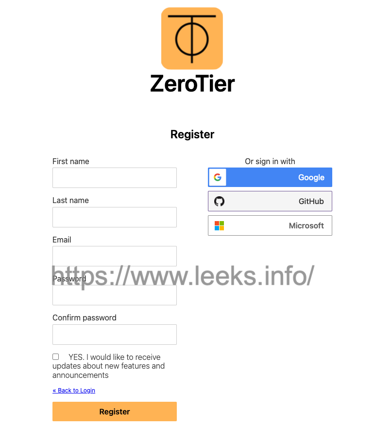

# ZeroTier 服务使用配置


[官方网站地址](https://www.zerotier.com)

[项目地址](https://github.com/zerotier)

## ZeroTier 原理
-  ZeroTier 这一类 P2P VPN 是在互联网的基础上将自己的所有设备组成一个私有的网络，可以理解为互联网连接的局域网。最常见的场景就是在公司可以用手机直接访问家里的 NAS，而且是点对点直连，数据传输并不经由第三方服务器中转。

- Zerotier 在多设备之间建立了一个 Peer to Peer VPN（P2PVPN） 连接，如：在笔记本电脑、台式机、嵌入式设备、云资源和应用。这些设备只需要通过 ZeroTier One ( ZeroTier 的客户端) 在不同设备之间建立直接连接，即使它们位于 NAT 之后。连接到虚拟 LAN 的任何计算机和设备通常通过 NAT 或路由器设备与 Internet 连接，ZeroTier One 使用 STUN 和隧道来建立 NAT 后设备之间的 VPN 直连。
- 简单一点说，Zerotier 就是通过 P2P 等方式实现形如交换机或路由器上 LAN 设备的内网互联。


`ZeroTier` 官方搭建了一个行星根服务器叫做 `地球 Earth`，这个行星根服务器是唯一且是免费的，它记录了所有的路径信息，一般情况下大家都直接用的这个。

行星根服务器 R 记录了所有的路径信息，设备 A 能通过 `ZeroTier` 唯一地址标识找到需要连接的设备 B。这个过程如下：

1. A 想要将数据包发送到 B，但由于它没有直接路径，因此将其向上发送到 R。
2. 如果 R 有直接链接到 B，它会转发数据包给 B。否则它会继续向上游发送数据包，直到达到行星根 (planet)。行星根知道所有节点，所以如果 B 在线，最终数据包将到达 B。
3. R 还向 A 发送一个消息，包含有关它如何到达 B 的提示。同时，将消息发给 B，通知 B 它如何到达 A。
4. A 和 B 获取它们的消息并尝试相互发送测试消息，可能会对 NAT 或状态防火墙进行穿透。如果这样可以建立直接链路，则不再需要中继。
5. 如果无法建立直接路径，则通信可以继续中继 (速度慢)

除此之外还有 12 个遍布全球的根服务器，这些是收费的服务。由于 Earth 在国外，如果使用免费套餐，连接时的延迟可能会很高。不过 `ZeroTier` 能自己创建根服务器 `月球 Moons`，这样我们就能在大局域网中得到更好的体验了。

因为有 ZeroTier 服务器的支持，所以对于网络是有限制的，免费网络限制 100 台设备，超过了就要付费。100 台对于个人或者小团队使用来说都足够了。超过 100 台价格为 $29/month，另外也可以自建服务中心，$100/month

## 账号注册

注册请点击[这里](https://accounts.zerotier.com/auth/realms/zerotier/protocol/openid-connect/registrations?client_id=zt-central&redirect_uri=https%3A%2F%2Fmy.zerotier.com%2Fapi%2F_auth%2Foidc%2Fcallback&response_type=code&scope=openid+profile+email+offline_access&state=state)



## 创建网络


## 安装客户端

1. 客户端下载地址请点击[这里](https://www.zerotier.com/download/)

   

2. linux客户端安装

   ```shell
   $ curl -s https://install.zerotier.com | sudo bash
   $ systemctl start zerotier-one.service
   $ systemctl enable zerotier-one.service
   Synchronizing state of zerotier-one.service with SysV service script with /lib/systemd/systemd-sysv-install.
   Executing: /lib/systemd/systemd-sysv-install enable zerotier-one
   $ /lib/systemd/systemd-sysv-install enable zerotier-one
   $ zerotier-cli join ${NetWork_ID}  # 刚刚创建的网络ID
   200 join OK
   ```

   查看网卡信息`ifconfig` 发现生成一个类似 `zt7nne4pq5` 名称的网卡，此时网卡还没有ip地址，需要登录平台授权才能生成ip地址。

   

   后台设置默认是需要 `AUTH` 才能连接，在客户端申请加入网络后，需要在后台授权。

   

   再次查看网卡信息

   

3. Mac配置

   

   

   

## 建立中转服务器moom

ZeroTier 的官方服务器在国外，国内客户端使用时延迟较大，网络高峰期时甚至各个客户端节点之间访问不了。此时，“自定义根服务器”，又称 moon 中转服务器就显得非常重要，它的主要功能是通过自定义的服务器作为跳板加速内网机器之间的互相访问。

ZeroTier 定义了几个需要知道的专业名词：

- PLANET 行星服务器，ZeroTier 各地的根服务器，有日本、新加坡等地
- moon 卫星级服务器，用户自建的私有根服务器，起到中转加速的作用
- LEAF 相当于各个枝叶，就是每台连接到该网络的机器节点。
- 在使用 zerotier-cli listpeers 命令时能看到这几个名词。

1. 获取`moom.json`文件

   充当 moon 的机子最好有公网 IP，现在我们尝试用 QNAP 搭建一个 moon 中转，zerotier 安装好之后会带有 `zerotier-idtool` 这个命令，之后的内容需要依赖该命令。假设现在有一台公网固定 IP 的 VPS，在上面安装完 ZeroTier 之后。

   ```shell
   $ cd /var/lib/zerotier-one
   $ zerotier-idtool initmoon identity.public > moon.json
   ```

   获得 `moon.json` 文件。查看文件内容，其中 `id` 为 VPS 的 ZeroTier ID。 编辑 `vim moon.json`，修改 “stableEndpoints” 为 VPS 的公网的 IP，xxx.xxx.xxx.xxx 为公网 IP，9993 为 ZeroTier 默认端口。

   ```shell
   "stableEndpoints": [ "xxx.xxx.xxx.xxx/9993" ]
   ```

   另外，记录下 `moon.json` 中的 id 值，是一个 10 位的字符串。

2. 生成签名文件

   用到上一步中的 `moon.json`， 执行以下命令，成功后，会生成类似 `000000faf52b982b.moon` 名称的文件。

   ```shell
   $ zerotier-idtool genmoon moon.json
   wrote 000000faf52b982b.moon (signed world with timestamp 1644907755738)
   ```

3. 将moon节点加入网络

   在 VPS 的 ZeroTier 安装目录下（/var/lib/zerotier-one）建立文件夹 `moons.d`，将生成的 `000000faf52b982b.moon` 文件拷贝进去，重启 zerotier，至此，VPS 上（moon 服务器）配置完成。

   ```shell
   $ cp -a 000000faf52b982b.moon moons.d/
   $ chown -R zerotier-one.zerotier-one /var/lib/zerotier-one
   ```

4. 其他客户端机器连接moon节点

   其他虚拟局域网中的机器想要连接到 moon 节点的话有两种方法。

   第一种方法就是使用 `zerotier-cli orbit` 命令。连接 moon 节点方法一，使用之前步骤中 `moon.json` 文件中的 id 值 (10 位的字符串）分别在客户端机器里执行：

   ```shell
   $ zerotier-cli orbit <world-id> <seed-id>
   ```

   第二种方法是需要在 `/var/lib/zerotier-one` 目录下新建 `moons.d` 文件夹和 moon 节点一样，将 `000000faf52b982b.moon` 文件放到其中，并重启 zerotier。

5. 测试

   ```shell
   $ zerotier-cli listpeers
   200 listpeers <ztaddr> <path> <latency> <version> <role>
   200 listpeers 35c192ce9b 35.224.180.120/65403;9332;9332 201 1.8.5 LEAF
   200 listpeers 62f865ae71 50.7.252.138/9993;11098;742 342 - PLANET
   200 listpeers 778cde7190 103.195.103.66/9993;11098;859 225 - PLANET
   200 listpeers cafe04eba9 84.17.53.155/9993;11098;890 186 - PLANET
   200 listpeers cafe9efeb9 104.194.8.134/9993;11098;910 174 - PLANET
   200 listpeers ccfadb1767 139.198.5.150/9993;11098;1076 7 1.6.4 MOON
   ```

   如果有 moon 服务器 IP 地址的那一行后面有 moon 字样，证明 moon 节点已经被本机连接。

   不同系统下的 ZeroTier 目录位置：

   > Windows：`C:\ProgramData\ZeroTier\One`
   >
   > Macintosh： `/Library/Application\ Support/ZeroTier/One)`
   >
   > Linux： `/var/lib/zerotier-one`
   >
   > FreeBSD/OpenBSD： `/var/db/zerotier-one`

## 命令

1. `zerotier-cli` 命令

   ```shell
   Usage: zerotier-cli [-switches] <command/path> [<args>]
   
   Available switches:
     -h                      - Display this help
     -v                      - Show version
     -j                      - Display full raw JSON output # 显示完整的原始 JSON 输出
     -D<path>                - ZeroTier home path for parameter auto-detect # 用于参数自动检测的 ZeroTier 主路径
     -p<port>                - HTTP port (default: auto) # HTTP 端口
     -T<token>               - Authentication token (default: auto) # 身份验证令牌
   
   Available commands:
     info                    - Display status info # 显示状态信息
     listpeers               - List all peers # 列出所有对等点
     peers                   - List all peers (prettier) # 列出所有同行
     listnetworks            - List all networks # 列出所有网络
     join <network ID>          - Join a network # 加入网络
     leave <network ID>         - Leave a network # 离开网络
     set <network ID> <setting> - Set a network setting # 设置网络设置
     get <network ID> <setting> - Get a network setting # 获取网络设置
     listmoons               - List moons (federated root sets) # 列出 moon
     orbit <world ID> <seed> - Join a moon via any member root # 通过任何会员跟加入 moon
     deorbit <world ID>      - Leave a moon # 离开 moon
     dump                    - Debug settings dump for support # 调试设置转储以获得支持
   
   Available settings:
     Settings to use with [get/set] may include property names from 
     the JSON output of "zerotier-cli -j listnetworks". Additionally, 
     (ip, ip4, ip6, ip6plane, and ip6prefix can be used). For instance:
     zerotier-cli get <network ID> ip6plane will return the 6PLANE address
     assigned to this node.
   # 与 [get/set] 一起使用的设置可能包括来自 "zerotier-cli -j listnetworks" 的 JSON 输出。 此外，（可以使用 ip、ip4、ip6、ip6plane 和 ip6prefix）。 例如：zerotier-cli get <network ID> ip6plane 将返回 6PLANE 地址分配给这个节点。
   ```

2. `zerotier-idtool` 命令

   ```shell
   Usage: zerotier-idtool <command> [<args>]
   
   Commands:
     generate [<identity.secret>] [<identity.public>] [<vanity>]
     validate <identity.secret/public>
     getpublic <identity.secret>
     sign <identity.secret> <file>
     verify <identity.secret/public> <file> <signature>
     initmoon <identity.public of first seed>
     genmoon <moon json>
   ```

3. `zerotier-one` 命令

   ```shell
   Usage: zerotier-one [-switches] [home directory]
   
   Available switches:
     -h                - Display this help
     -v                - Show version
     -U                - Skip privilege check and do not attempt to drop privileges # 跳过权限检查，不要尝试删除权限
     -p<port>          - Port for UDP and TCP/HTTP (default: 9993, 0 for random) # UDP 和 TCP/HTTP 的端口（默认：9993，0 表示随机）
     -d                - Fork and run as daemon (Unix-ish OSes) # 分叉并作为守护进程运行（Unix-ish 操作系统）
     -i                - Generate and manage identities (zerotier-idtool) # 生成和管理身份
     -q                - Query API (zerotier-cli) # 查询 API
   ```

   