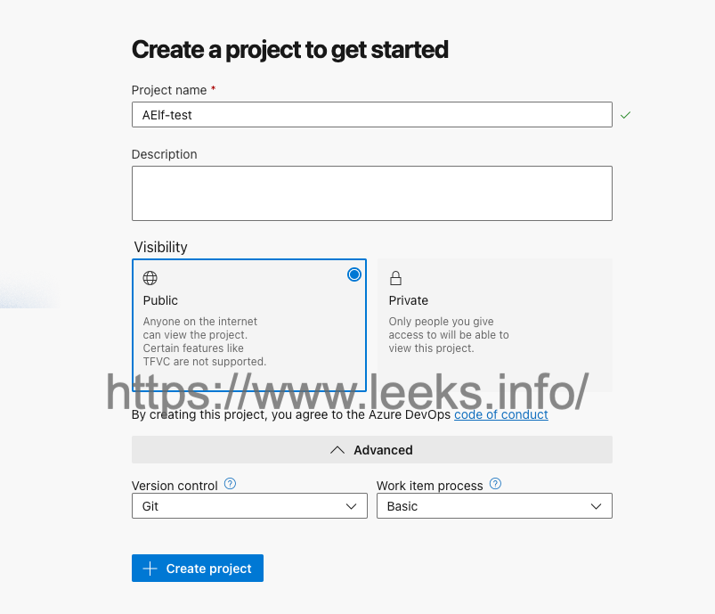
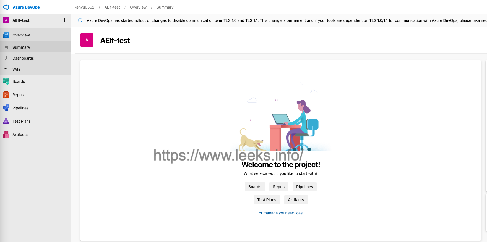

# Azure DevOps

## 创建 Azure DevOps 组织

在开始之前，我们首先要创建 一个 Azure DevOps 组织。 目前在 Azure DevOps 用户许可证的基本计划中， 前五名用户是免费的，可以直接通过 Azure DevOps 官方页面上的 “免费开始使用”按钮，创建一个试用组织。

在完成登陆之后， 页面会被重定向到 Azure DevOps 服务。 如果之前没有创建过组织， 在这里，它会提示我们创建一个新的组织。 

在项目完成创建之后， 我们会被重定向到概述组和概要页面。

Azure DevOps 是一套 用于管理、协作、构建和部署代码的服务。 它提供了用于工作管理的 Azure Boards； 用于社交化协作的 Azure Repos； 以及用于构建和发布的 Azure Pipelines。 在 Azure DevOps 中， Azure Boards 提供了 工作管理相关的能力； Azure Repos 提供了社交化的协作能力； Azure Pipelines 用于代码的构建和发布， 以及持续集成和持续部署； Azure Test Plans 提供了手动测试和探索测试的工具； Azure Artifacts 提供了让团队与你的团队 一起创建、托管共享包， 简化复杂的生产作业。 

转到“项目设置”。 在团队选项中，我们可以创建新的团队。 点击“新团队”按钮。 在这里，我们可以给团队起一个名字， 添加一个描述， 并创建一个区域路径。 然后点击“创建”。 

[相关文档](https://docs.microsoft.com/zh-cn/azure/devops/pipelines/?view=azure-devops)