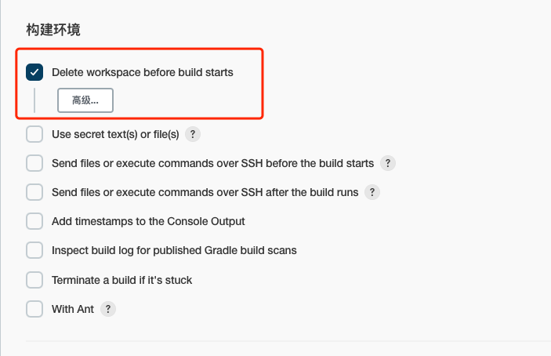
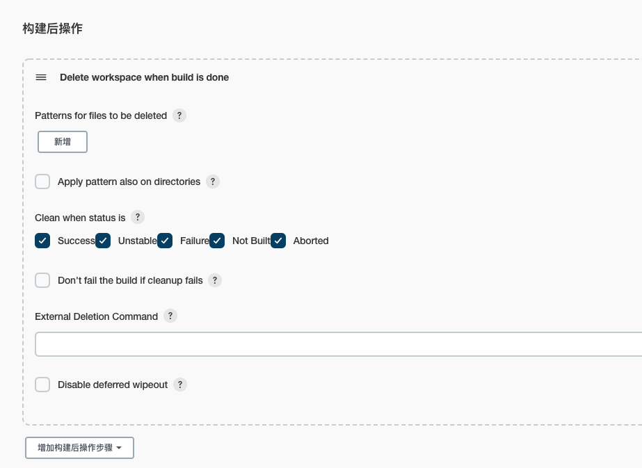
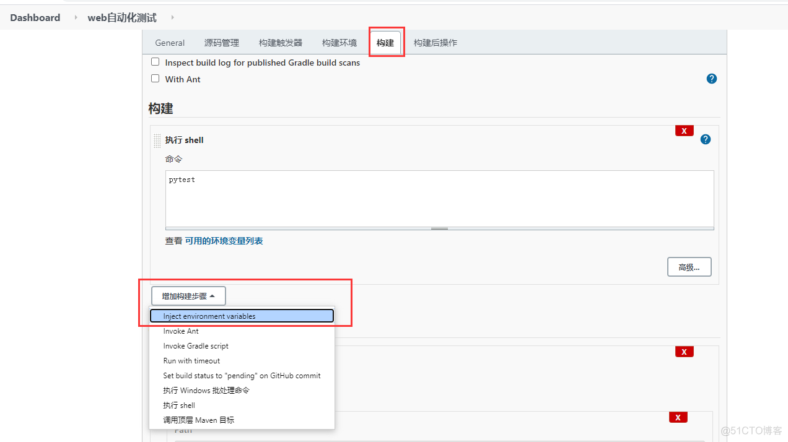

# Jenkins 服务使用

## 使用 Docker 运行 Jenkins

建议使用的Docker映像是[`jenkinsci/blueocean` image](https://hub.docker.com/r/jenkinsci/blueocean/)(来自 the [Docker Hub repository](https://hub.docker.com/))。 该镜像包含当前的[长期支持 (LTS) 的Jenkins版本](https://www.jenkins.io/download) （可以投入使用） ，捆绑了所有Blue Ocean插件和功能。这意味着你不需要单独安装Blue Ocean插件。

运行容器

```shell
$ mkdir -p /opt/jenkins/{jenkins_home,project}

$ docker run --name jenkins \
  -u root -d \
  -p 8080:8080 \
  -p 50000:50000 \
  -v /opt/jenkins/jenkins_home:/var/jenkins_home \
  -v /var/run/docker.sock:/var/run/docker.sock \
  -v /opt/jenkins/project:/app/project \
  jenkinsci/blueocean
```

参考文档：

- https://www.jenkins.io/zh/doc/book/installing/

## 使用war包运行 Jenkins

1. [配置java环境变量](https://www.leeks.info/zh_CN/latest/Linux/deploy-env/%E7%8E%AF%E5%A2%83%E9%83%A8%E7%BD%B2.html#java-jdk)

2. 创建运行用户及下载软件

   ```shell
   # 创建Jenkins用户
   $ useradd -s /usr/sbin/nologin -d /opt/jenkins -M jenkins
   # 下载Jenkins最新版本包
   $ mkdir /opt/jenkins
   $ cd /opt/jenkins && wget http://mirrors.jenkins.io/war-stable/latest/jenkins.war
   ```

3. 创建启动脚本

   ```shell
   $ vim /opt/jenkins/jenkins.sh
   #################################脚本内容##################################
   #!/bin/bash
   # 导入环境变量
   export JENKINS_HOME=/opt/jenkins
   export JAVA_HOME=/opt/jdk1.8.0_131
   cd $JENKINS_HOME
   pid=`ps -ef | grep jenkins.war | grep -v 'grep'| awk '{print $2}'`
   if [ "$1" = "start" ];then
       if [ -n "$pid" ];then
           echo 'jenkins is running...'
       else
           ### java启动服务 配置java安装根路径,和启动war包存的根路径
           sudo -E -u jenkins nohup $JAVA_HOME/bin/java -Xms1024m -Xmx1024m -jar $JENKINS_HOME/jenkins.war --ajp13Port=-1 --httpPort=18080 >/dev/null 2>&1 &
       fi
   elif [ "$1" = "stop" ];then
       exec ps -ef | grep jenkins | grep -v grep | awk '{print $2}'| xargs kill -9
       echo 'jenkins is stop...'
   else
       echo "Please input like this:"./jenkins.sh start" or "./jenkins stop""
   fi
   ```

4. 启动服务

   ```shell
   $ /opt/jenkins/jenkins.sh start
   ```

5. 修改配置

   ```shell
   # 备份default.json
   $ cp /opt/jenkins/updates/default.json /opt/jenkins/updates/default.json.bak
   # 替换插件下载地址
   $ sed -i 's/https:\/\/updates.jenkins.io\/download/https:\/\/mirrors.tuna.tsinghua.edu.cn\/jenkins/g' /opt/jenkins/updates/default.json
   $ sed -i 's/http:\/\/www.google.com/https:\/\/www.baidu.com/g' /opt/jenkins/updates/default.json
   ```

6. 访问Jenkins

   ```shell
   # https://jenkins.域名.com/
   # 复制密钥
   $ cat /opt/jenkins/secrets/initialAdminPassword
   ```

   

   

7. 安装推荐的插件

   

   安装推荐插件需要一点点时间等待，请耐心！！！

   

8. 登录admin

   安装完成后，会进入到创建第一个管理员用户页面，我选择的是继续使用admin账户，如下图所示。

   

9. 配置 URL

   

   这一步配置完成后，选择开始使用Jenkins。

   

   登录后的页面如下图所示，到这里Jenkins就安装部署完成。

   

## Jenkins反向代理配置有误问题修复

Jenkins URL使用 nginx 代理 HTTPS 网络协议时，Jenkins内部会出现反向代理配置有误的问题，

需要在nginx配置中设置 X-Forwarded-Proto 参数

```nginx
server {
    listen 443 ssl;
    server_name jenkins.xxxx.com;

    ssl_certificate   /opt/cert/Nginx/1_jenkins.xxxx.com_bundle.crt;
    ssl_certificate_key  /opt/cert/Nginx/2_jenkins.xxxx.com.key;
    ssl_session_timeout 5m;
    ssl_ciphers ECDHE-RSA-AES128-GCM-SHA256:ECDHE:ECDH:AES:HIGH:!NULL:!aNULL:!MD5:!ADH:!RC4;
    ssl_protocols TLSv1 TLSv1.1 TLSv1.2;
    ssl_prefer_server_ciphers on;

    location / {
        proxy_pass http://jenkins;
        client_max_body_size 1024M;
        proxy_next_upstream error timeout http_500 http_502 http_503 http_504;
        proxy_set_header Host $host;
        proxy_set_header X-Real-IP $remote_addr;
        proxy_set_header X-Forwarded-For $proxy_add_x_forwarded_for;
        proxy_set_header X-Forwarded-Proto $scheme;
        proxy_set_header Connection "";
        proxy_http_version 1.1;

    }
}
```

参考链接：https://cloud.tencent.com/developer/article/1476876

## 用户权限配置

1. 安装插件

   插件：Role-based Authorization Strategy

   

2. 全局安全配置-授权策略

   当插件安装好的时候，授权策略会多出一个Role-Based Strategy选项，选择该项并保存

   

3. 管理和分配角色

   在系统管理页面进入 Manage and Assign Roles

   

4. 管理角色

   

5. 全局角色

   **设置全局角色（全局角色可以对jenkins系统进行设置与项目的操作）**

   > admin：对整个jenkins都可以进行操作 
   >
   > ops：可以对所有的job进行管理
   >
   > other：只有读的权限
   >
   > build：操作构建权限

   

6. 项目角色

   **注意：Pattern是设置正则表达式，其中test.\*表示匹配以test开头的job name**

   

7. 分配角色

   

   

   

## 清理工作空间 workspace

1. 进入Jenkins 插件管理安装 workspace cleanup plugin 插件

2. 在项目中配置构建前删除工作空间，将在每次构建之前删除旧的工作空间

   

3. 配置构建后删除工作空间，将在每次构建完成后删除工作空间

   


## 构建 Job 时设置环境变量

`Environment Injector` 插件可以在构建步骤中添加环境变量

- `Properties Content` 自定义环境变量
- `Properties File Path` 引用本地文件作为环境变量

搜索插件：`Environment Injector`，安装成功后，重启 Jenkins 生效。


Properties Content 自定义环境变量



Properties Content 可以写成如下键值对的格式

```tex
AUTHOR=Job
NAME=JOB
ENV=/opt
```

## 添加环境变量（Environment Injector）

jenkins在构建job的时候，可以自己添加一些环境变量，在后续的构建步骤中引用环境变量，比如在测试报告中引用 Environment Injector 插件可以在在构建步骤中添加环境变量。

- Properties Content 自定义环境变量
- Properties File Path 引用本地文件作为环境变量

安装插件：`Environment Injector`


安装成功后，重启jenkins生效。

自定义环境变量

添加构建步骤 - Inject environment variables，Properties Content 可以写成如下键值对的格式

```bash
home=/opt
user=root
pas=123456
```

