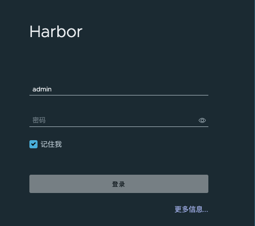
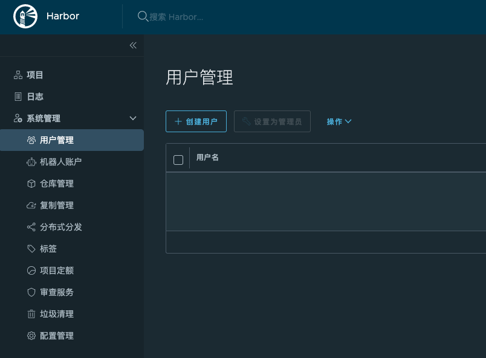

# Docker私有仓库搭建

## 开源的仓库管理工具Harbor

`Harbor`是一个由`CNCF`托管的开源的`Docker`镜像仓库管理工具，我们可以通过它快速的建立起自己的私有仓库。当然，搭建私有仓库的选择很多，如`Docker`官方提供的`registry`镜像或者`Nexus`等。但`Harbor`不失为一种不错的选择。

## 安装依赖环境

首先`Docker`是要安装的，`Harbor`是通过一堆容器来启动的。另外还需要安装`docker-compose`，并对版本有一定要求，这里通过在`Rancher`的资源库找到软件包。

## 安装Harbor

先到[GitHub Release](https://github.com/goharbor/harbor/releases)下载对应的包，有`offline`和`online`两种，`offline`比较大，包含的对应的依赖；`online`没有包含对应的依赖组件，安装的时候还需要进行下载。

```shell
$ wget https://github.com/goharbor/harbor/releases/download/v2.4.3/harbor-offline-installer-v2.4.3.tgz -P /opt

$ cd /opt && tar -zxf harbor-offline-installer-v2.4.3.tgz

$ cp -a harbor.yml.tmpl harbor.yml
```

修改配置：`vim harbor.yml`，主要把`https`去掉，并配置服务器地址和密码。关键配置有：

```yaml
hostname: 192.168.66.50

http:
  port: 8080

# https related config
# https:
  # https port for harbor, default is 443
  # port: 443
  # The path of cert and key files for nginx
  # certificate: /your/certificate/path
  # private_key: /your/private/key/path
  
harbor_admin_password: Hoopox#2022
```

改完配置后就开始执行安装：

```shell
$ ./install.sh
```

安装成功会有提示。

## 简单使用

访问：`http://192.168.66.50:8080/`，即可登陆使用，用户名为`admin`，密码默认为`Hoopox#2022`。



管理用户`admin`权限太高，要创建一个普通用户：



退出`admin`，用新创建的用户登陆，然后创建一个项目，用于存放镜像。

## Docker连接仓库

修改docker配置并重启

```shell
$ vim /etc/docker/daemon.json
{
  "insecure-registries": ["http://192.168.66.50:8080"],
  "registry-mirrors": ["https://xxx.mirror.aliyuncs.com"],
  "exec-opts": ["native.cgroupdriver=systemd"],
  "log-driver": "json-file",
  "log-opts": {
    "max-size": "100m"
  },
  "storage-driver": "overlay2"
}

```

重启`Docker`：

```shell
$ systemctl restart docker
```

## 登陆与推送镜像

```shell
# 登陆新建的仓库
$ docker login http://192.168.66.50:8080 --username aelf --password Aelf#2022

# 给其中一个镜像打个 tag
$ docker tag nginx 192.168.66.50:8080/explorer/nginx:latest

# 上传镜像到仓库
$ docker push 192.168.66.50:8080/explorer/nginx:latest

```

## 管理 Harbor 服务

```shell
# 停止服务
$ docker-compose down

# 启动服务
$ docker-compose up -d
```


