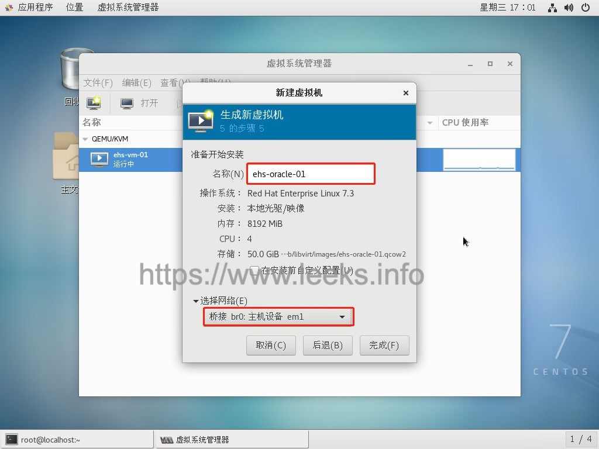
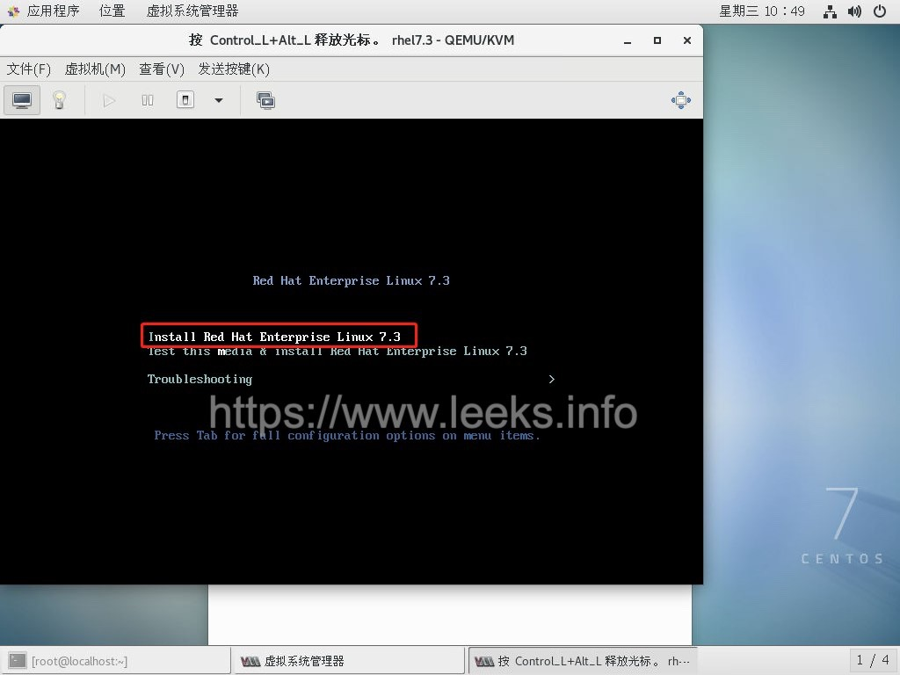
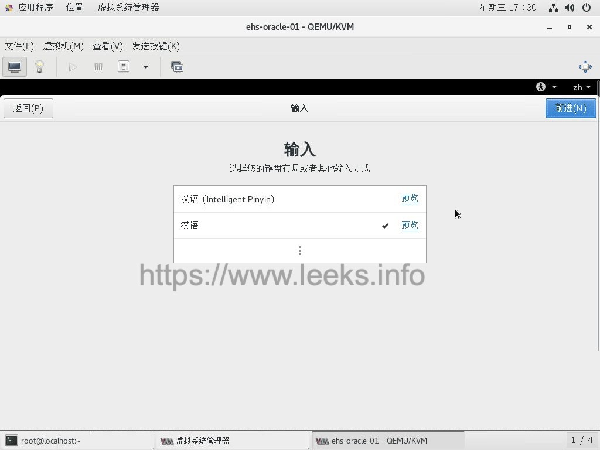
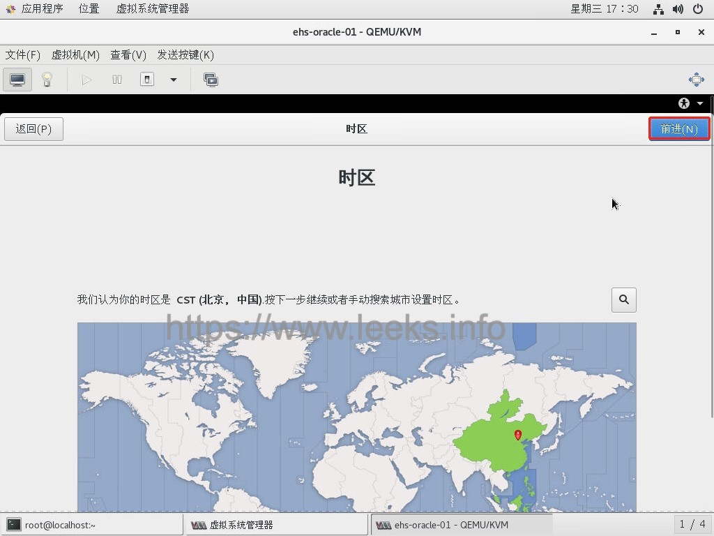

# centos7 安装KVM虚拟机系统


## **KVM是什么**

- KVM(Kernel-based Virtual Machine, 即内核级虚拟机) 是一个开源的系统虚拟化模块。
- 它使用Linux自身的调度器进行管理，所以相对于Xen，其核心源码很少。
- 目前KVM已成为学术界的主流VMM之一，它包含一个为处理器提供底层虚拟化 可加载的核心模块kvm.ko(kvm-intel.ko 或 kvm-amd.ko)。
- kvm还需要一个经过修改的QEMU 软件(qemu-kvm)，作为虚拟机上层控制和界面。KVM的虚拟化需要硬件支持(如 Intel VT技术或者AMD V技术)。
- 是基于硬件的完全虚拟化。 KVM可以运行多个其本身运行未改动的镜像的虚拟机，例如Windows，Mac OS X ，每个虚拟机都有各自的虚拟硬件，比如网卡、硬盘核图形适配器等。
- KVM和QEMU的关系
  ​QEMU是个独立的虚拟化解决方案，从这个角度它并不依赖KVM。而KVM是另一套虚拟化解决方案，不过因为这个方案实际上只实现了内核中对处理器（Intel VT）, AMD SVM)虚拟化特性的支持，换言之，它缺乏设备虚拟化以及相应的用户空间管理虚拟机的工具，所以它借用了QEMU的代码并加以精简，连同KVM一起构成了另一个独立的虚拟化解决方案：KVM+QEMU。


## kvm相关安装包及其作用

```shell
qemu-kvm           # 主要的KVM程序包
python-virtinst    # 创建虚拟机所需要的命令行工具和程序库
virt-manager       # GUI虚拟机管理工具
virt-top           # 虚拟机统计命令
virt-viewer        # GUI连接程序，连接到已配置好的虚拟机
libvirt            # C语言工具包，提供libvirt服务
libvirt-client     # 虚拟客户机提供的C语言工具包
virt-install       # 基于libvirt服务的虚拟机创建命令
bridge-utils       # 创建和管理桥接设备的工具
```


## CentOS 7 安装 VNC 环境

 [参考文档](http://www.cnblogs.com/kevingrace/p/5821450.html)

1. 更改为启动桌面或命令行模式

   获取当前系统启动模式

   ```shell
   [root@localhost ~]# systemctl get-default
   multi-user.target
   ```

   查看配置文件

   ```shell
   [root@localhost ~]# cat /etc/inittab
   # inittab is no longer used when using systemd.
   #
   # ADDING CONFIGURATION HERE WILL HAVE NO EFFECT ON YOUR SYSTEM.
   #
   # Ctrl-Alt-Delete is handled by /usr/lib/systemd/system/ctrl-alt-del.target
   #
   # systemd uses 'targets' instead of runlevels. By default, there are two main targets:
   #
   # multi-user.target: analogous to runlevel 3 //命令行模式
   # graphical.target: analogous to runlevel 5 //图形界面模式
   #
   # To view current default target, run:
   # systemctl get-default
   #
   # To set a default target, run:
   # systemctl set-default TARGET.target
   ```

   由命令行模式更改为图形界面模式

   ```shell
   [root@localhost ~]# systemctl set-default graphical.target
   ```

   由图形界面模式更改为命令行模式（此步骤不用执行）

   ```shell
   [root@localhost ~]# systemctl set-default multi-user.target
   ```

   获取当前系统启动模式

   ```shell
   [root@localhost ~]# systemctl get-default
   graphical.target
   ```

2. 关闭防火墙

   centos的防火墙是firewalld，关闭防火墙的命令

   ```shell
   # 停止firewall
   [root@localhost ~]# systemctl stop firewalld.service
   
   # 禁止firewall开机启动
   [root@localhost ~]# systemctl disable firewalld.service
   
   # 关闭selinux
   [root@ehs-rac-01 ~]# sed -i 's/^SELINUX=.*/SELINUX=disabled/' /etc/selinux/config
   [root@ehs-rac-01 ~]# setenforce 0
   [root@ehs-rac-01 ~]# cat /etc/selinux/config | grep -i SELINUX= | grep -v "^#"
   SELINUX=disabled
   [root@ehs-rac-01 ~]# getenforce
   ```

3. 安装软件

   ```shell
   [root@localhost ~]# yum update
   [root@localhost ~]# yum groupinstall "GNOME Desktop" "X Window System" "Desktop"
   [root@localhost ~]# yum install tigervnc-server tigervnc vnc vnc-server
   ```

4. 配置vnc连接

   ```shell
   [root@localhost ~]# cp /lib/systemd/system/vncserver@.service /etc/systemd/system/vncserver@:1.service
   ######## 修改 vim /etc/systemd/system/vncserver@:1.service
   ######## 找到这一行 ########
   ExecStart=/sbin/runuser -l <USER> -c "/usr/bin/vncserver %i"
   PIDFile=/home/<USER>/.vnc/%H%i.pid
   ######## 这里直接用root 用户登录，所以我替换成 ########
   ExecStart=/sbin/runuser -l root -c "/usr/bin/vncserver %i"
   PIDFile=/root/.vnc/%H%i.pid
   ######## 如果是其他用户的话比如john替换如下 ########
   ExecStart=/sbin/runuser -l john -c "/usr/bin/vncserver %i"
   PIDFile=/home/john/.vnc/%H%i.pid
   ```

   由于直接root用户登录，所以配置如下：

   ```shell
   [root@localhost ~]# cat /etc/systemd/system/vncserver@:1.service
   .........
   [Unit]
   Description=Remote desktop service (VNC)
   After=syslog.target network.target
   [Service]
   Type=forking
   # Clean any existing files in /tmp/.X11-unix environment
   ExecStartPre=/bin/sh -c '/usr/bin/vncserver -kill %i > /dev/null 2>&1 || :'
   ExecStart=/usr/sbin/runuser -l root -c "/usr/bin/vncserver %i"
   PIDFile=/root/.vnc/%H%i.pid
   ExecStop=/bin/sh -c '/usr/bin/vncserver -kill %i > /dev/null 2>&1 || :'
   [Install]
   WantedBy=multi-user.target
   ```

   为VNC设密码（比如密码设置为123456）

   ```shell
   [root@localhost ~]# vncpasswd
   Password:
   Verify:
   Would you like to enter a view-only password (y/n)? n #注意表示"是否输入一个只能查看的密码，选择否",否则连接vnc会出现黑屏
   A view-only password is not used
   [root@localhost ~]# vim /etc/libvirt/qemu.conf
   vnc_password = "123456"
   vnc_listen = "0.0.0.0"
   
   # 重加载 systemd
   [root@localhost ~]# systemctl daemon-reload
   
   # 启动vnc
   [root@localhost ~]# systemctl enable vncserver@:1.service
   [root@localhost ~]# systemctl start vncserver@:1.service
   ```

   注意，此处关闭了防火墙，如果防火墙开了，需要开通一下规则：

   ```shell
   [root@localhost ~]# firewall-cmd --permanent --add-service vnc-server
   [root@localhost ~]# systemctl restart firewalld.service
   ```

   如果是iptable，则需要在/etc/sysconfig/iptables里添加：

   ```shell
   -A INPUT -m state --state NEW -m tcp -p tcp --dport 5900:5903 -j ACCEPT
   ```

   关闭vnc连接

   ```shell
   [root@localhost ~]# /usr/bin/vncserver -kill :1
   ```

   测试vnc连接：

   ```shell
   [root@localhost ~]# novnc_server --vnc 192.168.1.8:5901 --listen 6081
   Warning: could not find self.pem
   Starting webserver and WebSockets proxy on port 6081
   WebSocket server settings:
   - Listen on :6081
   - Flash security policy server
   - Web server. Web root: /usr/share/novnc
   - No SSL/TLS support (no cert file)
   - proxying from :6081 to 192.168.1.8:5901
   Navigate to this URL:
   http://kvm-server:6081/vnc.html?host=kvm-server&port=6081 #http访问方式
   Press Ctrl-C to exit
   ```

   由于kvm-server的主机名对于ip是10.0.7.100，所以在浏览器里输入：

   ```shell
   http://10.0.7.100:6081/vnc.html?host=10.0.7.100&port=6081
   ```

   也可以在本地windows机器上安装vnc viewer，远程访问，在windows下安装vnc客户端，VNC远程连接信息（下面ip是VNC服务端的地址）：

   VNC Server： 10.0.7.100:5901

   Encrytion：Let VNC Server choose

   然后输入vncpasswd的密码即可完成VNC远程连接！

   问题：**Could not make bus activated clients aware of XDG_CURRENT_DESKTOP=GNOME environment variable:Could not connect: Connection refused**

   ```shell
   [root@kevin ~]# cat /root/.vnc/kevin:1.log
   ...........
   ...........
   (imsettings-check:31898): GLib-GIO-CRITICAL **: 21:56:03.842: g_dbus_proxy_call_sync_internal: assertion 'G_IS_DBUS_PROXY (proxy)' failed
   GLib-GIO-Message: 21:56:03.854: Using the 'memory' GSettings backend. Your settings will not be saved or shared with other applications.
    
   ** (process:31798): WARNING **: 21:56:03.861: Could not make bus activated clients aware of XDG_CURRENT_DESKTOP=GNOME environment variable:
   Could not connect: Connection refused
    
   原因：dbus-daemon存在冲突。
   因为root系统环境中装有anaconda，它的bin目录中的dbus-daemon会与系统自带的dbus-daemon冲突。
    
   [root@kevin ~]# find / -name "dbus-daemon"
   /usr/bin/dbus-daemon
   /data/anaconda3/bin/dbus-daemon
   /data/anaconda3/pkgs/dbus-1.13.6-h746ee38_0/bin/dbus-daemon
    
   [root@kevin ~]# which dbus-daemon
   /data/anaconda3/bin/dbus-daemon
    
   解决办法：使用非root用户启动vncserver
   [root@kevin ~]# useradd vncuser
   [root@kevin ~]# echo "vncuser@123"|passwd --stdin vncuser
   [root@kevin ~]# vim /etc/sudoers
   vncuser ALL=(ALL) NOPASSWD: ALL
    
   修改vncserver使用vncuser这个非root用户启动
   [root@kevin ~]# cat /etc/systemd/system/vncserver@:1.service
   ..........
   ..........
   ExecStart=/usr/sbin/runuser -l vncuser -c "/usr/bin/vncserver %i"
   PIDFile=/root/.vnc/%H%i.pid
    
   接着切入到非root用户vncuser下启动vncserver
   [root@kevin ~]# su - vncuser
   Last login: Tue Jul 2 22:05:38 CST 2019 on pts/2
    
   设置vnc登录密码
   [vncuser@kevin ~]$ vncpasswd
    
   启动vnc
   [vncuser@kevin ~]$ vncserver
    
   查看vnc日志
   [vncuser@kevin ~]$ cd .vnc/
   [vncuser@kevin .vnc]$ ll
   total 20
   -rw-r--r-- 1 vncuser vncuser 332 Jul 2 22:06 config
   -rw-rw-r-- 1 vncuser vncuser 1046 Jul 2 22:10 kevin:1.log
   -rw-rw-r-- 1 vncuser vncuser 5 Jul 2 22:06 kevin:1.pid
   -rw------- 1 vncuser vncuser 8 Jul 2 22:06 passwd
   -rwxr-xr-x 1 vncuser vncuser 112 Jul 2 22:06 xstartup
    
   [vncuser@kevin .vnc]$ cat kevin\:1.log
    
   Xvnc TigerVNC 1.8.0 - built Nov 2 2018 19:05:14
   Copyright (C) 1999-2017 TigerVNC Team and many others (see README.txt)
   See http://www.tigervnc.org for information on TigerVNC.
   Underlying X server release 12001000, The X.Org Foundation
    
    
   Tue Jul 2 22:06:26 2019
    vncext: VNC extension running!
    vncext: Listening for VNC connections on all interface(s), port 5901
    vncext: created VNC server for screen 0
   touch: cannot touch ‘/home/vncuser/.cache/imsettings/log’: No such file or directory
    
   Tue Jul 2 22:06:30 2019
    ComparingUpdateTracker: 0 pixels in / 0 pixels out
    ComparingUpdateTracker: (1:-nan ratio)
    
   Tue Jul 2 22:10:22 2019
    Connections: accepted: 192.168.1.200::56162
    
   Tue Jul 2 22:10:23 2019
    Connections: closed: 192.168.1.200::56162 (reading version failed: not an RFB
                 client?)
    EncodeManager: Framebuffer updates: 0
    EncodeManager: Total: 0 rects, 0 pixels
    EncodeManager: 0 B (1:-nan ratio)
    ComparingUpdateTracker: 0 pixels in / 0 pixels out
    ComparingUpdateTracker: (1:-nan ratio)
   ```

   

## 安装kvm

1. 检查cpu是否支持虚拟化

   ```shell
   [root@localhost ~]# grep vmx /proc/cpuinfo
   # 如果有vmx信息输出，就说明支持VT;如果没有任何的输出，说明你的cpu不支持，将无法使用KVM虚拟机。
   ```

2. 确保BIOS里开启虚拟化功能，即查看是否加载KVM模块

   ```shell
   [root@localhost ~]# lsmod | grep kvm
   kvm_intel 188683 6 
   kvm 621392 1 kvm_intel
   irqbypass 13503 3 kvm
   =========================================================
   #如果没有加载，运行以下命令：
   [root@localhost ~]# modprobe kvm
   [root@localhost ~]# modprobe kvm-intel
   [root@localhost ~]# lsmod | grep kvm
   kvm_intel 170086 0
   kvm 566340 1 kvm_intel
   irqbypass 13503 1 kvm
   =========================================================
   #内核模块导出了一个名为/dev/kvm的设备，这个设备将虚拟机的的地址空间独立于内核或者任何应用程序的地址空间。
   [root@localhost ~]# ll /dev/kvm
   crw-rw-rw-+ 1 root kvm 10, 232 9月 4 13:59 /dev/kvm
   ```

3. 桥接网络

   如果没有brctl命令（用来管理网桥的工具），则需要安装bridge-utils 

   ```shell
   [root@localhost ~]# yum -y install bridge-utils
   [root@localhost ~]# systemctl restart network
   ```

   配置KVM的网桥模式

   ```shell
   [root@localhost ~]# cd /etc/sysconfig/network-scripts/
   [root@localhost network-scripts]# cp ifcfg-em1 ifcfg-br0
   [root@localhost network-scripts]# cat ifcfg-br0 
   TYPE=Bridge #这一行修改为Bridge
   PROXY_METHOD=none
   BROWSER_ONLY=no
   BOOTPROTO=static
   DEFROUTE=yes
   IPV4_FAILURE_FATAL=no
   IPV6INIT=no
   IPV6_AUTOCONF=yes
   IPV6_DEFROUTE=yes
   IPV6_FAILURE_FATAL=no
   IPV6_ADDR_GEN_MODE=stable-privacy
   NAME=br0    #修改设备名称为br0
   #UUID=12609bab-f8f0-46d0-bc6c-13c6773df04f  #这一行注释
   DEVICE=br0  #修改设备为br0
   ONBOOT=yes
   DELAY=0
   IPADDR=10.0.7.100
   NETMASK=255.255.255.0
   GATEWAY=10.0.7.1
   DNS1=114.114.114.114
   [root@localhost network-scripts]# cat ifcfg-em1 
   TYPE=Ethernet
   BRIDGE=br0  #添加这一行
   PROXY_METHOD=none
   BROWSER_ONLY=no
   BOOTPROTO=none
   DEFROUTE=yes
   IPV4_FAILURE_FATAL=no
   IPV6INIT=no
   IPV6_AUTOCONF=yes
   IPV6_DEFROUTE=yes
   IPV6_FAILURE_FATAL=no
   IPV6_ADDR_GEN_MODE=stable-privacy
   NAME=em1
   UUID=12609bab-f8f0-46d0-bc6c-13c6773df04f
   DEVICE=em1
   ONBOOT=yes
   #IPADDR=10.0.7.100  #注释掉这几行
   #NETMASK=255.255.255.0
   #GATEWAY=10.0.7.1
   #dns1=114.114.114.114
   ```

   重启网卡服务

   ```shell
   [root@localhost network-scripts]# systemctl restart network
   ```

   查看网卡

   ```shell
   [root@localhost network-scripts]# brctl show
   bridge name bridge id STP enabled interfaces
   br0 8000.44a8422bfad4 no em1
   virbr1 8000.525400535018 yes virbr1-nic
   ```

   查看ip信息

   ```shell
   [root@localhost network-scripts]# ifconfig |head -20
   br0: flags=4163<UP,BROADCAST,RUNNING,MULTICAST> mtu 1500
           inet 10.0.7.100 netmask 255.255.255.0 broadcast 10.0.7.255
           inet6 fe80::46a8:42ff:fe2b:fad4 prefixlen 64 scopeid 0x20<link>
           ether 44:a8:42:2b:fa:d4 txqueuelen 1000 (Ethernet)
           RX packets 38776 bytes 1901003 (1.8 MiB)
           RX errors 0 dropped 486 overruns 0 frame 0
           TX packets 30650 bytes 14303961 (13.6 MiB)
           TX errors 0 dropped 0 overruns 0 carrier 0 collisions 0
   em1: flags=4163<UP,BROADCAST,RUNNING,MULTICAST> mtu 1500
           ether 44:a8:42:2b:fa:d4 txqueuelen 1000 (Ethernet)
           RX packets 73991 bytes 5250039 (5.0 MiB)
           RX errors 0 dropped 320 overruns 0 frame 0
           TX packets 71210 bytes 37997234 (36.2 MiB)
           TX errors 0 dropped 0 overruns 0 carrier 0 collisions 0
           device interrupt 16  
   em2: flags=4099<UP,BROADCAST,MULTICAST> mtu 1500
           ether 44:a8:42:2b:fa:d5 txqueuelen 1000 (Ethernet)
           RX packets 0 bytes 0 (0.0 B)
   [root@localhost network-scripts]# ping www.baidu.com
   PING www.a.shifen.com (61.135.169.121) 56(84) bytes of data.
   64 bytes from 61.135.169.121 (61.135.169.121): icmp_seq=1 ttl=51 time=8.07 ms
   64 bytes from 61.135.169.121 (61.135.169.121): icmp_seq=2 ttl=51 time=7.94 ms
   ```

4. 安装libvirt及kvm

   libvirt是管理虚拟机的API库，不仅支持KVM虚拟机，也可以管理Xen等方案下的虚拟机。

   ```shell
   [root@localhost ~]# yum -y install libcanberra-gtk2 qemu-kvm.x86_64 qemu-kvm-tools.x86_64 libvirt.x86_64 libvirt-cim.x86_64 libvirt-client.x86_64 libvirt-java.noarch libvirt-python.x86_64 libiscsi-1.7.0-5.el6.x86_64 dbus-devel virt-clone tunctl virt-manager libvirt libvirt-python python-virtinst
   ```

   由于要用virt-manager图形化安装虚拟机，所以还需要安装X-window（这个在前面部署VNC环境里就已经安装了）

   ```shell
   [root@localhost ~]# yum groupinstall "X Window System"
   ```

   安装中文字符，解决界面乱码问题

   ```shell
   [root@localhost ~]# yum install -y dejavu-lgc-sans-fonts
   [root@localhost ~]# yum groupinstall -y "Fonts"
   ```

   启用libvirt

   ```shell
   [root@localhost ~]# systemctl enable libvirtd
   [root@localhost ~]# systemctl start libvirtd
   ```

   

## 使用virt-manager管理kvm

通过VNC连接服务器，提前将ISO系统镜像存放到服务器的一个目录里，比如/opt/iso

```shell
[root@openstack ~]# mkdir /opt/iso
[root@localhost ~]# ll /opt/iso/
总用量 3704832
-rw-r--r--. 1 qemu qemu 3793747968 9月 3 20:28 rhel-server-7.3-x86_64-dvd.iso
```

开始安装虚拟机系统


)








网络和主机名配置


系统安装完成后配置








解决KVM虚拟机在使用vnc连接时鼠标不同步的问题

在VNC界面中感觉virt-manager管理的虚拟机界面总是鼠标跟不上，指到哪儿也看不出来，界面上一直显示press control_l+a/t_l来移动鼠标!十分郁闷！

想要修改鼠标和宿主机界面同步方法如下：

```shell
[root@openstack ~]# cd /etc/libvirt/qemu
[root@openstack qemu]# ls
networks  test-win2008.xml
[root@openstack qemu]# cp test-win2008.xml /opt/
[root@openstack qemu]# vim test-win2008.xml               # 在<devices>标签中添加下面这段配置
<devices>
......
 <input type='tablet' bus='usb'/>                        //即添加这句话即可！
......
</devices>
[root@openstack qemu]# virsh define /etc/libvirt/qemu/test-win2008.xml
定义域 test-win2008（从 /etc/libvirt/qemu/test-win2008.xml）
```