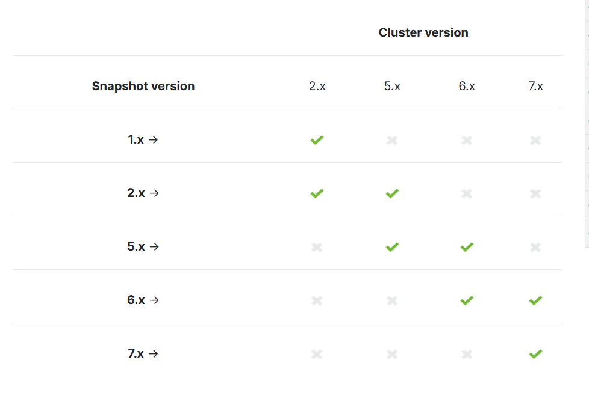

# ElasticSearch 集群部署

## 简介

Elasticsearch是一个基于Lucene的实时分布式的搜索与分析引擎。Elasticsearch为所有类型的数据提供近乎实时的搜索和分析。无论结构化或非结构化文本、数字数据还是地理空间数据，Elasticsearch都可以有效地存储和索引，以支持快速搜索。随着你的数据和查询量的增长，Elasticsearch的分布式特性使部署能够随着它而无缝增长。

## 数据存储

Elasticsearch是一个分布式文档存储。Elasticsearch不是将信息存储为列式数据行，而是存储已序列化为JSON文档的复杂数据结构。当集群中有多个Elasticsearch节点时，存储的文档会分布在整个集群中，并且可以从任何节点立即访问。

存储文档后，它会在近乎实时的情况下被索引并完全可搜索——1秒内。Elasticsearch使用一种称为倒排索引的数据结构，它支持非常快速的全文搜索。倒排索引列出了出现在任何文档中的每个唯一单词，并标识了每个单词出现的所有文档。

索引是文档的优化集合，每个文档都是字段的集合，字段是包含数据的键值对。 默认情况下，Elasticsearch对每个字段中的所有数据进行索引，并且每个索引字段都有一个专用的优化数据结构。

Elasticsearch还具有无预定数据模式(schema-less)的能力，这意味着无需明确指定如何处理文档中可能出现的每个不同字段即可对文档进行索引。启用动态映射后，Elasticsearch会自动检测新字段并将其添加到索引中。只要开始索引文档，Elasticsearch就会检测并将布尔值、浮点和整数值、日期和字符串映射到适当的Elasticsearch数据类型。也可以定义规则来控制动态映射，明确定义映射以完全控制字段的存储和索引方式。

## 查询分析

Elasticsearch提供了一个简单REST API，用于管理集群以及索引和搜索数据。可以直接从命令行、应用程序客户端或通过Kibana中的开发者控制台轻松提交请求。

Elasticsearch REST API支持结构化查询、全文查询和将两者结合的复杂查询。结构化查询类似于在SQL中构造的查询类型。全文查询查找与查询字符串匹配的所有文档，并按与搜索词的匹配程度对它们进行排序。

除了搜索单个术语之外，还可以执行短语搜索、相似性搜索和前缀搜索。可以使用 Elasticsearch全面的JSON样式查询语言 (Query DSL) 访问所有这些搜索功能。 您还可以构建SQL样式的查询以在Elasticsearch内本地搜索和聚合数据。

## 名称概念

- **集群（cluster）**

  一个Elasticsearch集群由一个或多个Elasticsearch节点组成，所有节点共同存储数据。每个集群都应有一个唯一的集群名（ClusterName），同一环境内如果存在同名集群，可能会出现不可知异常。默认集群名为elasticsearch。

- **节点（node）**

  一个节点是集群中的一个服务器，用来存储数据并参与集群的索引和搜索。一个集群可以拥有多个节点，每个节点可以扮演不同的角色：

  数据节点：存储索引数据的节点，主要对文档进行增删改查、聚合等操作。

  专有主节点：对集群进行操作，例如创建或删除索引，跟踪哪些节点是集群的一部分，并决定哪些分片分配给相关的节点。稳定的主节点对集群的健康非常重要，默认情况下集群中的任一节点都可能被选为主节点。

  协调节点：分担数据节点的CPU开销，从而提高处理性能和服务稳定性。

- **索引（index）**

  一个索引是一个拥有一些相似特征的文档的集合，相当于关系型数据库中的一个数据库。一个索引通常使用一个名称（所有字母必须小写）来标识，当针对这个索引的文档执行索引、搜索、更新和删除操作的时候，这个名称被用来指向索引。

- **类型（type）**

  一个类型通常是一个索引的一个逻辑分类或分区，允许在一个索引下存储不同类型的文档，相当于关系型数据库中的一张表。由于6.x以后的Elasticsearch版本已经不支持在一个索引下创建多个类型，因此类型概念在后续版本中不再被提及。Elasticsearch 5.x允许在一个索引下存储不同类型的文档，Elasticsearch 6.x在一个索引下只允许一个类型，Elasticsearch 7.x索引类型命名只允许_doc。

- **文档（document）**

  一个文档是可以被索引的基本信息单元，相当于关系型数据库中的一行数据。文档可以用JSON格式来表示。在一个索引中，您可以存储任意多的文档，且文档必须被索引。

- **字段（field）**

  field是组成文档的最小单位，相当于关系型数据库中的一列数据。

- **映射（mapping）**

  mapping用来定义一个文档以及其所包含的字段如何被存储和索引，相当于关系型数据库中的Schema，例如在mapping中定义字段的名称和类型，以及所使用的分词器。

- **分片（shards）**

  shards代表索引分片，Elasticsearch可以把一个完整的索引分成多个分片，这样的好处是可以把一个大的索引拆分成多个，分布到不同的节点上，构成分布式搜索。分片的数量只能在索引创建前指定，并且索引创建后不能更改。

- **副本（replicas）**

  replicas是索引的备份，Elasticsearch可以设置多个副本。写操作会先在主分片上完成，然后分发到副本分片上。因为索引的主分片和副本分片都可以对外提供查询服务，所以副本能够提升系统的高可用性和搜索时的并发性能。但如果副本太多，也会增加写操作时数据同步的负担。

  Elasticsearch 7.0以下版本默认为一个索引创建5个主分片，并分别为每个主分片创建1个副本分片，7.0及以上版本默认为一个索引创建1个主分片和1个副本分片。两者区别如下：

  | 分片类型 | 支持处理的请求                         | 数量是否可修改                     | 其他说明                                                     |
  | -------- | -------------------------------------- | ---------------------------------- | ------------------------------------------------------------ |
  | 主分片   | 支持处理查询和索引请求。               | 在创建索引时设定，设定后不可更改。 | 索引内任意一个文档都存储在一个主分片中，所以主分片的数量决定着索引能够保存的最大数据量。 |
  | 副本分片 | 支持处理查询请求，不支持处理索引请求。 | 可在任何时候添加或删除副本分片。   | 副本分片对搜索性能非常重要，能提高系统的容错性能，提高查询效率。 |

- **gateway**

  gateway代表Elasticsearch索引快照的存储方式，Elasticsearch默认优先将索引存放到内存中，当内存满时再将这些索引持久化存储至本地硬盘。gateway对索引快照进行存储，当这个Elasticsearch集群关闭再重新启动时就会从gateway中读取索引备份数据。Elasticsearch支持多种类型的gateway，有本地文件系统（默认）、分布式文件系统、Hadoop的HDFS和阿里云的OSS云存储服务。

  

## 相关组件

- **X-Pack**

  X-Pack是Elasticsearch的一个商业版扩展包，包含安全Security、警告Altering、监控Monitoring、图形Graph和报告Reporting、机器学习MachineLearning等多种高级功能。

- **Beats**

  Beats是轻量级的数据采集工具，集合了多种单一用途的数据采集器。它们从成百上千或成千上万台机器和系统向Logstash或Elasticsearch发送数据。

- **Logstash**

  Logstash作为服务器端的数据处理管道，通过输入、过滤和输出插件，动态地从多个来源采集数据，并加工和转换任何类型的事件，最终将数据存储到所选择的位置。

- **Kibana**

  Kibana是灵活的数据分析和可视化工具，支持多用户登录。在Kibana中，您可以搜索和查看Elasticsearch索引中的数据，并进行交互。

## 安装部署

### 调整操作系统配置

[官方部署文档](https://www.elastic.co/guide/en/elasticsearch/reference/7.15/system-config.html)

- 调整系统设置

  ```bash
  vim /etc/security/limits.conf
  * soft nofile 65535
  * hard nofile 65535
  * soft nproc 65535
  * hard nproc 65535
  elastic soft memlock unlimited
  elastic hard memlock unlimited
  ```

- 禁用swap交换分区

  ```bash
  swapoff -a
  # 永久禁用，去掉 /etc/fstab 中swap内容行
  ```

- 调整虚拟内存

  ```bash
  vim /etc/sysctl.conf
  vm.max_map_count=262144
  
  # 生效
  sysctl -p
  ```

- 修改 JNA 和 libffi 临时目录路径

  在 `systemd` 启动管理中添加环境变量：`ES_TMPDIR=/opt/elasticsearch/tmp`

- 减少tcp重传最大次数

  ```bash
  # 此设置适用于所有 TCP 连接，并且也会影响与 Elasticsearch 集群以外的系统通信的可靠性。
  # 如果您的集群通过低质量网络与外部系统通信，那么您可能需要为 net.ipv4.tcp_retries2 选择更高的值。
  vim /etc/sysctl.conf
  net.ipv4.tcp_retries2=5
  
  sysctl -p
  ```

### 服务部署

- 下载对应版本的软件包

  ```bash
  wget https://artifacts.elastic.co/downloads/elasticsearch/elasticsearch-7.15.1-linux-x86_64.tar.gz -P /tmp
  tar -zxf /tmp/elasticsearch-7.15.1-linux-x86_64.tar.gz -C /opt
  mv /opt/elasticsearch-7.15.1 /opt/elasticsearch
  ```

- 创建相关目录并授权

  ```bash
  groupadd elastic
  useradd -g elastic -M -s /sbin/nologin elastic
  mkdir -p /opt/elasticsearch-data/{data,var/run,tmp,backup}
  chown -R elastic. /opt/elasticsearch*
  
  ```

- 修改服务配置

  ```bash
  vim /opt/elasticsearch/config/elasticsearch.yml
  ```

  ```yaml
  # 集群名称，默认elasticsearch
  cluster.name: es-cluster
  
  # 节点名称，默认主机名
  node.name: node-01
  # 添加此行配置，定义节点的角色。参考：https://www.elastic.co/guide/en/elasticsearch/reference/7.17/modules-node.html
  node.roles: [ master, data, voting_only ]
  
  # 数据目录路径
  path.data: /opt/elasticsearch-data/data
  # 日志目录路径
  path.logs: /opt/elasticsearch/logs
  # 快照存储库目录路径
  path.repo: /opt/elasticsearch-data/backup
  
  # tcp通讯端口，为节点之间的通信绑定的端口
  transport.port: 9330
  # 设置是否压缩TCP传输时的数据，默认为false
  transport.tcp.compress: true
  
  
  
  # 开启跨域访问支持，默认为false
  http.cors.enabled: true
  # 跨域访问允许的域名地址，(允许所有域名)以上使用正则
  http.cors.allow-origin: /.*/  
  http.cors.allow-headers: Authorization,X-Requested-With,Content-Length,Content-Type
  # 设置http端口，接受单个值或范围。 如果指定了范围，则节点将绑定到范围中的第一个可用端口。默认为9200-9300。
  http.port: 9200
  # HTTP 请求正文的最大大小。 默认为100mb。
  http.max_content_length: 200mb
  
  
  # 绑定访问地址
  network.host: 0.0.0.0
  # 是否启用tcp无延迟，true为启用tcp不延迟，默认为false启用tcp延迟
  network.tcp.no_delay: true
  # 是否启用TCP保持活动状态，默认为true
  network.tcp.keep_alive: true
  # 是否应该重复使用地址。默认true，在Windows机器上默认为false
  network.tcp.reuse_address: true
  # tcp发送缓冲区大小，默认不设置
  network.tcp.send_buffer_size: 128mb
  # tcp接收缓冲区大小，默认不设置
  network.tcp.receive_buffer_size: 128mb
  
  
  
  # 设置自动发现的Node，以便集群中的节点可以相互发现并选举一个主节点。
  # 参考：https://www.elastic.co/guide/en/elasticsearch/reference/7.17/modules-discovery-settings.html
  discovery.seed_hosts:
     - 192.168.67.78:9330
     - 192.168.67.79:9330
     - 192.168.67.80:9330
  
  # 通过外部文件配置集群节点相互发现列表。Elasticsearch会在这个文件改变的时候重新加载这个文件，这样集群节点列表就可以动态的改变，而不需要重启每个节点。在$ES_PATH_CONF下创建unicast_hosts.txt文件，任何时候unicast_hosts.txt文件改变都会被Elasticsearch接收，并使用新的主机列表。如果discovery.seed_hosts中存在有效的列表，那么Elasticsearch除了使用unicast_hosts.txt中提供的地址外，还使用这些地址。unicast_hosts.txt文件每行包含一个节点条目。 每个节点条目由主机名和端口号组成。
  # discovery.seed_providers
  
  # 指定Elasticsearch是否应该形成一个多节点集群。默认情况下，Elasticsearch在形成集群时发现其他节点，并允许其他节点随后加入集群。如果discovery.type设置为single-node，Elasticsearch会形成一个单节点集群，并抑制cluster.publish.timeout设置的超时。
  # discovery.type
  
  # 设置尝试连接到每个地址时的等待时间。默认为30秒。
  # discovery.probe.connect_timeout
  
  # 设置在试图通过握手识别远程节点时要等待多长时间。默认为30秒。
  # discovery.probe.handshake_timeout
  
  # 设置节点在再次询问其对等方之后将等待多长时间，然后才认为请求失败。默认为3s.
  discovery.request_peers_timeout: 30s
  # Elasticsearch7 新增参数，启动后30秒内，如果集群未形成，那么将会记录一条警告信息，警告信息未master not fount开始，默认为10秒
  discovery.cluster_formation_warning_timeout: 30s 
  
  
  # 初始化主节点，当第一次启动 ES 集群时， 集群引导步骤会确定在第一次选举中计票的符合主节点资格的节点集。
  cluster.initial_master_nodes:
     - node-01
     - node-02
     - node-03
  # Elasticsearch7 新增参数，设置每个节点在选中的主节点的检查之间等待的时间。默认为1秒
  cluster.fault_detection.leader_check.interval: 15s
  # Elasticsearch7新增参数，节点发送请求加入集群后，在认为请求失败后，再次发送请求的等待时间，默认为60秒
  cluster.join.timeout: 30s
  # Elasticsearch7新增参数，设置主节点等待每个集群状态完全更新后发布到所有节点的时间，默认为30秒
  cluster.publish.timeout: 90s 
  # 集群内同时启动的数据任务个数，默认是2个
  cluster.routing.allocation.cluster_concurrent_rebalance: 32
  # 添加或删除节点及负载均衡时并发恢复的线程个数，默认4个
  cluster.routing.allocation.node_concurrent_recoveries: 32
  # 初始化数据恢复时，并发恢复线程的个数，默认4个
  cluster.routing.allocation.node_initial_primaries_recoveries: 32
  # 设置集群最大shard(分片)数
  cluster.max_shards_per_node: 10000
  
  
  # 设置集群中N个数据节点加入集群后就可以进行数据恢复
  gateway.recover_after_data_nodes: 2
  # 设置初始化数据恢复进程的超时时间，默认是5分钟。
  gateway.recover_after_time: 3m
  # 集群中预期的数据节点数。当预期数量的数据节点加入集群时，本地分片的恢复开始。默认为0.
  gateway.expected_data_nodes: 3
  
  
  
  # 在节点上关闭 Elasticsearch 安全功能
  xpack.security.enabled: false
  # 设置为true在节点上启用审计。默认值为false。
  xpack.security.audit.enabled: false
  
  # 启用自动创建索引，禁用后logstash无法自动创建索引。安全考虑可以关闭，即使是内网也有很多扫描程序，一旦开启，扫描程序会自动给你创建很多索引。
  action.auto_create_index: true
  
  
  
  # 启动内存锁定
  # 在ES运行起来后锁定ES所能使用的堆内存大小，锁定内存大小一般为可用内存的一半左右；锁定内存后就不会使用交换分区
  # 如果不打开此项，当系统物理内存空间不足，ES将使用交换分区，ES如果使用交换分区，那么ES的性能将会变得很差
  bootstrap.memory_lock: true
  
  # 删除索引时要求明确的名称，这个设置使删除只限于特定名称指向的数据, 而不允许通过指定 _all 或通配符来删除指定索引库
  action.destructive_requires_name: true
  ingest.geoip.downloader.enabled: false
  
  # xpack配置
  xpack.security.enabled: true
  xpack.security.transport.ssl.enabled: true
  xpack.monitoring.collection.enabled: true
  xpack.security.transport.ssl.verification_mode: certificate
  xpack.security.transport.ssl.keystore.path: /opt/elasticsearch/certs/elastic-certificates.p12
  xpack.security.transport.ssl.truststore.path: /opt/elasticsearch/certs/elastic-certificates.p12
  xpack.security.http.ssl.enabled: true
  xpack.security.http.ssl.keystore.path: /opt/elasticsearch/certs/elastic-certificates.p12
  xpack.security.http.ssl.truststore.path: /opt/elasticsearch/certs/elastic-certificates.p12
  xpack.security.http.ssl.client_authentication: none
  xpack.security.http.ssl.verification_mode: certificate
  
  ```

  ```bash
  vim /opt/elasticsearch/config/jvm.options
  
  # 根据实际情况进行调整，默认4G
  -Xms8g
  -Xmx8g
  
  # 当来自Java堆的分配失败时生成堆转储；除非指定了替代路径，否则堆转储将在JVM的工作目录中创建
  -XX:+HeapDumpOnOutOfMemoryError
  
  # 指定堆转储的替代路径；确保目录存在并且有足够的空间
  -XX:HeapDumpPath=/opt/elasticsearch/logs
  ```

- **设置systemd管理**

  ```bash
  cat > /etc/systemd/system/elasticsearch.service <<'EOF'
  [Unit]
  Description=Elasticsearch
  Documentation=https://www.elastic.co
  Wants=network-online.target
  After=network-online.target
  
  [Service]
  Type=simple
  PrivateTmp=true
  Environment=ES_HOME=/opt/elasticsearch
  Environment=ES_PATH_CONF=/opt/elasticsearch/config
  Environment=PID_DIR=/opt/elasticsearch-data/var/run
  Environment=ES_TMPDIR=/opt/elasticsearch-data/tmp
  WorkingDirectory=/opt/elasticsearch
  User=elastic
  Group=elastic
  ExecStart=/opt/elasticsearch/bin/elasticsearch -p ${PID_DIR}/elasticsearch.pid 
  StandardOutput=journal
  StandardError=journal
  LimitMEMLOCK=infinity
  # 指定此进程可以打开的最大文件描述符编号
  LimitNOFILE=65535
  # 指定最大进程数
  LimitNPROC=65535
  # 指定虚拟内存的最大大小
  LimitAS=infinity
  # 指定最大文件大小
  LimitFSIZE=infinity
  # 禁用超时逻辑并等待进程停止
  TimeoutStopSec=0
  # SIGTERM信号用于停止Java进程
  KillSignal=SIGTERM
  # 仅向JVM而不是其控制组发送信号
  KillMode=process
  # Java进程从未终止
  SendSIGKILL=no
  # 当JVM接收到SIGTERM信号时，它退出并返回代码143
  SuccessExitStatus=143
  # 在systemd通知程序模块启动以延长超时之前，允许缓慢启动
  TimeoutStartSec=75
  
  [Install]
  WantedBy=multi-user.target
  EOF
  ```

- 管理服务

  ```bash
  systemctl daemon-reload
  systemctl start elasticsearch
  systemctl enable elasticsearch
  ```


## 启用X-pack安全配置TLS和身份验证

1. 生成CA证书

   开启安全模块后，节点间通讯需要配置TLS 生成CA证书 `bin/elasticsearch-certutil ca`，将产生新文件 `elastic-stack-ca.p12` 为集群中的每个节点生成证书和私钥 `bin/elasticsearch-certutil cert –ca elastic-stack-ca.p12`，将产生新文件 `elastic-certificates.p12` 默认情况下 `elasticsearch-certutil` 生成没有主机名信息的证书，这意味着你可以将证书用于集群中的每个节点，另外要关闭主机名验证。 将 `elastic-certificates.p12` 文件复制到每个节点上Elasticsearch配置目录中。

   **注意：** 密码后面需要单独设置，这里是集群安全认证，建议密码不设置，成功后生成的证书默认在es的config目录里面 `elastic-certificates.p12`；分别copy一份到其他节点的config里面（默认目录）

   ```bash
   bin/elasticsearch-certutil ca --days  2920
   bin/elasticsearch-certutil cert --days 2920 --ca elastic-stack-ca.p12
   ```

   拷贝证书到所有节点下并赋予相关的权限， elasticsearch.yml 末尾增加xpack相关配置

   ```bash
   xpack.security.enabled: true
   # xpack.license.self_generated.type: basic
   xpack.security.transport.ssl.enabled: true
   xpack.security.transport.ssl.verification_mode: certificate
   xpack.security.transport.ssl.keystore.path: elastic-certificates.p12
   xpack.security.transport.ssl.truststore.path: elastic-certificates.p12
   xpack.security.http.ssl.enabled: true
   xpack.security.http.ssl.keystore.path: elastic-certificates.p12
   xpack.security.http.ssl.truststore.path: elastic-certificates.p12
   xpack.security.http.ssl.client_authentication: none
   ```

2. 设置内置用户密码

   启动集群初始化 `elastic,apm_system,kibana,logstash_system,beats_system,remote_monitoring_user`用户的密码，请牢记！ `bin/elasticsearch-setup-passwords auto` 各用户生成随机密码。 

   ```bash
   $ bin/elasticsearch-setup-passwords auto
   Initiating the setup of passwords for reserved users elastic,apm_system,kibana,kibana_system,logstash_system,beats_system,remote_monitoring_user.
   The passwords will be randomly generated and printed to the console.
   Please confirm that you would like to continue [y/N]y
   
   
   Changed password for user apm_system
   PASSWORD apm_system = m7d5aijhnm24fyTt1oAh
   
   Changed password for user kibana_system
   PASSWORD kibana_system = BOIvKntIxW3dB0OAX5f6
   
   Changed password for user kibana
   PASSWORD kibana = BOIvKntIxW3dB0OAX5f6
   
   Changed password for user logstash_system
   PASSWORD logstash_system = QrPfd7GnH0Ey3qRwRqQS
   
   Changed password for user beats_system
   PASSWORD beats_system = 2OKJEs1XrqwNIo1D1sGg
   
   Changed password for user remote_monitoring_user
   PASSWORD remote_monitoring_user = pIfpLEu5WtnJ2JYYsJL1
   
   Changed password for user elastic
   PASSWORD elastic = bYhCy16GSKmnl6cddSqM
   
   ```

   `bin/elasticsearch-setup-passwords interactive` 手动定义密码。

   ```bash
   bin/elasticsearch-setup-passwords interactive
   
   -----------------------
   
   # 将p12证书转换为PEM格式
   openssl pkcs12 -in ca.p12 -clcerts -nokeys -chain -out ca.pem
   ```

   - `elastic` 账号：拥有 superuser 角色，是内置的超级用户。
   - `kibana` 账号：拥有 kibana_system 角色，用户 kibana 用来连接 elasticsearch 并与之通信。Kibana 服务器以该用户身份提交请求以访问集群监视 API 和 .kibana 索引。不能访问 index。
   - `logstash_system` 账号：拥有 logstash_system 角色。用户 Logstash 在 Elasticsearch 中存储监控信息时使用。
   - `beats_system` 账号：拥有 beats_system 角色。用户 Beats 在 Elasticsearch 中存储监控信息时使用。

3. 配置 kibana 认证

   ```bash
   elasticsearch.username: "kibana"
   elasticsearch.password: "123456"
   ```

   

## 配置详解

- `cluster.initial_master_nodes`

  集群第一次启动时，需要有一个适合作为主节点的节点列表，这个列表就是通过cluster.initial_master_nodes来配置，在配置中需要写出具体的节点名称，对应node.name配置项。

- `indices.breaker.total.use_real_memory`

  Elasticsearch 包含多个断路器，用于防止操作导致 OutOfMemoryError。 每个断路器都指定了它可以使用多少内存的限制。 此外，还有一个父级断路器，它指定可以跨所有断路器使用的内存总量。（静态）确定父断路器是否应考虑实际内存使用量（true）或仅考虑子断路器保留的数量（false）。 默认为true。

- `indices.breaker.total.limit`

  （动态）整个父级断路器的起始限制。 如果indices.breaker.total.use_real_memory为 false，则默认为堆内存的70%。 如果indices.breaker.total.use_real_memory为 true，则默认为堆内存的95%。

- `indices.fielddata.cache.size`

  字段数据缓存的最大大小，默认为无限制，如果设置它，它应该小于字段数据断路器限制。默认缓存大小是无限的，这会导致缓存不断增长，直到达到字段数据断路器设置的限制。如果设置了缓存大小限制，缓存将开始清除缓存中最近最少更新的条目。 此设置可以自动避免断路器限制，但代价是根据需要重建缓存。如果达到断路器限制，增加缓存大小的进一步请求将被阻止。 在这种情况下，您应该手动[clear the cache](https://www.elastic.co/guide/en/elasticsearch/reference/7.15/indices-clearcache.html)

- `indices.breaker.fielddata.limit`

  （动态）字段数据断路器的限制。 默认为堆内存的40%。字段数据断路器估计将字段加载到字段数据缓存中所需的堆内存。 如果加载该字段会导致缓存超出预定义的内存限制，则断路器将停止操作并返回错误。

- `indices.breaker.fielddata.overhead`

  (动态）一个常数，所有的字段数据估算值都要与之相乘，以确定最终的估算值。默认为1.03。

- `indices.breaker.request.limit`

  （动态）请求中断器的限制，默认为堆内存的60%。请求断路器允许Elasticsearch防止每个请求的数据结构（例如，用于在请求期间计算聚合的内存）超过一定的内存量。

- `indices.breaker.request.overhead`

  (动态）一个常数，所有请求的估算值都与之相乘，以确定最终的估算值。默认为1。

- `network.breaker.inflight_requests.limit`

  （动态）in flight requests断路器的限制，默认为堆内存的100%。 这意味着它受为 父断路器 配置的限制的约束。in flight requests断路器允许Elasticsearch在传输或HTTP级别上限制所有当前活动的传入请求的内存使用，使其不超过节点上的一定内存量。内存的使用是基于请求本身的内容长度。

- `network.breaker.inflight_requests.overhead`

  (动态) 一个常数，所有in flight requests估算值都与之相乘，以确定最终的估算值。默认为2。

- `indices.breaker.accounting.limit`

  (动态）accounting断路器的限制，默认为堆内存的100%。这意味着，它受到为 父断路器 配置的限制的约束。accounting断路器允许Elasticsearch限制在内存中保留的东西的内存使用，这些东西在请求完成后不会释放。包括像Lucene段内存这样的东西。

- `indices.breaker.accounting.overhead`

  (动态）一个常数，所有的accounting估算值都要与之相乘，以确定最终的估算值。默认为1

- `action.auto_create_index`

  (动态）如果一个索引不存在，自动创建索引，并应用任何配置的索引模板。默认为true。

- `action.destructive_requires_name`

  (动态）设置为 true 时，您必须指定索引名称才能删除索引。 无法使用 _all 删除所有索引或使用通配符。

- `cluster.indices.close.enable`

  (动态）启用在Elasticsearch中关闭打开的索引。 如果为false，则无法关闭打开的索引。 默认为true。关闭的索引仍然会消耗大量的磁盘空间。

- `stack.templates.enabled`

  (动态)  如果为true，则启用内置索引和组件模板。Elastic Agent使用这些模板来创建数据流。如果是false，Elasticsearch会禁用这些索引和组件模板。默认为true。

- `indices.recovery.max_bytes_per_sec`

  (动态）限制每个节点的入站和出站恢复总流量，适用于对等恢复以及快照恢复，默认为40MB。除非节点是专用的[cold](https://www.elastic.co/guide/en/elasticsearch/reference/7.15/data-tiers.html#cold-tier)或[frozen](https://www.elastic.co/guide/en/elasticsearch/reference/7.15/data-tiers.html#frozen-tier)节点，在这种情况下，默认值与节点可用的总内存有关。此限制分别适用于每个节点。 如果集群中的多个节点同时执行恢复，则集群的总恢复流量可能会超过此限制。如果此限制太高，正在进行的恢复可能会消耗过多的带宽和其他资源，这可能会破坏集群的稳定性。

- `logger.org.elasticsearch.discovery`

  (动态）修改日志级别。

- `node.roles`

  定义节点的角色，具体角色含义参考[官方文档](https://www.elastic.co/guide/en/elasticsearch/reference/7.15/modules-node.html)

  可以通在文件elasticsearch.yml 中定义节点的角色，如果设置了角色，则仅向节点分配指定的角色，如果不设置角色，节点将分配一下角色：`master`、`data`、`data_content`、`data_hot`、`data_warm`、`data_cold`、`data_frozen`、`ingest`、`ml`、`remote_cluster_client`、`transform`。

  如果设置`node.roles`，请确保指定集群所需的每个节点角色。每个集群都需要以下节点角色：master、data_content和data_hot或data。

  某些 Elastic Stack 功能还需要特定的节点角色：

  - 跨集群搜索和跨集群复制需要该`remote_cluster_client`角色。
  - 堆栈监控和摄取管道需要该`ingest`角色。
  - Fleet、Elastic Security 应用程序和转换需要该`transform`角色。该`remote_cluster_client`角色还需要使用具有这些功能的跨集群搜索。
  - 异常检测等机器学习功能需要该`ml`角色。

- `indices.requests.cache.size`

  分片级请求缓存模块将本地结果缓存在每个分片上。这使得经常使用的搜索请求几乎立即返回结果。请求缓存非常适用于日志的使用情况，在这种情况下，只有最近的索引被主动更新--来自较早索引的结果将直接从缓存中提供。缓存默认最大大小为堆的1%。

- `cluster.routing.allocation.enable`

  (动态）为特定类型的分片启用或禁用分配，默认all。

- `cluster.routing.rebalance.enable`

  (动态）为特定类型的分片启用或禁用重新平衡，默认all。

- `cluster.routing.allocation.allow_rebalance`

  (动态）指定何时允许分片重新平衡，默认indices_all_active。

- `cluster.routing.allocation.cluster_concurrent_rebalance`

  (动态）允许控制集群范围内允许多少并发分片重新平衡。 默认为 2。请注意，此设置仅控制由于集群不平衡而导致的并发分片重定位数。 由于分配过滤或强制感知，此设置不会限制分片重定位。

- `cluster.routing.allocation.disk.threshold_enabled`

  (动态)  默认为true。设置为false则禁用磁盘分配决定器。

- `cluster.routing.allocation.disk.watermark.low`

  (动态)  控制磁盘使用的低水位线。 它默认为85%。

- `cluster.routing.allocation.disk.watermark.high`

  (动态）控制磁盘使用的高水位线。 它默认为90%。

- `cluster.routing.allocation.disk.watermark.flood_stage`

  (动态）控制磁盘使用的洪水位线，默认为 95%。

- `cluster.blocks.read_only`

  (动态）使整个集群只读（索引不接受写操作），元数据不允许被修改（创建或删除索引）。默认false。

- `cluster.blocks.read_only_allow_delete`

  (动态）与cluster.blocks.read_only相同，但允许删除索引以释放资源。默认false。

- `cluster.max_shards_per_node`

  (动态）限制集群的主分片和复制分片的总数量。cluster.max_shards_per_node * number of non-frozen data nodes。

- `cluster.max_shards_per_node.frozen`

  (动态）限制集群的主要和复制的冻结分片的总数。cluster.max_shards_per_node * number of frozen data nodes。

## 集群配置

### 部署集群

1. 环境准备

   | 主机名  | IP             | 角色   |
   | ------- | -------------- | ------ |
   | node-01 | 192.168.66.101 | master |
   | Node-02 | 192.168.66.102 | data   |
   | Node-03 | 192.168.66.103 | data   |
   | Node-04 | 192.168.66.104 | data   |

2. 修改所有主机系统hosts文件

   ```bash
   vim /etc/hosts
   192.168.66.101 node-01
   192.168.66.102 node-02
   192.168.66.103 node-03
   192.168.66.104 node-04
   ```

3. 在所有主机上，按照上文单机安装部署步骤安装服务，安装完成后无需启动。

4. 主机node-01配置信息：

   ```bash
   vim /opt/elasticsearch/config/elasticsearch.yml
   node.name: node-01
   node.roles: [master]
   cluster.name: es-cluster
   path.data: /opt/elasticsearch-data/data
   path.logs: /opt/elasticsearch/logs
   path.repo: /opt/elasticsearch-data/backup
   bootstrap.memory_lock: true
   network.host: 0.0.0.0
   http.port: 9200
   http.max_content_length: 200mb
   http.cors.enabled: true
   http.cors.allow-origin: "*"
   transport.port: 9300
   discovery.seed_hosts: ["node-01", "node-02", "node-03", "node-04"]
   discovery.seed_providers: file
   discovery.probe.connect_timeout: 3s
   discovery.probe.handshake_timeout: 1s
   cluster.initial_master_nodes: ["node-01"]
   action.auto_create_index: true
   action.destructive_requires_name: true
   indices.requests.cache.size: 2%
   gateway.expected_nodes: -1
   gateway.expected_master_nodes: -1
   gateway.expected_data_nodes: -1
   gateway.recover_after_time: 0ms
   gateway.recover_after_nodes: -1
   gateway.recover_after_master_nodes: 0
   gateway.recover_after_data_nodes: -1
   cluster.routing.allocation.cluster_concurrent_rebalance: 4
   ```

   ```bash
   node.name: node-01
   cluster.name: mainnet-indexer-cluster
   path.data: /opt/elasticsearch-data/data
   path.logs: /opt/elasticsearch/logs
   path.repo: /opt/elasticsearch-data/backup
   
   # 启动内存锁定
   bootstrap.memory_lock: true
   network.host: 0.0.0.0
   http.port: 9200
   transport.port: 9300
   
   node.roles: [master, data]
   
   http.max_content_length: 200mb
   http.cors.enabled: true
   http.cors.allow-origin: "*"
   
   discovery.seed_hosts: ["172.31.45.88:9300", "172.31.37.130:9300", "172.31.45.195:9300"]
   cluster.initial_master_nodes: ["node-01", "node-02", "node-03"]
   
   ingest.geoip.downloader.enabled: false
   
   discovery.seed_providers: file
   discovery.probe.connect_timeout: 3s
   discovery.probe.handshake_timeout: 1s
   
   action.auto_create_index: true
   action.destructive_requires_name: true
   indices.requests.cache.size: 2%
   gateway.expected_nodes: -1
   gateway.expected_master_nodes: -1
   gateway.expected_data_nodes: -1
   gateway.recover_after_time: 0ms
   gateway.recover_after_nodes: -1
   gateway.recover_after_master_nodes: 0
   gateway.recover_after_data_nodes: -1
   cluster.routing.allocation.cluster_concurrent_rebalance: 4
   
   indices.fielddata.cache.size: 5%
   ```

   

5. 主机node-02、node-03、node-04配置需要修改`node.name`即可

   ```bash
   vim /opt/elasticsearch/config/elasticsearch.yml
   node.name: node-02
   node.roles: [data]
   cluster.name: es-cluster
   path.data: /opt/elasticsearch-data/data
   path.logs: /opt/elasticsearch/logs
   path.repo: /opt/elasticsearch-data/backup
   bootstrap.memory_lock: true
   network.host: 0.0.0.0
   http.port: 9200
   http.max_content_length: 200mb
   http.cors.enabled: true
   http.cors.allow-origin: "*"
   transport.port: 9300
   discovery.seed_hosts: ["node-01", "node-02", "node-03", "node-04"]
   discovery.seed_providers: file
   discovery.probe.connect_timeout: 3s
   discovery.probe.handshake_timeout: 1s
   cluster.initial_master_nodes: ["node-01"]
   action.auto_create_index: true
   action.destructive_requires_name: true
   indices.requests.cache.size: 2%
   gateway.expected_nodes: -1
   gateway.expected_master_nodes: -1
   gateway.expected_data_nodes: -1
   gateway.recover_after_time: 0ms
   gateway.recover_after_nodes: -1
   gateway.recover_after_master_nodes: 0
   gateway.recover_after_data_nodes: -1
   cluster.routing.allocation.cluster_concurrent_rebalance: 4
   ```

6. 启动服务

   ```bash
   systemctl start elasticsearch
   systemctl enable elasticsearch
   ```

7. 查看集群状态

   ```bash
   curl -XGET 'http://127.0.0.1:9200/_cat/nodes?v=true'
   
   curl -XGET 'http://127.0.0.1:9200/_cat/health?v'
   ```

   

### 集群重启流程

1. **禁用分片分配**

   当你关闭一个数据节点时，分配过程会等待index.unassigned.node_left.delayed_timeout（默认为1m），然后才开始将该节点上的分片复制到集群中的其他节点，这会产生大量I/O。 由于节点很快将重新启动， 可以通过在关闭数据节点之前禁用副本分配来避免。

   ```bash
   curl -X PUT "http://127.0.0.1:9200/_cluster/settings?pretty" -H 'Content-Type: application/json' -d'
   {
     "persistent": {
       "cluster.routing.allocation.enable": "primaries"
     }
   }'
   ```
   
2. **停止索引并执行同步刷新**

   执行同步刷新可加快分片恢复。当你执行同步刷新时，检查响应以确保没有失败。由于挂起的索引操作而失败的同步刷新操作会在响应体中列出，尽管请求本身仍然返回200 OK状态。如果有失败，重新发出请求。此功能将在8.0版本中删除。

   ```bash
   curl -X POST "http://127.0.0.1:9200/_flush/synced?pretty"
   ```

3. **关闭所有节点**

   ```bash
   systemctl stop elasticsearch
   ```

4. **启动节点**

   如果有专用的主节点，请先启动它们并等待它们形成集群并选择主节点，然后再继续处理数据节点。 可以通过cat nodes API来检查进度。

   ```bash
   systemctl start elasticsearch
   ```

5. **重新启用分配**

   当一个节点加入集群时，它开始恢复本地存储的任何主分片。 _cat/health API 最初报告的状态为红色，表示并非所有主分片都已分配。

   一旦节点恢复其本地分片，集群状态将切换为黄色，表示所有主分片已恢复，但未分配所有副本分片。 因为尚未重新启用分配。 延迟分配副本直到所有节点都为黄色允许主节点将副本分配给已经具有本地分片副本的节点。

   ```bash
   curl -X PUT "http://127.0.0.1:9200/_cluster/settings?pretty" -H 'Content-Type: application/json' -d'
   {
     "persistent": {
       "cluster.routing.allocation.enable": null
     }
   }'
   ```
   


## 使用标准SQL操作ES

1. **SQL REST API**

   ```bash
   curl -X POST "http://127.0.0.1:9200/_sql?format=txt&pretty" -H 'Content-Type: application/json' -d'
   {
     "query": "SELECT * FROM library WHERE release_date < \u00272000-01-01\u0027"
   }
   '
   ```

2. **SQL CLI**

   ```bash
   ./bin/elasticsearch-sql-cli
   sql> SELECT * FROM library WHERE release_date < '2000-01-01';
   ```

   

## 索引

[Index modules](https://www.elastic.co/guide/en/elasticsearch/reference/7.15/index-modules.html)

[Index management](https://www.elastic.co/guide/en/elasticsearch/reference/7.15/index-mgmt.html)

## 索引生命周期管理

可以通过Kibana Management或ILM API创建和管理索引生命周期策略。当您为Beats或Logstash Elasticsearch输出插件启用索引生命周期管理时，默认策略是自动配置的。

索引生命周期阶段共分为五个阶段：

- Hot：该索引正在积极更新和查询。
- Warm：该索引不再被更新，但仍在被查询。
- Cold：该索引不再被更新，并且不经常被查询。这些信息仍然需要被搜索到，只是查询速度比较慢。
- Frozen：该索引不再被更新，并且不经常被查询。这些信息仍然需要被搜索到，只是查询速度非常慢。
- Delete：不再需要该索引，可以安全地删除该索引。


在为日志或指标等时间序列数据编制索引时，不能无限期地写入单个索引。 为了满足索引和搜索性能要求并管理资源使用情况，写入索引直到满足某个阈值，然后创建一个新索引并开始写入它。 使用滚动索引能够达到以下效果：

- 针对高性能Hot节点上的高摄取率优化活动索引。
- 优化Warm节点上的搜索性能。
- 将较旧、访问频率较低的数据转移到成本较低的Cold节点。
- 通过删除整个索引，根据您的保留策略删除数据。


ILM能够根据索引大小、文档计数或年龄自动滚动到新索引。 当触发 [Rollover](https://www.elastic.co/guide/en/elasticsearch/reference/7.15/index-rollover.html) 时，会创建一个新索引，写入别名会更新为指向新索引，所有后续更新都会写入新索引。

[索引生命周期操作](https://www.elastic.co/guide/en/elasticsearch/reference/7.15/ilm-actions.html)

[配置生命周期策略](https://www.elastic.co/guide/en/elasticsearch/reference/7.15/set-up-lifecycle-policy.html)

[启动和停止索引生命周期管理](https://www.elastic.co/guide/en/elasticsearch/reference/7.15/start-stop-ilm.html)

## 命令工具详解

### elasticsearch-keystore

elasticsearch-keystore 命令管理 Elasticsearch 密钥库中的安全设置。

```bash
用于管理存储在弹性搜索密钥库中的设置的工具

Commands
--------
create - 创建新的弹性搜索密钥库
list - 列出密钥库中的条目
add - 向密钥库添加字符串设置
add-file - 向密钥库添加文件设置
remove - 从密钥库中删除设置
upgrade - 升级keystore格式
passwd - 更改密钥库的密码
has-passwd - 如果密钥库存在且受密码保护，则成功，否则失败，退出代码为1。

Non-option arguments:
command              

Option             Description        
------             -----------        
-E <KeyValuePair>  配置设置
-h, --help         Show help          
-s, --silent       显示最小输出
-v, --verbose      显示详细输出
```

### elasticsearch-node

elasticsearch-node命令能够在节点上执行某些不安全的操作，这些操作只能在关闭时执行。 此命令允许您调整节点的角色，不安全地编辑集群设置，并且即使在与磁盘上的数据不兼容的情况下，也可以在灾难后恢复某些数据或启动节点。

```bash
在当前节点上执行不安全群集和索引操作的CLI工具

Commands
--------
repurpose - 将此节点重新调整为另一个主/数据角色，清除任何多余的持久化数据
unsafe-bootstrap - 在一半或更多符合条件的主节点永久丢失后，强制成功选择当前节点
detach-cluster - 将此节点与其群集分离，允许其不安全地加入新群集
override-version - 使用[7.15.1]覆盖存储在此节点数据路径中的版本，以绕过版本兼容性检查
remove-settings - 从群集状态中删除持久设置
remove-customs - 从群集状态中删除自定义元数据

Non-option arguments:
command              

Option             Description        
------             -----------        
-E <KeyValuePair>  Configure a setting
-h, --help         Show help          
-s, --silent       Show minimal output
-v, --verbose      Show verbose output
```

### elasticsearch-service-token

创建、列出和删除基于文件的服务账户令牌。当创建第一个服务帐户令牌时，此命令会在 $ES_HOME/config 目录中创建一个 service_tokens 文件。 该文件默认不存在。Elasticsearch监视此文件的更改并动态重新加载它.

```bash
管理弹性搜索服务帐户文件令牌

Commands
--------
create - 为指定的服务帐户和令牌名称创建文件令牌
delete - 删除指定服务帐户和令牌名称的文件令牌
list - 列出指定服务帐户的文件令牌

Non-option arguments:
command              

Option             Description        
------             -----------        
-E <KeyValuePair>  Configure a setting
-h, --help         Show help          
-s, --silent       Show minimal output
-v, --verbose      Show verbose output
```

### elasticsearch-setup-passwords

设置内置用户的密码。此命令仅供在Elasticsearch安全功能的初始配置期间使用。 它使用弹性引导密码来运行用户管理API请求。 如果Elasticsearch密钥库受密码保护，则必须先输入密钥库密码，然后才能为内置用户设置密码。 为弹性用户设置密码后，引导密码不再有效，无法使用该命令。

```bash
设置保留用户的密码

Commands
--------
auto - 使用随机生成的密码
interactive - 使用用户输入的密码

Non-option arguments:
command              

Option             Description        
------             -----------        
-E <KeyValuePair>  Configure a setting
-h, --help         Show help          
-s, --silent       Show minimal output
-v, --verbose      Show verbose output
```

### elasticsearch-shard

在某些情况下，分片副本的Lucene索引或事务日志可能会损坏。 elasticsearch-shard命令能够在无法自动恢复或从备份恢复的分片的良好副本时删除分片的损坏部分。运行elasticsearch-shard时，将丢失损坏的数据。在运行elasticsearch-shard之前停止Elasticsearch。

```bash
用于删除不可恢复碎片损坏部分的CLI工具

Commands
--------
remove-corrupted-data - 删除损坏的碎片文件

Non-option arguments:
command              

Option             Description        
------             -----------        
-E <KeyValuePair>  Configure a setting
-h, --help         Show help          
-s, --silent       Show minimal output
-v, --verbose      Show verbose output
```

### elasticsearch-users

使用基于文件的用户身份验证，则可以使用elasticsearch-users命令添加和删除用户、分配用户角色和管理密码。

```bash
管理弹性搜索文件用户

Commands
--------
useradd - 添加文件用户
userdel - 删除基于文件的用户
passwd - 更改现有基于文件的用户的密码
roles - 编辑现有用户的角色
list - 列出现有的基于文件的用户及其相应的角色

Non-option arguments:
command              

Option             Description        
------             -----------        
-E <KeyValuePair>  Configure a setting
-h, --help         Show help          
-s, --silent       Show minimal output
-v, --verbose      Show verbose output
```

## 常用REST API

参考官方文档[REST APIs](https://www.elastic.co/guide/en/elasticsearch/reference/7.15/rest-apis.html)

### 查询

1. 查看ES集群健康值

   ```bash
   GET /_cluster/health
   
   curl -X GET "http://127.0.0.1:9200/_cluster/health?pretty"
   ```

2. 请求带密码的ES接口

   ```bash
   curl -X GET "http://127.0.0.1:9200/_cluster/health?pretty --user elastic:123456"
   ```

3. 查看分片的状态

   ```bash
   GET /_cluster/health?level=shards
   
   curl -X GET "http://127.0.0.1:9200/_cluster/health?level=shards&pretty"
   ```

4. 查看分片信息

   ```bash
   curl -XGET "http://127.0.0.1:9200/_cat/shards"
   
   curl -XGET 'http://127.0.0.1:9200/_cat/shards?h=index,shard,prirep,state,unassigned.reason'
   ```

5. 查看每个索引的状态

   ```bash
   curl -XGET "http://127.0.0.1:9200/_cat/indices?v"
   ```

6. 查看某个索引的status

   ```bash
   curl -s "http://127.0.0.1:9200/_cat/indices/Index_Name?h=status"
   ```

7. 查看状态是red的索引

   ```bash
   curl -XGET "http://127.0.0.1:9200/_cat/indices | awk '$1 ~/red/'"
   ```

8. 查询索引库的settings信息

   ```bash
   curl -XGET "http://127.0.0.1:9200/<index_name>/settings?pretty&pretty=true"
   ```

9. 查询所有索引别名信息

   ```bash
   curl -XGET "http://127.0.0.1:9200/_cat/aliases?v"
   ```

10. 查询某个索引的别名信息

    ```bash
    curl -XGET "http://127.0.0.1:9200/<index_name>/_alias/*"
    ```

11. 查询用户信息

    ```bash
    curl -XGET "http://127.0.0.1:9200/_xpack/security/role_mapping/<username>"
    ```

12. 查询所有索引信息

    ```bash
    curl -XGET "http://127.0.0.1:9200/_cat/indices?v"
    ```

13. 查看集群当前配置

    ```bash
    curl -XGET 'http://127.0.0.1:9200/_cluster/settings?pretty'
    ```

    

14. 查询模板

    ```bash
    curl -XGET 'http://127.0.0.1:9200/aelfindexer_beangotown-cc9d80a0e0664cf5883a57ba5c68a027.gameindex/_count' -H 'Content-Type: application/json' -d '{
      "query": {
        "term": {
          "caAddress": {
            "value": "ELF_26p8oByNEWg7zx5LGGWbvPV7wrcjHbXAsd4hgJWpYMHojqMM4L_tDVV"
          }
        }
      }
    }'
    ```

15. 排错命令

    ```bash
    # 查看集群状态
    GET _cluster/health
    
    # 查看分片的状态
    GET /_cluster/health?level=shards
    curl -XGET "http://127.0.0.1:9200/_cluster/health?level=shards"
    
    # 查看没有分配的原因
    GET _cluster/allocation/explain?pretty
    
    # 下面的请求返回 unassigned.reason 列，该列指示未分配分片的原因。
    GET _cat/shards?h=index,shard,prirep,state,unassigned.reason
    
    # 查看正在恢复的分片
    curl http://127.0.0.1:9200/_cat/recovery?active_only=true
    
    # 查看所有索引的副本数
    curl http://127.0.0.1:9200/_cluster/health?level=indices | jq .indices > test2222.txt
    cat test2222.txt | jq .[].number_of_replicas | grep 0
    
    # 查看所有分片的详情
    curl http://127.0.0.1:9200/_cat/shards?v  > shared111.txt
    
    # 查看各节点文件打开数限制
    GET _nodes/stats/process?filter_path=**.max_file_descriptors
    curl -XGET "http://127.0.0.1:9200/_nodes/stats/process?filter_path=**.max_file_descriptors"
    
    # 查看节点详情
    GET _nodes/process
    curl -XGET "http://127.0.0.1:9200/_nodes/process"
    
    ```

16. 查询索引中数据信息

    ```bash
    # 在ES如果使用match_all查询索引的全量数据时，默认只会返回10条数据。
    # 因为_search查询默认采用的是分页查询，每页记录数size的默认值为10.
    curl -XGET "http://127.0.0.1:9200/<index_name>/_search?pretty"
    # 等同于
    curl -XGET "http://127.0.0.1:9200/<index_name>/_search?pretty" -H 'Content-Type: application/json' -d '{
      "query": {
        "match_all": {}
      }
    }'
    
    # 添加size参数，但是size的值不能大于10000
    curl -XGET "http://127.0.0.1:9200/<index_name>/_search?pretty" -H 'Content-Type: application/json' -d '{
      "query": {
        "match_all": {}
      },
      "size": 100
    }'
    
    curl -s -XGET "http://172.31.33.57:9200/<index_name>/_search?pretty" -H 'Content-Type: application/json' -d '{
      "query": {
        "match_all": {}
      },
      "size": 1000
    }' | grep -v Total > <index_name>.json
    
    ```

    


### 修改

1. 关闭不需要的索引，减少内存占用

   ```bash
   curl -XPOST "http://127.0.0.1:9200/<index_name>/_close"
   ```

2. 创建索引

   ```bash
   curl -XPUT 'http://127.0.0.1:9200/<index_name>' -H 'content-Type:application/json' -d'{"settings":{"index":{"number_of_shards":3,"number_of_replicas":1}}}'
   ```

   操作已存在的索引

   ```bash
   curl -XPUT 'http://127.0.0.1:9200/<index_name>/_settings' -d '{"index":{"number_of_replicas":1}}'
   ```

   总结：就是，不存在索引时,可以指定副本和分片，如果已经存在,则只能修改副本。

3. 修改索引别名

   ```bash
   POST /_aliases
   {
       "actions" : [
           { "remove" : { "index" : "test1", "alias" : "alias1" } },
           { "add" : { "index" : "test2", "alias" : "alias1" } }
       ]
   }
   ```

4. 添加用户权限组

   ```bash
   curl -XPUT 'http://127.0.0.1:9200/_xpack/security/role_mapping/<username>' -d
   '{
       "enabled" : true,
       "roles" : [
         "ops.test",
         "ops.eic.test.group"
       ],
       "rules" : {
         "any" : [
           {
             "field" : {
               "username" : "<username>"
             }
           }
         ]
       },
       "metadata" : {
         "username" : "<username>"
       }
   }'
   ```

5. 取消索引只读

   ```bash
   curl -XPUT 'http://127.0.0.1:9200/_all/_settings' -d '{"index.blocks.read_only_allow_delete": null}'
   ```

### 删除

1. 删除索引数据

   ```bash
   # 删除单个索引
   curl -XDELETE 'http://127.0.0.1:9200/index_name_01'
   # 删除多个索引
   curl -XDELETE 'http://127.0.0.1:9200/index_name_01,index_name_02,index_name_03'
   
   curl -XDELETE 'http://127.0.0.1:9200/index_name_*'
   
   # 删除全部索引（强烈不建议）
   curl -XDELETE 'http://127.0.0.1:9200/_all'
   curl -XDELETE 'http://127.0.0.1:9200/*'
   
   # 删除全部索引操作非常危险，禁止措施是：在elasticsearch.yml 配置文件中添加以下配置
   # action.destructive_requires_name: true
   # 这个设置使删除只限于特定名称指向的数据, 而不允许通过指定 _all 或通配符来删除指定索引库
   ```
   
   


```bash
GET /_cat/aliases?v=true
    检索集群的索引别名，包括过滤器和路由信息。API不返回data stream别名。
GET /_cat/allocation?v=true
    提供分配给每个数据节点的分片数量及其磁盘空间的快照。
GET /_cat/count/my-index-000001?v=true
    提供快速访问数据流、索引或整个集群的文档计数。
GET /_cat/fielddata?v=true
    返回集群中每个数据节点上的字段数据缓存当前使用的堆内存量。
GET /_cat/health?v=true
    返回集群的健康状态
GET /_cat/indices/my-index-*?v=true
    返回有关集群中索引的高级信息，包括数据流的支持索引。
GET /_cat/master?v=true
    返回主节点信息，包括ID、绑定IP地址、名称。
GET /_cat/nodeattrs?v=true
    返回有关自定义节点属性的信息。
GET /_cat/nodes?v=true
    返回有关集群节点的信息。
GET /_cat/pending_tasks?v=true
    返回尚未执行的集群级别更改，类似于挂起的集群任务API。
GET /_cat/plugins?v=true&h=name,component,version,description
    返回在集群的每个节点上运行的插件列表。
GET /_cat/recovery?v=true
    返回有关正在进行和已完成的分片恢复的信息，类似于索引恢复API。
GET /_cat/repositories?v=true
    返回集群的快照存储库。
GET /_cat/segments?v=true
    返回有关索引分片中Lucene segments的低级信息，类似于index segments API。
GET /_cat/shards?v=true
    shards命令是哪些节点包含哪些分片的详细视图。它会告诉您它是主节点还是副本节点、文档数、它在磁盘上占用的字节数以及它所在的节点。
GET /_cat/snapshots?v=true
    返回有关存储在一个或多个存储库中的快照的信息。
GET /_cat/tasks?v=true
    返回集群中当前正在执行的任务的信息。
GET /_cat/templates/my-template-*?v=true
    返回有关集群中索引模板的信息。
GET /_cat/thread_pool?v=true
    返回集群中每个节点的线程池统计信息。返回的信息包括所有内置线程池和自定义线程池。

GET /_cluster/allocation/explain
    提供分片当前分配的详情。
GET /_cluster/settings
    返回集群范围设置。
#GET /_cluster/health
#    返回集群的健康状态。
GET /_cluster/state/<metrics>/<target>
    返回有关集群状态的元数据。
GET /_cluster/stats
    返回集群统计信息。
PUT /_cluster/settings
    配置动态集群设置。
GET /_nodes/<node_id>/usage/<metric>
    返回集群有关功能使用情况的信息。
GET /_nodes/<node_id>/<metric>
    返回集群节点信息。
POST /_nodes/reload_secure_settings
    在集群中的节点上重新加载密钥库。
GET /_nodes/<node_id>/stats/<metric>/<index_metric>
    返回集群节点统计信息。
GET /_remote/info
    返回配置的远程集群信息。
POST /_cluster/voting_config_exclusions?node_names=<node_names>
    从投票配置排除列表中添加符合主节点资格的节点。
DELETE /_cluster/voting_config_exclusions?node_names=<node_names>
    从投票配置排除列表中删除符合主节点资格的节点。
```

## 因ES节点磁盘占用率高，导致无法分配分片

有场景会出现因没有关注到，导致es-data的磁盘使用占用超过85%，es 集群的默认配置是当集群中的某个节点磁盘达到使用率为 85% 的时候，就不会在该节点进行创建副本，当磁盘使用率达到 90% 的时候，尝试将该节点的副本重分配到其他节点。当磁盘使用率达到95% 的时候，当前节点的所有索引将被设置为只读索引。

es根据磁盘使用情况来分配shard，默认设置是开启的，也可以通过api关闭：
`cluster.routing.allocation.disk.threshold_enabled: false`
在开启的情况下，有两个重要的设置：
`cluster.routing.allocation.disk.watermark.low`：控制磁盘最小使用率。默认85%.说明es在磁盘使用率达到85%的时候将会停止分配新的shard。也可以设置为一个绝对数值，比如500M.
`cluster.routing.allocation.disk.watermark.high`：控制磁盘的最大使用率。默认90%.说明在磁盘使用率达到90%的时候es将会relocate shard去其他的节点。同样也可以设置为一个绝对值。

### 查看 ES 当前的配置

```bash
curl -XGET 'http://127.0.0.1:9200/_cluster/settings?pretty'
```

### 更改配置

临时更改 transient 重启后配置失效

```bash
curl -H "Content-Type: application/json" -XPUT 'http://127.0.0.1:9200/_cluster/settings?pretty' -d'
{
    "transient":{
        "cluster.routing.allocation.disk.watermark.low":"94%",
        "cluster.routing.allocation.disk.watermark.high":"95%",
        "cluster.info.update.interval":"1m"
    }
}'
```

永久更改 persistent 重启后不失效

```bash
curl -H "Content-Type: application/json" -XPUT 'http://127.0.0.1:9200/_cluster/settings?pretty' -d'
{
    "persistent":{
        "cluster.routing.allocation.disk.watermark.low":"94%",
        "cluster.routing.allocation.disk.watermark.high":"95%",
        "cluster.info.update.interval":"1m"
    }
}'
```


## 快照备份恢复

快照是从正在运行的Elasticsearch集群中获取的备份。 可以拍摄整个集群的快照，包括其所有数据流和索引。 还可以仅对集群中的特定数据流或索引进行快照。必须先注册快照存储库，然后才能创建快照。

Elasticsearch以增量方式进行快照：快照过程只将数据复制到存储库中，而之前的快照还没有复制到那里，避免了不必要的重复工作或存储空间。这意味着可以安全地以最小的开销频繁地进行快照。这种增量只适用于单个存储库，因为存储库之间没有数据共享。快照在逻辑上也是相互独立的，即使是在一个存储库内：删除一个快照不会影响任何其他快照的完整性。

可以将快照恢复到正在运行的集群中，默认情况下包括快照中的所有数据流和索引。 也可以选择仅从快照恢复集群状态或特定数据流或索引。

可以使用快照生命周期管理来自动拍摄和管理快照。

快照包含构成索引或数据流支持索引的磁盘上数据结构的副本。这意味着快照只能被恢复到可以读取索引的Elasticsearch版本中。版本兼容图如下：



### 环境说明

**注意：**

- 多节点的集群实现快照必须满足以下要求
  - 建立共享文件系统：如NFS共享，确定每一个节点挂载到指定路径，才能创建快照存储库。
  - 在所有的主节点、数据节点都要配置相同的 path.repo 配置项。


集群快照存储路径: `/opt/elasticsearch-data/backup`

仓库名: `repository_name`

快照名: `indexer_snapshot_01`

快照含索引: `blockindex, logeventindex, transactionindex`

查看创建的repo路径信息：

```bash
GET _cluster/settings?include_defaults&filter_path=*.path.repo

curl -X GET "http://127.0.0.1:9200/_cluster/settings?include_defaults&filter_path=*.path.repo&pretty"

# 输出结果
{
  "defaults" : {
    "path" : {
      "repo" : [
        "/opt/elasticsearch-data/backup"
      ]
    }
  }
}
```

### 创建快照仓库

**注意：**location配置的路径 ，必须和集群 `elasticsearh.yml` 中配置 `path.repo` 保持一致。

```bash
PUT /_snapshot/repository_name
{
  "type": "fs",
  "settings": {
    "location": "/opt/elasticsearch-data/backup"
  }
}

# 在终端执行命令
curl -X PUT "http://127.0.0.1:9200/_snapshot/repository_name" -H 'Content-Type: application/json' -d'
{
  "type": "fs",
  "settings": {
    "location": "/opt/elasticsearch-data/backup"
  }
}'
```

使用获取快照API检索有关注册存储库的信息：

```bash
GET /_snapshot/repository_name

# 在终端执行命令
curl -X GET "http://127.0.0.1:9200/_snapshot/repository_name"

# 输出结果
{
  "repository_name": {
    "type": "fs",
    "uuid": "0JLknrXbSUiVPuLakHjBrQ",
    "settings": {
      "location": "/opt/elasticsearch-data/backup"
    }
  }
}
```

查看在哪个node上创建的仓库：

```bash
POST _snapshot/repository_name/_verify

curl -X GET "http://127.0.0.1:9200/_snapshot/repository_name/_verify"

# 输出结果
{
  "nodes" : {
    "pMrJwVGSQcSgeTZdh61QRw" : {
      "name" : "node1"
    }
  }
}
```

要检索有关所有已注册快照存储库的信息，请省略存储库名称：

```bash
GET /_snapshot

curl -X GET "http://127.0.0.1:9200/_snapshot"

# 或者可以指定 _all
GET /_snapshot/_all
```

### 删除或注销快照仓库

```bash
DELETE /_snapshot/repository_name

curl -X DELETE "http://127.0.0.1:9200/_snapshot/repository_name"
```


### 创建快照

以下请求在存储库 repository_name 中创建名为 indexer_snapshot_01 的快照。

默认情况下，快照备份集群中的所有数据流和打开的索引。您可以通过在快照请求的主体中指定数据流和索引的列表来更改此行为。

```bash
# 创建快照 indexer_snapshot_01 对索引 blockindex,logeventindex,transactionindex 的快照
PUT /_snapshot/repository_name/indexer_snapshot_01?wait_for_completion=true
{
  "indices": "blockindex,logeventindex,transactionindex",
  "ignore_unavailable": true,
  "include_global_state": false
}

# 在终端执行命令
curl -X PUT "http://127.0.0.1:9200/_snapshot/repository_name/indexer_snapshot_01?wait_for_completion=true&pretty" -H 'Content-Type: application/json' -d'
{
  "indices": "blockindex,logeventindex,transactionindex",
  "ignore_unavailable": true,
  "include_global_state": false
}'

# 保存集群下的所有索引快照
PUT /_snapshot/repository_name/indexer_snapshot_01?wait_for_completion=true

curl -X PUT "http://127.0.0.1:9200/_snapshot/repository_name/indexer_snapshot_01?wait_for_completion=true&pretty"
```

`wait_for_completion`: 参数指定请求是否应在快照初始化后立即返回（默认）或等待快照完成。在快照初始化期间，有关所有先前快照的信息都会加载到内存中，这意味着在大型存储库中，即使wait_for_completion参数设置为false，此请求也可能需要几秒钟（甚至几分钟）才能返回。

使用`indices`参数列出快照中应包含的数据流和索引。此参数支持多目标语法，但控制多索引语法行为的选项必须在请求正文中提供，而不是作为请求参数提供。

创建快照请求支持`ignore_unavailable`选项。将其设置为true将导致在创建快照期间忽略不存在的数据流和索引。默认情况下，当未设置ignore_unavailable选项并且缺少数据流或索引时，快照请求将失败。

通过将`include_global_state`设置为false，可以防止将集群全局状态存储为快照的一部分。

### 查看快照

```bash
# 查看所有快照存储库
GET /_snapshot/_all

curl -X GET "http://127.0.0.1:9200/_snapshot/_all?pretty"

# 查看创建的快照信息
GET /_snapshot/repository_name/indexer_snapshot_*

curl -X GET "http://127.0.0.1:9200/_snapshot/repository_name/indexer_snapshot_*?pretty"

# 查看所有的快照信息
GET /_snapshot/repository_name/_all

curl -X GET "http://127.0.0.1:9200/_snapshot/repository_name/_all?pretty"

# 查看快照状态或备份的进度
GET /_snapshot/repository_name/indexer_snapshot_01/_status?pretty

curl -X GET "http://127.0.0.1:9200/_snapshot/repository_name/indexer_snapshot_01/_status?pretty"
```

### 还原或恢复快照

```bash
POST /_snapshot/repository_name/indexer_snapshot_01/_restore
{
  "indices": "aelfindexer.blockindex,aelfindexer.logeventindex,aelfindexer.transactionindex",
  "ignore_unavailable": true,
  "include_aliases": false
}

# 在终端执行命令
curl -X POST "http://127.0.0.1:9200/_snapshot/repository_name/indexer_snapshot_01/_restore?pretty" -H 'Content-Type: application/json' -d'
{
  "indices": "*",
  "ignore_unavailable": true,
  "include_aliases": false
}'
```

恢复快照到重命名索引

```bash
POST _snapshot/repository_name/indexer_snapshot_01/_restore
{
  "indices": "blockindex,logeventindex,transactionindex",
  "ignore_unavailable": true,
  "rename_pattern": "(.+)",
  "rename_replacement": "restored_$1"
}

# 在终端执行命令
curl -X POST "http://127.0.0.1:9200/_snapshot/repository_name/indexer_snapshot_01/_restore?pretty" -H 'Content-Type: application/json' -d'
{
  "indices": "blockindex,logeventindex,transactionindex",
  "ignore_unavailable": true,
  "rename_pattern": "(.+)",
  "rename_replacement": "restored_$1"
}'
```

查询新索引的数据：

```bash
GET restored_blockindex/_search

curl -X GET "http://127.0.0.1:9200/restored_blockindex/_search?pretty"
```

查看快照恢复的进度

```bash
curl -XGET 'http://127.0.0.1:9200/indexer_snapshot_01/_recovery?pretty'
```

取消恢复

```bash
curl -XDELETE 'http://127.0.0.1:9200/indexer_snapshot_01'
```


### 删除和取消快照

正在备份的数据可以执行取消，使用的是 DELETE 命令：

- 如果备份正在进行中，那么取消备份操作，并且删除备份了一半的数据。
- 如果备份已经完成，直接删除备份数据。

```bash
DELETE /_snapshot/repository_name/indexer_snapshot_01

curl -X DELETE "http://127.0.0.1:9200/_snapshot/repository_name/indexer_snapshot_01?pretty"
```

### 设置快照生命周期策略

```bash
curl -X PUT "http://127.0.0.1:9200/_slm/policy/nightly-snapshots?pretty" -H 'Content-Type: application/json' -d'
{
  "nightly-snapshots" : {
    "version": 1,
    "modified_date": "2019-04-23T01:30:00.000Z",
    "modified_date_millis": 1556048137314,
    "policy" : {
      "schedule": "0 30 1 * * ?",
      "name": "<nightly-snap-{now/d}>",
      "repository": "my_repository",
      "config": {
        "indices": ["*"],
      },
      "retention": {
        "expire_after": "30d",
        "min_count": 5,
        "max_count": 50
      }
    },
    "last_success": {                                                    
      "snapshot_name": "nightly-snap-2019.04.24-tmtnyjtrsxkhbrrdcgg18a", 
      "time_string": "2019-04-24T16:43:49.316Z",
      "time": 1556124229316
    } ,
    "last_failure": {                                                    
      "snapshot_name": "nightly-snap-2019.04.02-lohisb5ith2n8hxacaq3mw",
      "time_string": "2019-04-02T01:30:00.000Z",
      "time": 1556042030000,
      "details": "{\"type\":\"index_not_found_exception\",\"reason\":\"no such index [important]\",\"resource.type\":\"index_or_alias\",\"resource.id\":\"important\",\"index_uuid\":\"_na_\",\"index\":\"important\",\"stack_trace\":\"[important] IndexNotFoundException[no such index [important]]\\n\\tat org.elasticsearch.cluster.metadata.IndexNameExpressionResolver$WildcardExpressionResolver.indexNotFoundException(IndexNameExpressionResolver.java:762)\\n\\tat org.elasticsearch.cluster.metadata.IndexNameExpressionResolver$WildcardExpressionResolver.innerResolve(IndexNameExpressionResolver.java:714)\\n\\tat org.elasticsearch.cluster.metadata.IndexNameExpressionResolver$WildcardExpressionResolver.resolve(IndexNameExpressionResolver.java:670)\\n\\tat org.elasticsearch.cluster.metadata.IndexNameExpressionResolver.concreteIndices(IndexNameExpressionResolver.java:163)\\n\\tat org.elasticsearch.cluster.metadata.IndexNameExpressionResolver.concreteIndexNames(IndexNameExpressionResolver.java:142)\\n\\tat org.elasticsearch.cluster.metadata.IndexNameExpressionResolver.concreteIndexNames(IndexNameExpressionResolver.java:102)\\n\\tat org.elasticsearch.snapshots.SnapshotsService$1.execute(SnapshotsService.java:280)\\n\\tat org.elasticsearch.cluster.ClusterStateUpdateTask.execute(ClusterStateUpdateTask.java:47)\\n\\tat org.elasticsearch.cluster.service.MasterService.executeTasks(MasterService.java:687)\\n\\tat org.elasticsearch.cluster.service.MasterService.calculateTaskOutputs(MasterService.java:310)\\n\\tat org.elasticsearch.cluster.service.MasterService.runTasks(MasterService.java:210)\\n\\tat org.elasticsearch.cluster.service.MasterService$Batcher.run(MasterService.java:142)\\n\\tat org.elasticsearch.cluster.service.TaskBatcher.runIfNotProcessed(TaskBatcher.java:150)\\n\\tat org.elasticsearch.cluster.service.TaskBatcher$BatchedTask.run(TaskBatcher.java:188)\\n\\tat org.elasticsearch.common.util.concurrent.ThreadContext$ContextPreservingRunnable.run(ThreadContext.java:688)\\n\\tat org.elasticsearch.common.util.concurrent.PrioritizedEsThreadPoolExecutor$TieBreakingPrioritizedRunnable.runAndClean(PrioritizedEsThreadPoolExecutor.java:252)\\n\\tat org.elasticsearch.common.util.concurrent.PrioritizedEsThreadPoolExecutor$TieBreakingPrioritizedRunnable.run(PrioritizedEsThreadPoolExecutor.java:215)\\n\\tat java.base/java.util.concurrent.ThreadPoolExecutor.runWorker(ThreadPoolExecutor.java:1128)\\n\\tat java.base/java.util.concurrent.ThreadPoolExecutor$Worker.run(ThreadPoolExecutor.java:628)\\n\\tat java.base/java.lang.Thread.run(Thread.java:834)\\n\"}"
    } ,
    "next_execution": "2019-04-24T01:30:00.000Z",                        
    "next_execution_millis": 1556048160000
  }
}
'
```

### 测试快照策略

```bash
curl -X POST "http://127.0.0.1:9200/_slm/policy/nightly-snapshots/_execute?pretty"
```

### SLM权限设置

```bash
curl -X POST "http://127.0.0.1:9200/_security/role/slm-admin?pretty" -H 'Content-Type: application/json' -d'
{
  "cluster": ["manage_slm", "cluster:admin/snapshot/*"],
  "indices": [
    {
      "names": [".slm-history-*"],
      "privileges": ["all"]
    }
  ]
}'
```

### 参考文档

https://www.elastic.co/guide/en/elasticsearch/reference/7.13/snapshot-restore.html

## 使用对象存储库备份快照（`repository-s3`）

官方文档链接：https://www.elastic.co/guide/en/elasticsearch/plugins/7.17/repository-s3.html#repository-s3-remove

### 配置S3插件

**注意：以下操作需要在所有ES节点上执行**

```bash
# 安装 repository-s3 插件
sudo /opt/elasticsearch/bin/elasticsearch-plugin install repository-s3

# 该插件必须安装在集群中的每个节点上，安装后必须重新启动每个节点。
```

如果要移除repository-s3插件请执行：

```bash
sudo /opt/elasticsearch/bin/elasticsearch-plugin remove repository-s3
```

### 重启集群每个节点

数据节点优先，主节点最后

```bash
# 禁止分片自动分布
curl -X PUT "http://127.0.0.1:9200/_cluster/settings?pretty" -H 'Content-Type: application/json' -d'
{
  "persistent": {
    "cluster.routing.allocation.enable": "primaries"
  }
}'

# 执行同步刷新
curl -X POST "http://127.0.0.1:9200/_flush/synced?pretty"

# 关闭一个节点
systemctl stop elasticsearch.service 

# 启动关闭的节点
systemctl start elasticsearch.service 

# 启用分片自动分布
curl -X PUT "http://127.0.0.1:9200/_cluster/settings?pretty" -H 'Content-Type: application/json' -d'
{
  "persistent": {
    "cluster.routing.allocation.enable": null
  }
}'

# 执行同步刷新，等待全部分片重新加入集群
curl -X POST "http://127.0.0.1:9200/_flush/synced?pretty"

# 对集群中每个节点重复以上操作，完成集群全部节点重启；
# 注意：ES集群对外访问使用负载均衡，该重启方式不会影响线上业务运行。
```

### 配置账号权限

```json
{
  "Statement": [
    {
      "Action": [
        "s3:ListBucket",
        "s3:GetBucketLocation",
        "s3:ListBucketMultipartUploads",
        "s3:ListBucketVersions"
      ],
      "Effect": "Allow",
      "Resource": [
        "arn:aws:s3:::bucket-name"
      ]
    },
    {
      "Action": [
        "s3:GetObject",
        "s3:PutObject",
        "s3:DeleteObject",
        "s3:AbortMultipartUpload",
        "s3:ListMultipartUploadParts"
      ],
      "Effect": "Allow",
      "Resource": [
        "arn:aws:s3:::bucket-name/*"
      ]
    }
  ],
  "Version": "2012-10-17"
}
```

### 添加秘钥库配置

**注意：以下操作需要在所有ES节点上执行**

```bash
# 添加 AK
/opt/elasticsearch/bin/elasticsearch-keystore add s3.client.default.access_key

# 添加 SK
/opt/elasticsearch/bin/elasticsearch-keystore add s3.client.default.secret_key

# 重载秘钥配置
curl -X POST "http://127.0.0.1:9200/_nodes/reload_secure_settings?pretty"

POST _nodes/reload_secure_settings
{
  "secure_settings_password": "s3.client.default.secret_key" 
}

# 查看秘钥库信息
/opt/elasticsearch/bin/elasticsearch-keystore list

chown -R elastic. /opt/elasticsearch*
```

### 修改jvm.options文件

在`/opt/elasticsearch/config/jvm.options`文件中添加以下参数：

```bash
-Des.allow_insecure_settings=true
```

**操作完后，需要重启 ES 集群中所有节点服务**

### 备份数据

调用 snapshot api 创建快照以备份索引数据，创建快照时可以指定只对部分索引进行备份，也可以备份所有的索引。

**多次备份“快照名”不能重复；同一仓库下，第一次快照为全量备份，后续快照都是增量备份。**

1. 创建 S3 repository

   ```bash
   curl -XPUT "http://127.0.0.1:9200/_snapshot/s3_repository?pretty" -H 'Content-Type: application/json' -d '{
     "type": "s3",
     "settings": {
       "region": "ap-northeast-1",
       "bucket": "portkey-did-resized",
       "base_path": "SOHO-ES-Snapshot/tmp/",
       "max_snapshot_bytes_per_sec": "200mb",
       "max_restore_bytes_per_sec": "200mb"
     }
   }'
   ```

2. 备份单个或多个索引

   这个命令会立刻返回，并在后台异步执行直到结束。如果希望创建快照命令阻塞执行，可以添加 `wait_for_completion=true` 参数

   ```bash
   # snapshot_name_01 是快照名称
   # 备份单个索引
   curl -XPUT "http://127.0.0.1:9200/_snapshot/s3_repository/snapshot_name_01?pretty&wait_for_completion=false" -H 'Content-Type: application/json' -d'{
     "indices": "tmp_index_name_01",
     "ignore_unavailable": true,
     "include_global_state": false
   }'
   
   # 备份多个索引
   # 参数 indices 的值为多个索引的时候，需要用,隔开且不能有空格。
   curl -XPUT "http://127.0.0.1:9200/_snapshot/s3_repository/snapshot_name?pretty&wait_for_completion=false" -H 'Content-Type: application/json' -d'{
     "indices": "tmp_index_name_03,tmp_index_name_04,tmp_index_name_05",
     "ignore_unavailable": true,
     "include_global_state": false
   }'
   
   # 备份所有索引数据
   curl -XPUT "http://127.0.0.1:9200/_snapshot/s3_repository/snapshot_all?wait_for_completion=false&pretty"
   ```

### 查看数据

1. 查看 S3 repository 信息

   ```bash
   curl -XGET "http://127.0.0.1:9200/_snapshot/s3_repository?pretty"
   ```

2. 查看所有快照仓库

   ```bash
   curl -XGET "http://127.0.0.1:9200/_snapshot/_all?pretty"
   ```

3. 查看索引信息

   ```bash
   curl -XGET "http://127.0.0.1:9200/_cat/indices?v"
   ```

4. 查看快照信息

   通过以下命令检查快照是否备份完成，返回结果中的state字段为SUCCESS则说明快照已经备份成功。

   获取所有快照信息：

   ```bash
   curl -XGET "http://127.0.0.1:9200/_snapshot/s3_repository/_all?pretty"
   ```

   查看快照snapshot_name信息

   ```bash
   curl -XGET "http://127.0.0.1:9200/_snapshot/s3_repository/snapshot_name/?pretty"
   ```

   查看所有当前正在运行的快照以及显示他们的详细状态信息

   ```bash
   curl -XGET "http://127.0.0.1:9200/_snapshot/_status?pretty"
   ```

   查看`s3_repository`当前正在运行的快照以及显示他们的详细状态信息

   ```bash
   curl -XGET "http://127.0.0.1:9200/_snapshot/s3_repository/_status?pretty"
   ```

   查看指定快照的详细状态信息即使不是正在运行

   ```bash
   curl -XGET "http://127.0.0.1:9200/_snapshot/s3_repository/snapshot_name_01/_status?pretty"
   ```

### 恢复数据

1. 恢复索引数据

   如果 snapshot_name 包括5个索引，则这5个索引都会被恢复到 ES 集群中。您还可以使用附加的选项对索引进行重命名。该选项允许您通过模式匹配索引名称，并通过恢复进程提供一个新名称。如果您想在不替换现有数据的前提下，恢复旧数据来验证内容或进行其他操作，则可以使用该选项。从快照里恢复单个索引并提供一个替换的名称：

   ```bash
   curl -XPOST 'http://127.0.0.1:9200/_snapshot/s3_repository/snapshot_name/_restore'
   
   curl -XPOST 'http://127.0.0.1:9200/_snapshot/s3_repository/snapshot_name_01/_restore' -H 'Content-Type: application/json' -d'{
       "indices": "index_1",
       "rename_pattern": "index_(.+)",
       "rename_replacement": "restored_index_$1"
   }'
   ```

   - `indices`：只恢复 index_1 索引，忽略快照中存在的其他索引。
   - `rename_pattern`：查找所提供的模式能匹配上的正在恢复的索引。
   - `rename_replacement`：将匹配的索引重命名成替代的模式。

2. 查看恢复状态

   ```bash
   curl -XGET 'http://127.0.0.1:9200/_recovery/snapshot_name_01?pretty'
   
   curl -XGET 'http://127.0.0.1:9200/snapshot_name_01/_recovery?pretty'
   
   curl -XGET "http://127.0.0.1:9200/_recovery/?pretty"
   ```

3. 查看指定索引的状态

   另外可以通过调用以下 API，查看指定索引的状态，返回结果中 status 为 green，则说明索引已经完全恢复：

   ```bash
   curl -XGET 'http://127.0.0.1:9200/_cluster/health/snapshot_name_01?pretty'
   ```

4. 验证快照仓库

   ```bash
   curl -XPOST 'http://127.0.0.1:9200/_snapshot/s3_repository/_verify'
   ```

   

### 删除数据

1. 删除一个快照存储桶

   ```bash
   curl -XDELETE 'http://127.0.0.1:9200/_snapshot/s3_repository/snapshot_name?pretty'
   ```

   **注意：**

   - 用 API 删除快照很重要，而不能用其他机制（比如手动删除，或者用 S3 上的自动清除工具）。因为快照是增量的，有可能很多快照依赖于过去的段。delete API 知道哪些数据还在被更多近期快照使用，然后会只删除不再被使用的段。
   - 但是，如果你做了一次人工文件删除，你将会面临备份严重损坏的风险，因为你在删除的是可能还在使用中的数据。

### 监测备份状态

```bash
curl -XGET "http://127.0.0.1:9200/_snapshot/s3_repository/_status?pretty";

### 输出 ###
{
  "snapshots" : [ ]
}
```

### 脚本

```bash
#!/usr/bin/env bash

# es_data_snapshot.sh

HOME_DIR=$(cd $(dirname "$0") && pwd )

function log() {
  [ -d "${HOME_DIR}/logs" ] || mkdir -p ${HOME_DIR}/logs
  LOG_FILE="${HOME_DIR}/logs/backup_$(date +%Y%m%d).log"
  
  if [[ $# -eq 1 ]];then
    msg=$1
    echo -e "$(date +"%Y-%m-%d %H:%M:%S") \033[32m[INFO]\033[0m ${msg}" >> ${LOG_FILE}
  elif [[ $# -eq 2 ]];then
    param=$1
    msg=$2
    if [[ ${param} = "-w" ]];then
      echo -e "$(date +"%Y-%m-%d %H:%M:%S") \033[34m[WARNING]\033[0m ${msg}" >> ${LOG_FILE}
    elif [[ ${param} = "-e" ]];then
      echo -e "$(date +"%Y-%m-%d %H:%M:%S") \033[31m[ERROR]\033[0m ${msg}" >> ${LOG_FILE}
      exit 1
    elif [[ ${param} = "-d" ]];then
      echo "$(date +"%Y-%m-%d %H:%M:%S") [DEBUG] ${msg}" >> ${LOG_FILE}
      if [[ ${DEBUG_FLAG} = 1 ]];then
        set -x
      fi
    fi
  fi
}

HEAD_INFO='Content-Type: application/json'

function es_url() {
  _ES_URL="${1:-http://127.0.0.1:9200}"
  # log "ElasticSearch URL: ${_ES_URL}"
  echo "ElasticSearch URL: ${_ES_URL}"
}


# 监测备份状态
function status {
  [ -z "${_REPOSITORY}" ] && { show_help; echo "参数 -r, --repository 不能为空。"; exit 0; }
  es_url "${_ES_URL}"
  curl -XGET "${_ES_URL}/_snapshot/${_REPOSITORY}/_status?pretty";
}


# 查看当前的snapshot状态信息
function list_snapshot {
  [ -z "${_REPOSITORY}" ] && { show_help; echo "参数 -r, --repository 不能为空。"; exit 0; }
  es_url "${_ES_URL}"
  curl -XGET "${_ES_URL}/_cat/snapshots/${_REPOSITORY}?v"
}


# 查看 s3 repository
function check_snapshot_repository {
  [ -z "${_REPOSITORY}" ] && { show_help; echo "参数 -r, --repository 不能为空。"; exit 0; }
  
  es_url "${_ES_URL}"
  repos=$(curl -XGET "${_ES_URL}/_snapshot/${_REPOSITORY}")
  
  if [[ ${repos} =~ "bucket" ]] && [[ ${repos} =~ "uuid" ]]; then
    echo "快照存储库：${_REPOSITORY} 已存在。"
    echo "${repos}"
    exit 0
  else
    echo "没有查找到快照存储库：${_REPOSITORY}"
  fi
}


# 创建新的s3 repository
function create_snapshot_repository {
  [ -z "${_REPOSITORY}" ] && { show_help; echo "参数 -r, --repository 不能为空。"; exit 0; }
  [ -z "${_BUCKET_NAME}" ] && { show_help; echo "参数 --bucket <name> 不能为空。"; exit 0; }
  [ -z "${_BASE_PATH}" ] && { show_help; echo "参数 --base-path <path> 不能为空。"; exit 0; }
  [ -z "${_REGION}" ] && { show_help; echo "参数 --region <region> 不能为空。"; exit 0; }
  
  es_url "${_ES_URL}"

  check_snapshot_repository ${_REPOSITORY}
 
  echo "创建新的快照存储库：${_REPOSITORY}"
  
  result=$(curl -XPUT "${_ES_URL}/_snapshot/${_REPOSITORY}?pretty" -H ${HEAD_INFO} -d '{
    "type": "s3",
    "settings": {
      "region": '\"${_REGION}\"',
      "bucket": '\"${_BUCKET_NAME}\"',
      "base_path": '\"${_BASE_PATH}\"',
      "max_snapshot_bytes_per_sec": "200mb",
      "max_restore_bytes_per_sec": "200mb"
    }
  }')
  
  echo ${result}
  repos=$(curl -XGET "${_ES_URL}/_snapshot/${_REPOSITORY}?pretty");
  echo -e "当前S3存储库为: \n ${repos} \n";
}


# 备份一个或多个索引
function indices_snapshot {
  [ -z "${_REPOSITORY}" ] && { show_help; echo "参数 -r, --repository 不能为空。"; exit 0; }
  [ -z "${_INDICES}" ] && { show_help; echo "参数 -i, --index 不能为空。"; exit 0; }

  es_url "${_ES_URL}"

  CURRENT_DATE=$(date '+%Y-%m-%d.%H:%M:%S');
  SNAPSHOT_NAME="indices_snapshot_${CURRENT_DATE}"
  
  echo "备份索引 ${_INDEX} 数据, 快照名称: ${SNAPSHOT_NAME}"
  
  result=$(curl -XPUT "${_ES_URL}/_snapshot/${_REPOSITORY}/${SNAPSHOT_NAME}?pretty" -H ${HEAD_INFO} -d'{
        "indices": '\"${_INDICES}\"',
        "ignore_unavailable": false,
        "include_global_state": false
    }')
  echo ${result}
}

# 备份所有索引数据
function all_snapshot {
  [ -z "${_REPOSITORY}" ] && { show_help; echo "参数 -r, --repository 不能为空。"; exit 0; }
  
  es_url "${_ES_URL}"
  
  CURRENT_DATE=$(date '+%Y-%m-%d.%H:%M:%S');
  SNAPSHOT_NAME="all_snapshot_"${CURRENT_DATE}
  
  result=$(curl -XPUT "${_ES_URL}/_snapshot/${_REPOSITORY}/${SNAPSHOT_NAME}")
  echo ${result}
}


# 删除snapshot
function delete_snapshot {
  [ -z "${_REPOSITORY}" ] && { show_help; echo "参数 -r, --repository 不能为空。"; exit 0; }
  [ -z "${_SNAPSHOT}" ] && { show_help; echo "参数 -s, --snapshot 不能为空。"; exit 0; }
  
  es_url "${_ES_URL}"
  
  # 需要添加判断索引名称是否存在
  
  curl -XDELETE "${_ES_URL}/_snapshot/${_REPOSITORY}/${_SNAPSHOT}?pretty"
}

# 恢复
function restore_snapshot {
  [ -z "${_REPOSITORY}" ] && { show_help; echo "参数 -r, --repository 不能为空。"; exit 0; }
  [ -z "${_SNAPSHOT}" ] && { show_help; echo "参数 -s, --snapshot 不能为空。"; exit 0; }
  
  es_url "${_ES_URL}"
  
  # 需要添加判断索引名称是否存在
  
  # HTTP_CODE=$(curl -m 30 -o /dev/null -s -w "%{http_code}" "http://${es_url}/_snapshot/${REPO_NAME}/${snapshot_name}")
  
  curl -XPOST "${_ES_URL}/_snapshot/${_REPOSITORY}/${_SNAPSHOT}/_restore"
}


function show_help() {
  echo "Usage: $0 <command> ... [parameters ...]

Commands:
  status                    监测备份状态
  init                      初始化新的快照仓库
  check                     检查快照仓库是否存在
  backup                    备份所有索引数据
  index_backup              备份部分索引数据
  list                      查看当前快照状态信息
  delete                    删除仓库中某个快照数据
  restore                   恢复某个快照数据到当前集群

Parameters:
  -h, --help                            显示此帮助消息。
  -r, --repository                      指定快照存储库名称，如: s3_repository
  -s, --snapshot <name>                 指定快照名称
  -i, --index <name>                    索引名称，多个使用逗号间隔，如: index1,index2,index3...
  --bucket <name>                       S3 存储桶名称
  --base-path <path>                    存储桶文件目录，例: backup/data/
  --region <region>                     AWS 区域 ID
  --es-url <url>                        ElasticSearch 地址，默认: http://127.0.0.1:9200
"
}

function _process() {
  _CMD=""
  while [ ${#} -gt 0 ]; do
    case "${1}" in
      -h | --help)
        show_help
        return
        ;;
      status)
        _CMD="status"
        ;;
      init)
        _CMD="init"
        ;;
      check)
        _CMD="check"
        ;;
      backup)
        _CMD="backup"
        ;;
      index_backup)
        _CMD="index_backup"
        ;;
      list)
        _CMD="list"
        ;;
      delete)
        _CMD="delete"
        ;;
      restore)
        _CMD="restore"
        ;;
      -r | --repository)
        _REPOSITORY="$2"
        shift
        ;;
      -s | --snapshot)
        _SNAPSHOT="$2"
        shift
        ;;
      -i | --index)
        _INDICES="$2"
        shift
        ;;
      --bucket)
        _BUCKET_NAME="$2"
        shift
        ;;
      --base-path)
        _BASE_PATH="$2"
        shift
        ;;
      --region)
        _REGION="$2"
        shift
        ;;
      --es-url)
        _ES_URL="$2"
        shift
        ;;
      *)
        echo "未知参数：$1"
        show_help
        return
        ;;
    esac
    shift 1
  done

  case "${_CMD}" in
    status)
      status
      ;;
    init)
      create_snapshot_repository
      ;;
    check)
      check_snapshot_repository
      ;;
    backup)
      all_snapshot
      ;;
    index_backup)
      indices_snapshot
      ;;
    list)
      list_snapshot
      ;;
    delete)
      delete_snapshot
      ;;
    restore)
      restore_snapshot
      ;;
    *)
      echo "无效命令：${_CMD}"
      show_help
      return 1
      ;;
  esac
}


function main() {
  [ -z "$1" ] && show_help && return
  _process "$@"
}

main "$@"

```

### OSS存储桶配置示例

```bash
# 创建快照仓库
PUT _snapshot/仓库名
{
  "type": "s3",
  "settings": {
    "endpoint": "oss-cn-shenzhen.aliyuncs.com",     # OSS节点
    "bucket": "es",                                 # bucket名称
    "base_path": "esdata",                          # 快照文件所在路径
    "max_snapshot_bytes_per_sec": "200mb",          # 调整快照创建的速度，默认 40mb
    "max_restore_bytes_per_sec": "200mb"            # 调整快照恢复的速度，默认无限制
  }
}
```

### 集群快照还原

创建快照仓库，并验证是否包含每个节点

```bash
# 创建快照仓库【只读】
PUT _snapshot/仓库名
{
  "type": "s3",
  "settings": {
    "endpoint": "oss-cn-shenzhen.aliyuncs.com",     # OSS节点
    "bucket": "es",                                 # bucket名称
    "base_path": "esdata",                          # 快照文件所在路径
    "max_snapshot_bytes_per_sec": "200mb",          # 调整快照创建的速度，默认 40mb
    "max_restore_bytes_per_sec": "200mb",           # 调整快照恢复的速度，默认无限制
    "readonly": true                                # 恢复建议设置为只读，避免误操作
  }
}

# 验证快照仓库
POST /_snapshot/仓库名/_verify
```

调整集群恢复分片速度和并发数

```bash
# 修改集群配置
PUT _cluster/settings 
{
  "transient": {
    "indices.recovery.max_bytes_per_sec": "200mb",                 # 恢复时每秒字节数限制
    "cluster.routing.allocation.node_concurrent_recoveries": "3"   # 分片恢复并发数，不宜设置过大，否则容易死锁
  }
}

# 查看集群配置（包括默认配置）
GET _cluster/settings?flat_settings&include_defaults
```

查看仓库所有快照，按顺序恢复快照备份

```bash
# 查仓库下所有快照
GET _snapshot/仓库名/_all

# 恢复快照（恢复整个快照）
POST /_snapshot/仓库名/快照名/_restore
{
  "include_global_state": true,           # 恢复全局设置，全量备份为true，增量备份为false
  "index_settings": {
    "index.number_of_replicas": 0         # 关闭副本节约时间
  }
}

# 恢复快照（部分恢复快照）
POST /_snapshot/仓库名/快照名/_restore
{
  "indices": "index_1,index_2",           # 部分恢复需索引不存在，或自动重命名为新索引（原索引不受影响）
  "index_settings": {
    "index.number_of_replicas": 0         # 关闭副本节约时间
  },
  "rename_pattern": "index_(.+)",
  "rename_replacement": "restored_index_$1",
  "include_aliases": false
}

# 关闭索引（快照增量恢复前需关闭索引）
POST index_*/_close

# 打开索引（快照恢复后会自动打开索引，也可以手动打开）
POST index_*/_open

# 查看恢复状态
GET /_cat/recovery?active_only
```

所有快照恢复完成后，增加索引副本

```bash
PUT index_*/_settings
{
  "index.number_of_replicas": 1
}
```


## elasticsearch-head插件安装

注意:需要修改配置文件添加允许跨域参数

```yaml
http.cors.enabled: true 
http.cors.allow-origin: "*"
```

1. 编译安装

   ```bash
   cd /opt/
   wget https://nodejs.org/dist/v12.13.0/node-v12.13.0-linux-x64.tar.xz
   tar xf node-v12.13.0-linux-x64.tar.xz
   mv node-v12.13.0-linux-x64 node
   echo 'export PATH=$PATH:/opt/node/bin' >> /etc/profile
   source /etc/profile 
   npm -v
   node -v 
   git clone git://github.com/mobz/elasticsearch-head.git
   unzip elasticsearch-head-master.zip
   cd elasticsearch-head-master
   npm install -g cnpm --registry=https://registry.npm.taobao.org
   cnpm install
   cnpm run start &
   ```

2. docker安装

   ```bash
   docker pull alivv/elasticsearch-head
   docker run --name es-head -p 9100:9100 -dit elivv/elasticsearch-head
   ```

3. google浏览器插件（推荐）

   https://github.com/mobz/elasticsearch-head

## kibana图形界面管理

[生产环境中使用 Kibana](https://www.elastic.co/guide/cn/kibana/current/production.html)

1. 下载软件

   ```bash
   wget https://artifacts.elastic.co/downloads/kibana/kibana-7.15.1-linux-x86_64.tar.gz -P /tmp
   tar -xzf /tmp/kibana-7.15.1-linux-x86_64.tar.gz -C /opt
   mv /opt/kibana-7.15.1-linux-x86_64 /opt/kibana-7.15.1
   ```

2. 修改配置文件

   ```yaml
   # 管理端配置
   server.port: 5601
   server.host: "192.168.66.101"
   server.name: "kibana-admin"
   server.publicBaseUrl: "http://kibana-manager.xxxx.com"
   elasticsearch.hosts: ["http://192.168.66.102:9200", "http://192.168.66.103:9200", "http://192.168.66.104:9200"]
   elasticsearch.requestTimeout: 90000
   i18n.locale: "en"
   
   # 普通用户端配置
   server.port: 5601
   server.host: "192.168.66.102"
   server.name: "kibana"
   server.publicBaseUrl: "http://kibana.xxxx.com"
   elasticsearch.hosts: ["http://192.168.66.102:9200", "http://192.168.66.103:9200", "http://192.168.66.104:9200"]
   elasticsearch.requestTimeout: 90000
   i18n.locale: "en"
   xpack.monitoring.enabled: true
   xpack.monitoring.ui.enabled: false
   xpack.watcher.enabled: false
   xpack.canvas.enabled: false
   xpack.reporting.enabled: false
   xpack.maps.enabled: false
   xpack.security.enabled: false
   xpack.uptime.enabled: false
   xpack.spaces.enabled: false
   xpack.license_management.enabled: false
   xpack.upgrade_assistant.enabled: false
   xpack.index_management.enabled: false
   xpack.apm.enabled: false
   xpack.beats.enabled: false
   xpack.ccr.enabled: false
   xpack.cloud.enabled: false
   xpack.graph.enabled: false
   xpack.grokdebugger.enabled: false
   xpack.ilm.enabled: false
   xpack.infra.enabled: false
   xpack.logstash.enabled: false
   xpack.ml.enabled: false
   xpack.remote_clusters.enabled: false
   xpack.rollup.enabled: false
   xpack.searchprofiler.enabled: false
   xpack.tilemap.enabled: false
   console.enabled: false
   ```

3. 创建运行用户并授权

   ```bash
   groupadd kibana
   useradd -g kibana -M -s /sbin/nologin kibana
   chown -R kibana. /usr/local/kibana-7.15.1
   ```

4. 设置systemd管理

   ```bash
   cat > /etc/systemd/system/kibana.service <<'EOF'
   [Unit]
   Description=kibana
   After=network.target
   
   [Service]
   User=kibana
   Group=kibana
   ExecStart=/opt/kibana-7.15.1/bin/kibana
   ExecStop=/bin/kill -TERM $MAINPID
   ExecReload=/bin/kill -HUP $MAINPID
   Type=simple
   RemainAfterExit=yes
   PrivateTmp=true
   # file size
   LimitFSIZE=infinity
   # cpu time
   LimitCPU=infinity
   # virtual memory size
   LimitAS=infinity
   # open files
   LimitNOFILE=65535
   # processes/threads
   LimitNPROC=65535
   # locked memory
   LimitMEMLOCK=infinity
   # total threads (user+kernel)
   TasksMax=infinity
   TasksAccounting=false
   
   [Install]
   WantedBy=multi-user.target
   EOF
   ```

   ```bash
   systemctl daemon-reload
   systemctl start kibana
   systemctl enable kibana
   ```

5. nginx反代配置

   ```nginx
   upstream kibanaservice {
     server 192.168.66.101:5601 max_fails=2 fail_timeout=30s;
   }
   server {
     listen          80;
     server_name    kibana-manager.xxxx.com;
     charset utf-8;
     location / {
           proxy_pass http://kibanaservice/;
           proxy_next_upstream http_502 http_504 error  timeout invalid_header;
           proxy_set_header Host $host;
           proxy_set_header X-Real-IP $remote_addr;
           proxy_set_header $http_x_forwarded_for $remote_addr;
                   client_max_body_size    10m;
                   client_body_buffer_size 128k;
                   proxy_connect_timeout  1800;
                   proxy_send_timeout     1800;
                   proxy_read_timeout     1800;
                   proxy_buffer_size      4k;
                   proxy_buffers          4 32k;
                   proxy_busy_buffers_size 64k;
                   proxy_temp_file_write_size 64k;
   } 
    location ^~ /WEB-INF{
                   deny all;
           }
   }
   ```

   

## Elasticsearch Curator

[官网地址](https://www.elastic.co/guide/en/elasticsearch/client/curator/current/index.html)

一个用来管理Elasticsearch索引的工具，使用它可以管理需要删除或保留的索引数据。 当Elasticsearch作为ELK、EFK等日志收集方案的日志存储时，删除过期数据以释放存储空间显的格外重要，使用Curator可以删除旧的索引并优化系统。

1. 修改配置文件

   ```bash
   mkdir /opt/elasticsearch-curator/.conf
   cd /opt/elasticsearch-curator/.conf
   cat > curator.yml <<'EOF'
   client:
     hosts: ["192.168.66.101", "192.168.66.102", "192.168.66.103", "192.168.66.104"]
     port: 9200
     url_prefix:
     use_ssl: False
     certificate:
     client_cert:
     client_key:
     ssl_no_validate: False
     http_auth:
     timeout: 600
     master_only: False
   
   logging:
     loglevel: INFO
     logfile: /var/log/curator.log
     logformat: default
     blacklist: ['elasticsearch', 'urllib3']
   EOF
   ```

2. 修改动作文件

   ```bash
   cat > actions.yml <<'EOF'
   actions:
     1:
       action: delete_indices
       description: >-
         业务日志保留30天
         暂时保留20天,待磁盘扩容后进行调整
         Delete indices older than 20 days (based on index name), for logstash-
         prefixed indices. Ignore the error if the filter does not result in an
         actionable list of indices (ignore_empty_list) and exit cleanly.
       options:
         ignore_empty_list: True
         disable_action: False
       filters:
       - filtertype: pattern
         kind: regex
         value: '^business-live-logs|^ods-.*-logs|^zt-monitor-logs|^fip-live-logs|^fip-pre-logs|^test-fip-lbg|^bi-live-logs|netmonitor|^mdm-log|^goten-app-log|^srs-app-log|^cbs-dcbank-log|^ztn-.*-log|^ztn-.*-applogs|^lbu-.*-applogs|^fbg-.*-log|^gc-elasticsearch-slow|^gc-mongodb-slow|^ztn-digital-skywalking'
       - filtertype: age
         source: name
         direction: older
         timestring: '%Y.%m.%d'
         unit: days
         unit_count: 15
     2:
       action: delete_indices
       description: >-
         Delete indices older than 20 days (based on index name), for logstash-
         prefixed indices. Ignore the error if the filter does not result in an
         actionable list of indices (ignore_empty_list) and exit cleanly.
       options:
         ignore_empty_list: True
         disable_action: False
       filters:
       - filtertype: pattern
         kind: regex
         value: '^fbg-.*-applogs'
       - filtertype: age
         source: name
         direction: older
         timestring: '%Y.%m.%d'
         unit: days
         unit_count: 15
     3:
       action: delete_indices
       description: >-
         访问日志保留45天
         Delete indices older than 45 days (based on index name), for logstash-
         prefixed indices. Ignore the error if the filter does not result in an
         actionable list of indices (ignore_empty_list) and exit cleanly.
       options:
         ignore_empty_list: True
         disable_action: False
       filters:
       - filtertype: pattern
         kind: regex
         value: '^nginx-access|gc-tms-hk-proxy|^ztn-lmp-nginxaccess'
       - filtertype: age
         source: name
         direction: older
         timestring: '%Y.%m.%d'
         unit: days
         unit_count: 45
     4:
       action: delete_indices
       description: >-
         慢日志保留60天
         Delete indices older than 60 days (based on index name), for logstash-
         prefixed indices. Ignore the error if the filter does not result in an
         actionable list of indices (ignore_empty_list) and exit cleanly.
       options:
         ignore_empty_list: True
         disable_action: False
       filters:
       - filtertype: pattern
         kind: regex
         value: '^goten-mysqlslow|^gc-mysql-slow-new|mysql-slow-log|gc-mysql-slow-rds|gc-mysql-slow-test|netmonitor|^fbg-gd-openapi-applogs|^kong-access|^lbu-kong-logs|^ztn-digitalkong-logs'
       - filtertype: age
         source: name
         direction: older
         timestring: '%Y.%m.%d'
         unit: days
         unit_count: 60
     5:
       action: delete_indices
       description: >-
         .monitoring-es-7,.monitoring-logstash-7保留7天
         Delete indices older than 7 days (based on index name), for logstash-
         prefixed indices. Ignore the error if the filter does not result in an
         actionable list of indices (ignore_empty_list) and exit cleanly.
       options:
         ignore_empty_list: True
         disable_action: False
       filters:
       - filtertype: pattern
         kind: regex
         value: '^\.monitoring-es-7|^\.monitoring-logstash-7|^ztn-cmslts-applogs|^ztn-cmschannel-applogs|^zt_sw_all_percentile'
       - filtertype: age
         source: name
         direction: older
         timestring: '%Y.%m.%d'
         unit: days
         unit_count: 7
     6:
       action: delete_indices
       description: >-
         .monitoring-kibana-7保留30天
         Delete indices older than 30 days (based on index name), for logstash-
         prefixed indices. Ignore the error if the filter does not result in an
         actionable list of indices (ignore_empty_list) and exit cleanly.
       options:
         ignore_empty_list: True
         disable_action: False
       filters:
       - filtertype: pattern
         kind: regex
         value: '^\.monitoring-kibana-7'
       - filtertype: age
         source: name
         direction: older
         timestring: '%Y.%m.%d'
         unit: days
         unit_count: 30
   
     7:
       action: delete_indices
       description: >-
         线下日志保留7天
         Delete indices older than 7 days (based on index name), for logstash-
         prefixed indices. Ignore the error if the filter does not result in an
         actionable list of indices (ignore_empty_list) and exit cleanly.
       options:
         ignore_empty_list: True
         disable_action: False
       filters:
       - filtertype: pattern
         kind: regex
         value: '^business-dev-logs|^business-test-logs|^business-test1-logs|^business-hp-logs|^business-pt-logs|^business-sbx-logs|^business-pre-logs|^ztn-monitor-applogs|^fbg-test-logs|^fbg-test1-logs|^fbg-uat-logs|^nginx-error|^fbg-test1-applogs|^fbg-test-applogs|^fbg-uat-applogs|^jaeger-span'
       - filtertype: age
         source: name
         direction: older
         timestring: '%Y.%m.%d'
         unit: days
         unit_count: 7
   EOF
   ```

3. 测试

   ```bash
   curator --config /opt/elasticsearch-curator/.conf/curator.yml --dry-run /opt/elasticsearch-curator/.conf/actions.yml
   ```

4. 配置定时任务

   ```bash
   crontab -e
   10 3 * * * /usr/bin/curator --config /opt/elasticsearch-curator/.conf/curator.yml /opt/elasticsearch-curator/.conf/actions.yml
   ```

   

## 中文分词器

所有的ES节点都需要安装

所有的ES都需要重启才能生效

中文分词器的版本号要和ES版本号对应


1. **安装中文分词器**

   ```bash
   cd /opt/elasticsearch
   bin/elasticsearch-plugin install https://github.com/medcl/elasticsearch-analysis-ik/releases/download/v7.15.1/elasticsearch-analysis-ik-7.15.1.zip
   ```

2. **热更新中文分词库**

   ```bash
   # 在 nginx 中添加配置
   cat >>/opt/nginx/html/my_dic.txt <<EOF
   北京
   武汉
   深圳
   中国
   EOF
   
   nginx -t
   nginx -s reload
   
   cat >/opt/elasticsearch/config/analysis-ik/IKAnalyzer.cfg.xml <<'EOF'
   <?xml version="1.0" encoding="UTF-8"?>
   <!DOCTYPE properties SYSTEM "http://java.sun.com/dtd/properties.dtd">
   <properties>
           <comment>IK Analyzer 扩展配置</comment>
           <!--用户可以在这里配置自己的扩展字典 -->
           <entry key="ext_dict"></entry>
            <!--用户可以在这里配置自己的扩展停止词字典-->
           <entry key="ext_stopwords"></entry>
           <!--用户可以在这里配置远程扩展字典 -->
           <entry key="remote_ext_dict">http://192.168.66.100/my_dic.txt</entry>
           <!--用户可以在这里配置远程扩展停止词字典-->
           <!-- <entry key="remote_ext_stopwords">words_location</entry> -->
   </properties>
   EOF
   
   systemctl restart elasticsearch
   ```

   

## 第三方工具elasticdump备份恢复

[官方文档](https://github.com/elasticsearch-dump/elasticsearch-dump)

### 安装

```bash
# 安装部署 node 环境
npm install elasticdump -g
```

### 命令参数介绍

- `--input`: 数据来源 
- `--output`: 接收数据的目标 
- `--type`: 导出的数据类型（settings, analyzer, data, mapping, alias, template）

备份数据类型

- settings：指定 index 的配置信息，比如分片数、副本数，tranlog 同步条件、refresh 策略等信息；
- mappings：指定 index 的内部构建信息；
- templates：索引模板，就是把已经创建好的某个索引的参数设置（settings）和索引映射（mapping）保存下来作为模板，在创建新索引时，指定要使用的模板名,，就可以直接重用已经定义好的模板中的设置和映射；
- analyzer：分词器；
- data：数据；
- alias：索引别名

### 查看需要迁移的索引

```bash
curl -X GET http://127.0.0.1:9200/_cat/indices?v=true
```

### 备份数据到集群

```bash
# 备份数据到另一个 ES 集群
elasticdump \
  --input=http://10.0.0.121:9200/my_index \
  --output=http://10.0.0.51:9200/my_index \
  --type=analyzer
 
elasticdump \
  --input=http://10.0.0.121:9200/my_index \
  --output=http://10.0.0.51:9200/my_index \
  --type=mapping
  
elasticdump \
  --input=http://10.0.0.121:9200/my_index \
  --output=http://10.0.0.51:9200/my_index \
  --type=data

elasticdump \
  --input=http://10.0.0.121:9200/my_index \
  --output=http://10.0.0.51:9200/my_index \
  --type=template
```

### 备份数据到本地

```bash
elasticdump \
  --input=http://10.0.0.121:9200/student \
  --output=/tmp/student_mapping.json \
  --type=mapping
  
elasticdump \
  --input=http://10.0.0.121:9200/student \
  --output=/tmp/student_data.json \
  --type=data
```

### 导出文件打包

```bash
elasticdump \
  --input=http://production.es.com:9200/my_index \
  --output=$ \
  | gzip > /data/my_index.json.gz
```

### 备份指定条件的数据

```bash
elasticdump \
  --input=http://production.es.com:9200/my_index \
  --output=query.json \
  --searchBody="{\"query\":{\"term\":{\"username\": \"admin\"}}}"
```

### 导入数据命令

```bash
elasticdump \
  --input=./student_template.json \
  --output=http://10.0.0.121:9200 \
  --type=template
  
elasticdump \
  --input=./student_mapping.json \
  --output=http://10.0.0.121:9200 \
  --type=mapping
  
elasticdump \
  --input=./student_data.json \
  --output=http://10.0.0.121:9200 \
  --type=data
  
elasticdump \
  --input=./student_analyzer.json \
  --output=http://10.0.0.121:9200 \
  --type=analyzer

# 恢复数据的时候，如果数据已存在，会覆盖原数据
```

### 备份脚本

1. 指定索引

   ```bash
   [root@dbtest03 test]# cat bak.sh
   #!/bin/bash
   # 备份集群节点 IP 
   host_ip=10.0.0.121
   index_name='
   student
   teacher
   abc
   '
   for index in `echo $index_name`
   do
       echo "start input index ${index}"
       elasticdump --input=http://${host_ip}:9200/${index} --output=/data/${index}_alias.json --type=alias &> /dev/null
       elasticdump --input=http://${host_ip}:9200/${index} --output=/data/${index}_analyzer.json --type=analyzer &> /dev/null
       elasticdump --input=http://${host_ip}:9200/${index} --output=/data/${index}_data.json --type=data &> /dev/null
       elasticdump --input=http://${host_ip}:9200/${index} --output=/data/${index}_alias.json --type=alias &> /dev/null
       elasticdump --input=http://${host_ip}:9200/${index} --output=/data/${index}_template.json --type=template &> /dev/null
   done
   ```

2. 全部索引

   ```bash
   [root@dbtest03 test]# cat back.sh
   ES=http://10.0.0.121:9200
   ED=/data
   
   mkdir /data -p
   
   for index in `curl -s -XGET $ES/_cat/indices?h=i`
   do
       # settings, analyzer, data, mapping, alias, template
       echo "elasticdump --input=$ES/$index --output=$ED/$index"
       elasticdump --input=$ES/$index --output=${ED}/${index}_setting.json --limit=10000 --type=settings --searchBody '{"query": { "match_all": {} }, "stored_fields": ["*"], "_source": true }'
       elasticdump --input=$ES/$index --output=${ED}/${index}_analyzer.json --limit=10000 --type=analyzer --searchBody '{"query": { "match_all": {} }, "stored_fields": ["*"], "_source": true }'
       elasticdump --input=$ES/$index --output=${ED}/${index}_alias.json --limit=10000 --type=alias --searchBody '{"query": { "match_all": {} }, "stored_fields": ["*"], "_source": true }'
       elasticdump --input=$ES/$index  --output=${ED}/${index}_template.json --limit=10000 --type=template --searchBody '{"query": { "match_all": {} }, "stored_fields": ["*"], "_source": true }'
       elasticdump --input=$ES/$index --output=${ED}/${index}_mapping.json --limit=10000 --type=mapping --searchBody '{"query": { "match_all": {} }, "stored_fields": ["*"], "_source": true }'
       elasticdump --input=$ES/$index --output=${ED}/${index}_data.json --limit=10000 --type=data --searchBody '{"query": { "match_all": {} }, "stored_fields": ["*"], "_source": true }'
       echo ""
   done
   
   ```

### 导入脚本

1. 指定索引

   ```bash
   [root@dbtest03 test]# cat imp.sh
   #!/bin/bash
   # 导入集群节点 IP 
   host_ip=10.0.0.121
   index_name='
   abc
   student
   '
   for index in `echo $index_name`
   do
       echo "start input index ${index}"
       elasticdump --input=/data/${index}_alias.json --output=http://${host_ip}:9200/${index} --type=alias &> /dev/null
       elasticdump --input=/data/${index}_analyzer.json --output=http://${host_ip}:9200/${index} --type=analyzer &> /dev/null
       elasticdump --input=/data/${index}_data.json --output=http://${host_ip}:9200/${index} --type=data &> /dev/null
       elasticdump --input=/data/${index}_template.json --output=http://${host_ip}:9200/${index} --type=template &> /dev/null
   done
   ```

### 迁移全部索引数据脚本

```bash
# 源 ES 集群地址
ES=http://search-es-0.search-es.app.svc.cluster.local:9200
# 目标 ES 集群地址
ED=http://es-0.es.infra.svc.cluster.local:9200
 
for index in `curl -s -XGET $ES/_cat/indices?h=i`
do
    # settings, analyzer, data, mapping, alias, template
    echo "elasticdump --input=$ES/$index --output=$ED/$index"
    elasticdump --input=$ES/$index --output=$ED/$index --limit=10000 --type=settings --searchBody '{"query": { "match_all": {} }, "stored_fields": ["*"], "_source": true }'
    elasticdump --input=$ES/$index --output=$ED/$index --limit=10000 --type=analyzer --searchBody '{"query": { "match_all": {} }, "stored_fields": ["*"], "_source": true }'
    elasticdump --input=$ES/$index --output=$ED/$index --limit=10000 --type=alias --searchBody '{"query": { "match_all": {} }, "stored_fields": ["*"], "_source": true }'
    elasticdump --input=$ES/$index --output=$ED/$index --limit=10000 --type=template --searchBody '{"query": { "match_all": {} }, "stored_fields": ["*"], "_source": true }'
    elasticdump --input=$ES/$index --output=$ED/$index --limit=10000 --type=mapping --searchBody '{"query": { "match_all": {} }, "stored_fields": ["*"], "_source": true }'
    elasticdump --input=$ES/$index --output=$ED/$index --limit=10000 --type=data --searchBody '{"query": { "match_all": {} }, "stored_fields": ["*"], "_source": true }'
    echo ""
done
```

### 迁移命令汇总

```bash
# 远程迁移mapping结构
elasticdump \
  --input=http://production.es.com:9200/my_index \
  --output=http://staging.es.com:9200/my_index \
  --type=mapping

# 远程迁移索引数据
elasticdump \
  --input=http://production.es.com:9200/my_index \
  --output=http://staging.es.com:9200/my_index \
  --type=data

# 远程迁移分词
elasticdump \
  --input=http://production.es.com:9200/my_index \
  --output=http://staging.es.com:9200/my_index \
  --type=analyzer

# 远程认证迁移
elasticdump \
  --input=http://production.es.com:9200/my_index \
  --output=http://staging.es.com:9200/my_index \
  --httpAuthFile pass.ini \
  --type=data

# 远程迁移多个索引
multielasticdump \
  --direction=dump \
  --match='^.*$' \
  --input=http://production.es.com:9200 \
  --output=/tmp/es_backup

multielasticdump \
  --direction=dump \
  --match='^.*-index$'\
  --input=http://production.es.com:9200 \
  --ignoreType='mapping,settings,template' \
  --output=/tmp/es_backup

multielasticdump \
  --direction=load \
  --input=/tmp/es_backup \
  --output=http://127.0.0.1:9200
```

