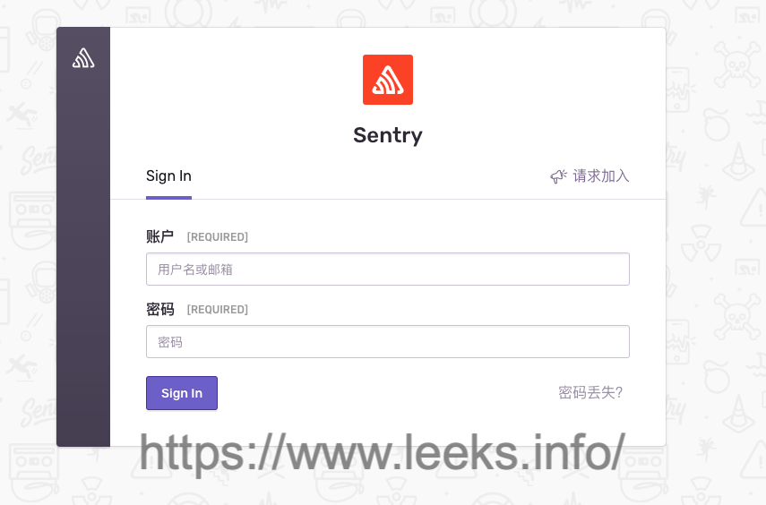

# 自建 Sentry 平台系统

[官方文档](https://develop.sentry.dev/self-hosted/)

## 下载源代码

在官方[GitHub仓库](https://github.com/getsentry/self-hosted/releases)下载最新版本源代码

```shell
$ wget https://github.com/getsentry/self-hosted/archive/refs/tags/22.7.0.tar.gz -P /tmp
```

## 安装

```shell
# 安装 docker
$ apt-get install -y docker.io

# 安装 docker-compose 最新版本，使用版本需要大于 v2.0
# 查看 版本：https://github.com/docker/compose/releases
# https://github.com/docker/compose/releases/download/v2.9.0/docker-compose-linux-x86_64
$ curl -L https://github.com/docker/compose/releases/download/v2.9.0/docker-compose-`uname -s`-`uname -m` -o /usr/bin/docker-compose
$ chmod +x /usr/bin/docker-compose
$ docker-compose -v

$ tar -zxf /tmp/22.7.0.tar.gz -C /opt
$ cd /opt/self-hosted-22.7.0/
$ ./install.sh

# 是否创建账户
Would you like to create a user account now? [Y/n]: Y
Email: *********
Password:/usr/local/lib/python3.8/getpass.py:91: GetPassWarning: Can not control echo on the terminal.
  passwd = fallback_getpass(prompt, stream)
Warning: Password input may be echoed.
 ********
Repeat for confirmation:
Warning: Password input may be echoed.
 ********
Added to organization: sentry
Should this user have Super Admin role? (This grants them all permissions available) [y/N]: y

User created: ken.yu@aelf.io
Creating missing DSNs
Correcting Group.num_comments counter

...

-----------------------------------------------------------------

You're all done! Run the following command to get Sentry running:

  docker-compose up -d

-----------------------------------------------------------------

$ docker-compose up -d

$ docker ps
CONTAINER ID   IMAGE                                    COMMAND                  CREATED          STATUS                     PORTS                                   NAMES
24c7f700460a   nginx:1.22.0-alpine                      "/docker-entrypoint.…"   4 minutes ago    Up 2 minutes               0.0.0.0:9000->80/tcp, :::9000->80/tcp   sentry-self-hosted-nginx-1
b01fcb13f794   getsentry/relay:22.7.0                   "/bin/bash /docker-e…"   4 minutes ago    Up 2 minutes               3000/tcp                                sentry-self-hosted-relay-1
0ba69362b70f   sentry-self-hosted-local                 "/etc/sentry/entrypo…"   4 minutes ago    Up 3 minutes               9000/tcp                                sentry-self-hosted-cron-1
7832bfd0868d   sentry-self-hosted-local                 "/etc/sentry/entrypo…"   4 minutes ago    Up 3 minutes               9000/tcp                                sentry-self-hosted-ingest-consumer-1
5ea373680909   sentry-self-hosted-local                 "/etc/sentry/entrypo…"   4 minutes ago    Up 3 minutes (healthy)     9000/tcp                                sentry-self-hosted-web-1
b14c2902e07e   sentry-self-hosted-local                 "/etc/sentry/entrypo…"   4 minutes ago    Up 3 minutes               9000/tcp                                sentry-self-hosted-worker-1
67ab6b5a8c0e   snuba-cleanup-self-hosted-local          "/entrypoint.sh '*/5…"   4 minutes ago    Up 3 minutes               1218/tcp                                sentry-self-hosted-snuba-cleanup-1
05fb7e5be4a9   snuba-cleanup-self-hosted-local          "/entrypoint.sh '*/5…"   4 minutes ago    Up 3 minutes               1218/tcp                                sentry-self-hosted-snuba-transactions-cleanup-1
efdeecbe05c0   sentry-self-hosted-local                 "/etc/sentry/entrypo…"   4 minutes ago    Up 3 minutes               9000/tcp                                sentry-self-hosted-post-process-forwarder-1
1578f4f0f826   symbolicator-cleanup-self-hosted-local   "/entrypoint.sh '55 …"   4 minutes ago    Up 4 minutes               3021/tcp                                sentry-self-hosted-symbolicator-cleanup-1
7ad0293bcf3f   maxmindinc/geoipupdate:v4.7.1            "/usr/bin/geoipupdat…"   4 minutes ago    Exited (1) 4 minutes ago                                           sentry-self-hosted-geoipupdate-1
0acf2c9c5844   sentry-cleanup-self-hosted-local         "/entrypoint.sh '0 0…"   4 minutes ago    Up 3 minutes               9000/tcp                                sentry-self-hosted-sentry-cleanup-1
40923795fb36   sentry-self-hosted-local                 "/etc/sentry/entrypo…"   4 minutes ago    Up 3 minutes               9000/tcp                                sentry-self-hosted-subscription-consumer-transactions-1
126b27a5374d   sentry-self-hosted-local                 "/etc/sentry/entrypo…"   4 minutes ago    Up 3 minutes               9000/tcp                                sentry-self-hosted-subscription-consumer-events-1
efd107c0d8b9   getsentry/snuba:22.7.0                   "./docker_entrypoint…"   10 minutes ago   Up 3 minutes               1218/tcp                                sentry-self-hosted-snuba-transactions-consumer-1
086468f7e39e   getsentry/snuba:22.7.0                   "./docker_entrypoint…"   10 minutes ago   Up 3 minutes               1218/tcp                                sentry-self-hosted-snuba-outcomes-consumer-1
ee3c74b06276   getsentry/snuba:22.7.0                   "./docker_entrypoint…"   10 minutes ago   Up 3 minutes               1218/tcp                                sentry-self-hosted-snuba-subscription-consumer-events-1
023035a6d188   getsentry/snuba:22.7.0                   "./docker_entrypoint…"   10 minutes ago   Up 3 minutes               1218/tcp                                sentry-self-hosted-snuba-replacer-1
a4642ebfe93f   tianon/exim4                             "docker-entrypoint.s…"   10 minutes ago   Up 4 minutes               25/tcp                                  sentry-self-hosted-smtp-1
73f0f2917102   getsentry/snuba:22.7.0                   "./docker_entrypoint…"   10 minutes ago   Up 3 minutes               1218/tcp                                sentry-self-hosted-snuba-consumer-1
284e7edf93a1   memcached:1.6.9-alpine                   "docker-entrypoint.s…"   10 minutes ago   Up 4 minutes (healthy)     11211/tcp                               sentry-self-hosted-memcached-1
5bab2e42b8f1   getsentry/snuba:22.7.0                   "./docker_entrypoint…"   10 minutes ago   Up 3 minutes               1218/tcp                                sentry-self-hosted-snuba-sessions-consumer-1
ac48c04d648a   getsentry/snuba:22.7.0                   "./docker_entrypoint…"   10 minutes ago   Up 3 minutes               1218/tcp                                sentry-self-hosted-snuba-api-1
8221efcdee62   postgres:9.6                             "/opt/sentry/postgre…"   10 minutes ago   Up 4 minutes (healthy)     5432/tcp                                sentry-self-hosted-postgres-1
3c3e7c68de58   getsentry/snuba:22.7.0                   "./docker_entrypoint…"   10 minutes ago   Up 3 minutes               1218/tcp                                sentry-self-hosted-snuba-subscription-consumer-transactions-1
78e2d551c6c8   getsentry/symbolicator:0.5.1             "/bin/bash /docker-e…"   10 minutes ago   Up 4 minutes               3021/tcp                                sentry-self-hosted-symbolicator-1
033b2502cf19   confluentinc/cp-kafka:5.5.0              "/etc/confluent/dock…"   12 minutes ago   Up 3 minutes (healthy)     9092/tcp                                sentry-self-hosted-kafka-1
1e105fafcee8   confluentinc/cp-zookeeper:5.5.0          "/etc/confluent/dock…"   12 minutes ago   Up 4 minutes (healthy)     2181/tcp, 2888/tcp, 3888/tcp            sentry-self-hosted-zookeeper-1
85b535bb6f19   redis:6.2.4-alpine                       "docker-entrypoint.s…"   12 minutes ago   Up 4 minutes (healthy)     6379/tcp                                sentry-self-hosted-redis-1
1be75549c86e   clickhouse-self-hosted-local             "/entrypoint.sh"         12 minutes ago   Up 4 minutes (healthy)     8123/tcp, 9000/tcp, 9009/tcp            sentry-self-hosted-clickhouse-1
```

## 登录平台

Sentry 默认绑定到端口`9000`。




## 配置

1. `sentry/config.yml`：包含大部分（如果不是全部）要调整的配置选项。这个文件是在安装时从 `sentry/config.example.yml` 生成的。文件本身将最常见的配置选项记录为代码注释。此文件中的一些流行设置包括：
   - `system.url-prefix`：安装后我们会提示您在欢迎屏幕上进行设置。
   - `mail.*`：提供了一个基本的 SMTP 服务器。
   - GitHub、Slack 等的集成。
2. `sentry/sentry.conf.py`：包含更高级的配置。这个文件是在安装期间从 `sentry/sentry.conf.example.py` 生成的。
3. `sentry/enhance-image.sh`：要安装插件及其依赖项或对 Sentry 基础映像进行其他修改，请将 `sentry/enhance-image.example.sh` 复制到 `sentry/enhance-image.sh` 并在其中添加必要的步骤。例如，可以使用 apt-get 安装依赖项并使用 pip 安装插件。对 `sentry/enhance-image.sh` 进行修改后，再次运行 `./install.sh` 应用配置。
4. **环境变量**：可用键在 .env 中定义。如果需要覆盖其中任何一个，请使用一些与系统相关的方法来设置环境变量。为避免 Git 更改，只需创建一个名为 `.env.custom` 的文件并在其中插入与系统相关的环境变量。为了使用它，请使用 `docker-compose --env-file /path/to/.env.custom up -d`。
5. **Geolocation**：使用自定义配置文件以符合底层技术。

可以在[开发人员文档](https://develop.sentry.dev/config/)的配置部分找到有关配置 Sentry 的更多信息。

更改配置后，需要通过运行 `docker-compose restart web worker cron sentry-cleanup` （或仅 `docker-compose restart` 重新启动所有内容）来重新启动所有 Sentry 服务。

## 升级版本

查看[最新版本](https://github.com/getsentry/self-hosted/releases/latest)

关于版本更新请查看[官方文档](https://develop.sentry.dev/self-hosted/releases/)

## 备份和恢复

[官方文档](https://develop.sentry.dev/self-hosted/backup/)

