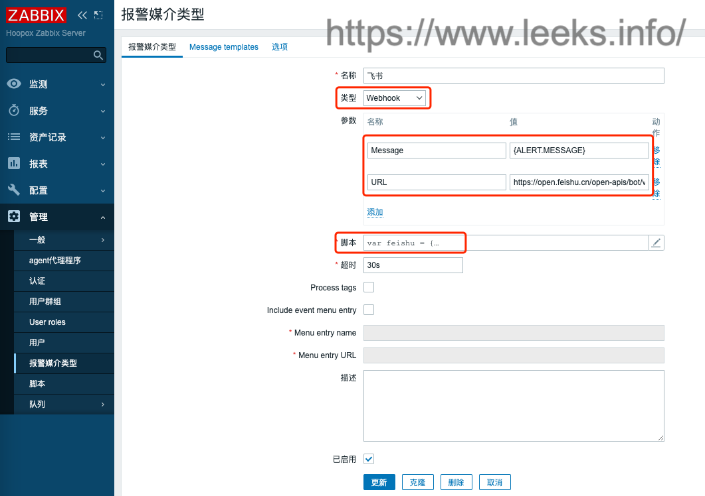
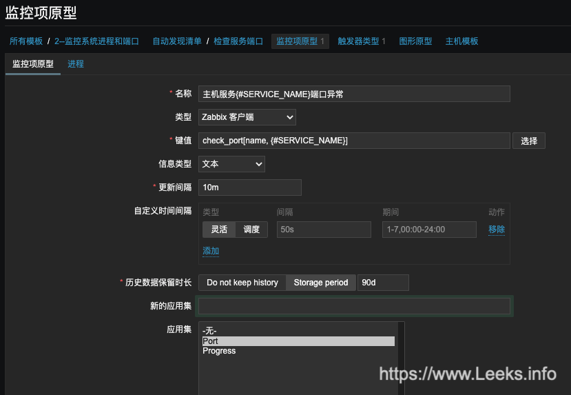
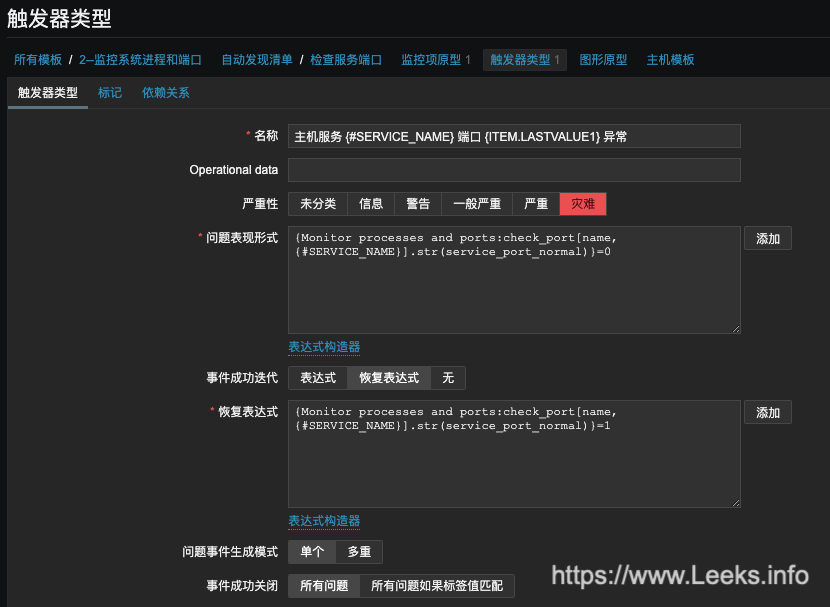
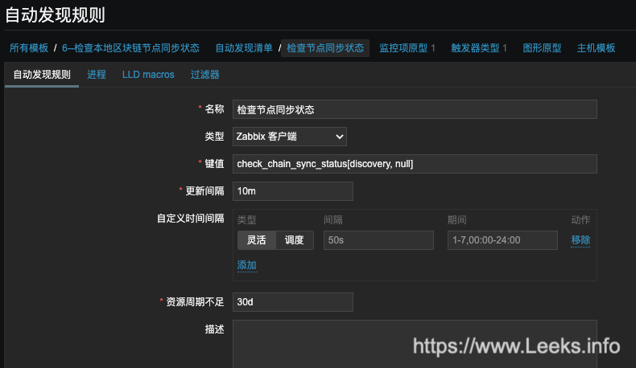
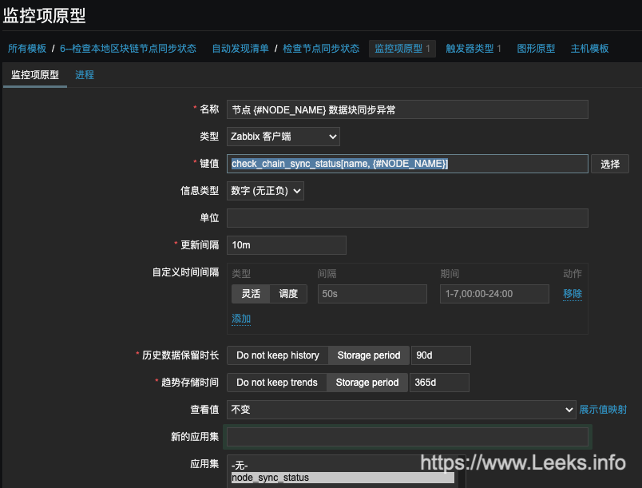

# 配置参数优化

## Zabbix Server 的常用参数

| 参数                    | 必填 | 范围       | 默认值 | 描述                                                         |
| :---------------------- | ---- | ---------- | ------ | ------------------------------------------------------------ |
| CacheSize               | no   | 128K-8G    | 8M     | 缓存大小, 单位字节.<br/>用于存储主机、监控项、触发器数据的共享内存大小.<br/>服务器分配有4G<br/>设置为：CacheSize=256M |
| CacheUpdateFrequency    | no   | 1-3600     | 60     | Zabbix 缓存更新频率, 单位秒.60秒感觉太快了<br/>设置为：CacheUpdateFrequency=180 |
| DebugLevel              | no   | 0-5        | 3      | 指定调试等级:<br/>0 - Zabxxi进程起停的基本信息<br/>1 - 重要信息<br/>2 - 错误信息<br/>3 - 警告信息<br/>4 - 调试 (产生大量信息)<br/>5 - 扩展调试 (产生更多信息) |
| HistoryCacheSize        | no   | 128K-2G    | 16M    | 历史缓存数据大小, 单位字节.<br/>存储历史数据.<br/>设置为：HistoryCacheSize=64M |
| HistoryIndexCacheSize   | no   | 128K-2G    | 4M     | 历史索引缓存大小, 单位字节.<br/>用于索引历史缓存中历史数据的共享内存大小.<br/>缓存一个item大概需要索引的大小为100字节.item代表一个监控项，按照100000个监控项来算：100000*100/1024/1024=9.6M<br/>设置为：HistoryIndexCacheSize=10M |
| HousekeepingFrequency   | no   | 0-24       | 1      | Zabbix 执行 housekeeping 的频率 (单位小时).<br/>从数据库中删除过期的信息.<br/>注意: 为了防止 housekeeper 过载 (例如, 当历史和趋势周期大大减小时), 对于每一个item，不会在一个housek周期内删除超过4倍HousekeepingFrequency 的过时信息. 因此, 如果 HousekeepingFrequency 是 1, 一个周期内不会删除超过4小时的过时信息 (starting from the oldest entry) . |
| StartPollersUnreachable | no   | 0-1000     | 1      | 不可达主机 (包括IPMI 和 Java)的轮询器实例数量。<br/>设置为：StartPollersUnreachable=20 占总数20%足够 |
| StartPollers            | no   | 0-1000     | 5      | 轮询器实例数量。根据具体情况设置大小<br/>设置为：StartPollers=30 |
| StartDiscoverers        | no   | 0-250      | 1      | 自动发现子进程实例个数。<br/>设置为：StartDiscoverers=5      |
| StartTrappers           | no   | 0-1000     | 5      | trappers进程实例数量。<br/>Trappers接受来自Zabbix发送者、主动agents和主动proxies的传入连接。<br/>至少要运行一个trapper进程来显示前端的服务器可用性和视图队列。<br/>设置为：StartTrappers=15 |
| StartVMwareCollectors   | no   | 0-250      | 0      | vmware 采集器的子进程实例个数,如果有虚拟机的话，记得开启。   |
| Timeout                 | no   | 1-30       | 3      | agent, SNMP 设备或外部检查的超时时长(单位秒)。<br/>设置为：Timeout=6 |
| TrendCacheSize          | no   | 128K-2G    | 4M     | 趋势缓存的大小，单位字节。<br/>用于存储趋势数据的共享内存大小。<br/>设置为：128M |
| ValueCacheSize          | no   | 0,128K-64G | 8M     | 历史数据缓存大小, 单位bytes.<br/>缓存item历史数据请求的共享内存大小.<br/>0即禁止缓存 (不建议).<br/>当缓存大小超过共享内存时，每5分钟会向服务器日志写入一条警告信息.<br/>设置为：ValueCacheSize=128M |


# Zabbix Webhook 集成飞书机器人

管理 --> 报警媒介类型 --> 创建媒介类型

类型选择`Webhook`

参数：

- Message：`{ALERT.MESSAGE}`

- URL：飞书机器人地址

- 脚本：

  ```javascript
  var feishu = {
      params: {},
      proxy: null,
      setParams: function (params) {
          if (typeof params !== 'object') {
              return;
          }
          feishu.params = params; 
      },
      request: function () {
          var data = {
            msg_type: "text",
            content: {
              // text: "## 通知:\n " + feishu.params.Message,
              text: feishu.params.Message,
            },
          },
          response,
          url = feishu.params.URL,
          request = new HttpRequest();
          request.addHeader('Content-Type: application/json');
          if (typeof feishu.HTTPProxy !== 'undefined' && feishu.HTTPProxy !== '') {
              request.setProxy(feishu.HTTPProxy);
          }
          if (typeof data !== 'undefined') {
              data = JSON.stringify(data);
          }
          Zabbix.Log(4, "[ feishu Webhook ] message is: " + data);
          response = request.post(url, data);
          Zabbix.log(4, '[ feishu Webhook ] Received response with status code ' +
              request.getStatus() + '\n' + response);
          if (response !== null) {
              try {
                  response = JSON.parse(response);
              }
              catch (error) {
                  Zabbix.log(4, '[ feishu Webhook ] Failed to parse response received from feishu');
                  response = null;
              }
          }
          if (request.getStatus() !== 200 || response.StatusCode !== 0) {
              var message = 'Request failed with status code '+request.getStatus();
              if (response !== null && typeof response.errmsg !== 'undefined') {
                  message += ': '+ JSON.stringify(response.errmsg) ;
              }
              throw message + '. Check debug log for more information.';
          }
          return response;
      },
  };
  try {
      var params = JSON.parse(value);
  
      if (typeof params.URL !== 'undefined' 
           && typeof params.Message !== 'undefined') {
             Zabbix.log(4, '[ feishu Webhook ] webhookURL "' + params.URL )+'"';
          } 
          else {
            throw 'Missing parameter. URL, message, to parameter is required'
          }
      if (params.HTTPProxy) {
          feishu.proxy = params.HTTPProxy;
      } 
      feishu.setParams(params);
      feishu.request();
      return 'OK';
  }catch (error) {
      Zabbix.log(3, '[ feishu Webhook ] ERROR: ' + error);
      throw 'Sending failed: ' + error;
  }
  ```

  




# Zabbix 自动注册服务示例

## 配置文件

`vim check_port.yaml`

```yaml
# ServicesPort 中 Key 值表示服务名称，value 值表示端口
ServicesPort:
  nginx: ['19136', '19133', '19139', '38545', '36666', '38645', '31080']
  bsc: ['30311', '8645', '8646']
  ethereum: ['30303', '6666', '6667']
  hecochain: ['33333', '8545', '18546']
  blockbook_hecochain: ['9039', '9139']
  blockbook_ethereum: ['9036', '9136']
  blockbook_bsc: ['9033', '9133']
```

## 脚本文件

`vim check_port.py`

```python
# -*- coding=utf-8
"""
检查服务端口是否正常
"""

import subprocess
import os
import yaml
import sys


def load_config():
    path = os.path.dirname(os.path.abspath(__file__))
    # yaml_file = os.path.join(path, "check_port.yaml")
    yaml_file = os.path.join(path, "/opt/zabbix-agent/var/check_port.yaml")
    file = open(yaml_file, 'r', encoding='utf-8')
    data = yaml.load(file.read(), Loader=yaml.Loader)
    file.close()
    return data


def init_service_port_conf():
    config = load_config()
    return config['ServicesPort']


def query_system_port():
    """
    查询系统端口
    :return:
    """
    command = "sudo netstat -ltn | awk '{if (NR > 2) {print $4}}' | awk -F ':' '{print $NF}'"
    # command = "netstat -ltn | awk '{if (NR > 2) {print $4}}' | awk -F ':' '{print $NF}'"
    res_str = subprocess.getoutput(command)
    res_list = res_str.split('\n')
    return res_list


def discovery(service_list):
    """
    定义自动发现规则
    :return:
    """
    print("{")
    print('\t'"\"data\":[")
    i = 0
    while i < len(service_list):
        if i < len(service_list) - 1:
            print("\t\t{\"{#SERVICE_NAME}\":\"%s\"}," % service_list[i])
        else:
            print("\t\t{\"{#SERVICE_NAME}\":\"%s\"}" % service_list[i])
        i += 1
    print("\t]")
    print("}")


if __name__ == '__main__':
    try:
        data_type = sys.argv[1]
        service_name = sys.argv[2]

        conf = init_service_port_conf()
        system_port = query_system_port()

        if data_type == "discovery":
            key_list = []
            for key in conf.keys():
                key_list.append(key)
            discovery(key_list)

        elif data_type == "name":
            name_port_list = conf[service_name]
            for port in name_port_list:
                if port in system_port:
                    print("service_port_normal")
                else:
                    print(port)
                    break
    except IndexError as e:
        print(e)
        exit()
    except FileNotFoundError as e:
        print(e)
        exit()
```

## Zabbix 配置修改

`vim check_port.conf`

```shell
UserParameter=check_port[*],/opt/python38/bin/python3.8 /opt/zabbix-agent-conf/script/check_port.py $1 $2
```

## 创建自动发信规则

- **名称**: 检查服务端口
- **类型**: Zabbix 客户端
- **键值**: check_port[discovery, null]
- **更新间隔**: 10m

如图：


## 创建监控项原型

- **名称**: 主机服务{#SERVICE_NAME}端口异常
- **类型**: Zabbix 客户端
- **键值**: check_port[name, {#SERVICE_NAME}]
- **信息类型**: 文本
- **更新间隔**: 10m

如图：



## 创建触发器类型

- **名称**: 主机服务 {#SERVICE_NAME} 端口 {ITEM.LASTVALUE1} 异常
- **问题表现形式**: `{Monitor processes and ports:check_port[name, {#SERVICE_NAME}].str(service_port_normal)}=0`
- **恢复表达式**: `{Monitor processes and ports:check_port[name, {#SERVICE_NAME}].str(service_port_normal)}=1`

如图：



# 检查节点同步状态

## 配置文件

`vim check_chain_sync_status.yaml`

```yaml
BinanceSmartChain:
  scan_url: 'https://api.bscscan.com/api'
  header:
    User-Agent: 'Mozilla/5.0 (Windows NT 6.1; Trident/7.0; rv:11.0) like Gecko'
  params:
    module: proxy
    action: eth_blockNumber
    apikey: xxxxx
#  local_node_url: 'http://127.0.0.1:8645'
  local_node_url: 'http://81.70.221.253:8645'
  headers:
    Content-Type: 'application/json;charset=utf-8'

Ethereum:
  scan_url: 'https://api.etherscan.io/api'
  header:
    User-Agent: 'Mozilla/5.0 (Windows NT 6.1; Trident/7.0; rv:11.0) like Gecko'
  params:
    module: proxy
    action: eth_blockNumber
    apikey: xxxxx
#  local_node_url: 'http://127.0.0.1:6666'
  local_node_url: 'http://81.70.221.253:6666'
  headers:
    Content-Type: 'application/json;charset=utf-8'

HuobiECOChain:
  scan_url: 'https://api.hecoinfo.com/api'
  header:
    User-Agent: 'Mozilla/5.0 (Windows NT 6.1; Trident/7.0; rv:11.0) like Gecko'
  params:
    module: proxy
    action: eth_blockNumber
    apikey: xxxxx
#  local_node_url: 'http://127.0.0.1:8545'
  local_node_url: 'http://81.70.221.253:8545'
  headers:
    Content-Type: 'application/json;charset=utf-8'

```

## 脚本文件

`vim check_chain_sync_status.py`

```python
# -*- coding=utf-8
"""
检查本地节点数据块是否同步正常
"""

import requests
import json
import yaml
import os
import sys


def load_config():
    path = os.path.dirname(os.path.abspath(__file__))
    yaml_file = os.path.join(path, "check_chain_sync_status.yaml")
    # yaml_file = os.path.join(path, "/opt/zabbix-agent/var/check_chain_sync_status.yaml")
    file = open(yaml_file, 'r', encoding='utf-8')
    data = yaml.load(file.read(), Loader=yaml.Loader)
    file.close()
    return data


def init_service_port_conf():
    config = load_config()
    return config


def discovery(node_list):
    """
    定义自动发现规则
    :return:
    """
    print("{")
    print('\t'"\"data\":[")
    i = 0
    while i < len(node_list):
        if i < len(node_list) - 1:
            print("\t\t{\"{#NODE_NAME}\":\"%s\"}," % node_list[i])
        else:
            print("\t\t{\"{#NODE_NAME}\":\"%s\"}" % node_list[i])
        i += 1
    print("\t]")
    print("}")


def scan_data(config_info):
    """
    获取区块链浏览器最新块信息
    :return:
    """
    data_str = requests.get(url=config_info['scan_url'], params=config_info['params'],
                            headers=config_info['header']).text
    data_json = json.loads(data_str)
    jsonrpc = data_json['jsonrpc']
    node_id = data_json['id']
    result = data_json['result']
    base16 = result[2:]  # 十六进制区块数
    base10 = int(base16, 16)  # 转换为十进制区块数
    return [jsonrpc, node_id, base10]


def local_data(scan, config_info):
    params = {"jsonrpc": scan[0], "method": "eth_blockNumber", "params": [], "id": scan[1]}
    data_str = requests.post(config_info['local_node_url'], data=json.dumps(params),
                             headers=config_info['headers']).text
    result = json.loads(data_str)['result']
    base16 = result[2:]  # 十六进制区块数
    base10 = int(base16, 16)  # 转换为十进制区块数
    return base10


if __name__ == '__main__':
    try:
        data_type = sys.argv[1]
        node_name = sys.argv[2]

        conf = init_service_port_conf()

        if data_type == "discovery":
            key_list = []
            for key in conf.keys():
                key_list.append(key)
            discovery(key_list)

        elif data_type == "name":
            scan = scan_data(conf[node_name])
            local_num = local_data(scan, conf[node_name])  # 本地节点区块数
            scan_num = scan[2]  # 区块浏览器区块数
            diff = scan_num - local_num
            print(diff)

    except IndexError as e:
        # print(e)
        exit()
    except FileNotFoundError as e:
        # print(e)
        exit()
    except Exception as e:
        # print(e)
        exit()

```

## Zabbix 增加配置

`vim check_chain_sync_status.conf`

```shell
UserParameter=check_chain_sync_status[*],/opt/python38/bin/python3.8 /opt/zabbix-agent-conf/script/check_chain_sync_status.py $1 $2
```

## 创建自动发信规则

- **名称**: 检查节点同步状态
- **类型**: Zabbix 客户端
- **键值**: check_chain_sync_status[discovery, null]
- **更新间隔**: 10m

如图：



## 创建监控项原型

- **名称**: 节点 {#NODE_NAME} 数据块同步异常
- **类型**: Zabbix 客户端
- **键值**: check_chain_sync_status[name, {#NODE_NAME}]
- **信息类型**: 数字
- **更新间隔**: 10m

如图：



## 创建触发器类型

- **名称**: 节点 {#NODE_NAME} 数据同步异常，差值 {ITEM.LASTVALUE1}
- **问题表现形式**: `{check_chain_sync_status:check_chain_sync_status[name, {#NODE_NAME}].last()}>=50`
- **恢复表达式**: `{check_chain_sync_status:check_chain_sync_status[name, {#NODE_NAME}].last()}<50`

如图：


## 独立监控脚本（无需zabbix，钉钉告警方式）

`check_chain_sync_status.py`

```python
import requests
import json
import hmac
import time
import urllib
import base64
import hashlib
import socket

bsc_conf = {
    "scan_url": "https://api.bscscan.com/api",
    "header": {'User-Agent': 'Mozilla/5.0 (Windows NT 6.1; Trident/7.0; rv:11.0) like Gecko'},
    "params": {"module": "proxy", "action": "eth_blockNumber", "apikey": "xxxxx"},
    "local_node_url": "http://127.0.0.1:8645",
    # "local_node_url": "http://49.233.100.230:8645",
    "headers": {'Content-Type': 'application/json;charset=utf-8'}
}

eth_conf = {
    "scan_url": "https://api.etherscan.io/api",
    "header": {'User-Agent': 'Mozilla/5.0 (Windows NT 6.1; Trident/7.0; rv:11.0) like Gecko'},
    "params": {"module": "proxy", "action": "eth_blockNumber", "apikey": "xxxxx"},
    "local_node_url": "http://127.0.0.1:6666",
    # "local_node_url": "http://49.233.100.230:6666",
    "headers": {'Content-Type': 'application/json;charset=utf-8'}
}

heco_conf = {
    "scan_url": "https://api.hecoinfo.com/api",
    "header": {'User-Agent': 'Mozilla/5.0 (Windows NT 6.1; Trident/7.0; rv:11.0) like Gecko'},
    "params": {"module": "proxy", "action": "eth_blockNumber", "apikey": "xxxxx"},
    "local_node_url": "http://127.0.0.1:8545",
    # "local_node_url": "http://49.233.100.230:8545",
    "headers": {'Content-Type': 'application/json;charset=utf-8'}
}

ding_conf = {
    "url": "https://oapi.dingtalk.com/robot/send",
    "access_token": "*********",
    "auth": "*********",
    "headers": {'Content-Type': 'application/json;charset=utf-8'}
}


def auth():
    timestamp = round(time.time() * 1000)
    secret_enc = bytes(ding_conf['auth'].encode('utf-8'))
    string_to_sign = '{}\n{}'.format(timestamp, ding_conf['auth'])  # 把 timestamp+"\n"+密钥 当做签名字符串 string_to_sign
    string_to_sign_enc = bytes(string_to_sign.encode('utf-8'))
    hmac_code = hmac.new(secret_enc, string_to_sign_enc,
                         digestmod=hashlib.sha256).digest()  # 使用HmacSHA256算法计算签名，得到 hmac_code
    hmac_code_base64 = base64.b64encode(hmac_code)  # 将hmac_code进行Base64 encode
    sign = urllib.parse.quote(hmac_code_base64)  # 进行urlEncode，得到最终的签名sign
    auth_list = [timestamp, sign]
    return auth_list


def send_msg(url, message):
    r = requests.post(url, data=json.dumps(message), headers=ding_conf['headers'])
    return r.text


def msg(name, types, info, hostname):
    t = time.strftime('%Y-%m-%d %H:%M:%S', time.localtime(time.time()))
    content = f'报警时间: {t}\n主机信息:{hostname}\n链名称: {name}\n报警类型: {types}\n其他信息: {info}'
    data_info = {
        "msgtype": "text",
        "text": {
            "content": content
        },
        "at": {
            "atMobiles": [],
            "isAtAll": "False"
        }
    }
    auth_list = auth()
    url = f"{ding_conf['url']}?access_token={ding_conf['access_token']}&timestamp={str(auth_list[0])}&sign={str(auth_list[1])}"
    send_msg(url, data_info)


def scan_data(conf):
    """
    获取区块链浏览器最新块信息
    :return:
    """
    data_str = requests.get(url=conf['scan_url'], params=conf['params'], headers=conf['header']).text
    data_json = json.loads(data_str)
    jsonrpc = data_json['jsonrpc']
    node_id = data_json['id']
    result = data_json['result']
    base16 = result[2:]  # 十六进制区块数
    base10 = int(base16, 16)  # 转换为十进制区块数
    return [jsonrpc, node_id, base10]


def local_node_data(scan, conf):
    params = {"jsonrpc": scan[0], "method": "eth_blockNumber", "params": [], "id": scan[1]}
    data_str = requests.post(conf['local_node_url'], data=json.dumps(params), headers=conf['headers']).text
    result = json.loads(data_str)['result']
    base16 = result[2:]  # 十六进制区块数
    base10 = int(base16, 16)  # 转换为十进制区块数
    return base10


def main():
    node_conf = {
        "HecoChain": heco_conf,
        "Ethereum": eth_conf,
        "BinanceSmartChain": bsc_conf
    }

    for name, conf in node_conf.items():
        try:
            scan = scan_data(conf)
            node_num = local_node_data(scan, conf)  # 本地节点区块数
            scan_num = scan[2]  # 区块浏览器区块数
            if scan_num - node_num >= 5:
                types = "本地节点数据同步异常"
                info = f"区块浏览器区块数:{scan_num},本地节点区块数:{node_num}"
                hostname = socket.gethostname()  # 获取主机名
                msg(name, types, info, hostname)
        except Exception as e:
            print(e)
            continue


if __name__ == '__main__':
    main()
```

