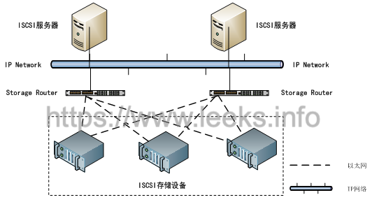

# iscsi 构建 RAC 共享存储

## iSCSI简介

> ​         iSCSI（internet SCSI）技术由IBM公司研究开发，是一个供硬件设备使用的、可以在IP协议的上层运行的SCSI指令集，这种指令集合可以实现在IP网络上运行SCSI协议，使其能够在诸如高速千兆以太网上进行路由选择。iSCSI技术是一种新储存技术，该技术是将现有SCSI接口与以太网络(Ethernet)技术结合，使服务器可与使用IP网络的储存装置互相交换资料。
>
> ​         iSCSI是一种基于TCP/IP 的协议，用来建立和管理IP存储设备、主机和客户机等之间的相互连接，并创建存储区域网络（SAN）。SAN使得SCSI 协议应用于高速数据传输网络成为可能，这种传输以数据块级别（block-level）在多个数据存储网络间进行。SCSI结构基于C/S模式，其通常应用环境是：设备互相靠近，并且这些设备由SCSI 总线连接。
>
> ​        iSCSI 的主要功能是在TCP/IP 网络上的主机系统（启动器 initiator）和存储设备（目标器完整的iSCSI系统的拓扑结构如下：



Centos下配置iscsi 共享存储

> ​        ISCSI存储分为服务端(server，提供target存储给客户端挂载使用)和客户段(client，使用服务端提供的target来存放文件等)，Centos6.8下对应的agent为scsi-target-utils(服务端安装)和iscsi-initiator(客户端安装)，以下的安装，全部是用虚拟机安装的。
>
> ​        我们在搭建RAC的时候会用到iscsi来构建共享存储，下面就介绍利用iscsi 怎样构建RAC的共享存储。


## 关闭防火墙

```shell
[root@ol7-122-rac1 ~]# systemctl stop firewalld
[root@ol7-122-rac1 ~]# systemctl disable firewalld
#防火墙如果沒有关掉,必须打开 iSCSI 所使用的 Port
[root@ol7-122-rac1 ~]# firewall-cmd --permanent --add-port=3260/tcp
[root@ol7-122-rac1 ~]# firewall-cmd --reload
```

## 修改 /etc/selinux/config 配置

```shell
[root@ehs-rac-01 ~]# sed -i 's/^SELINUX=.*/SELINUX=disabled/' /etc/selinux/config
[root@ehs-rac-01 ~]# setenforce 0
[root@ehs-rac-01 ~]# cat /etc/selinux/config | grep -i SELINUX= | grep -v "^#"
SELINUX=disabled
```

## 环境信息

```tex
server：10.0.7.135
rac1：10.0.7.110
rac2：10.0.7.120
```

这里我们选 server 为 iscsi 服务器，然后把其上的磁盘共享给 rac1 和 rac2 使用；

**注**：这里我们可以选用这个2个节点任何一台或者其他机器作为 iscsi 服务器；

首先我们在rac1上添加需要共享的磁盘，也就是rac的磁盘组。这里我已经在 server 上分配了6块盘，说明如下：

```tex
Ocrvotedisk 3块 4G
Data 1块 40G 
FRA_ARC 1 块 20G
```

**注**：Data数据盘必须大于或等于 40G

## server 端安装 iSCSI

首先安装管理工具

```shell
[root@ehs-server-01 ~]# yum install -y targetcli
```

启动 iSCSI 服务

```shell
[root@ehs-server-01 ~]# systemctl start target.service
[root@ehs-server-01 ~]# systemctl enable target.service
Created symlink from /etc/systemd/system/multi-user.target.wants/target.service to /usr/lib/systemd/system/target.service.
```

在 server 节点上查看

```shell
[root@ehs-server-01 ~]# fdisk -l
Disk /dev/vda: 42.9 GB, 42949672960 bytes, 83886080 sectors
Units = sectors of 1 * 512 = 512 bytes
Sector size (logical/physical): 512 bytes / 512 bytes
I/O size (minimum/optimal): 512 bytes / 512 bytes
Disk label type: dos
Disk identifier: 0x000ae6a1
   Device Boot      Start         End      Blocks   Id  System
/dev/vda1   *        2048     2099199     1048576   83  Linux
/dev/vda2         2099200    83886079    40893440   8e  Linux LVM
Disk /dev/mapper/rhel-root: 37.6 GB, 37576769536 bytes, 73392128 sectors
Units = sectors of 1 * 512 = 512 bytes
Sector size (logical/physical): 512 bytes / 512 bytes
I/O size (minimum/optimal): 512 bytes / 512 bytes
Disk /dev/mapper/rhel-swap: 4294 MB, 4294967296 bytes, 8388608 sectors
Units = sectors of 1 * 512 = 512 bytes
Sector size (logical/physical): 512 bytes / 512 bytes
I/O size (minimum/optimal): 512 bytes / 512 bytes
Disk /dev/vdb: 4294 MB, 4294967296 bytes, 8388608 sectors
Units = sectors of 1 * 512 = 512 bytes
Sector size (logical/physical): 512 bytes / 512 bytes
I/O size (minimum/optimal): 512 bytes / 512 bytes
Disk /dev/vdc: 4294 MB, 4294967296 bytes, 8388608 sectors
Units = sectors of 1 * 512 = 512 bytes
Sector size (logical/physical): 512 bytes / 512 bytes
I/O size (minimum/optimal): 512 bytes / 512 bytes
Disk /dev/vdd: 4294 MB, 4294967296 bytes, 8388608 sectors
Units = sectors of 1 * 512 = 512 bytes
Sector size (logical/physical): 512 bytes / 512 bytes
I/O size (minimum/optimal): 512 bytes / 512 bytes
Disk /dev/vde: 21.5 GB, 21474836480 bytes, 41943040 sectors
Units = sectors of 1 * 512 = 512 bytes
Sector size (logical/physical): 512 bytes / 512 bytes
I/O size (minimum/optimal): 512 bytes / 512 bytes
Disk /dev/vdf: 21.5 GB, 21474836480 bytes, 41943040 sectors
Units = sectors of 1 * 512 = 512 bytes
Sector size (logical/physical): 512 bytes / 512 bytes
I/O size (minimum/optimal): 512 bytes / 512 bytes
```

以上说明磁盘已经在 server 节点上挂载，下面就利用 iscsi 共享给 rac1 和 rac2 节点


## 配置 iscsi server服务端

- 安装 scsi-target-utils 已用 yum 安装完成，不需要操作

  ```shell
  [root@ehs-server-01 ~]# rpm -q epel-release
  package epel-release is not installed
  [root@ehs-server-01 ~]# yum install -y epel-release
  [root@ehs-server-01 ~]# rpm -q epel-release
  epel-release-7-11.noarch
  [root@ehs-server-01 ~]# yum --enablerepo=epel -y install scsi-target-utils libxslt
  ```

- 配置 targets.conf ，在文件末尾添加如下内容

  ```shell
  [root@ehs-server-01 ~]# cat >> /etc/tgt/targets.conf << EOF
  <target iqn.2019-09.com.oracle:rac>
      backing-store /dev/vdb
      backing-store /dev/vdc
      backing-store /dev/vdd
      backing-store /dev/vde
      backing-store /dev/vdf
      initiator-address 10.0.7.0/24
      write-cache off
  </target>
  EOF
  ```

  iqn  名字可任意

  initiator-address   限定 允许访问的客户端地址段或具体IP

  write-cache off  是否开启或关闭快取

  **注**：里面添加的就是想要共享给 rac1 和 rac2 的磁盘

- 启动 tgtd

  ```shell
  [root@ehs-server-01 ~]# /bin/systemctl restart tgtd.service
  [root@ehs-server-01 ~]# systemctl restart target.service
  [root@ehs-server-01 ~]# systemctl enable tgtd
  Created symlink from /etc/systemd/system/multi-user.target.wants/tgtd.service to /usr/lib/systemd/system/tgtd.service.
  [root@ehs-server-01 ~]# tgtadm --lld iscsi --mode target --op show
  Target 1: iqn.2019-09.com.oracle:rac
      System information:
          Driver: iscsi
          State: ready
      I_T nexus information:
      LUN information:
          LUN: 0
              Type: controller
              SCSI ID: IET     00010000
              SCSI SN: beaf10
              Size: 0 MB, Block size: 1
              Online: Yes
              Removable media: No
              Prevent removal: No
              Readonly: No
              SWP: No
              Thin-provisioning: No
              Backing store type: null
              Backing store path: None
              Backing store flags: 
          LUN: 1
              Type: disk
              SCSI ID: IET     00010001
              SCSI SN: beaf11
              Size: 4295 MB, Block size: 512
              Online: Yes
              Removable media: No
              Prevent removal: No
              Readonly: No
              SWP: No
              Thin-provisioning: No
              Backing store type: rdwr
              Backing store path: /dev/vdb
              Backing store flags: 
          LUN: 2
              Type: disk
              SCSI ID: IET     00010002
              SCSI SN: beaf12
              Size: 4295 MB, Block size: 512
              Online: Yes
              Removable media: No
              Prevent removal: No
              Readonly: No
              SWP: No
              Thin-provisioning: No
              Backing store type: rdwr
              Backing store path: /dev/vdc
              Backing store flags: 
          LUN: 3
              Type: disk
              SCSI ID: IET     00010003
              SCSI SN: beaf13
              Size: 4295 MB, Block size: 512
              Online: Yes
              Removable media: No
              Prevent removal: No
              Readonly: No
              SWP: No
              Thin-provisioning: No
              Backing store type: rdwr
              Backing store path: /dev/vdd
              Backing store flags: 
          LUN: 4
              Type: disk
              SCSI ID: IET     00010004
              SCSI SN: beaf14
              Size: 21475 MB, Block size: 512
              Online: Yes
              Removable media: No
              Prevent removal: No
              Readonly: No
              SWP: No
              Thin-provisioning: No
              Backing store type: rdwr
              Backing store path: /dev/vde
              Backing store flags: 
          LUN: 5
              Type: disk
              SCSI ID: IET     00010005
              SCSI SN: beaf15
              Size: 21475 MB, Block size: 512
              Online: Yes
              Removable media: No
              Prevent removal: No
              Readonly: No
              SWP: No
              Thin-provisioning: No
              Backing store type: rdwr
              Backing store path: /dev/vdf
              Backing store flags: 
      Account information:
      ACL information:
          10.0.7.0/24
  ```

  

## 配置 iscsi 客户端（所有rac节点）

1. 安装 iscsi-initiator-utils,安裝 iSCSI Client 软件

   ```shell
   [root@ehs-rac-01 ~]# yum install -y iscsi-initiator-utils
   [root@ehs-rac-01 ~]# rpm -qa | grep iscsi
   iscsi-initiator-utils-iscsiuio-6.2.0.874-10.el7.x86_64
   libiscsi-1.9.0-7.el7.x86_64
   iscsi-initiator-utils-6.2.0.874-10.el7.x86_64
   ##重启客户端
   [root@ehs-rac-01 ~]# systemctl restart iscsid.service
   ```

2. 配置 initiatorname.iscsi

   ```shell
   [root@ehs-rac-01 ~]# vim /etc/iscsi/initiatorname.iscsi
   InitiatorName=iqn.2019-09.com.oracle:rac
   ```

   **注**：InitiatorName 值就是 server 上 /etc/tgt/targets.conf 里配置的值

3. 启动iscsi

   ```shell
   [root@ehs-rac-01 ~]# systemctl restart iscsi
   [root@ehs-rac-01 ~]# systemctl enable iscsi.service
   ```

   **注**：如果我安装操作系统时已经安装了 iscsi-initiator-utils 软件包所以不用再另外安装，直接配置就行。

 

## 共享存储（所有rac节点）

1. 通过3260端口查看开放了哪些共享存储

   ```shell
   [root@ehs-rac-01 ~]# iscsiadm -m discovery -tsendtargets -p 10.0.7.110:3260
   10.0.7.110:3260,1 iqn.2019-09.com.oracle:rac
   [root@ehs-rac-01 ~]# iscsiadm -m node -T discovery -T iqn.2019-09.com.oracle:rac -p 10.0.7.110:3260
   # BEGIN RECORD 6.2.0.874-10
   node.name = iqn.2019-09.com.oracle:rac
   node.tpgt = 1
   node.startup = automatic
   node.leading_login = No
   iface.hwaddress = <empty>
   iface.ipaddress = <empty>
   iface.iscsi_ifacename = default
   ...
   ```

2. 登录共享存储

   ```shell
   [root@ehs-rac-01 ~]# iscsiadm -m node -T iqn.2019-09.com.oracle:rac -p 10.0.7.110:3260 -l
   Logging in to [iface: default, target: iqn.2019-09.com.oracle:rac, portal: 10.0.7.110,3260] (multiple)
   Login to [iface: default, target: iqn.2019-09.com.oracle:rac, portal: 10.0.7.110,3260] successful.
   ```

3. 探测下共享存储的目录

   ```shell
   [root@ehs-rac-01 ~]# partprobe
   [root@ehs-rac-01 ~]# fdisk -l
   Disk /dev/vda: 42.9 GB, 42949672960 bytes, 83886080 sectors
   Units = sectors of 1 * 512 = 512 bytes
   Sector size (logical/physical): 512 bytes / 512 bytes
   I/O size (minimum/optimal): 512 bytes / 512 bytes
   Disk label type: dos
   Disk identifier: 0x000ae6a1
      Device Boot      Start         End      Blocks   Id  System
   /dev/vda1   *        2048     2099199     1048576   83  Linux
   /dev/vda2         2099200    83886079    40893440   8e  Linux LVM
   Disk /dev/mapper/rhel-root: 37.6 GB, 37576769536 bytes, 73392128 sectors
   Units = sectors of 1 * 512 = 512 bytes
   Sector size (logical/physical): 512 bytes / 512 bytes
   I/O size (minimum/optimal): 512 bytes / 512 bytes
   Disk /dev/mapper/rhel-swap: 4294 MB, 4294967296 bytes, 8388608 sectors
   Units = sectors of 1 * 512 = 512 bytes
   Sector size (logical/physical): 512 bytes / 512 bytes
   I/O size (minimum/optimal): 512 bytes / 512 bytes
   Disk /dev/sdb: 4294 MB, 4294967296 bytes, 8388608 sectors
   Units = sectors of 1 * 512 = 512 bytes
   Sector size (logical/physical): 512 bytes / 512 bytes
   I/O size (minimum/optimal): 512 bytes / 512 bytes
   Disk /dev/sda: 4294 MB, 4294967296 bytes, 8388608 sectors
   Units = sectors of 1 * 512 = 512 bytes
   Sector size (logical/physical): 512 bytes / 512 bytes
   I/O size (minimum/optimal): 512 bytes / 512 bytes
   Disk /dev/sdc: 4294 MB, 4294967296 bytes, 8388608 sectors
   Units = sectors of 1 * 512 = 512 bytes
   Sector size (logical/physical): 512 bytes / 512 bytes
   I/O size (minimum/optimal): 512 bytes / 512 bytes
   Disk /dev/sdd: 21.5 GB, 21474836480 bytes, 41943040 sectors
   Units = sectors of 1 * 512 = 512 bytes
   Sector size (logical/physical): 512 bytes / 512 bytes
   I/O size (minimum/optimal): 512 bytes / 512 bytes
   Disk /dev/sde: 21.5 GB, 21474836480 bytes, 41943040 sectors
   Units = sectors of 1 * 512 = 512 bytes
   Sector size (logical/physical): 512 bytes / 512 bytes
   I/O size (minimum/optimal): 512 bytes / 512 bytes
   ```

4. 退出共享存储目录

   ```shell
   [root@ehs-rac-01 ~]# iscsiadm -m node -T iqn.2019-09.com.oracle:rac -p 10.0.7.110:3260 --logout
   Logging out of session [sid: 1, target: iqn.2019-09.com.oracle:rac, portal: 10.0.7.110,3260]
   Logout of [sid: 1, target: iqn.2019-09.com.oracle:rac, portal: 10.0.7.110,3260] successful.
   # fdisk -l (将查看不到共享目录)
   [root@ehs-rac-01 ~]# fdisk -l
   Disk /dev/vda: 42.9 GB, 42949672960 bytes, 83886080 sectors
   Units = sectors of 1 * 512 = 512 bytes
   Sector size (logical/physical): 512 bytes / 512 bytes
   I/O size (minimum/optimal): 512 bytes / 512 bytes
   Disk label type: dos
   Disk identifier: 0x000ae6a1
      Device Boot      Start         End      Blocks   Id  System
   /dev/vda1   *        2048     2099199     1048576   83  Linux
   /dev/vda2         2099200    83886079    40893440   8e  Linux LVM
   Disk /dev/mapper/rhel-root: 37.6 GB, 37576769536 bytes, 73392128 sectors
   Units = sectors of 1 * 512 = 512 bytes
   Sector size (logical/physical): 512 bytes / 512 bytes
   I/O size (minimum/optimal): 512 bytes / 512 bytes
   Disk /dev/mapper/rhel-swap: 4294 MB, 4294967296 bytes, 8388608 sectors
   Units = sectors of 1 * 512 = 512 bytes
   Sector size (logical/physical): 512 bytes / 512 bytes
   I/O size (minimum/optimal): 512 bytes / 512 bytes
   ```

5. 删除共享存储目录

   ```shell
   [root@ehs-rac-01 ~]# systemctl restart iscsi.service
   [root@ehs-rac-01 ~]# iscsiadm -m node -T iqn.2019-09.com.oracle:rac -p 10.0.7.110:3260 --logout
   [root@ehs-rac-01 ~]# iscsiadm -m node -T iqn.2019-09.com.oracle:rac -p 10.0.7.110:3260 -o delete
   ```

6. 重新服务并重新创建登录

   ```shell
   [root@ehs-rac-01 ~]# systemctl restart iscsi.service
   [root@ehs-rac-01 ~]# iscsiadm -m discovery -t sendtargets -p 10.0.7.110:3260
   [root@ehs-rac-01 ~]# iscsiadm -m node -T iqn.2019-09.com.oracle:rac -p 10.0.7.110:3260 -l
   ```

7. 为共享存储分区创建目录

   ```shell
   # fdisk -l 我们发现多了一个sdb
   ```

   