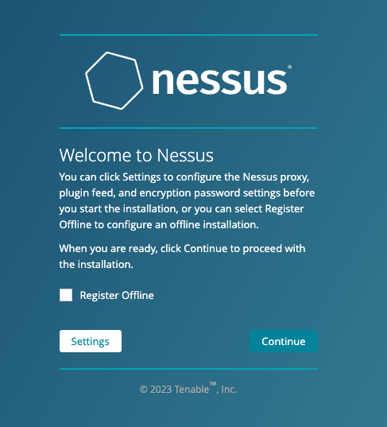
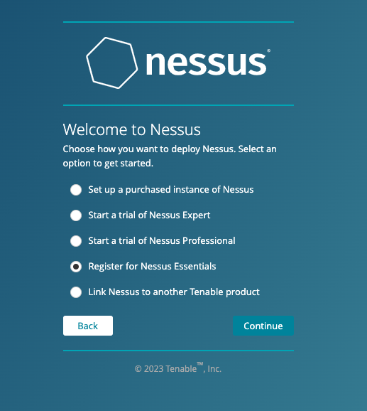
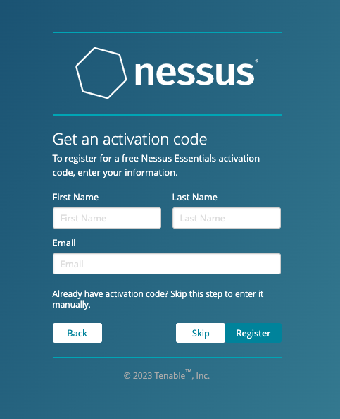
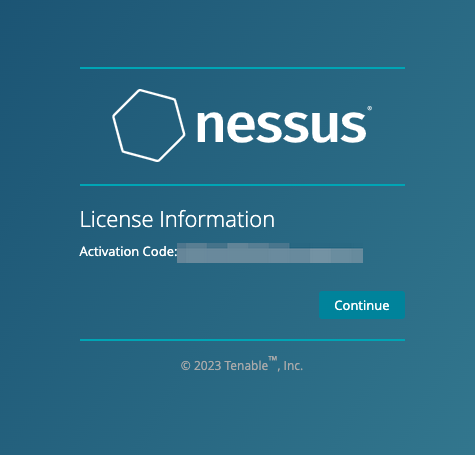
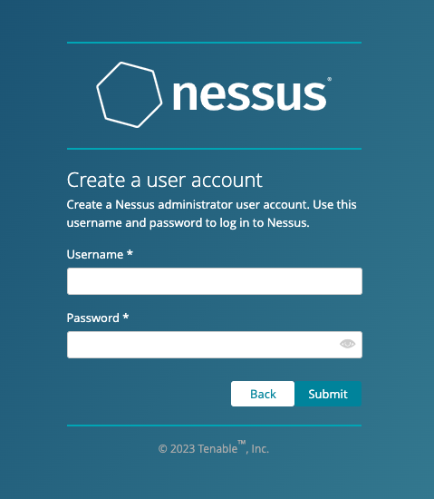
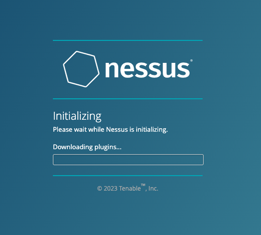
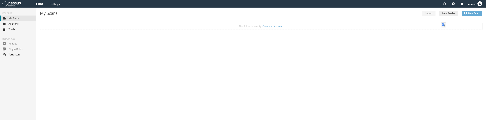
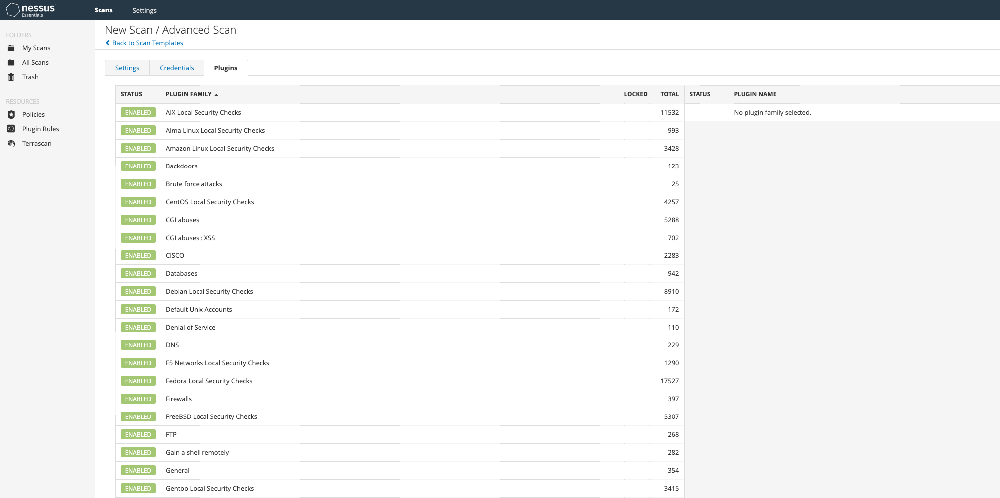

# Nessus 服务配置

## 简介

Nessus号称是世界上最流行的漏洞扫描程序，全世界有超过75000个组织在使用它。该工具提供完整的电脑漏洞扫描服务，并随时更新其漏洞数据库。Nessus不同于传统的漏洞扫描软件，Nessus可同时在本机或远端上遥控，进行系统的漏洞分析扫描。Nessus也是渗透测试重要工具之一。

## 安装

下载地址：https://www.tenable.com/downloads/nessus?loginAttempted=true

官方文档：https://docs.tenable.com/nessus/Content/GettingStarted.htm

### Docker 方式运行

```bash
docker pull tenable/nessus:latest-ubuntu

docker run -itd --name "nessus" --restart=always --network=host tenable/nessus:latest-ubuntu
```

### 设置

访问地址：`https://<ip>:8834`





获取激活码，邮箱一定要填写正确的，否则收不到激活码。









如果安装失败，可以进入docker内部执行命令进行安装

```bash
docker exec -it nessus /bin/bash

/opt/nessus/sbin/nessuscli update

```

配置完成后，进入以下页面



查看插件是否正常可用




