# TCP/IP 基础

## 基础知识

### 协议

计算机与网络设备要相互通信，必须基于相同的方法。比如，如何探测到通信目标，使用哪种语言通信，如何结束通信等规则要事先确定。

不同硬件，操作系统之间的通信都需要一种规则，我们将这种`事先约定好的规则称之为协议`。

### 地址

地址：在某一范围内确认的唯一标识符，即数据包传到某一个范围，需要有一个明确唯一的目标地址。

<table border="1" cellpadding="10" cellspacing="10">
  <thead>
    <tr><th>类型</th><th>层</th><th>地址</th><th>说明</th></tr>
  </thead>
    <tbody>
      <tr><td>端口号</td><td>传输层</td><td>程序地址</td><td>同一个计算机中不同的应用程序</td></tr>
      <tr><td>IP地址</td><td>网络层</td><td>主机地址</td><td>识别TCP/IP网络中不同的主机或路由器</td></tr>
      <tr><td>MAC地址</td><td>数据链路层</td><td>物理地址</td><td>在同一个数据链路中识别不同的计算机</td></tr>
  </tbody>
</table>

### 网络构成

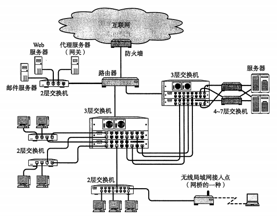

<table border="1" cellpadding="10" cellspacing="10">
  <thead>
    <tr><th>构成要素</th><th>说明</th></tr>
  </thead>
    <tbody>
      <tr><td>网卡</td><td>连入网络必须使用网卡，又称网络接口卡。</td></tr>
      <tr><td>中继器</td><td>OSI第1层，物理层上延长网络的设备，将电缆的信号放大传给另一个电缆。</td></tr>
      <tr><td>网桥/2层交换机</td><td>OSI第2层，数据链路层面上连接两个网络的设备，识别数据帧的内容并转发给相邻的网段，根据MAC地址进行处理。</td></tr>
      <tr><td>路由器/3层交换机</td><td>OSI第3层，网络层面连接两个网络并对分组报文进行转发，根据IP进行处理。</td></tr>
      <tr><td>4-7层交换机</td><td>传输层到应用层，以TCP等协议分析收发数据，负载均衡器就是其中一种。</td></tr>
      <tr><td>网关</td><td>对传输层到应用层的数据进行转换和转发的设备，通常会使用表示层或应用层的网关来处理不同协议之间的翻译和通信，代理服务器（proxy）就是应用网关的一种。</td></tr>
  </tbody>
</table>

## OSI与TCP/IP参考模型

### OSI与TCP/IP参考模型图

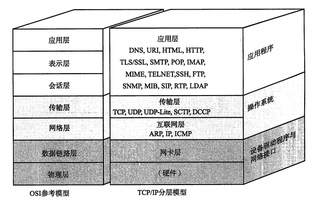

### OSI参考模型分层说明

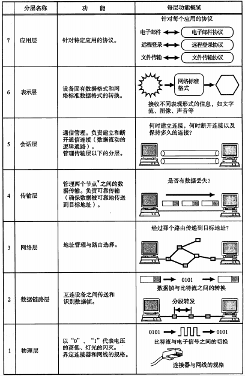

### OSI参考模型通信过程

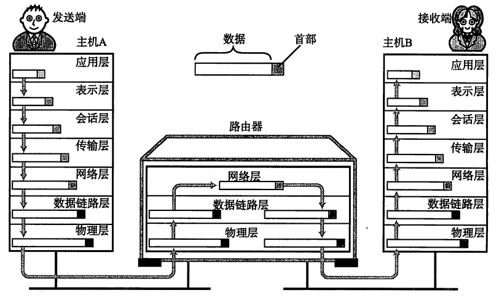

1、打包数据时，每一层在处理上一层传过来的数据时，会在数据上附上当前层的首部信息后传给下一层；

2、解包数据时，每一层在处理下一层传过来的数据时，会将当前层的首部信息与数据分开，将数据传给上一层。

3、数据通信过程

<table border="1" cellpadding="10" cellspacing="10">
  <thead>
    <tr><th>分层</th><th>操作</th></tr>
  </thead>
    <tbody>
      <tr><td>应用层</td><td>在数据前面加首部，首部包括数据内容、源地址和目标地址，同时也会处理异常的反馈信息。</td></tr>
      <tr><td>表示层</td><td>将特有的数据格式转换为通用的数据格式，同时也会加上表示层的首部信息以供解析。</td></tr>
      <tr><td>会话层</td><td>对何时连接，以何种方式连接，连接多久，何时断开等做记录。同时也会加会话层的首部信息。</td></tr>
      <tr><td>传输层</td><td>建立连接，断开连接，确认数据是否发送成功和执行失败重发任务。</td></tr>
      <tr><td>网络层</td><td>负责将数据发到目标地址，也包含首部信息。</td></tr>
      <tr><td>数据链路层</td><td>通过物理的传输介质实现数据的传输。</td></tr>
      <tr><td>物理层</td><td>将0/1转换成物理的传输介质，通过MAC地址进行传输。</td></tr>
  </tbody>
</table>

### TCP/IP应用层协议

#### 通信模型

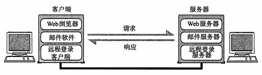

#### 应用层协议说明

<table border="1" cellpadding="10" cellspacing="10">
  <thead>
    <tr><th>应用类型</th><th>协议</th><th>协议说明</th></tr>
  </thead>
    <tbody>
      <tr><td>WWW</td><td>HTTP,HTML</td><td>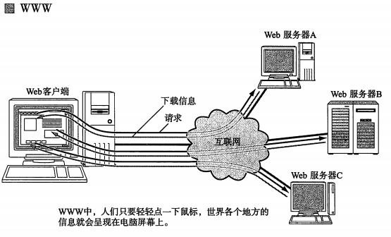</td></tr>
      <tr><td>电子邮件</td><td>SMTP，MIME</td><td>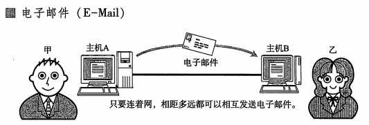</td></tr>
      <tr><td>文件传输</td><td>FTP</td><td>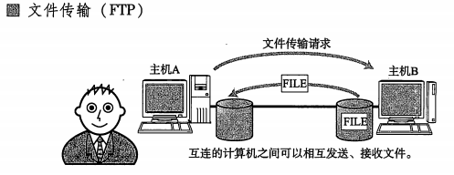</td></tr>
      <tr><td>远程登录</td><td>TELNET,SSH</td><td>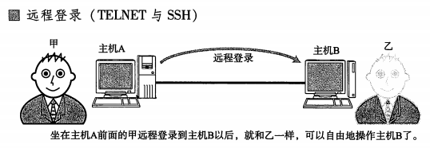</td></tr>
      <tr><td>网络管理</td><td>SNMP,MIB</td><td>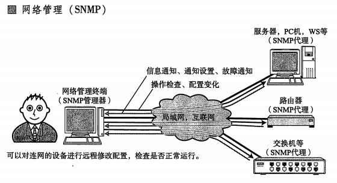</td></tr>
  </tbody>
</table>

## TCP/IP通信过程

### 数据包结构

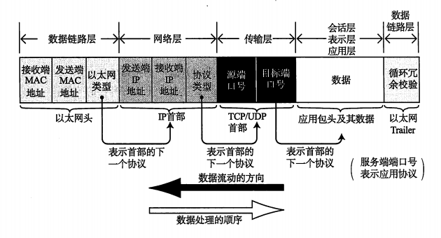

### 数据打包和解包过程

#### 包的封装

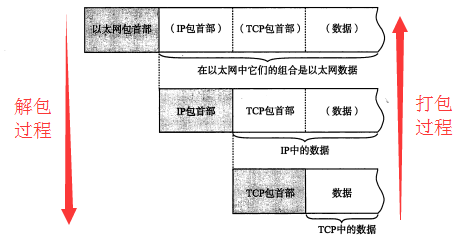 

#### 发送与接收

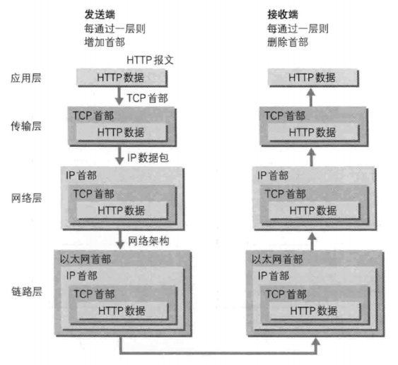

### 数据包传输过程

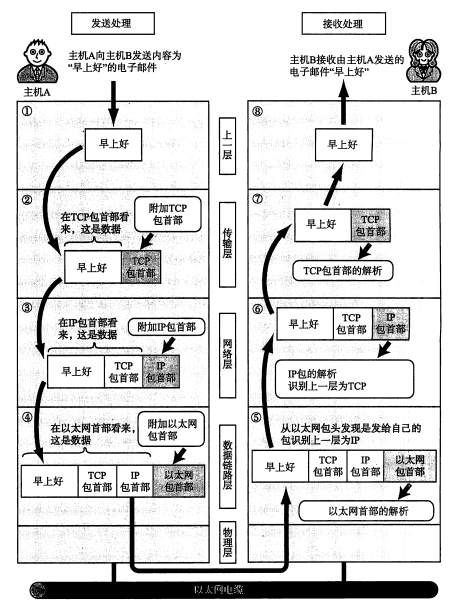

