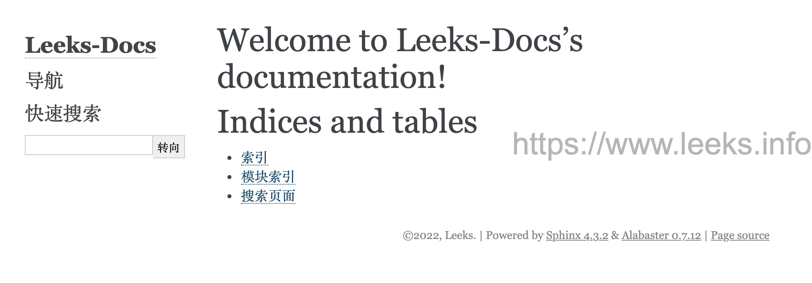
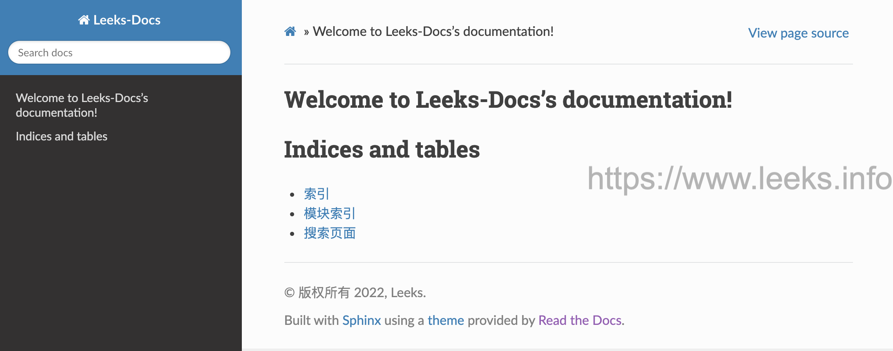
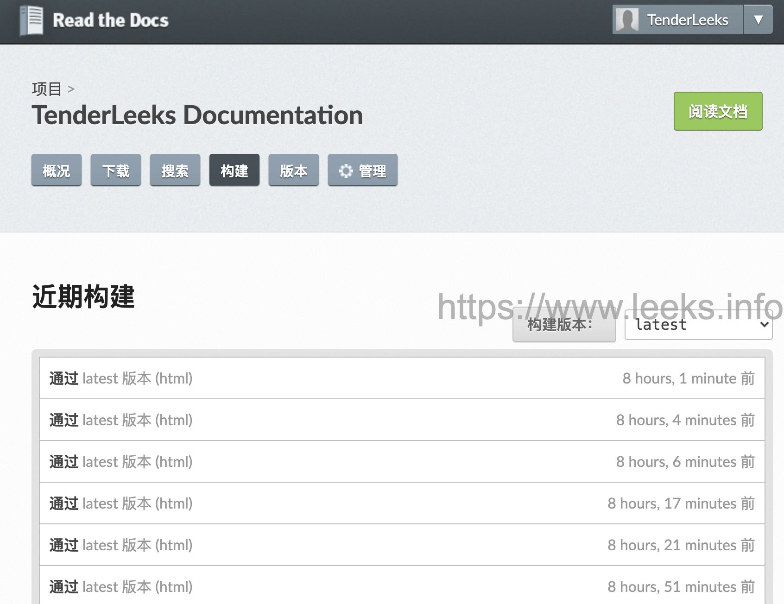
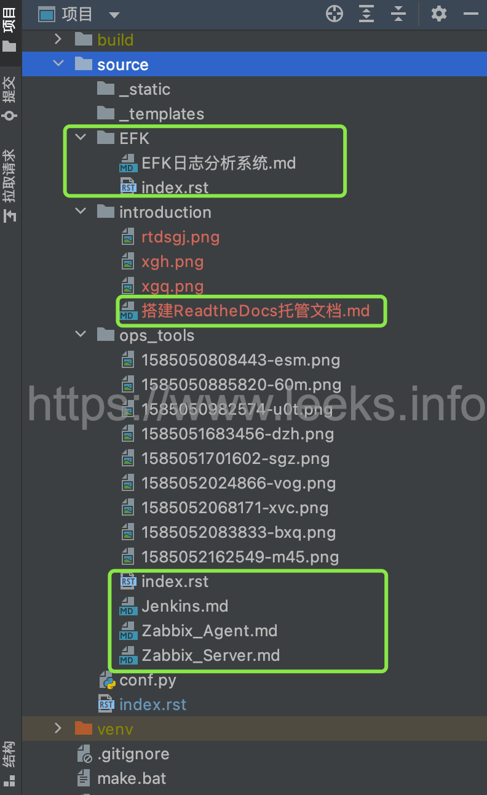
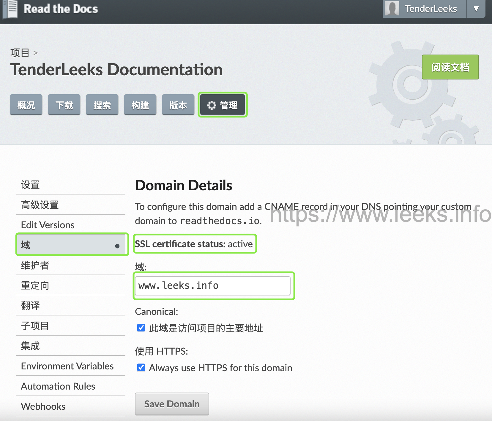
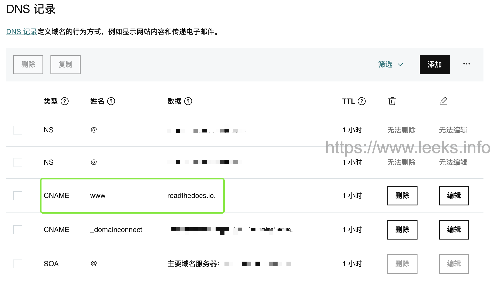

# ReadtheDocs

[Read the Docs](https://readthedocs.org/)是一个在线文档托管服务， 你可以从各种版本控制系统中导入文档，如果你使用[webhooks](http://docs.readthedocs.io/en/latest/webhooks.html)， 那么每次提交代码后可以自动构建并上传至readthedocs网站，非常方便。

本文使用Sphinx + GitHub + ReadtheDocs 作为文档写作工具，用 Sphinx 生成文档，GitHub 托管文档，再导入到 ReadtheDocs。

## 搭建环境步骤

1. 需要的工具

   * github账号
   * python环境

2. 安装Sphinx

   ```shell
   # 创建工程目录
   $ mkdir -p read-the-docs && cd read-the-docs
   
   # 创建 python 虚拟环境
   $ python3 -m venv v-env
   # 激活 python 虚拟环境环境
   $ source v-env/bin/activate
   # 停用 python 虚拟环境使用以下命令
   $ deactivate
   
   # 安装Sphinx同时会安装很多python依赖，请耐心等待...
   $ pip install sphinx sphinx-autobuild sphinx_rtd_theme
   
   # 安装完成后，执行命令
   $ sphinx-quickstart
   欢迎使用 Sphinx 4.3.2 快速配置工具。
   
   请输入接下来各项设置的值（如果方括号中指定了默认值，直接
   按回车即可使用默认值）。
   
   已选择根路径：.
   
   有两种方式来设置 Sphinx 输出的创建目录：
   一是在根路径下创建“_build”目录，二是在根路径下创建“source”
   和“build”两个独立的目录。
   > 独立的源文件和构建目录（y/n） [n]: y
   
   项目名称将会出现在文档的许多地方。
   > 项目名称: Leeks-Docs
   > 作者名称: Leeks
   > 项目发行版本 []: 0.0.1
   
   如果用英语以外的语言编写文档，
   你可以在此按语言代码选择语种。
   Sphinx 会把内置文本翻译成相应语言的版本。
   
   支持的语言代码列表见：
   http://sphinx-doc.org/config.html#confval-language。
   > 项目语种 [en]: zh_CN
   
   创建文件 /Users/yushuai/workspace/tmp/read-the-docs/source/conf.py。
   创建文件 /Users/yushuai/workspace/tmp/read-the-docs/source/index.rst。
   创建文件 /Users/yushuai/workspace/tmp/read-the-docs/Makefile。
   创建文件 /Users/yushuai/workspace/tmp/read-the-docs/make.bat。
   
   完成：已创建初始目录结构。
   
   你现在可以填写主文档文件 /Users/yushuai/workspace/tmp/read-the-docs/source/index.rst 并创建其他文档源文件了。 用 Makefile 构建文档，例如：
    make builder
   此处的“builder”是支持的构建器名，比如 html、latex 或 linkcheck。
   
   # 查看目录树结构
   $ tree .
   .
   ├── build
   ├── make.bat
   ├── Makefile
   └── source
       ├── conf.py
       ├── index.rst
       ├── _static
       └── _templates
   ```

3. 更改主题 sphinx_rtd_theme

   ```shell
   $ vim source/conf.py
   # 在文件中加入一下信息
   import sphinx_rtd_theme
   html_theme = "sphinx_rtd_theme"
   html_theme_path = [sphinx_rtd_theme.get_html_theme_path()]
   
   ```

   执行`make html`，进入`build/html`目录后用浏览器打开`index.html`预览效果

   ```shell
   $ make html
   正在运行 Sphinx v4.3.2
   正在加载翻译 [zh_CN]... 完成
   创建输出目录... 完成
   构建 [mo]： 0 个 po 文件的目标文件已过期
   构建 [html]： 1 个源文件的目标文件已过期
   更新环境: [新配置] 已添加 1，0 已更改，0 已移除
   阅读源... [100%] index                                                                             
   查找当前已过期的文件... 没有找到
   pickling环境... 完成
   检查一致性... 完成
   准备文件... 完成
   写入输出... [100%] index                                                                            
   正在生成索引... genindex 完成
   正在写入附加页面... search 完成
   copying static files... 完成
   正在复制额外文件... 完成
   正在导出 Chinese (code: zh) 的搜索索引... 完成
   正在导出对象清单... 完成
   构建 成功.
   
   HTML 页面保存在 build/html 目录。
   ```

   修改前页面样式，如图所示:

   

   修改后页面的样式，如图所示：

   

## 支持markdown编写

通过[recommonmark](https://recommonmark.readthedocs.io/en/latest/) 来支持markdown

```shell
$ pip install recommonmark
```

参考[配置文件](https://github.com/readthedocs/recommonmark/blob/master/docs/conf.py)

我的配置文件内容

```shell
$ vim source/conf.py

import sys
import os
import shlex
import sphinx_rtd_theme
import recommonmark
from recommonmark.parser import CommonMarkParser
from recommonmark.transform import AutoStructify

# 如果扩展（或使用 autodoc 记录的模块）在另一个目录中，请在此处将这些目录添加到 sys.path。 如果目录相对于文档根目录，请使用 os.path.abspath 使其成为绝对路径，如此处所示。
sys.path.insert(0, os.path.abspath('..'))
source_suffix = ['.rst', '.md']

project = 'Documentation'
copyright = '2022, TenderLeeks'
author = 'TenderLeeks'
release = '0.0.1'

extensions = [
    'sphinx.ext.autodoc',
    'sphinx.ext.napoleon',
    'sphinx.ext.mathjax',
    'recommonmark',
]

master_doc = 'index'
templates_path = ['_templates']
version = recommonmark.__version__
language = 'zh_CN'
exclude_patterns = ['_build']
default_role = None
pygments_style = 'sphinx'
todo_include_todos = False
html_theme = "sphinx_rtd_theme"
html_theme_path = [sphinx_rtd_theme.get_html_theme_path()]
html_static_path = ['_static']
htmlhelp_basename = 'Recommonmarkdoc'

latex_elements = {
}

latex_documents = [
  (master_doc, 'Recommonmark.tex', u'Recommonmark Documentation',
   u'Lu Zero, Eric Holscher, and contributors', 'manual'),
]

man_pages = [
    (master_doc, 'recommonmark', u'Recommonmark Documentation',
     [author], 1)
]

texinfo_documents = [
  (master_doc, 'Recommonmark', u'Recommonmark Documentation',
   author, 'Recommonmark', 'One line description of project.',
   'Miscellaneous'),
]

def setup(app):
    app.add_config_value('recommonmark_config', {
        'auto_toc_tree_section': 'Contents',
        'enable_math': False,
        'enable_inline_math': False,
        'enable_eval_rst': True,
        'enable_auto_doc_ref': True,
    }, True)
    app.add_transform(AutoStructify)
```


## GitHub托管

一般的做法是将文档托管到版本控制系统比如github上面，push源码后自动构建发布到readthedoc上面， 这样既有版本控制好处，又能自动发布到readthedoc，实在是太方便了。

首先在GitHub创建一个公有仓库名字叫 leeks-docs， 然后在本地添加 .gitignore 文件，文件内容如下：

```shell
$ vim .gitignore

build/
venv/
.idea/
source/.DS_Store
.DS_Store
```

具体几个步骤非常简单，参考[官方文档](https://github.com/rtfd/readthedocs.org)

* 在Read the Docs上面注册一个账号，可以直接使用github账号进行登录使用。
* 登陆后点击 **Import**
* 给该文档项目填写一个名字比如 `leeks-docs`, 并添加你在GitHub上面的工程HTTPS链接, 选择仓库类型为Git。
* 其他项目根据自己的需要填写后点击 `Create`，创建完后会自动去激活Webhooks，不用再去GitHub设置。
* 完成之后，从此只要你往这个仓库push代码，readthedoc上面的文档就会自动更新。
* **注：在创建 read the docs 项目时候，语言选择 `Simplified Chinese`**

在构建过程中出现任何问题，都可以登录readthedoc找到项目中的 `构建` 页查看构建历史，点击任何一条查看详细日志:



## index.rst 文件编写规则

rst上手难度远高于markdown, 功能扩展完爆markdown

以下是 index.rst 文件的简单内容，请参考：

```shell
$ vim source/index.rst 
```

```rst
.. Documentation documentation master file, created by
   sphinx-quickstart on Fri Jan  7 20:45:52 2022.
   You can adapt this file completely to your liking, but it should at least
   contain the root `toctree` directive.

欢迎使用 Leeks 的文档！
=========================================

.. toctree::

   搭建ReadtheDocs托管文档 <introduction/搭建ReadtheDocs托管文档>


.. toctree::
   :maxdepth: 2

   运维工具 <ops_tools/index>
   其他栏目 <other/index>


.. toctree::
   :caption: EFK
   :maxdepth: 2

   EFK日志分析系统 <EFK/index>
```

```shell
$ vim source/EFK/index.rst 
```

```rst
EFK日志分析系统
=====================================


.. toctree::
   :maxdepth: 2

   EFK日志管理系统 <EFK日志分析系统>
```

文件目录如图：



最终页面内容样式，如图所示：


## 使用自定义域名

在godaddy购买一个域名，然后在 ReadtheDocs 页面管理中选择域，如图：



godaddy DNS 添加解析，如图所示：




参考文档：

- [飞污熊博客-使用ReadtheDocs托管文档](https://www.xncoding.com/2017/01/22/fullstack/readthedoc.html)

- https://ebf-contribute-guide.readthedocs.io/zh_CN/latest/markdown-syntax/markdown-sphinx.html

  


