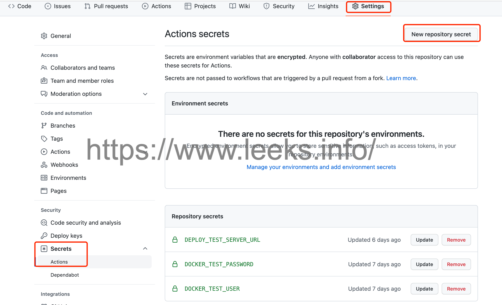

# GItHub CICD 配置示例

1. 在项目根目录创建 `.github/workflows/` 文件夹

   ```shell
   mkdir -p .github/workflows/
   ```

2. 创建文件 `vim .github/workflows/ci.yml`

   ```yaml
   name: dotnet package
   on:
     push:
       branches:
         - master
   
   jobs:
     build:
       name: Build
       runs-on: ubuntu-latest
   #    services:
   #      mysql:
   #        image: mysql:5.7
   #        env:
   #          MYSQL_ALLOW_EMPTY_PASSWORD: yes
   #          MYSQL_DATABASE: laravel
   #        ports:
   #          - 3306:3306
   #        options: --health-cmd="mysqladmin ping" --health-interval=10s --health-timeout=5s --health-retries=3
         
       steps:
         - uses: actions/checkout@v2
         - name: Setup dotnet
           uses: actions/setup-dotnet@v1
           with:
             dotnet-version: '6.0.x'
         - run: |
             dotnet --version
             dotnet publish tj-financing/src/Tank.Financing.DbMigrator/Tank.Financing.DbMigrator.csproj --configuration Release -o build/DbMigrator
             dotnet publish tj-financing/src/Tank.Financing.Web/Tank.Financing.Web.csproj --configuration Release -o build/Web
             docker build -t tank_financing -f .github/workflows/Dockerfile .
             docker tag tank_financing hoopoxtest/tank_financing_test
             docker login -u ${{ secrets.DOCKER_TEST_USER }} -p ${{ secrets.DOCKER_TEST_PASSWORD }}
             docker push hoopoxtest/tank_financing_test
             curl ${{ secrets.DEPLOY_TEST_SERVER_URL }}
   ```

3. 创建文件 `.github/workflows/Dockerfile`

   ```dockerfile
   FROM mcr.microsoft.com/dotnet/sdk:6.0
   
   WORKDIR /app
   
   COPY ./build /app/build
   COPY ./.github/workflows/start.sh /app
   
   ENTRYPOINT ["/bin/sh", "/app/start.sh"]
   ```

4. 创建文件 `.github/workflows/start.sh`

   ```shell
   #!/bin/bash
   
   cd /app/build/DbMigrator
   dotnet Tank.Financing.DbMigrator.dll
   
   sleep 2
   
   cd /app/build/Web
   dotnet Tank.Financing.Web.dll
   ```

5. 在GitHub仓库设置中配置`Secrets `

   添加参数：

   - `DEPLOY_TEST_SERVER_URL`：触发服务自动部署URL
   - `DOCKER_TEST_PASSWORD`：DOCKER中央仓库用户密码
   - `DOCKER_TEST_USER`：DOCKER中央仓库用户名

   

6. 主机配置

   部署脚本 `deploy.sh`

   ```shell
   #!/bin/bash
   
   docker stop tank_test
   
   docker rm tank_test
   
   docker rmi hoopoxtest/tank_financing_test
   
   docker run -itd --name tank_test -p 44366:44366 -p 5000:5000 \
   -v /opt/tank_financing_test/Web/appsettings.json:/app/build/Web/appsettings.json \
   -v /opt/tank_financing_test/DbMigrator/appsettings.json:/app/build/DbMigrator/appsettings.json \
   -v /opt/tank_financing_test/Logs/logs.txt:/app/build/Web/Logs/logs.txt \
   -v /etc/localtime:/etc/localtime hoopoxtest/tank_financing_test
   ```

   触发自动部署脚本 `api.py` 

   ```python
   import flask
   import json
   import subprocess
   from flask import request
   
   key = 'xxxxxxxx'
   
   # 创建一个服务，把当前这个python文件当做一个服务
   server = flask.Flask(__name__)
   
   
   @server.route('/xxxxxxxx', methods=['get', 'post'])
   def info():
       token = request.values.get('token')
       if token == key:
           command = subprocess.Popen(["/bin/bash", "/opt/tank_financing_test/deploy.sh"])
           out, err = command.communicate()
           result = {"data": err, "code": 200, "msg": "success"}
           return json.dumps(result, ensure_ascii=False)
       else:
           res = {"data": {}, 'code': 10001, 'message': 'invalid parameter'}
           return json.dumps(res, ensure_ascii=False)
   
   
   if __name__ == '__main__':
       # 指定端口、host,0.0.0.0代表不管几个网卡，任何ip都可以访问
       # 在浏览器访问 http://127.0.0.1:56478/xxxxxxxx?token=xxxxxxxx 进行测试
       server.run(debug=True, port=56478, host='0.0.0.0')
   ```

   