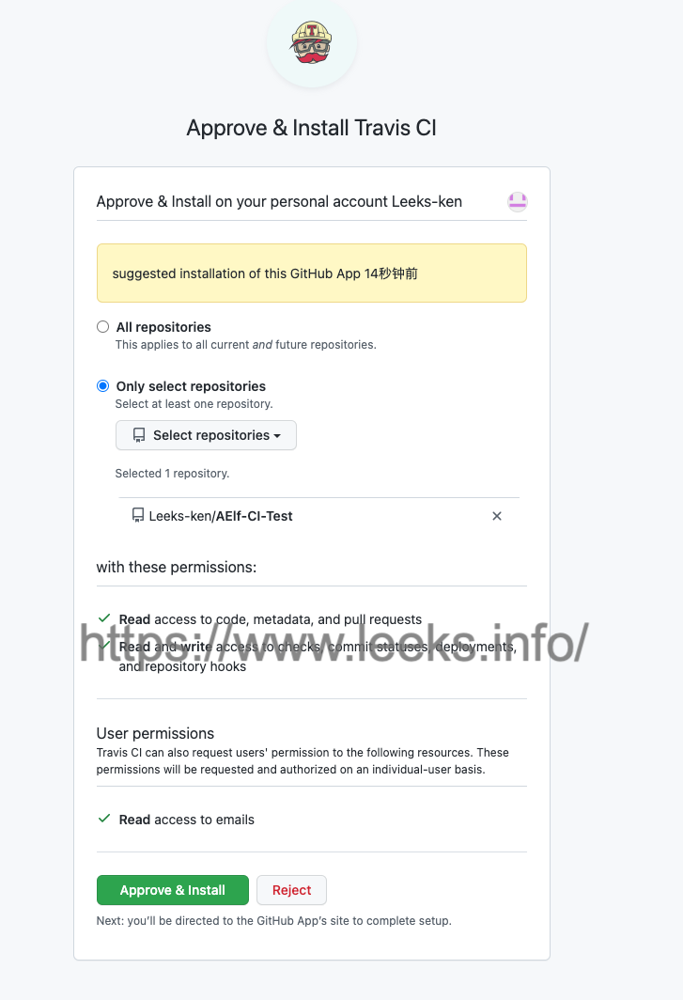
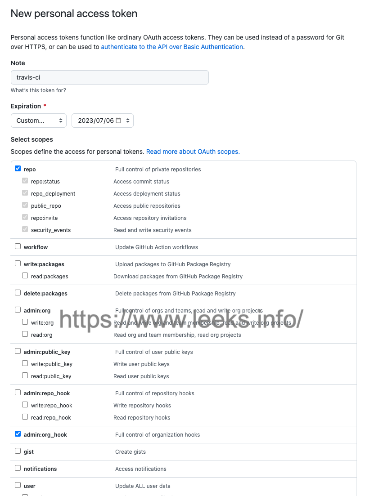
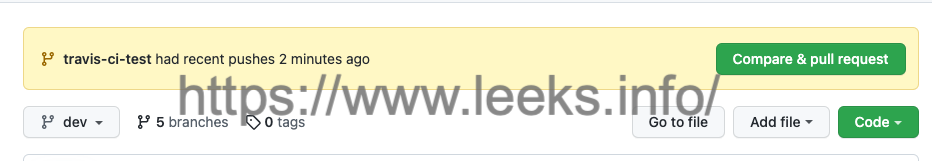
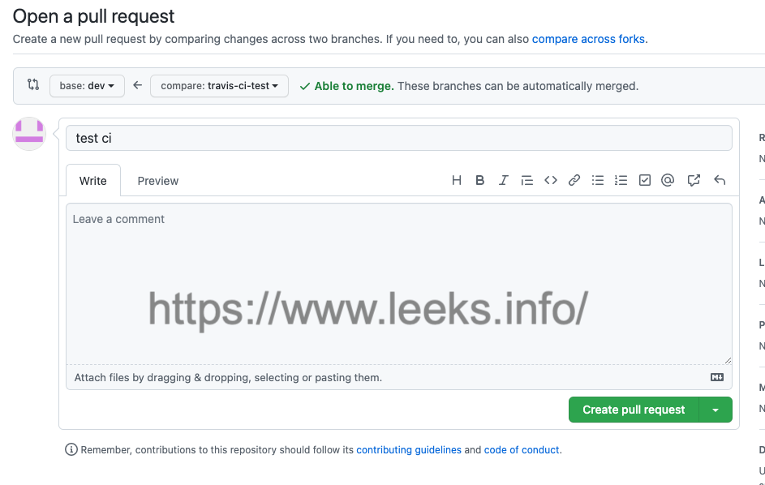

# Travis CI

## 简介

[官方网站](https://www.travis-ci.com/)

```tex
Travis CI 提供的是持续集成服务（Continuous Integration，简称 CI）。它绑定 Github 上面的项目，只要有新的代码，就会自动抓取。然后，提供一个运行环境，执行测试，完成构建，还能部署到服务器。
```

## 持续集成

```tex
持续集成指的是只要代码有变更，就自动运行构建和测试，反馈运行结果。确保符合预期以后，再将新代码"集成"到主干。
持续集成的好处在于，每次代码的小幅变更，就能看到运行结果，从而不断累积小的变更，而不是在开发周期结束时，一下子合并一大块代码。
```

Travis 要求项目的根目录下面，必须有一个`.travis.yml`文件。这是配置文件，指定了 Travis 的行为。该文件必须保存在 Github 仓库里面，一旦代码仓库有新的 Commit，Travis 就会去找这个文件，执行里面的命令。

这个文件采用 `YAML` 格式。下面是一个最简单的 Python 项目的`.travis.yml`文件。

```yaml
language: python
script: true
```

上面代码中，设置了两个字段。`language`字段指定了默认运行环境，这里设定使用 Python 环境。`script`字段指定要运行的脚本，`script: true`表示不执行任何脚本，状态直接设为成功。

Travis 默认提供的运行环境，请参考[官方文档](https://docs.travis-ci.com/user/languages) 。目前一共支持31种语言，以后还会不断增加。

下面是一个稍微复杂一点的`.travis.yml`。

```yaml
language: python
sudo: required
before_install: sudo pip install foo
script: py.test
```

上面代码中，设置了四个字段：运行环境是 Python，需要sudo权限，在安装依赖之前需要安装foo模块，然后执行脚本py.test。

## 运行流程

Travis 的运行流程很简单，任何项目都会经过两个阶段。

- install 阶段：安装依赖

- script 阶段：运行脚本

### install 字段

install字段用来指定安装脚本。

```yaml
install: ./install-dependencies.sh
```

如果有多个脚本，可以写成下面的形式。

```yaml
install:
  - command1
  - command2
```

上面代码中，**如果command1失败了，整个构建就会停下来**，不再往下进行。

如果不需要安装，即跳过安装阶段，就直接设为true。

```yaml
install: true
```

### script 字段

script字段用来指定构建或测试脚本。

```yaml
script: bundle exec thor build
```

如果有多个脚本，可以写成下面的形式。

```yaml
script:
  - command1
  - command2
```

注意，script与install不一样，**如果command1失败，command2会继续执行。**但是，整个构建阶段的状态是失败。

如果command2只有在command1成功后才能执行，就要写成下面这样。

```yaml
script: command1 && command2
```

## 环境变量

`.travis.yml`的`env`字段可以定义环境变量。

```yaml
env:
  - DB=postgres
  - SH=bash
  - PACKAGE_VERSION="1.0.*"
```

然后，脚本内部就使用这些变量了。

有些环境变量（比如用户名和密码）不能公开，这时可以通过 Travis 网站，写在每个仓库的设置页里面，Travis 会自动把它们加入环境变量。这样一来，脚本内部依然可以使用这些环境变量，但是只有管理员才能看到变量的值。具体操作请看[官方文档](https://docs.travis-ci.com/user/environment-variables)。

### 加密信息

如果不放心保密信息明文存在 Travis 的网站，可以使用 Travis 提供的加密功能。

首先，安装 Ruby 的包`travis`。

```shell
$ gem install travis
```

然后，就可以用`travis encrypt`命令加密信息。

在项目的根目录下，执行下面的命令。

```shell
$ travis encrypt SOMEVAR=secretvalue
```

上面命令中，`SOMEVAR`是要加密的变量名，`secretvalue`是要加密的变量值。执行以后，屏幕上会输出如下信息。

```shell
secure: ".... encrypted data ...."
```

现在，就可以把这一行加入`.travis.yml`。

```yaml
env:
  global:
    - secure: ".... encrypted data ...."
```

然后，脚本里面就可以使用环境变量`$SOMEVAR`了，Travis 会在运行时自动对它解密。

`travis encrypt`命令的`--add`参数会把输出自动写入`.travis.yml`，省掉了修改`env`字段的步骤。

```shell
$ travis encrypt SOMEVAR=secretvalue --add
```

详细信息请看[官方文档](https://docs.travis-ci.com/user/encryption-keys/)。

## GitHub 账号关联 TravisCI

使用GitHub账号登录[Travis CI](https://www.travis-ci.com/)，GitHub账号下的所有 Repo 都会列出来，选择激活你想要 build 的 Repo。




### 设置GitHub token变量

环境变量有两种，一种是配置在`.travis.yml`文件里面的，另一种是配置在travis-ci的后台系统中进行，在setting里的`Environment Variables`里面。


第二种方式的环境变量主要是用于第三方系统的权限校验。

**配置GitHub的token**

1. 进入GitHub的个人设置，`Settings -> Developer settings -> Personal access tokens -> Generate new token` 进行配置。

   

2. 进入`travis-ci`的后台系统中配置环境变量`Environment Variables`新增一个环境变量，然后将GitHub建立的token填入其中。`DISPLAY VALUE IN BUILD LOG` 选项不要勾选，否则环境变量会在你执行build脚本的时候显示出来。

   

## 配置 Travis CI 项目

以GitHub 开源库 [AElf](https://github.com/AElfProject/AElf) 中代码为例

- 从`master`分支 checkout 出`dev`分支，并把`dev`分支设置为`default`分支，日常 PR 都会合并到该分支上。	

- 从`dev`分支 checkout 出一条分支`docs/travis-ci-test`，接着修改 readme 的内容，`git add` 和 `git commit` 后就待 push 了。

### 配置文件

[配置文件参考](https://config.travis-ci.com/)

项目根目录`.travis.yml`配置文件

```yaml
language: csharp
sudo: required
mono: none
dotnet: 6.0.300
dist: xenial
os:
  - linux
osx_image: xcode11
cache:
  directories:
    - $HOME/.nuget/packages
env:
  global:
    - REAL_BRANCH=$(git ls-remote origin | sed -n "\|$TRAVIS_COMMIT\s\+refs/heads/|{s///p}")
    - CI_TEST=true
before_install:
  - bash scripts/install_protobuf.sh
  - bash scripts/download_binary.sh
install:
  - export DOTNET_CLI_TELEMETRY_OPTOUT=1
script: bash build.sh --configuration=Release

```

然后 pull 到远程分支，此时打开 github 项目仓库，点击`Create pull request`，







参考文档：

https://developer.aliyun.com/article/931076

