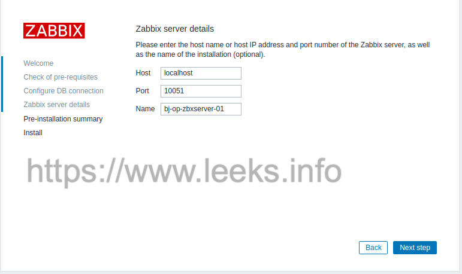
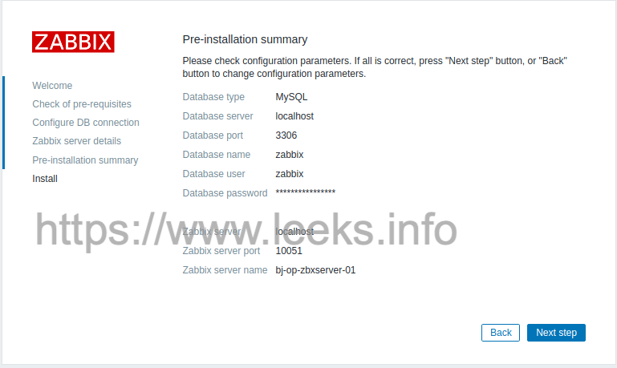
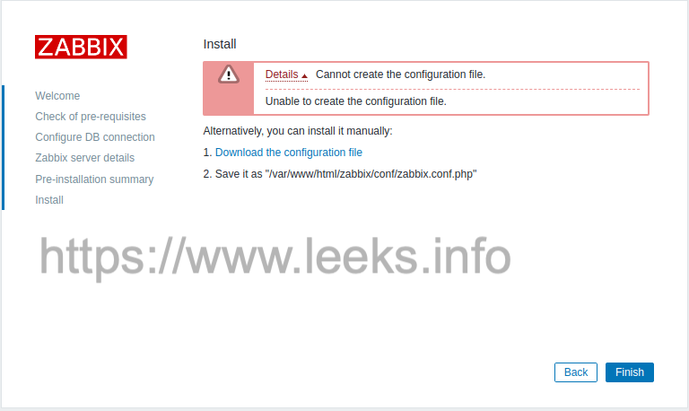

# Zabbix部署

最新版本安装请参照[Zabbix官方文档](https://www.zabbix.com/documentation/current/zh/manual/installation)

## Docker方式安装

```shell
# 创建专用于 Zabbix 组件容器的网络
$ docker network create --subnet 172.20.0.0/16 --ip-range 172.20.240.0/20 zabbix-net

# 启动空的 MySQL 服务器实例
$ docker run -v /etc/localtime:/etc/localtime \
      --name mysql-server -t \
      -e MYSQL_DATABASE="zabbix" \
      -e MYSQL_USER="zabbix" \
      -e MYSQL_PASSWORD="zabbix_pwd" \
      -e MYSQL_ROOT_PASSWORD="root_pwd" \
      --network=zabbix-net \
      --restart unless-stopped \
      -d mysql:8.0 \
      --character-set-server=utf8 --collation-server=utf8_bin \
      --default-authentication-plugin=mysql_native_password
      
# 启动 Zabbix Java 网关实例
$ docker run -v /etc/localtime:/etc/localtime \
      --name zabbix-java-gateway -t \
      --network=zabbix-net \
      --restart unless-stopped \
      -d zabbix/zabbix-java-gateway:ubuntu-6.0-latest

# 启动 Zabbix server 实例，并将其关联到已创建的 MySQL server 实例
$ docker volume create zabbix-server-volume
$ docker run -v /etc/localtime:/etc/localtime \
      --name zabbix-server-mysql -t \
      -e DB_SERVER_HOST="mysql-server" \
      -e MYSQL_DATABASE="zabbix" \
      -e MYSQL_USER="zabbix" \
      -e MYSQL_PASSWORD="zabbix_pwd" \
      -e MYSQL_ROOT_PASSWORD="root_pwd" \
      -e ZBX_JAVAGATEWAY="zabbix-java-gateway" \
      -v zabbix-server-volume:/etc/zabbix \
      -v /usr/lib/zabbix/alertscripts:/usr/lib/zabbix/alertscripts \
      --network=zabbix-net \
      -p 10051:10051 \
      --restart unless-stopped \
      -d zabbix/zabbix-server-mysql:ubuntu-6.0-latest

# 启动 Zabbix Web 界面，并将其关联到已创建的 MySQL server 和 Zabbix server 实例，默认用户名：Admin 密码：zabbix
$ docker run -v /etc/localtime:/etc/localtime \
      --name zabbix-web-nginx-mysql -t \
      -e ZBX_SERVER_HOST="zabbix-server-mysql" \
      -e DB_SERVER_HOST="mysql-server" \
      -e MYSQL_DATABASE="zabbix" \
      -e MYSQL_USER="zabbix" \
      -e MYSQL_PASSWORD="zabbix_pwd" \
      -e MYSQL_ROOT_PASSWORD="root_pwd" \
      --network=zabbix-net \
      -p 8080:8080 \
      --restart unless-stopped \
      -d zabbix/zabbix-web-nginx-mysql:ubuntu-6.0-latest

# 本地启动 zabbix agent2 服务
$ docker volume create zabbix-agent2-volume
$ docker run -v /etc/localtime:/etc/localtime \
      --name zabbix-agent2 \
      -v zabbix-agent2-volume:/etc/zabbix \
      -e ZBX_HOSTNAME="zabbix-server" \
      -e ZBX_SERVER_HOST="zabbix-server-mysql" \
      -p 10050:10050 \
      -e ZBX_SERVER_PORT=10051 \
      --privileged \
      --network=zabbix-net \
      --restart unless-stopped \
      -d zabbix/zabbix-agent2:ubuntu-6.0-latest
# 查询 zabbix agent2 ip
$ docker inspect zabbix-agent2 | grep -w "IPAddress"

# 解决 zabbix 图形界面乱码问题
# 下载楷体字库
$ wget https://raw.githubusercontent.com/TenderLeeks/Documentation/main/source/tools/monitor/Zabbix/fonts/simkai.ttf
# 下载黑体字库
$ wget https://raw.githubusercontent.com/TenderLeeks/Documentation/main/source/tools/monitor/Zabbix/fonts/msyh.ttf
$ mv simkai.ttf DejaVuSans.ttf
$ chmod 644 DejaVuSans.ttf
$ docker cp DejaVuSans.ttf zabbix-web-nginx-mysql:/usr/share/zabbix/assets/fonts

# 其他主机安装 zabbix agent2 服务
$ docker volume create zabbix-agent2-volume
$ docker run -v /etc/localtime:/etc/localtime \
      --name zabbix-agent2 \
      -v zabbix-agent2-volume:/etc/zabbix \
      -e ZBX_HOSTNAME="zabbix-agent-01" \
      -e ZBX_SERVER_HOST="192.168.66.40" \
      -p 10050:10050 \
      -e ZBX_SERVER_PORT=10051 \
      --privileged \
      --restart unless-stopped \
      -d zabbix/zabbix-agent2:ubuntu-6.0-latest

# 查看 volume 信息
$ docker volume ls
$ docker volume inspect zabbix-agent2-volume

# 安装 zabbix proxy 服务
$ docker run --name zabbix-proxy-mysql \
      -e DB_SERVER_HOST="mysql-server" \
      -e MYSQL_USER="user" \
      -e MYSQL_PASSWORD="some-password" \
      -e ZBX_HOSTNAME=some-hostname \
      -e ZBX_SERVER_HOST=some-zabbix-server \
      -d zabbix/zabbix-proxy-mysql:ubuntu-6.0-latest
```


## CentOS 源码安装4.4.7版本

### 安装MySQL服务

请参考此[文档](https://www.leeks.info/zh_CN/latest/Databases/MySQL/MySQL%E6%9C%8D%E5%8A%A1%E9%83%A8%E7%BD%B2.html#dockermysql)

### 安装前准备

```shell
# zabbix官网下载源码 https://www.zabbix.com/download
# 下载zabbix源码
$ wget https://liquidtelecom.dl.sourceforge.net/project/zabbix/ZABBIX%20Latest%20Stable/4.4.7/zabbix-4.4.7.tar.gz

# 创建系统zabbix用户
$ groupadd --system zabbix
$ useradd --system -g zabbix -s /sbin/nologin -c "Zabbix Monitoring System" -M zabbix

# 创建安装路径
$ mkdir -p /opt/{zabbix-server,zabbix-agent}

# 解压源码包
$ tar -zxvf zabbix-4.4.7.tar.gz

### 初始化数据库
$ mysql -uroot -p'password'
# 创建zabbix数据库，并给zabbix库授权用户和密码
> create database zabbix character set utf8 collate utf8_bin;
> grant all privileges on zabbix.* to zabbix@localhost identified by 'noZej3q2OBkN74B5';
> flush privileges;

$ cd /root/zabbix-4.4.7/database/mysql
$ mysql -uzabbix -pnoZej3q2OBkN74B5 zabbix < schema.sql 
$ mysql -uzabbix -pnoZej3q2OBkN74B5 zabbix < images.sql
$ mysql -uzabbix -pnoZej3q2OBkN74B5 zabbix < data.sql

### 关闭selinux
$ sed -i 's/^SELINUX=.*/SELINUX=disabled/' /etc/selinux/config
# 临时关闭
$ setenforce 0

### 关闭防火墙
systemctl stop firewalld && systemctl disable firewalld

### 修改ulimit
# 最大进程数和最大文件打开数
$ vim /etc/security/limits.conf
# 修改以下内容
*               soft      nofile          65536
*               hard     nofile          65536
*               soft       nproc           65536
*               hard      nproc           65536

# * 代表针对所有用户 
# nproc   是代表最大进程数 
# nofile   是代表最大文件打开数

### 关闭交换内存优化系统参数
$ vim /etc/sysctl.conf
vm.swappiness = 0
vm.max_map_count = 262144
net.core.somaxconn = 65535
net.ipv4.ip_forward = 1

# 激活设置
$ sysctl -p

# 修改完需要重启系统
```

### 安装

```shell
### 安装依赖
$ yum install -y gcc libxml2-devel libevent-devel net-snmp net-snmp-devel  curl  curl-devel php  php-bcmath  php-mbstring php-gettext php-session php-ctype php-xmlreader php-xmlwrer php-xml php-net-socket php-gd php-mysql php-ldap

# 配置JDK环境
$ vim /etc/profile
export JAVA_HOME=/opt/jdk1.8.0_131
export PATH=$JAVA_HOME/bin:$PATH
export CLASSPATH=.:$JAVA_HOME/lib/dt.jar:$JAVA_HOME/lib/tools.jar

# 编译
$ cd /root/zabbix-4.4.7/
$ ./configure --prefix=/opt/zabbix-server --enable-ipv6 --enable-server --with-mysql --with-net-snmp --with-libcurl --with-libxml2 --enable-java
  
$ make && make install

# 存放zabbix日志文件
$ mkdir -p /opt/zabbix-server/log
$ cd etc/
$ mv zabbix_server.conf zabbix_server.conf.bak

$ cat zabbix_server.conf.bak | egrep -v "^#|^$" > zabbix_server.conf
$ chown -R zabbix.zabbix /opt/zabbix-server

# 配置文件
$ vim /opt/zabbix-server/etc/zabbix_server.conf

#修改日志存放路径，默认是在/tmp下
LogFile=/opt/zabbix-server/log/zabbix_server.log
Timeout=4
LogSlowQueries=3000
StatsAllowedIP=127.0.0.1
#启用监听端口，不过默认也是启用的。
ListenPort=10051 
#开启日志滚动，单位为MB、达到指定值之后就生成新的日志文件。
LogFileSize=50
#日志级别等级，4为debug，利于排除错误，排错之后可以改成3级别的。
DebugLevel=4
#zabbix pid文件路径默认为tmp下需要改成安装目录，并且安装目录的所属组要改成zabbix用户
PidFile=/opt/zabbix-server/zabbix_server.pid
#启动的用户默认也是zabbix,如果要改成root的话 还需要修改一项
User=zabbix
#需要改成1才能使用root来启动，默认0的话是被禁止用root启动，不过最好别用root
# AllowRoot=0
#socket 文件存放路径默认在/tmp下 
SocketDir=/opt/zabbix-server
#数据库地址必须要填
DBHost=172.21.0.17
#数据库名称
DBName=zabbix
#数据库连接用户
DBUser=zabbix
#数据库连接密码
DBPassword=noZej3q2OBkN74B5
#数据库端口，其实也不用开默认就是3306
DBPort=3306
```

### 编写服务启动脚本

```shell
$ vim /opt/zabbix-server/init.server
###########################以下为脚本内容###############################
#!/bin/bash

DAEMON=/opt/zabbix-server/sbin/zabbix_server
CONFIG=/opt/zabbix-server/etc/zabbix_server.conf
PIDFILE=/opt/zabbix-server/zabbix_server.pid
NAME=zabbix_server

is_running() {
    [ -f $PIDFILE ] || return 1
    pid=`cat $PIDFILE`
    [ $NAME = "`ps -p $pid --no-header | awk '{ print $4 }'`" ] || return 1
    return 0
}

is_root() {
    [ "`whoami`" = 'root' ] && return 0
    return 1
}

is_root || { echo "only root can start zabbix daemon."; exit 1; }

wait_pid_exit() {
    pid=$1
    count=0
    MAX_WAIT=30
    until [ `ps -p $pid --no-header | wc -l` = "0" ] || [ $count -gt $MAX_WAIT ]
    do
        echo -n "."
        sleep 1
        count=`expr $count + 1`
        kill -QUIT $pid 2>/dev/null
    done

    if [ $count -gt $MAX_WAIT ]; then
        echo "killing it forcely after $MAX_WAIT second waiting."
        kill -9 $pid  2>/dev/null
        sleep 1
        [ `ps aux | grep $NAME | grep -v grep | wc -l` -gt 0 ] && killall -9 $NAME
        sleep 1
    fi
}

start() {
    sudo -E -u zabbix LD_LIBRARY_PATH=/opt/zabbix-server/lib $DAEMON -c $CONFIG
}

stop() {
    pid=`cat $PIDFILE`
    kill $pid
    wait_pid_exit $pid
}

case "$1" in
    start)
        is_running && { echo "$NAME is already running."; exit 0; }
        start
        if is_running; then
            echo "zabbix-server started"
        else
            echo "failed to start zabbix-server"
        fi
        ;;
    stop)
        is_running || { echo "$NAME isn't running."; exit 0; }
        stop
        if is_running; then
            echo "failed to stop zabbix-server!"
        else
            echo "zabbix-server stop"
        fi
        ;;
    status)
        if is_running; then
            echo "$NAME is runing (pid=`cat $PIDFILE`)"
        else
            echo "$NAME isn't running"
        fi
        ;;
    reload)
        echo -n "Reloading $NAME..."
        is_running || { echo "$NAME isn't running."; exit 7; }
        pid=`cat $PIDFILE`
        kill -HUP $pid
        return 0
        ;;
    restart)
        is_running && stop
        start
        if is_running; then
            echo "zabbix-server restarted"
        else
            echo "failed to restrat zabbix-server"
        fi
        ;;
    *)
        echo "Usage: $0 {start|stop|status|restart|reload}"
        exit 2
esac
```

### 启动 zabbix server 服务

```shell
/opt/zabbix-server/init.server start
```

### 添加系统服务自启动

````shell
echo '/opt/zabbix-server/init.server start' > /etc/rc.local
````

### 错误解决方法

出现如下错误：

```shell
/opt/zabbix-server/sbin/zabbix_server: error while loading shared libraries: libmysqlclient.so.20: cannot open shared object file: No such file or directory
```

解决方法：

```shell
# 查找系统所有libmysqlclient包
find / -name 'libmysqlclient*'
/usr/lib64/mysql/libmysqlclient.so.18
/usr/lib64/mysql/libmysqlclient.so.18.0.0
/opt/mysql-5.7.28/lib/libmysqlclient.a
/opt/mysql-5.7.28/lib/libmysqlclient.so
/opt/mysql-5.7.28/lib/libmysqlclient.so.20
/opt/mysql-5.7.28/lib/libmysqlclient.so.20.3.15

# 设置软连接
ln -s /opt/mysql-5.7.28/lib/libmysqlclient.so.20 /usr/local/lib/libmysqlclient.so.20

# 接着在/etc/ld.so.cnf中加入/usr/loca/lib这一行
vim /etc/ld.so.conf
include ld.so.conf.d/*.conf
/usr/local/lib

# 执行ldconfig -v更新下配置就可以了
/sbin/ldconfig -v 
```

### 安装配置web前端

```shell
$ yum install -y httpd
$ mkdir /var/www/html/zabbix
# copy php文件到web服务器
$ cp -a /root/zabbix-4.4.7/frontends/php/* /var/www/html/zabbix/
$ chown -R apache.apache /var/www/html/zabbix/
$ systemctl start httpd

# 启动后通过web安装
# 访问 http://zabbix-server-IP/zabbix/setup.php

$ vim /etc/php.ini
##############################
post_max_size = 16M
max_execution_time = 300
max_input_time = 300
date.timezone = Asia/Shanghai
#################################

systemctl restart httpd
systemctl enable httpd

## 重启后再次访问web,配置参数完成安装，最后一步需要手动下载配置文件
## copy 到指定目录，按提示操作即可(注意文件名需要保持一致)
```

完成后可通过默认账户：Admin 密码：zabbix 登陆web管理界面

### 配置中文

进入用户管理可以将，web整体设置为中文，但部分图形会中文显示异常。需要上传本地系统字体，并修改web配置

```shell
# 将windows系统字体copy一份到服务器，/var/www/html/zabbix/assets/fonts
# 字体文件名：simhei.ttf
$ vim /var/www/html/zabbix/include/defines.inc.php
# 修改以下字段中的值
define(‘ZBX_GRAPH_FONT_NAME’, ‘simhei’);
define(‘ZBX_FONT_NAME’, ‘simhei’);

# 保存后刷新，或者重启后，图形中的中文乱码即可解决。
$ systemctl restart httpd

$ chmod 777 /var/www/html/zabbix/conf
```

### 浏览器访问配置









### 配置https域名代理

此步骤是配置域名访问使用，可以略过此步骤。

```sh
$ cd /etc/nginx/conf.d/
$ cat zabbix.conf 

upstream zabbix {
    server ip:80;
}
server {
    listen 443;
    server_name zabbix.server.com;
    ssl on;
    ssl_certificate   /opt/cert/Nginx/1_zabbix.ystarglobal.com_bundle.crt;
    ssl_certificate_key  /opt/cert/Nginx/2_zabbix.ystarglobal.com.key;
    ssl_session_timeout 5m;
    ssl_ciphers ECDHE-RSA-AES128-GCM-SHA256:ECDHE:ECDH:AES:HIGH:!NULL:!aNULL:!MD5:!ADH:!RC4;
    ssl_protocols TLSv1 TLSv1.1 TLSv1.2;
    ssl_prefer_server_ciphers on;
    location /zabbix {
        proxy_pass http://zabbix;
        client_max_body_size 1024M;
        proxy_next_upstream error timeout http_500 http_502 http_503 http_504;
        proxy_set_header Host $host;
        proxy_set_header X-Real-IP $remote_addr;
        proxy_set_header X-Forwarded-For $proxy_add_x_forwarded_for;
        proxy_set_header Connection "";
        proxy_http_version 1.1;
    }
    location = / {
        rewrite ^ https://zabbix.server.com/zabbix redirect;  
    }
}
server{
    listen 80;
    server_name zabbix.server.com;
    rewrite ^(.*)$ https://$host$1 permanent;
    location / {
        return 301 https://zabbix.server.com:443$request_uri;
 }
}

$ systemctl reload nginx.service 
```

### 配置 agent

```shell
$ groupadd --system zabbix
$ useradd --system -g zabbix -s /sbin/nologin -c "Zabbix Monitoring System" -M zabbix
$ yum -y install gcc pcre*
$ tar -zxf zabbix-4.4.7.tar.gz
$ cd zabbix-4.4.7/
$ ./configure --prefix=/opt/zabbix-agent --enable-agent
$ make && make install
$ /bin/cp -f misc/init.d/fedora/core/zabbix_agentd /etc/init.d/
$ mkdir -p /opt/zabbix-agent/{log,run,script,var}
$ cd /opt/zabbix-agent/etc
$ mv zabbix_agentd.conf zabbix_agentd.conf.bak
$ cat zabbix_agentd.conf.bak | egrep -v "^#|^$" > zabbix_agentd.conf
$ vim zabbix_agentd.conf 
#####################文件内容#########################
PidFile=/opt/zabbix-agent/run/zabbix_agentd.pid
LogFile=/opt/zabbix-agent/log/zabbix_agentd.log
LogFileSize=0
Server=152.136.228.11
ServerActive=152.136.228.11
Hostname=bj-op-zbxserver-01
HostnameItem=system.hostname
Include=/opt/zabbix-agent/etc/zabbix_agentd.conf.d/*.conf
Timeout=30
#######################################################
$ vim /opt/zabbix-agent/init.agent
########################脚本内容###########################
#!/bin/sh
DAEMON="/opt/zabbix-agent/sbin/zabbix_agentd"
CONFIG="/opt/zabbix-agent/etc/zabbix_agentd.conf"
PIDFILE="/opt/zabbix-agent/run/zabbix_agentd.pid"
NAME="zabbix_agentd"
is_running() {
    [ `pgrep ${NAME} | wc -l` -gt 0  ] || return 1
    return 0
}
is_root() {
    [ "`whoami`" = 'root' ] && return 0
    return 1
}
is_root || { echo "only root can start zabbix daemon."; exit 1; }
wait_pid_exit() {
    count=0
    MAX_WAIT=30
    until ! `is_running` || [ $count -gt $MAX_WAIT ]
    do
        echo -n "."
        sleep 1
        count=`expr $count + 1`
        pkill ${NAME}
    done
    if [ $count -gt $MAX_WAIT ]; then
        echo "killing it forcely after $MAX_WAIT second waiting."
        pkill -9 ${NAME}  2>/dev/null
        sleep 1
    fi
}
start() {
    sudo -u zabbix $DAEMON -c $CONFIG
}
stop() {
    pkill ${NAME}
    wait_pid_exit
}
case "$1" in
    start)
        is_running && { echo "$NAME is already running."; exit 0; }
        start
        echo "zabbix-agent started"
        ;;
    stop)
        is_running || { echo "$NAME isn't running."; exit 0; }
        stop
        echo "zabbix-agent stop"
        ;;
    status)
        if is_running; then
            echo "$NAME is runing (pid=`cat $PIDFILE`)"
        else
            echo "$NAME isn't running"
        fi
        ;;
    reload)
        echo -n "Reloading $NAME..."
        is_running || { echo "$NAME isn't running."; exit 7; }
        pid=`cat $PIDFILE`
        kill -HUP $pid
        return 0
        ;;
    restart)
        is_running && stop
        sleep 1
        start
        if is_running; then
            echo "zabbix-agentd restarted"
        else
            echo "zabbix-agentd failed to restart"
        fi
        ;;
    *)
        echo "Usage: $0 {start|stop|status|restart|reload}"
        exit 2
esac
##################################################################
$ chmod +x init.agent 
$ chown -R zabbix.zabbix /opt/zabbix-agent/
$ /opt/zabbix-agent/init.agent start
# 开机自启动
$ echo '/opt/zabbix-agent/init.agent start' >> /etc/rc.local 
```

